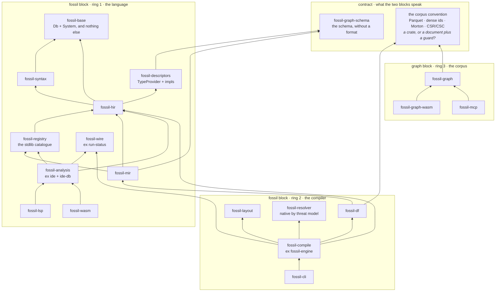

## The graph today, and it is meant to look like this

Grouped by what each crate is about, because twenty-five nodes drawn flat show nothing. The ugliness
is the finding, not a failure of the drawing.

Forty-three edges across five groups, and **one of them runs both ways**: `fossil-runtime →
fossil-graph` and `fossil-mcp → fossil-runtime`. At group level the engine and the corpus point at
each other. That mutual arrow is the whole of the complaint that opened
`decisions/0045-dos-nucleos-un-monorepo.md` — *"it feels like we have two cores"*. There are two, and
today they are stitched together in the wrong place.

## There are two cores, and the second is one landed decision from having none

<Callout title="A recognition, not a proposal">
The split below is not a refactor anyone has to be argued into. It is what the tree will look like
the moment a decision already taken is executed.
</Callout>

Three facts, in order:

1. **`fossil-graph` (2,438 lines) has exactly one fossil dependency: `fossil-sinks`.** It does not
   know the language — grepping its `src` for `fossil_hir|fossil_syntax|fossil_mir|fossil_base|
   fossil_descriptors|fossil_registry` returns zero — and it does not touch the disk. It declares two
   ports instead: `ManifestSource::fetch` and `DuckExecutor::query_json`.
2. **That dependency is used on one production line**: `manifest.rs:16`, importing three struct types
   from `fossil_sinks::manifest`. The other two occurrences are a `#[cfg(test)]` module and an
   example. And `fossil-sinks` is 380 lines whose own header says what it is — *"the canonical
   `GraphAr` manifest model"*. GraphAr, and nothing else.
3. **ADR-0042 §2 is titled "Parquet, plainly. GraphAr out."** The seam between the two cores is made
   of something an existing decision has already condemned.

So: **when ADR-0042 §2 lands, `fossil-graph` will have no fossil dependencies at all.** Not a small
one — zero. That is a different kind of statement from "these crates could be separated", and it is
the reason this page exists.

The other half of the confirmation is already measured rather than assumed: `kanzo-ui` reads corpora
written by fossil with **no dependency on `@fossil-lang/*`**, and three languages that do not know
fossil exists read the same tree on 2026-08-04. The seam between the two halves is the corpus on
disk. It was never an API.

<Callout type="warn" title="A name that misleads, corrected here too">
`fossil-graph` is **not** an implementation of GraphAr. It is the read surface over a corpus somebody
else already wrote: a closed enum of six verbs — `schema`, `read`, `expand`, `path`, `aggregate`,
`execute_sql` — with a JSON Schema each. The crate that writes is `fossil-df`; the crate that models
the manifest is `fossil-sinks`. Anyone who gets lost there is being misled by the names, which is the
next section.
</Callout>

## The verdict, which is not the crate count

The proposal takes 25 crates to 21 — five disappear, one appears, four are renamed where they stand.
That is a modest number, and the ADR says so about its own arithmetic. The answer to *"I don't know
whether all of these are necessary"* is that most of them are, and that what makes twenty-five feel
like a maze is not the count:

> **Four of them lie about what they are.** `fossil-ide` is not an IDE, `fossil-sinks` writes
> nothing, `fossil-engine` is not an engine, `fossil-run-status` is not a status.

A false name costs more than a surplus crate, because you cannot skip it while reading. `fossil-ide`
is the set of LSP functions, and exists only because `fossil-lsp` does not compile to wasm32.
`fossil-sinks` writes nothing because ADR-0017 decided fossil never writes Parquet bytes from Rust,
and half its dependents are readers. `fossil-engine` is 842 lines of credential resolution and
pre-introspection, not a façade over anything. `fossil-run-status` is four unrelated wire contracts,
two of which are inputs.

## Two blocks and three rings compose; neither subsumes the other

**The rings say where the code runs. The blocks say what the code is about.** Both have to be kept,
because each forbids something the other allows.

|  | ring 1 · language, no engine | ring 2 · native, disk and a budget | ring 3 · wasm, addresses bytes |
| --- | --- | --- | --- |
| **fossil block** | `base` · `syntax` · `hir` · `mir` · `registry` · `descriptors` · `analysis` · `lsp` · `wire` | `df` · `layout` · `resolver` · `compile` · `cli` | `fossil-wasm` (language/LSP) |
| **graph block** | — | — | `graph` · `graph-wasm` · `mcp` |
| **the contract** | `graph-schema` · the corpus convention | | |

The table makes one thing visible that neither taxonomy sees alone: **the graph block occupies a
single cell.** It is an entire core living in one ring. That is why it reads like a separate
repository, and why `fossil-graph` has no dependencies — not because it is well encapsulated, but
because it crosses neither frontier.

## The graph proposed

**Nothing crosses horizontally.** Both blocks point down at the contract and neither points at the
other, which is the entire difference from the first diagram, where the engine and the corpus pointed
at each other.

What that buys is not the crate count. It is that a newcomer can read the graph block whole — three
crates, 2,884 lines, two ports — without opening the compiler. Today they cannot, because the graph
does not tell them where to stop.

## What is on this page and what is in the record

The page is the shape. The 1,000-line record is the argument, and it holds things deliberately left
off here: the per-crate verdict table with the fact behind each row; why `fossil-base` is not
agnostic today and the single edge that proves it; why merging `fossil-resolver` into `fossil-base`
is impossible (a `compile_error!` on wasm32 that no symmetry argument survives); the nine-format
survey behind [the corpus contract](/docs/characteristics/corpus-contract); and the ADR correcting
two of its own claims in writing.

<Callout title="Undone, all of it">
Nothing in the proposed graph has been executed. `Status` on the record is `proposed`, the crate
count is 25 today, and the one decision the rest hangs from — whether the corpus convention lives in
a crate or in a document plus guards — is explicitly left open there. The measurement backing the
sentence at the top of this page is the manifest assertion in `apps/docs/content.test.ts`: it reads
`crates/fossil-graph/Cargo.toml` and fails if that crate's fossil dependencies are ever anything
other than `fossil-sinks` alone — including when ADR-0042 §2 lands and the answer becomes none, at
which point this page owes a rewrite rather than a quiet edit.
</Callout>
