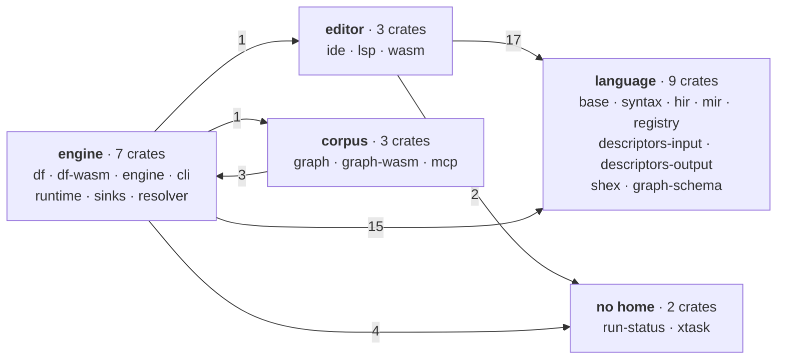

## The graph today, and it is meant to look like this

Grouped by what each crate is about, because two dozen nodes drawn flat show nothing. The ugliness is
the finding, not a failure of the drawing.

Forty-three edges across five groups, and **one of them runs both ways**: `fossil-runtime →
fossil-graph` and `fossil-mcp → fossil-runtime`. At group level the engine and the corpus point at
each other. That mutual arrow is the whole of the complaint that opened this page — *"it feels like
we have two cores"*. There are two, and today they are stitched together in the wrong place.

## Nobody cuts by deployment target

The attractive cut is three numbered rings by where the code runs — language, native, wasm. **It is
not the cut**, and the evidence is that none of the three compilers we compared against does
anything of the kind.

| | cuts by | says so in |
| --- | --- | --- |
| **Gleam** | **IO and purity** — *"compiler-core… is entirely pure and has no IO so that is provided by the other Rust crates that wrap this one"* | four bullets in `docs/compiler/README.md` |
| **Gluon** | **compiler phase** — parse → check → vm, with `base` as the shared vocabulary | one README bullet |
| **rust-analyzer** | **semantic richness**, with three declared API Boundaries: `syntax`, `hir`, `ide` | ~500 lines of `docs/book/src/contributing/architecture.md` |

All three cut by **what a piece of code is allowed to know**, and what they forbid is always the
same: knowledge of the outside world. Gleam implements it as nine traits in an `io.rs` that the core
declares and the shells satisfy; rust-analyzer implements it by forbidding `base-db` to produce a
`std::path::Path`.

<Callout title="When the cut is right, the shells collapse">
Gleam's entire wasm target is **352 lines**, 130 of which are an in-memory filesystem. Its binary is
**6 lines**. Its LSP transport is **69**. rust-analyzer's CLI is not even a crate — it is a module
inside the LSP binary.
</Callout>

A ring rule inverts that. It makes the target the primary axis, and then you have to decide which
ring a *feature* like the language server belongs to — and there is no good answer. Gleam puts it
under the CLI, rust-analyzer puts it *inside* the binary, Gluon puts it in a different repository.

What survives of the rings is not a ring. It is two crates with a `cfg` and a written reason:
`crates/fossil-lsp/src/lib.rs:14`, because `lsp-server` uses crossbeam and stdio, and
`crates/fossil-resolver/src/lib.rs:50`, because credential material is deliberately kept off the wasm
boundary.

## The rule is written first and checked second, in that order

> `duckdb` and `datafusion` each appear in exactly one crate, and neither is reachable from a wasm
> shell.

It goes in `deny.toml`. But the order of importance is the one stated: **none of the three references
checks its architecture with a test.** rust-analyzer's most-cited rule — that `ide` depends only on
the top-level `hir` — is held up by a comment in a `Cargo.toml`, repeated verbatim in two files. What
does the work is a document that states the invariant *and its reason*.

## `base` means two opposite things, and one of them has to be ours

The two references that have a crate called `base` give it contrary contents:

| | `gluon_base` — 11,970 lines | rust-analyzer's `base-db` — 1,866 |
| --- | --- | --- |
| contents | AST, types, kinds, symbols, positions | salsa plumbing, the input queries, `CrateGraph` |
| language vocabulary | **is** the vocabulary | **none** |
| describes itself as | "modular" | *"Basic database traits. The concrete DB is defined by `ide`"* |

And two of `base-db`'s own invariants point straight at us: *"base-db knows nothing about cargo"* and
*"base-db doesn't know about file system and file paths"* — its VFS is **another crate**, and the
operating-system implementation is **a third**.

`fossil-base` today holds the salsa `Db` trait, the filesystem abstraction, the diagnostics, a `Files`
struct that is empty, and the memory probe. And it knows a concrete type from a concrete provider:
`crates/fossil-base/src/system.rs:21` imports `InferredDescriptor`, so the crate that exists in order
to know nothing knows something.

> **If a crate called `base` contains the substrate *and* the file abstraction, it is two crates that
> have not been separated yet.**

The fix used to be invented two crates away: the output side hung its accessor off the **descriptor**
crate as an extension trait, so `fossil-base` never heard about it, and the input direction used the
opposite pattern for no recorded reason. That example is gone — `b675fe5` deleted the extension trait
outright, because nothing read what it carried. The asymmetry was resolved by subtraction rather than
by the input side adopting it, so the tree no longer holds a worked example of the direction that
would let `base` know nothing.

## `lsp-types` in exactly one `Cargo.toml`

This is the invariant rust-analyzer defends hardest, and both sentences are worth keeping whole:

> *"`rust-analyzer` is the only crate that knows about LSP and JSON serialization. If you want to
> expose a data structure `X` from ide to LSP, don't make it serializable. Instead, create a
> serializable counterpart in `rust-analyzer` crate and manually convert between the two."*

> *"Although at the moment it has only one consumer, the LSP server, **LSP does not influence its API
> design**. Instead, we keep in mind a hypothetical ideal client."*

It costs 3,180 lines of `to_proto.rs` — 0.8% of the codebase — and buys a guarantee a grep can check.
Note the asymmetry: 3,180 lines out against 156 in. Translating *inwards* is trivial; the work is all
on the way out.

**`fossil-ide` returns `lsp_types` structs directly** —
`crates/fossil-ide/src/completion.rs:69`. We made Gleam's mistake, which has `use lsp_types::Position`
inside the crate its own documentation calls *"entirely pure"*, rather than rust-analyzer's choice.

And that relocates one crate rather than renaming it. `fossil-run-status` holds four unrelated wire
contracts — the output of `run`, of `providers`, of `refs`, and the **input** of `catalog`. They are
not a crate: **they are the outbound half of a protocol**, and in rust-analyzer they would live in the
binary. Six crates depend on it and it depends on nothing, which is not being foundational — it is
being the place where types that did not fit were left.

## The verdict, which is not the crate count

**Twenty-four crates and about 45,000 lines.** Against the references: Gluon has ~11 for 90k, Gleam 15
(six real; the rest are test harnesses and vendored libraries) for 228k, rust-analyzer 36 for 571k.
**For 45k the honest target is five to eight.**

But what makes two dozen feel like a maze is not the count:

> **Four of them lie about what they are.** `fossil-ide` is not an IDE, `fossil-sinks` writes nothing,
> `fossil-engine` is not an engine, `fossil-run-status` is not a status.

A false name costs more than a surplus crate, because you cannot skip it while reading. `fossil-ide`
is the set of LSP functions, and exists only because `fossil-lsp` does not compile to wasm32.
`fossil-sinks` writes nothing — it is the GraphAr manifest model, and half its dependents are readers.
`fossil-engine` is credential resolution and pre-introspection, not a façade. `fossil-run-status` is
four wire contracts, two of which are inputs.

<Callout title="Deliberately absent">
**No numbered layers.** A rule that needs a number to explain itself is a taxonomy, not a rule.

**No crate named after its deployment target.** The one crate rust-analyzer names after a process
boundary is `proc-macro-srv-cli`, and it exists because procedural macros segfault — fault isolation,
not a ring.

**No crate that exists by imitation.** `fossil-ide-db` was created citing rust-analyzer's `ide-db`,
which is ~20k lines shared by five crates; here there was one consumer, and it has since been folded
back in. A crate earns its boundary from a cycle, a `cfg`, an orphan rule or a publishing frontier.
</Callout>

## There are two cores, and the second is one landed decision from having none

<Callout title="A recognition, not a proposal">
The split below is not a refactor anyone has to be argued into. It is what the tree will look like the
moment a decision already taken is executed.
</Callout>

Three facts, in order:

1. **`fossil-graph` has exactly one fossil dependency: `fossil-sinks`.** It does not know the language
   — grepping its `src` for `fossil_hir|fossil_syntax|fossil_mir|fossil_base|fossil_descriptors|fossil_lineage`
   returns zero — and it does not touch the disk. It declares two ports instead:
   `ManifestSource::fetch` and `DuckExecutor::query_json`, **the only two real extension points in the
   entire workspace.**
2. **That dependency is used on one production line**: `crates/fossil-graph/src/manifest.rs:16`. The
   other two occurrences are a `#[cfg(test)]` module and an example.
3. **The corpus is Parquet and nothing else.** Conforming to an existing graph interchange
   specification is a [discarded alternative](/docs/design/discarded) — it gave vocabulary and
   stopped giving contract — and that manifest is exactly what the dependency in (2) models. The
   seam between the two cores is made of the one thing the design has already ruled out.

So: **when the manifest goes, `fossil-graph` will have no fossil dependencies at all.** Not a small
one — zero.

The other half of the confirmation is measured rather than assumed: `kanzo-ui` reads corpora written
by fossil with **no dependency on `@fossil-lang/*`**, and three languages that do not know fossil
exists read the same tree on 2026-08-04. The seam between the two halves is the corpus on disk. It was
never an API.

<Callout type="warn" title="A name that misleads, corrected here too">
`fossil-graph` is **not** an implementation of GraphAr. It is the read surface over a corpus somebody
else already wrote: a closed enum of [six verbs](/docs/characteristics/verbs). The crate that writes
is `fossil-df`; the crate that models the manifest is `fossil-sinks`.
</Callout>

## One repository

Five projects that have already been through this were compared, and **none of them puts the
specification in its own repository.**

- **dbt** separates **the schema, not the implementation** — `schemas.getdbt.com` is its own repo with
  versioned URLs, while the compiler stays in `dbt-core`. Its Rust engine was recently folded *back*
  into `dbt-core`.
- **Delta shows that co-location does not prevent drift**: CheckpointV2 diverged from its own
  specification while living in the same repository. What fixed it was a **process** —
  `protocol_rfcs/`, where the specification PR lands before the implementation PR. Lance arrived at
  the same rule independently.
- **Lance** is two years ahead of us and still has an open, unanswered question about *what constitutes
  the specification* — the protobufs, the docs, or some of the code.
- **Malloy is the counterexample**, and it is our scenario if this goes wrong: its interfaces package
  was created, killed within three months by a maintainer's issue titled *"malloy-interfaces cannot
  have a copy of malloy_types in it"* — still open — and revived seventeen months later. Twenty-five
  satellite repositories held in lockstep by a script, one of them frozen **159 releases** behind.

> **What buys correctness is not the boundary. It is the process.** The specification lands before the
> implementation, and conformance is round-trip.

## What is on this page and what is not

The page is the shape. [Three hosts](/docs/design/three-hosts) is the argument, and what is
deliberately left off here goes to the pages that own it: the measurement that reordered the whole
priority — a compiler that reports success and writes a corpus with a property missing — is
[the expression cliff](/docs/characteristics/expressions); the scope of the incremental system is
[tooling for humans](/docs/design/tooling-for-humans); the extension mechanism is a
[discarded alternative](/docs/design/discarded) with a named condition that would reopen it; and the
design for statements is [RDF 1.2](/docs/characteristics/rdf12).

<Callout title="Undone, all of it">
The crate count is twenty-four today and nothing below the first diagram has been executed. The
measurement backing the sentence at the top of this page is the manifest assertion in
`apps/docs/content.test.ts`: it reads `crates/fossil-graph/Cargo.toml` and fails if that crate's
fossil dependencies are ever anything other than `fossil-sinks` alone — including when the manifest
goes and the answer becomes none, at which point this page owes a rewrite rather than a quiet edit.
</Callout>
