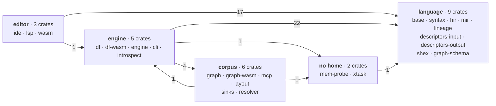
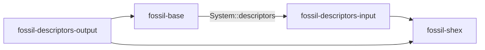
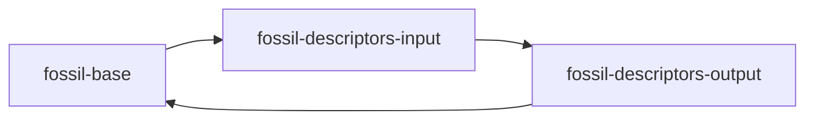
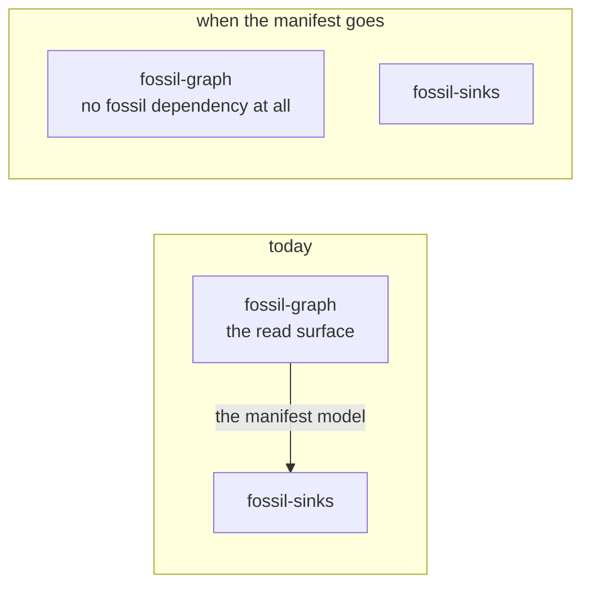

## The graph today

Grouped by what each crate is about, because two dozen nodes drawn flat show nothing. The ugliness is
the finding, not a failure of the drawing.

**48 cross-group edges**, and one pair still runs both ways — on a single edge. Every number above
is derived from `crates/*/Cargo.toml`, `[dependencies]` only: a test may depend on whatever it
likes, so dev edges are out of scope here for the same reason they are in `content.test.ts`, which
reads the manifests and fails the build on any figure in this diagram that stops holding.

The single `editor → engine` edge is `fossil-lsp → fossil-introspect`, and it is deliberate: without
the columns a `DESCRIBE` finds, the editor is silent on every diagnostic whose evidence is a source's
schema, which is pinned by `crates/fossil-lsp/tests/introspected_diagnostics.rs`.

The mutual arrow is `engine ↔ corpus`, and one edge holds it:

| direction | edge | why it is there |
| --- | --- | --- |
| corpus → engine | `fossil-layout → fossil-df` | one function, `files::batches_to_parquet`, the single Arrow→Parquet encoder — moving it would put `arrow` + `parquet` into `fossil-graph-wasm`'s browser bundle, which has neither |
| engine → corpus | `fossil-engine → fossil-layout` | the post-pass runs after the write, so the thing that writes calls it |
| engine → corpus | `fossil-df → fossil-sinks` | the manifest model, which **is** the format, and the writer is what builds it |
| engine → corpus | `fossil-engine → fossil-sinks` | one constant, `manifest::DEFAULT_CHUNK_SIZE`, so the files on disk and the manifest cannot disagree about a chunk |
| engine → corpus | `fossil-introspect → fossil-resolver` | `ResolvedPath::create_secret_sql` — the secret that authenticates a cloud source before the pre-compile `DESCRIBE` opens it |

`fossil-sinks` and `fossil-resolver` are filed by subject and not by history, and that is the whole
of the change: neither crate has a fossil dependency of its own, so a leaf changed groups and no
code moved. It **cost** an edge — 47 before, 48 after, because `fossil-df → fossil-sinks`,
`fossil-engine → fossil-sinks` and `fossil-introspect → fossil-resolver` used to be internal to the
engine — and it bought the cycle: `fossil-graph → fossil-sinks` and `fossil-mcp → fossil-resolver`
are now inside `corpus`, so the return leg went from three edges to one. There are still two cores,
but the stitch that closes the loop is one function.
[One engine](/docs/design/one-engine) is where the rest of the filing gets settled.

What has **not** happened is everything below this diagram: `fossil-base` still holds a `tracked`
query and the `@conn` locator, and `fossil-engine` is still a sack.

## What is left of the rings

The attractive cut is three numbered rings by where the code runs. It is not the cut, and
[three hosts](/docs/design/three-hosts) is where the three reference compilers say why. What survives
is not a ring: two crates with a `cfg` and a written reason — `crates/fossil-lsp/src/lib.rs:98`,
because `lsp-server` uses crossbeam and stdio, and `crates/fossil-resolver/src/lib.rs:48`, because
credential material is deliberately kept off the wasm boundary.

## A list is not a check

> `duckdb` and `datafusion` are each reachable only from crates that declare themselves native.

`deny.toml` names six wrappers for `duckdb` and five for `datafusion` (measured 2026-08-25), but
`cargo deny check bans` matches `wrappers` against the **direct** parents of a banned crate, so a
crate one hop further away is invisible to it — measured with `fossil-lsp` linking a bundled database
while `cargo deny` printed `bans ok`. `crates/xtask/tests/engine_reach.rs` closes it, deriving the
policy from `deny.toml` and the truth from `cargo metadata`.

## `base` means two opposite things

The two references that have a crate called `base` give it contrary contents:

| | `gluon_base` — 11,970 lines | rust-analyzer's `base-db` — 1,866 |
| --- | --- | --- |
| contents | AST, types, kinds, symbols, positions | salsa plumbing, the input queries, `CrateGraph` |
| language vocabulary | **is** the vocabulary | **none** |
| describes itself as | "modular" | *"Basic database traits. The concrete DB is defined by `ide`"* |

`base-db` states two invariants that point straight at us — *"knows nothing about cargo"*, *"doesn't
know about file system and file paths"* — and its VFS is another crate, the operating-system
implementation a third.

> **If a crate called `base` contains the substrate *and* the file abstraction, it is two crates that
> have not been separated yet.**

The prose half of that rule is now a test — `crates/fossil-base/tests/substrate_has_no_prose.rs`
reads `providers.rs` and fails on a string literal with a space in it, because a crate that decides
nothing about a program has no business composing an English sentence about one.

### What would move the remaining edge

`fossil-base → fossil-descriptors-input` exists for **one trait method**, `System::descriptors`,
which hands out a `&DescriptorCache` (`crates/fossil-base/src/system.rs:23`). Four crates, and the
arrows nearly meet:

Acyclic, but only just. Fold `fossil-shex` into `fossil-descriptors-output` — the obvious
simplification, one crate fewer — and the two remaining arrows close on themselves:

So the fold is blocked while that edge stands. Three ways out were costed:

| the way out | what it costs |
| --- | --- |
| a generic or associated type on `System` | impossible, not merely expensive: the trait is used as `Arc<dyn System>` and as `&dyn System`, and either shape is object-safety's own counterexample |
| the types down into `fossil-graph-schema`, the leaf both sides already see | no new crate — and a `Mutex<HashMap>` of host-owned mutable state inside the crate that depends on nothing but `serde`, which is this page's own mistake committed a second time |
| a new leaf holding `DescriptorCache` + `InferredDescriptor` | it works, and it is the only one that does: a 26th crate, an import path changed in nine crates, and **nothing removed from `fossil-base`** |

**What reverses this:** the fold itself. It removes a crate, so the third way nets zero on the count
and the cycle goes with it.

## The verdict is not the crate count

**Twenty-five crates over roughly 47,000 lines of Rust** — non-blank, non-comment, measured
2026-08-25. Gluon has ~11 crates for 90k, Gleam 15 (six real) for 228k, rust-analyzer 36 for 571k.
**At this size the honest target is five to eight.**

What makes two dozen feel like a maze is not the count. Three of them lie about what they are, and a
false name costs more than a surplus crate because you cannot skip it while reading.

| the name | what it actually is |
| --- | --- |
| `fossil-ide` | not an IDE: the set of LSP functions, and it exists only because `fossil-lsp` does not compile to wasm32. It also returns `lsp_types` structs directly (`crates/fossil-ide/src/completion.rs:64`), which is the invariant rust-analyzer defends hardest and the one Gleam broke |
| `fossil-sinks` | writes nothing: the manifest model, borrowing GraphAr's YAML field names without conforming to GraphAr ([where borrowing stops](/docs/design/corpus#what-is-borrowed-from-graphar-and-where-borrowing-stops)); half its dependents are readers |
| `fossil-engine` | not an engine: the native host, which supplies the `System` the compiler runs against, does the pre-compile jobs — register the shape documents, install the secrets a `@conn` needs, call `fossil-introspect` — and drives compile→run |

<Callout title="Deliberately absent">
**No numbered layers.** A rule that needs a number to explain itself is a taxonomy, not a rule.

**No crate named after its deployment target.** The one crate rust-analyzer names after a process
boundary is `proc-macro-srv-cli`, and procedural macros segfault — fault isolation, not a ring.

**No crate that exists by imitation.** A crate earns its boundary from a cycle, a `cfg`, an orphan
rule or a publishing frontier.
</Callout>

## The second core has one dependency left

**`fossil-graph` has exactly one fossil dependency, `fossil-sinks`, and uses it on one production
line** — `crates/fossil-graph/src/manifest.rs:16`; everything else is a `#[cfg(test)]` module. It
does not know the language (grepping its `src` for
`fossil_hir|fossil_syntax|fossil_mir|fossil_base|fossil_descriptors|fossil_lineage` returns zero) and
it does not touch the disk. It declares two ports instead: `ManifestSource::fetch` and
`DuckExecutor::query_json`, **the only two real extension points in the entire workspace.**

That last dependency is the manifest, and conforming to an existing graph interchange specification
is already a [discarded alternative](/docs/design/discarded) — so the read surface's one remaining
dependency is on the one thing the design has ruled out. Filing `fossil-sinks` under the corpus put
that edge inside a group; it did not make it disappear.

The seam between the two halves is the corpus on disk, and it was never an API: `kanzo-ui` reads
corpora written by fossil with **no dependency on `@fossil-lang/*`**, and three languages that do not
know fossil exists read the same tree on 2026-08-04. `apps/docs/content.test.ts` keeps the first
paragraph a build failure rather than a sentence somebody measured once — it reads
`crates/fossil-graph/Cargo.toml` and fails if that crate's fossil dependencies are ever anything but
`fossil-sinks` alone, including when the manifest goes and the answer becomes none.

## What is on this page and what is not

The page is the shape; [three hosts](/docs/design/three-hosts) is the argument. The measurement that
reordered the whole priority — a compiler that reports success and writes a corpus with a property
missing — is [the expression cliff](/docs/design/expressions); the scope of the incremental system is
[tooling for humans](/docs/design/tooling-for-humans); and whether the specification belongs in its
own repository was settled against five projects in [prior art](/docs/design/prior-art).
