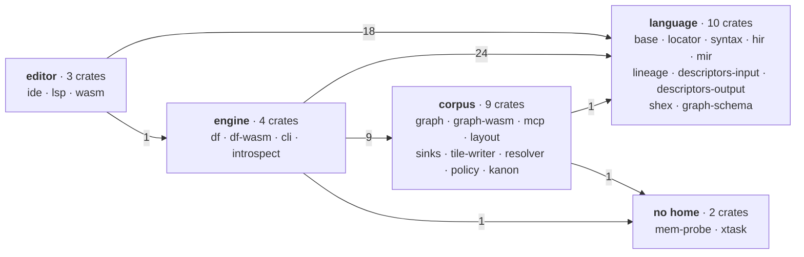
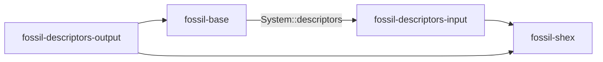
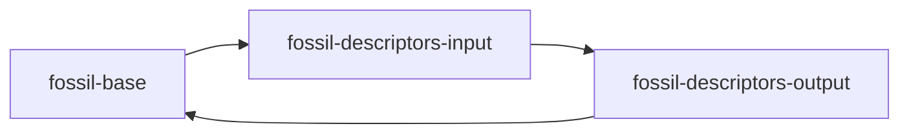
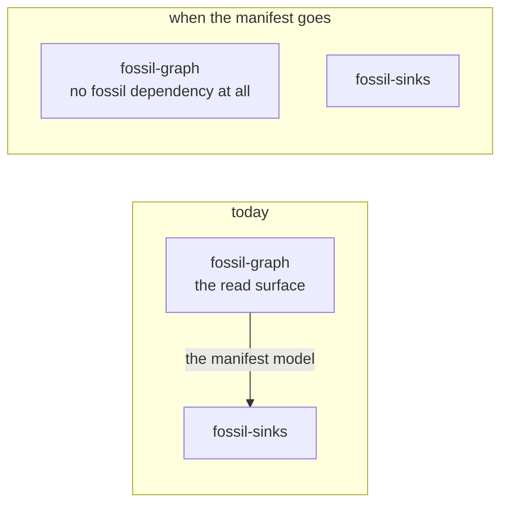

`corpus.bnf`'s header states the spine: fossil has **three boundaries — program, plan, artefact** —
and each one is specified by a data file that generates code rather than by prose that describes it.
`grammar.bnf` is the shape of a program, `catalogue.bnf` is the names a program may write, and
`corpus.bnf` is the columns a writer emits. Everything below hangs off one of the three.

**This page states the shape and links to the page that argues each part.** Where a section would
restate an argument, it is a sentence and a route instead. That is the discipline, and it is the one
this repository has paid for twice.

## What a corpus is

**Four sets of columns, seventeen columns between them**, declared once in `corpus.bnf` and projected
into `crates/fossil-sinks/src/generated.rs` and `packages/corpus/src/vocabulary.generated.ts` by
`cargo xtask corpus`: the **payload** (5), the **adjacency** (2), the **cell** (7) and the
**quotient** (3). Exactly one of the seventeen is also a declared `properties:` entry — `subject` —
and every reader names the ROLE it means rather than the name, because the eight words the writer
emits were 545 string literals with no declaration any of them derived from.

**Every one of the four is addressed by a shift, and nothing is listed.** `dense_id` is a vertex's
rank in the Morton order of its own position; a tile is
`crates/fossil-sinks/src/manifest.rs, tile_of`, a level's address is the payload's shift plus `2k`
by `crates/fossil-sinks/src/manifest.rs, STRIDE_BITS`, and a cell of rung `k` is `dense_id >> shift`
with parent `r >> 2` — `crates/fossil-layout/src/layout/cells.rs, Pyramid`. There is no directory
listing over HTTP and the format asks for none.
[Addressing](/docs/format/conventions/addressing) is the specification.

**The corpus carries two coarse faces and neither of them was deleted.** The level pyramid *samples*
— `dense_id % scale == 0`, real rows sharing the payload's own numbering — and the cell pyramid
*aggregates* into synthetic rows that no scale describes. They draw different pictures rather than
being two prices for one, which is why `crates/fossil-layout/tests/level_vs_rung.rs` weighs them on
ONE corpus: two instruments over two graphs compare two graphs.
[Cells](/docs/design/cells) is the argument for the cell pyramid being a third artefact.

## What the writer is

Three loops and a document, sequenced in `crates/fossil-cli/src/host.rs` in the order a corpus is
true in.

| the loop | where | what it produces |
| --- | --- | --- |
| every vertex, then every edge, with a hard barrier between them | `crates/fossil-df/src/lib.rs, execute_graph` | the payload columns and both adjacency orientations, as Arrow in memory |
| partition, place, renumber into Morton order, tile | `crates/fossil-layout/src/layout/pass.rs, enrich_layout` | the payload on disk and the level pyramid |
| one linear scan per rung, over the payload rather than the rung below | `crates/fossil-layout/src/layout/cells.rs, Pyramid` | the cell rows and the quotient edges |

Nothing is staged and read back: the rows reach the pass as the batches the executor already held.
The trip that is gone was 43.3 MB of the 115.9 MB a com-DBLP run wrote — **37.4%, a write
amplification of 1.60×**.

**The manifest is written last, and that is not tidiness.** A document written before the bytes can
only *promise* them, which is the right shape for a count that is arithmetic and the wrong one for a
number that is measured — and three of its fields are measured. A rung's quotient edge count; a
categorical channel's `domain`, because nothing in front of the bytes knows how many communities
Louvain will find; and `reached` on `crates/fossil-sinks/src/manifest.rs, KAnonymity`, which
`crates/fossil-df/src/privacy.rs` takes after the corpus is a value and before any of it is a file.
[Streaming](/docs/design/streaming) argues the budget the write path runs under, and
[privacy](/docs/format/conventions/privacy) argues the bound.

## What the reader is

**One door, one name, three depths, all of them asynchronous** —
`packages/corpus/src/corpus.ts, open`. `resolveCorpus` and `openCorpus` are both gone into it, and
the depth follows from the capability the caller brings, which is the whole of why there is one
name:

```ts
await open(url,  { query, wasmUrl })          // Corpus — the whole door
await open(url,  { readText, wasmUrl })       // CorpusAddressing — the manifests, no payload
await open(base, { manifestFiles, wasmUrl })  // CorpusAddressing — no request at all
```

`sql: 'allowed'` widens the first of those to `SqlCorpus`; it is a widening and not a fourth depth.

**What comes back has two halves, and the line between them is which bytes get chosen.** `extent`,
`rows`, `frame`, `node` and `neighbours` compute which files to open and open those. The six verbs —
`crates/fossil-graph/src/operations/mod.rs, Operation`, compiled to wasm32 — name a table and let the
engine decide. The two halves meet at exactly one point, the host's `query` callback, and the reader
brings no engine of its own to either.

**What would merge them is pruning by predicate, and it was measured to lose.** DuckDB evaluates a
range predicate per row instead of skipping row groups: a range join against the id runs at 237 ms
and 179 `BETWEEN … OR …` predicates at 189 ms, against 5 ms for not pruning at all. A window written
as a `WHERE` reads the whole file, so pruning stays the tiles' job and this change did not merge
anything. [One door](/docs/design/one-door) argues the surface;
[the reference viewer](/docs/design/reference-viewer) argues what a frame may answer with.

The reader's **policy** over that contract is a second published package and deliberately not on the
door: `@fossil-lang/draw` holds what a corpus is drawn WITH
(`packages/draw/src/encoding.ts, encodingFor`) and what is already LOADED
(`packages/draw/src/residency.ts, residency`). A channel is read off a manifest, but an encoding is a
reader's ranking of what to do with one and a residency budget is a number measured against one
renderer on one corpus. Neither is a property of the artefact.

## What is declared and what is derived

One rule, and `crates/fossil-sinks/src/manifest.rs, Channel` states it beside the field it is applied
to: **a document carries a fact exactly when a reader cannot recover it from the bytes.**

| the field | why the document carries it |
| --- | --- |
| `CellTree::vertices_per_cell` | the base of the pyramid is a choice about what a screen can draw, and a set of points is never full, so no writer derives it from the data |
| `Channel::domain` | a categorical's distinct-value count is in no footer and costs a scan; a quantitative channel carries none, because Parquet's per-row-group min and max already are one |
| `CoordinateSystem::provenance` | a latitude and a drawing algorithm's output are both two `float32` columns, and nothing but a declaration tells them apart |

**The absences are the same rule read the other way.** A cell row carries no `parent`, because a cell
of rung `k` covers a fixed interval of the `dense_id` axis and the parent is `r >> 2`; and no
`subject`, because a cell is not an entity and no bookmark keys on one.
`crates/fossil-sinks/src/manifest.rs, CellTree` carries no `chunk_size` of its own, because a rung's
ids are a shift of the payload's and there is no second number to declare. And `corpus.bnf` declares
no prefix, no file name and neither shift: those are addressing, and addressing already has one
implementation in `crates/fossil-graph/src/plan.rs`.

## The heuristic stops at the corpus

> **What crosses to the reader is arithmetic and declared.**

The fifth quality attribute, and the only one this page states rather than links, because it is the
only one without a page of its own. The other four have one: a declared budget bounds the write path
([streaming](/docs/design/streaming)), a read is bounded and reports what it read
([one door](/docs/design/one-door)), addressing is arithmetic
([addressing](/docs/format/conventions/addressing)), and a reader never holds the graph
([cells](/docs/design/cells), [the reference viewer](/docs/design/reference-viewer)).

It is what decided the pyramid against the holarchy. A holarchy's extents are **measured** — they are
wherever Louvain's sweeps stopped — so addressing one means fetching a heuristic's boundaries into
the read path, where every reader pays for them and no reader can check them.
[Cells](/docs/design/cells) carries that argument and this page does not repeat it.

**Its first measured violation was a dependency edge and not a format decision**, which is why it
belongs here rather than on the format. `fossil-layout`'s pass wrote tiles through a Parquet encoder
that lived in `fossil-df` and that `fossil-df` never called, and that one `use` put `datafusion`,
`fossil-hir`, `fossil-mir`, `fossil-descriptors-output`, `fossil-base` and `salsa` into the normal
closure of a pass that resolves no name and holds no database. `39d0fb8` cut it, and
`crates/xtask/tests/substrate_reach.rs` is the attribute made checkable: it takes its subject from
`CLAUDE.md` and its linkers from `cargo metadata`, so neither half is a list anybody keeps by hand.
It proves the rule is enforced and not that the rule is right, and says so.

## The graph today

The same three boundaries seen from the tree: `language` and `editor` serve the program, `engine`
runs the plan, `corpus` is the artefact. Grouped by what each crate is about, because two dozen nodes
drawn flat show nothing. The ugliness is the finding, not a failure of the drawing.



**55 cross-group edges**, and no pair runs both ways. Every number above
is derived from `crates/*/Cargo.toml`, `[dependencies]` only: a test may depend on whatever it
likes, so dev edges are out of scope here for the same reason they are in `content.test.ts`, which
reads the manifests and fails the build on any figure in this diagram that stops holding.

The single `editor → engine` edge is `fossil-lsp → fossil-introspect`, and it is deliberate: without
the columns a `DESCRIBE` finds, the editor is silent on every diagnostic whose evidence is a source's
schema, which is pinned by `crates/fossil-lsp/tests/introspected_diagnostics.rs`.

`engine ↔ corpus` was the mutual pair, and one edge held it: `fossil-layout → fossil-df`, for one
type — the row-group container the corpus's payload is written through. It looked like an edge with
nowhere to go. `fossil-sinks` was the obvious home and takes `arrow-schema` alone, so moving the
writer there would have put `arrow` + `parquet` into `fossil-graph-wasm`'s browser bundle, which has
neither; a leaf crate of its own looked like a whole crate for one shared function.

What settled it was what the edge cost rather than what it was worth. A struct `fossil-df` never
called put `datafusion`, `fossil-hir`, `fossil-mir`, `fossil-descriptors-output`, `fossil-base` and
`salsa` into the closure of a pass that resolves no name and holds no database — measurable as
`cargo tree -p fossil-layout -e normal -i salsa`, which printed a tree and now prints nothing. The
writer is `crates/fossil-tile-writer/src/lib.rs, TileWriter`, a leaf over `arrow` and `parquet`, and
`fossil-layout` reaches the engine on a dev edge alone, for the bench that measures the tiling
against the baseline encoder. The arrow that remains runs one way:

| direction | edge | why it is there |
| --- | --- | --- |
| engine → corpus | `fossil-cli → fossil-layout` | the post-pass **is** the payload write, so the thing that writes the manifests calls it |
| engine → corpus | `fossil-df → fossil-sinks` | the manifest model, which **is** the format, and the writer is what builds it |
| engine → corpus | `fossil-cli → fossil-sinks` | one constant, `manifest::DEFAULT_CHUNK_SIZE`, so the files on disk and the manifest cannot disagree about a chunk — and `Privacy`, which the run summary prints |
| engine → corpus | `fossil-df → fossil-policy` | the bound is verified where the release is still a value, before any of it is a file |
| engine → corpus | `fossil-cli → fossil-policy` | reading the document is a host's job, the way reading a shape document is: the program's `policy := "…"` and `--policy` are both a reference, and a `PrivacyPolicy` by the time the write path is handed one. Unlike a shape document it never enters the database — the compiler does not open a policy |
| engine → corpus | `fossil-introspect → fossil-resolver` | `ResolvedPath::create_secret_sql` — the secret that authenticates a cloud source before the pre-compile `DESCRIBE` opens it |

`fossil-sinks` and `fossil-resolver` are filed by subject and not by history, and that is the whole
of the change: neither crate had a fossil dependency of its own when it was filed, so a leaf changed
groups and no code moved.

**`fossil-sinks` is not a leaf any more, and that is the whole of the `corpus → language` arrow.**
It grew two: `fossil-policy`, which is inside `corpus` and so invisible here, and
`fossil-graph-schema`, which is not — a manifest records what a compiler decided, so it names the
substrate contract, and `crates/fossil-graph-schema/src/lib.rs, Cardinality` is what made an edge's
`{1,1}` a fact the corpus could state rather than one a reader defaulted. The direction runs this
way for the same reason `fossil-policy` does, and it is **not** the objection that keeps
`fossil-hir::Primitive` out of the manifest layer: a cardinality is not a type, it is the shape a
predicate was declared with. `fossil-resolver` is still a leaf. It **cost** an edge rather than saving one — `fossil-df → fossil-sinks`,
`fossil-cli → fossil-sinks` and `fossil-introspect → fossil-resolver` used to be internal to the
engine, three that started crossing against two that stopped — and it bought the cycle:
`fossil-graph → fossil-sinks` and `fossil-mcp → fossil-resolver` are now inside `corpus`, so the
return leg went from three edges to one — and that one has since gone too, which is the section
above. There are still two cores; there is no longer a stitch closing the loop.
[One engine](/docs/design/one-engine) is where the rest of the filing gets settled.

`fossil-policy` is filed under **corpus** and not under the engine that reads it, for the reason
`fossil-sinks` is: the declared bound is part of what the artefact says about itself, and the crate
that models it has no fossil dependency of its own. Four of the eight `engine → corpus` edges are
its arrivals, which is what took that arrow from four to eight in one landing.

`fossil-kanon` was filed under *no home* on the strongest version of that reason: it had no
dependents **and** no dependencies inside the tree, so it was the one node this diagram drew with no
arrow at either end — a disclosure-control pass over Arrow arrays that nothing in the pipeline
called. It has a caller now. `fossil-df`'s write path derives the generalisation a declared bound
needs before verifying one, which is the seventh `engine → corpus` edge and the reason that arrow
went from six to seven.

It is filed under **corpus** rather than under the engine that calls it, for the reason
`fossil-policy` is: what it models is a property of the artefact — what these bytes disclose — and
not a capability of the executor. The crate itself is unchanged by the edge; it was already
`[package.metadata.fossil] wasm = true` on the claim that the pass belongs in the data holder's
browser, and the gate was already reading that declaration.
[Deriving k-anonymity](/docs/design/anonymity) is the argument for the crate.

Two things have left `fossil-base` and neither shows on this diagram in the same way. The `@conn`
locator is `fossil-locator`, a crate with no dependencies at all — filing it under `language` is the
same subject-not-history move `fossil-sinks` and `fossil-resolver` got, except that this one moved a
file. The `tracked` query that decodes a shape document is `fossil_hir::shape_documents`, and it
cost **no** edge: its only production caller was `fossil-hir` already, and `fossil-hir` already
depended on `fossil-base`. A module crossing a boundary that was already crossed is the cheapest
kind of move there is.

`fossil-engine` is the crate that is gone. It was the native host, it was a library, and it had
**one consumer** — `fossil-cli`, which called all five of its verbs and nothing else did. The other
two hosts each keep theirs inside themselves, so the native one was the only host filed apart from
the thing that used it. Folding it in removed a crate and three edges — 54 → 51 — because the two
manifests shared `fossil-df`, `fossil-sinks`, `fossil-layout`, `fossil-policy` and
`fossil-introspect`, and each of those stopped being counted twice. `providers()` did not survive the
fold at all — it was `fossil_lineage::providers()` with a `Vec` around it, and the binary calls the
projection directly.

## What is left of the rings

The attractive cut is three numbered rings by where the code runs. It is not the cut, and
[three hosts](/docs/design/three-hosts) is where the three reference compilers say why. What survives
is not a ring: two crates with a `cfg` and a written reason — `crates/fossil-lsp/src/lib.rs`,
because `lsp-server` uses crossbeam and stdio, and `crates/fossil-resolver/src/lib.rs`, because
credential material is deliberately kept off the wasm boundary.

## A list is not a check

> `duckdb` and `datafusion` are each reachable only from crates that declare themselves native.

`deny.toml` names six wrappers for `duckdb` and five for `datafusion` (measured 2026-08-25), but
`cargo deny check bans` matches `wrappers` against the **direct** parents of a banned crate, so a
crate one hop further away is invisible to it — measured with `fossil-lsp` linking a bundled database
while `cargo deny` printed `bans ok`. `crates/xtask/tests/engine_reach.rs` closes it, deriving the
policy from `deny.toml` and the truth from `cargo metadata`.

## `base` means two opposite things

The two references that have a crate called `base` give it contrary contents:

| | `gluon_base` — 11,970 lines | rust-analyzer's `base-db` — 1,866 |
| --- | --- | --- |
| contents | AST, types, kinds, symbols, positions | salsa plumbing, the input queries, `CrateGraph` |
| language vocabulary | **is** the vocabulary | **none** |
| describes itself as | "modular" | *"Basic database traits. The concrete DB is defined by `ide`"* |

`base-db` states two invariants that point straight at us — *"knows nothing about cargo"*, *"doesn't
know about file system and file paths"* — and its VFS is another crate, the operating-system
implementation a third.

> **If a crate called `base` contains the substrate *and* the file abstraction, it is two crates that
> have not been separated yet.**

The prose half of that rule is now a test — `crates/fossil-base/tests/substrate_has_no_prose.rs`
reads `providers.rs` and fails on a string literal with a space in it, because a crate that decides
nothing about a program has no business composing an English sentence about one.

Two parts have gone. `fossil-locator` is the file abstraction — the rule that says where a written
path points; `base-db` keeps its VFS in another crate for exactly that reason. And the shape-document
decode is `fossil_hir::shape_documents`: `base-db` holds *input queries*, and a query that runs a
decoder over a document to produce a type is not an input, it is the compiler asking a question.
What stayed in `providers` is the ROW a decoder fills, because a table entry is not a decision about
a program — and `substrate_has_no_prose.rs` is the test that keeps it from becoming one.

**What stayed, and why it is not the same case.** `test_support` is also not compiler logic — its
own header says so — and lifting it out looks like the identical move. It is not: a helper that
implements `System` must depend on `fossil-base`, `fossil-base`'s unit tests must depend on the
helper, and `#[cfg(test)]` makes the crate under test a second copy of `fossil-base` whose types do
not unify with the one the helper linked. It does not compile, and the rest of the bill is in
[what was discarded](/docs/design/discarded). The distinction the rule actually draws is *decides
something about a program*: the locator did, and a decoder for a format no program is written in
does not.

### What would move the remaining edge

`fossil-base → fossil-descriptors-input` exists for **one trait method**, `System::descriptors`,
which hands out a `&DescriptorCache` (`crates/fossil-base/src/system.rs, descriptors`). Four crates, and the
arrows nearly meet:



Acyclic, but only just. Fold `fossil-shex` into `fossil-descriptors-output` — the obvious
simplification, one crate fewer — and the two remaining arrows close on themselves:



So the fold is blocked while that edge stands. Three ways out were costed:

| the way out | what it costs |
| --- | --- |
| a generic or associated type on `System` | impossible, not merely expensive: the trait is used as `Arc<dyn System>` and as `&dyn System`, and either shape is object-safety's own counterexample |
| the types down into `fossil-graph-schema`, the leaf both sides already see | no new crate — and a `Mutex<HashMap>` of host-owned mutable state inside the crate that depends on nothing but `serde`, which is this page's own mistake committed a second time |
| a new leaf holding `DescriptorCache` + `InferredDescriptor` | it works, and it is the only one that does: a 26th crate, an import path changed in eight crates, and **nothing removed from `fossil-base`** |

**What reverses this:** the fold itself. It removes a crate, so the third way nets zero on the count
and the cycle goes with it.

## The verdict is not the crate count

**Twenty-eight crates**, against Gluon's ~11 crates for 90k lines, Gleam's 15 (six real) for 228k
and rust-analyzer's 36 for 571k. The line count that used to sit beside this number is deliberately
not restated: it was measured on 2026-08-25 and `fossil-kanon` and `fossil-policy` have landed
since, so the only honest options were to re-measure or to drop it.
**At this size the honest target is five to eight.**

Five of them moved and only two are new code: `fossil-locator` arrived by moving a module down out
of `fossil-base`, `fossil-engine` left by moving three into the crate that already used them,
`fossil-kanon` and `fossil-policy` arrived carrying the privacy clause, and `fossil-tile-writer`
arrived by moving a struct out of a crate that never called it. Which is the point of the heading —
the count went 25 → 26 → 25 → 27 → 28 and none of those numbers is the verdict.

What makes two dozen feel like a maze is not the count. Two of them lie about what they are, and a
false name costs more than a surplus crate because you cannot skip it while reading. There were
three: `fossil-engine` was not an engine, it was the native host, and the crate that was wrong
about itself is now a module of the one host that used it.

| the name | what it actually is |
| --- | --- |
| `fossil-ide` | not an IDE: the set of LSP functions, and it exists only because `fossil-lsp` does not compile to wasm32. It also returns `lsp_types` structs directly (`crates/fossil-ide/src/completion.rs, completions`), which is the invariant rust-analyzer defends hardest and the one Gleam broke |
| `fossil-sinks` | writes nothing: the manifest model, borrowing GraphAr's YAML field names without conforming to GraphAr ([where borrowing stops](/docs/design/corpus#what-is-borrowed-from-graphar-and-where-borrowing-stops)); half its dependents are readers |

<Callout title="Deliberately absent">
**No numbered layers.** A rule that needs a number to explain itself is a taxonomy, not a rule.

**No crate named after its deployment target.** The one crate rust-analyzer names after a process
boundary is `proc-macro-srv-cli`, and procedural macros segfault — fault isolation, not a ring.

**No crate that exists by imitation.** A crate earns its boundary from a cycle, a `cfg`, an orphan
rule, a publishing frontier — or a rule about what the crate it left is allowed to contain, which is
the fifth and `fossil-locator` is the first to use it. Naming it is not widening the list: the rule
in question is the one at the head of this page, and a list that could not hold the page's own rule
would be a list that forbids acting on it.
</Callout>

## The second core has one dependency left

**`fossil-graph` has exactly one fossil dependency, `fossil-sinks`, and uses it on one production
line** — `crates/fossil-graph/src/manifest.rs`; everything else is a `#[cfg(test)]` module. It
does not know the language (grepping its `src` for
`fossil_hir|fossil_syntax|fossil_mir|fossil_base|fossil_descriptors|fossil_lineage` returns zero) and
it does not touch the disk. It declares two ports instead: `ManifestSource::fetch` and
`DuckExecutor::query_json`, **the only two real extension points in the entire workspace.**

That last dependency is the manifest, and conforming to an existing graph interchange specification
is already a [discarded alternative](/docs/design/discarded) — so the read surface's one remaining
dependency is on the one thing the design has ruled out. Filing `fossil-sinks` under the corpus put
that edge inside a group; it did not make it disappear.



The seam between the two halves is the corpus on disk, and it was never an API: `kanzo-ui` reads
corpora written by fossil with **no dependency on `@fossil-lang/*`**, and three languages that do not
know fossil exists read the same tree on 2026-08-04. `apps/docs/content.test.ts` keeps the first
paragraph a build failure rather than a sentence somebody measured once — it reads
`crates/fossil-graph/Cargo.toml` and fails if that crate's fossil dependencies are ever anything but
`fossil-sinks` alone, including when the manifest goes and the answer becomes none.

## What is on this page and what is not

The page is the shape; [three hosts](/docs/design/three-hosts) is the argument. The measurement that
reordered the whole priority — a compiler that reports success and writes a corpus with a property
missing — is [the expression cliff](/docs/design/expressions); the scope of the incremental system is
[tooling for humans](/docs/design/tooling-for-humans); and whether the specification belongs in its
own repository was settled against five projects in [prior art](/docs/design/prior-art).
