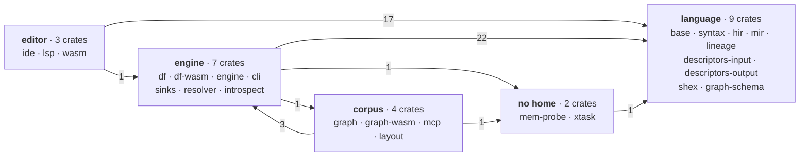
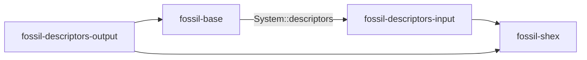
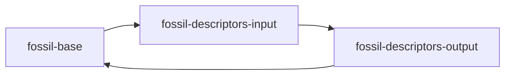
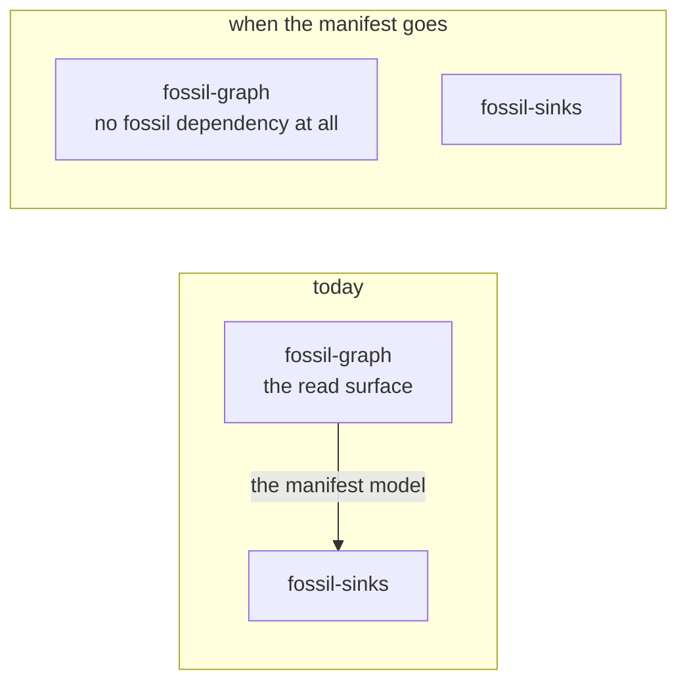

## The graph today, and it is meant to look like this

Grouped by what each crate is about, because two dozen nodes drawn flat show nothing. The ugliness is
the finding, not a failure of the drawing.

Twenty-five crates, forty-seven cross-group edges, and **one pair still runs both ways**. Measured
2026-08-25 from `cargo metadata`, `[dependencies]` only — a test may depend on whatever it likes, so
dev edges are out of scope here for the same reason they are in `content.test.ts`.

The single `editor → engine` edge is `fossil-lsp → fossil-introspect`, and it is deliberate: without
the columns a `DESCRIBE` finds, the editor is silent on every diagnostic whose evidence is a source's
schema.

The mutual arrow is `engine ↔ corpus`, and naming the four edges is the whole of the finding:

| direction | edge | why it is there |
| --- | --- | --- |
| engine → corpus | `fossil-engine → fossil-layout` | the post-pass runs after the write, so the thing that writes calls it |
| corpus → engine | `fossil-layout → fossil-df` | one function: `files::batches_to_parquet`, the single Arrow→Parquet encoder |
| corpus → engine | `fossil-graph → fossil-sinks` | the manifest model, which is the format and is filed under the engine |
| corpus → engine | `fossil-mcp → fossil-resolver` | `@conn` rendering, which is a host concern wearing an engine label |

That mutual arrow is the whole of the complaint that opened this page — *"it feels like we have two
cores"*. There are two, and they are still stitched together in the wrong place. **But the stitch is
now three named functions rather than a crate boundary**, and each has a stated price:
`batches_to_parquet` stays where it is because moving it would put `arrow` + `parquet` into
`fossil-graph-wasm`'s browser bundle, which has neither; `fossil-sinks` and `fossil-resolver` are
filed under the engine by history rather than by subject, and `/docs/design/one-engine` is where that
gets settled.

What has **not** happened is everything below this diagram: `fossil-base` still holds a `tracked`
query and the `@conn` locator, and `fossil-engine` is still a sack.

## Nobody cuts by deployment target

The attractive cut is three numbered rings by where the code runs — language, native, wasm. **It is
not the cut**, and the evidence is that none of the three compilers we compared against does
anything of the kind.

| | cuts by | says so in |
| --- | --- | --- |
| **Gleam** | **IO and purity** — *"compiler-core… is entirely pure and has no IO so that is provided by the other Rust crates that wrap this one"* | four bullets in `docs/compiler/README.md` |
| **Gluon** | **compiler phase** — parse → check → vm, with `base` as the shared vocabulary | one README bullet |
| **rust-analyzer** | **semantic richness**, with three declared API Boundaries: `syntax`, `hir`, `ide` | ~500 lines of `docs/book/src/contributing/architecture.md` |

All three cut by **what a piece of code is allowed to know**, and what they forbid is always the
same: knowledge of the outside world. Gleam implements it as nine traits in an `io.rs` that the core
declares and the shells satisfy; rust-analyzer implements it by forbidding `base-db` to produce a
`std::path::Path`.

<Callout title="When the cut is right, the shells collapse">
Gleam's entire wasm target is **352 lines**, 130 of which are an in-memory filesystem. Its binary is
**6 lines**. Its LSP transport is **69**. rust-analyzer's CLI is not even a crate — it is a module
inside the LSP binary.
</Callout>

A ring rule inverts that. It makes the target the primary axis, and then you have to decide which
ring a *feature* like the language server belongs to — and there is no good answer. Gleam puts it
under the CLI, rust-analyzer puts it *inside* the binary, Gluon puts it in a different repository.

What survives of the rings is not a ring. It is two crates with a `cfg` and a written reason:
`crates/fossil-lsp/src/lib.rs:98-100`, because `lsp-server` uses crossbeam and stdio, and
`crates/fossil-resolver/src/lib.rs:48-51`, because credential material is deliberately kept off the
wasm boundary.

## The rule is written first and checked second, in that order

> `duckdb` and `datafusion` are each reachable only from crates that declare themselves native.

It goes in `deny.toml`, which today names six wrappers for `duckdb` and five for `datafusion`
(measured 2026-08-25). But the order of importance is the one stated: **none of the three references
checks its architecture with a test.** rust-analyzer's most-cited rule — that `ide` depends only on
the top-level `hir` — is held up by a comment in a `Cargo.toml`, repeated verbatim in two files. What
does the work is a document that states the invariant *and its reason*.

And a list is not a check. `cargo deny check bans` matches `wrappers` against the **direct** parents
of a banned crate, so a crate that reaches an engine one hop further away is invisible to it —
measured with `fossil-lsp` linking a bundled database and `cargo deny` printing `bans ok`.
`crates/xtask/tests/engine_reach.rs` is what closes that, and it derives both halves: the policy from
`deny.toml`, the truth from `cargo metadata`.

## `base` means two opposite things, and one of them has to be ours

The two references that have a crate called `base` give it contrary contents:

| | `gluon_base` — 11,970 lines | rust-analyzer's `base-db` — 1,866 |
| --- | --- | --- |
| contents | AST, types, kinds, symbols, positions | salsa plumbing, the input queries, `CrateGraph` |
| language vocabulary | **is** the vocabulary | **none** |
| describes itself as | "modular" | *"Basic database traits. The concrete DB is defined by `ide`"* |

And two of `base-db`'s own invariants point straight at us: *"base-db knows nothing about cargo"* and
*"base-db doesn't know about file system and file paths"* — its VFS is **another crate**, and the
operating-system implementation is **a third**.

`fossil-base` holds the salsa `Db` trait, the filesystem abstraction and the diagnostics together,
and it knows a concrete type from a concrete provider: `crates/fossil-base/src/system.rs` imports
`InferredDescriptor` for `System::descriptors`, so the crate that exists in order to know nothing
knows something.

> **If a crate called `base` contains the substrate *and* the file abstraction, it is two crates that
> have not been separated yet.**

The prose half of that rule is now a test — `crates/fossil-base/tests/substrate_has_no_prose.rs`
reads `providers.rs` and fails on a string literal with a space in it, because a crate that decides
nothing about a program has no business composing an English sentence about one.

### The remaining edge stays, and this is what would move it

`fossil-base → fossil-descriptors-input` exists for **one trait method**, `System::descriptors`. Four
crates, and the arrows nearly meet:

Acyclic, but only just. Fold `fossil-shex` into `fossil-descriptors-output` — the obvious
simplification, one crate fewer — and the two remaining arrows close on themselves:

So the fold is blocked while that edge stands. Three ways out were costed:

1. **A generic or associated type on `System`.** Impossible, not merely expensive: the trait is used
   as `Arc<dyn System>` and as `&dyn System`. Either shape is object-safety's own counterexample.
2. **The types down into `fossil-graph-schema`,** the leaf both sides already see. It costs no new
   crate — and it puts a `Mutex<HashMap>` of host-owned mutable state inside the crate that depends
   on nothing but `serde`. That is the mistake this page is about, committed in a second place.
3. **A new leaf holding `DescriptorCache` + `InferredDescriptor`.** It works, and it is the only one
   that does. It also costs a 26th crate, changes an import path in nine crates, and — the reason it
   is not done — **removes nothing from `fossil-base`.** Only the crate the concrete type came from
   would be spelled differently.

**What reverses this:** somebody actually folding `fossil-shex` into `fossil-descriptors-output`.
That fold removes a crate, so (3) nets zero on the count and the cycle goes with it — the cost
becomes free at the moment there is a reason to pay it.

## `lsp-types` in exactly one `Cargo.toml`

This is the invariant rust-analyzer defends hardest, and both sentences are worth keeping whole:

> *"`rust-analyzer` is the only crate that knows about LSP and JSON serialization. If you want to
> expose a data structure `X` from ide to LSP, don't make it serializable. Instead, create a
> serializable counterpart in `rust-analyzer` crate and manually convert between the two."*

> *"Although at the moment it has only one consumer, the LSP server, **LSP does not influence its API
> design**. Instead, we keep in mind a hypothetical ideal client."*

It costs 3,180 lines of `to_proto.rs` — 0.8% of the codebase — and buys a guarantee a grep can check.
Note the asymmetry: 3,180 lines out against 156 in. Translating *inwards* is trivial; the work is all
on the way out.

**`fossil-ide` returns `lsp_types` structs directly** — `crates/fossil-ide/src/completion.rs:64`. We
made Gleam's mistake, which has `use lsp_types::Position` inside the crate its own documentation
calls *"entirely pure"*, rather than rust-analyzer's choice.

## The verdict, which is not the crate count

**Twenty-five crates and about 45,000 lines.** Against the references: Gluon has ~11 for 90k, Gleam 15
(six real; the rest are test harnesses and vendored libraries) for 228k, rust-analyzer 36 for 571k.
**For 45k the honest target is five to eight.**

But what makes two dozen feel like a maze is not the count:

> **Three of them lie about what they are.** `fossil-ide` is not an IDE, `fossil-sinks` writes nothing,
> and `fossil-engine` is not an engine. There were four: `fossil-run-status` was not a status, and
> that one was answered by deleting the crate rather than by renaming it.

A false name costs more than a surplus crate, because you cannot skip it while reading. `fossil-ide`
is the set of LSP functions, and exists only because `fossil-lsp` does not compile to wasm32.
`fossil-sinks` writes nothing — it is the manifest model, borrowing GraphAr's field names without
conforming to GraphAr ([where borrowing stops](/docs/design/corpus#what-is-borrowed-from-graphar-and-where-borrowing-stops)),
and half its dependents are readers.
`fossil-engine` is the native host: it supplies the `System` the compiler runs against, does the
pre-compile jobs (register the shape documents, install the secrets a `@conn` needs, call
`fossil-introspect`) and drives compile→run. Not an engine, and not a façade either.

<Callout title="Deliberately absent">
**No numbered layers.** A rule that needs a number to explain itself is a taxonomy, not a rule.

**No crate named after its deployment target.** The one crate rust-analyzer names after a process
boundary is `proc-macro-srv-cli`, and it exists because procedural macros segfault — fault isolation,
not a ring.

**No crate that exists by imitation.** A crate earns its boundary from a cycle, a `cfg`, an orphan
rule or a publishing frontier.
</Callout>

## There are two cores, and the second is one landed decision from having none

The split below is not a refactor anyone has to be argued into. It is what the tree will look like
the moment a decision already taken is executed. Three facts, in order:

1. **`fossil-graph` has exactly one fossil dependency: `fossil-sinks`.** It does not know the language
   — grepping its `src` for `fossil_hir|fossil_syntax|fossil_mir|fossil_base|fossil_descriptors|fossil_lineage`
   returns zero — and it does not touch the disk. It declares two ports instead:
   `ManifestSource::fetch` and `DuckExecutor::query_json`, **the only two real extension points in the
   entire workspace.**
2. **That dependency is used on one production line**: `crates/fossil-graph/src/manifest.rs:16`.
   Everything else is a `#[cfg(test)]` module.
3. **The corpus is Parquet and nothing else.** Conforming to an existing graph interchange
   specification is a [discarded alternative](/docs/design/discarded), and that manifest is exactly
   what the dependency in (2) models. The seam between the two cores is made of the one thing the
   design has already ruled out.

Not a small number of dependencies — zero. And the other half of the confirmation is measured rather
than assumed: `kanzo-ui` reads corpora written by fossil with **no dependency on `@fossil-lang/*`**,
and three languages that do not know fossil exists read the same tree on 2026-08-04. The seam between
the two halves is the corpus on disk. It was never an API.

That claim is a build failure rather than a sentence somebody measured once: `apps/docs/content.test.ts`
reads `crates/fossil-graph/Cargo.toml` and fails if that crate's fossil dependencies are ever anything
other than `fossil-sinks` alone — including when the manifest goes and the answer becomes none, at
which point this page owes a rewrite.

<Callout type="warn" title="A name that misleads, corrected here too">
`fossil-graph` is **not** an implementation of GraphAr, and neither is `fossil-sinks`. Nothing here
writes a corpus a GraphAr reader can open: the manifest borrows GraphAr's YAML field names and stops
where GraphAr stops specifying, which is
[stated once with the divergences measured](/docs/design/corpus#what-is-borrowed-from-graphar-and-where-borrowing-stops).
`fossil-graph` is the read surface over a corpus somebody else already wrote: a closed enum of
[six verbs](/docs/design/corpus#the-verb-surface-six-and-none-of-them-draws). The crate that writes is
`fossil-df`; the crate that models the manifest is `fossil-sinks`.
</Callout>

## What is on this page and what is not

The page is the shape; [three hosts](/docs/design/three-hosts) is the argument. The measurement that
reordered the whole priority — a compiler that reports success and writes a corpus with a property
missing — is [the expression cliff](/docs/design/expressions); the scope of the incremental system is
[tooling for humans](/docs/design/tooling-for-humans); and whether the specification belongs in its
own repository was settled against five projects in [prior art](/docs/design/prior-art).
