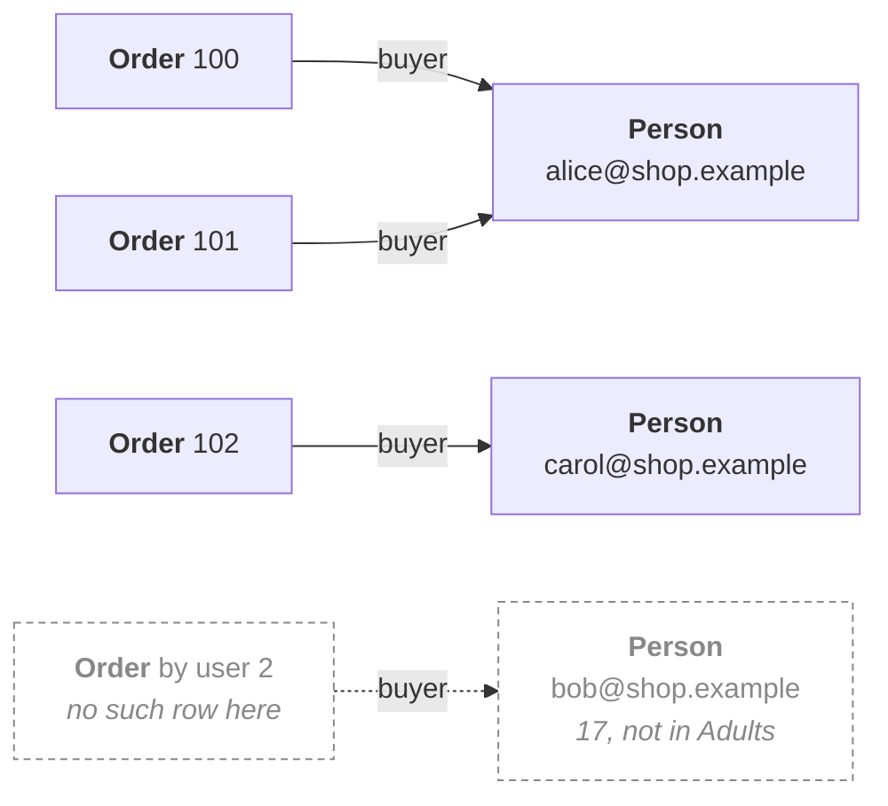

This is the page to read end to end. One program — a small shop, with people and the orders they
placed — built up a piece at a time, each idea arriving where the program needs it.

## What we are starting from

Two files of data. People:

<Program src="shop/data/users.csv" title="data/users.csv" />

And their orders, keyed back to them by `user_id`:

<Program src="shop/data/orders.csv" title="data/orders.csv" />

And a description of the graph we want out: a `Person` has an email, a name and maybe a phone; an
`Order` has a total and a buyer, and the buyer is a `Person`.

<Program src="shop/shop.shex" title="shop.shex" />

The program is the third thing — the piece that says *this column becomes that property*.

## 1. Declare what you are producing

<Program src="shop/shop.fossil" region="shapes" title="shop.fossil" context />

`io.shex(...)` reads the shape document, and the braces on the left pull two shapes out of it under
local names. They bind **by position**, and the label you choose never reaches the output: rename
`Person` to `Persona` and the graph is byte for byte the same, because the IRI written as the node's
type comes from the document. See
[naming what you produce](/docs/book/what-you-produce#binding-is-by-position).

`io` is where the readers live: `io.shex`, `io.shacl`, `io.csv`, `io.json`, `io.parquet`, `io.rdf`.
None of them take anything on the left, because they are what makes the thing.

## 2. Declare what you are reading

<Program src="shop/shop.fossil" region="sources" title="shop.fossil" context />

The same mechanism, pointed the other way. `io.csv` reads the real file at that path, and reads it
while it is checking your program rather than while it is running one: it works out that `age` holds
integers and `email` holds strings, and builds a type for the row. Nobody declares `User`; nobody
writes its fields down. The type exists because the data does, early enough to catch a misspelled
column while you are still typing it.

One line, one name, **two things**:

- `User` is a **type**. `User.age` is one of its fields, and it is an `Integer`.
- `User` is a **relation**. `from User` in a mapping header means *once per row*.

`.` means "member of", and what is on the left decides which of the two you get: `User.age` is a
field because a type is on the left, `User.where(...)` is a relational operation because a relation
is. One operator, two answers, and no second one to learn —
[values and expressions](/docs/book/expressions#member-access) has the full table.

## 3. Narrow it

<Program src="shop/shop.fossil" region="derived" title="shop.fossil" context />

`Adults` is a relation, derived from `User` by a member function. Look at what the predicate names:
not `.age`, which does not exist in this language, but `User.age`. **Every reference says which row
it came from**, even here where there is only one row in scope.

And `Adults` is not a new type. It is a relation of `User`s, which is why the mapping body below
writes `User.name` and not `Adults.name`.

## 4. The first mapping

### The header

<Program src="shop/shop.fossil" region="header" title="shop.fossil" context />

*The mapping called `Users` produces `Person`s, one per row of `Adults`.* `Person` is the type, the
contract the body is checked against; `Users` is the mapping's own name, and
[mappings](/docs/book/mappings#the-header-and-its-two-names) says why it needs one. No colon at the
end — the block is opened by the indentation.

### The identity

<Program src="shop/shop.fossil" region="identity" title="shop.fossil" context />

The identity is the one thing you have to invent, because an IRI is not in your CSV. It is an
assignment, and its right-hand side is an ordinary
[interpolated string](/docs/book/expressions#string-interpolation).

Two rules apply here and nowhere else — it is the first line of the body, and there is one per type —
and [`@subject`](/docs/book/mappings#subject) states both. The second is what makes the edge in
section 6 as short as it is.

### The properties

<Program src="shop/shop.fossil" region="properties" title="shop.fossil" context />

The key is a plain name and nothing else: the last segment of the predicate IRI the shape declares.
`https://shop.example/voc#email` in the document is `email` here, and the name depends on the label
and nothing else — never on cardinality, never on the datatype, never on where the property sits.

The right-hand side is any expression. Here they are bare column references, but
`User.email.trim().lower()` is a property line too.

## 5. The second source, and the join

<Program src="shop/shop.fossil" region="join" title="shop.fossil" context />

The orders live in their own file and the key back to a person lives with them, so this mapping's
source is a join. `join` is a member of a relation, the same way `where` is: it takes the other
relation and an `on` that is an equality between qualified references, or several joined by `and`
because compound keys are ordinary. Not a general condition — the `on` names keys.

**The join does not flatten.** Two rows are in scope, `Purchase` and `User`, and every reference says
which one it came from — which is why the qualification was there from the first line of the program.
[Relations](/docs/book/relations#a-join-does-not-flatten) has what follows from that.

## 6. The edge

The shape says `shop:buyer @shop:Person` — this property does not hold a string, it holds a `Person`.
So you give it one:

<Program src="shop/shop.fossil" region="edge" title="shop.fossil" context />

Read it as *the `Person` whose identity is built from this email*. You name the type you are pointing
at and hand it the value its identity needs — you never build an IRI by hand and hope it matches the
one the other mapping minted, because there is exactly one `@subject` for `Person`.

Here is the graph this program writes from that data, and the one arrow that is not in it:

The dashed pair is the arrangement, not the data. `Orders` joins against `User` while `Users` maps
from `Adults`, so an order placed by a seventeen-year-old would mint a `buyer` pointing at a `Person`
that `Users` never emitted — and **the checker does not ask whether the node at the other end
exists**, so it would still type-check. [Edges](/docs/book/edges) settles that.

## The program, whole

<Program src="shop/shop.fossil" title="shop.fossil" />

Sixteen lines, not one type written by hand, and one IRI per type inside the string where it is
minted. Every name on a left-hand side came from the shape document, every name on a right-hand side
came from the data, and the whole job of the checker is the space between them.

Change one letter of one of those names and the diagnostic names the fields that do exist, because
`User`'s fields are the columns of a file that was read — see
[when it does not compile](/docs/book/diagnostics).

Next, the ideas here on their own terms: [naming what you produce](/docs/book/what-you-produce),
[naming what you read](/docs/book/what-you-read), [relations](/docs/book/relations),
[mappings](/docs/book/mappings), [edges](/docs/book/edges).
