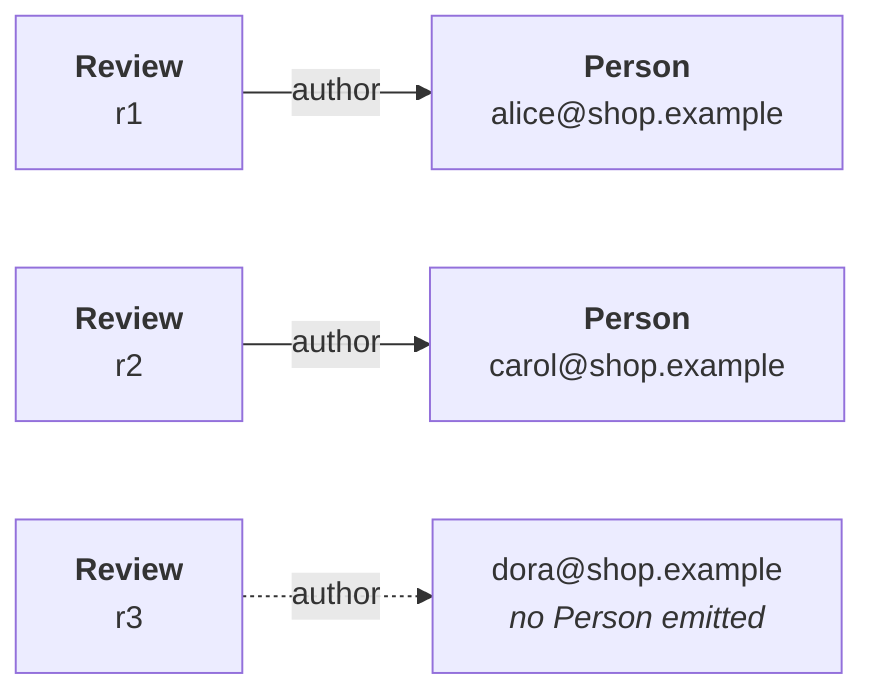

Most properties hold a value. Some hold another entity, and the shape document says which:

<Program src="shop/shop.shex" region="order" title="shop.shex" />

`shop:buyer @shop:Person` — this one does not take a string, it takes a `Person`. So you write one:

<Program src="shop/shop.fossil" region="edge" title="shop.fossil" />

Read it as *the `Person` whose identity is built from this email*. You name the type you are pointing
at and hand it the value its identity needs. That is the whole form.

## Why that is enough

A `Person` here has exactly one identity, because
[every mapping that produces one writes the same `@subject`](/docs/book/mappings#subject). So
`Person(User.email)` is not a guess at what the other mapping minted: there is one answer and the
compiler has it. You never write the IRI twice, so the two copies cannot drift apart. The argument is
checked too — hand `Person` something of the wrong kind and you hear about it at that line.

## An edge may dangle

**The checker does not ask whether the node at the other end exists**, only that the IRI is well
formed and built by the scheme that type uses. That is deliberate: in RDF an IRI denotes whether or
not this corpus says anything about it.

Three reviews name an author by email, and the people file has two of them:

<Callout type="warn" title="The dangling edge is dropped, and the run says so">
An edge is a pair of dense ids and a dense id is a row number in a vertex table, so `execute_edge`
resolves both endpoints with an inner join and the third review never becomes an edge. That is
intended and it stays; what it no longer is, is silent. The run counts the drops per edge type — a
summary line naming the edge and the number, and a `dropped` entry in `--output-json` present even as
`0` (`crates/fossil-df/src/report.rs:102`, `crates/fossil-df/tests/dangling_edges.rs:90`).
</Callout>

The usual way to arrive here by accident is a filter upstream: a mapping reads from `Adults` while
the join feeding the edge reads from `User`. If you want those edges inside your own graph, join
against the same relation the mapping reads.

## Edges in both directions

An edge lives on whichever entity the shape puts it on. There is nothing to declare at the other end
and no inverse to keep in step — `Order` has a `buyer`, and `Person` knows nothing about it. For
`Person` to have `orders`, the shape declares that property and a mapping writes it, as for any
other.
