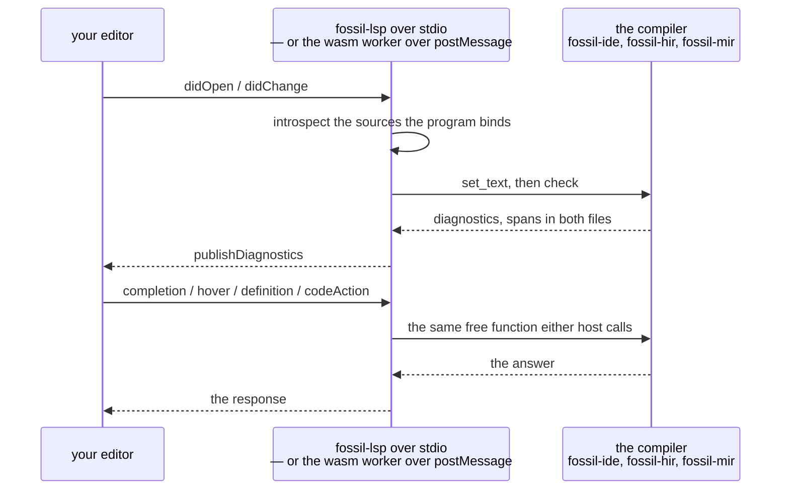

The language server is one binary, installed alongside the compiler:

```bash
cargo install --git https://github.com/Kanzo-Tech/fossil-lang fossil-lsp
```

Then point your editor at it for files ending in `.fossil` — an `lspconfig` entry in Neovim, a
`[[language]]` block with `language-servers = ["fossil-lsp"]` in Helix, the equivalent anywhere else
that speaks the protocol. It reads stdin, writes stdout, and has no configuration of its own.

## What it answers

Everything below is served by both hosts: the native binary, and the same compiler built to
WebAssembly behind a browser playground.

| you ask for | native | browser | and it answers |
| --- | --- | --- | --- |
| a property key, in the body | the target shape's own predicates | same | under the name your program writes — a renamed predicate is offered under its rename, with the full IRI as the entry's detail |
| a column, after `Source.` | columns of local files | columns, over DuckDB-WASM | the fields the provider read off the source, each with its inferred type |
| a member, after any other dot | narrowed to the receiver | same | only the catalogue rows that receiver has, spelled bare: `where`, not `seq.where` |
| a name, away from any dot | the whole catalogue | same | every row, spelled in full, because there is no receiver to narrow by |
| hover, anywhere in a property | two type blocks | same | the type of what you wrote and where it came from, and the type the shape demands of that predicate |
| go to definition | four positions | same | the shape document at the shape, the document at the predicate, a mapping, or the `:=` binding that introduced a name |
| quick fix, on an unknown column | Replace with… | same | the nearest field of that row, swapped into exactly the span that was wrong |
| quick fix, on a disjunctive shape | Split mapping… | same | one mapping per ShEx `OneOf` disjunct, as the checker already generated it |
| diagnostics as you type | on every edit | same | the diagnostics of [when it does not compile](/docs/book/diagnostics), at the same spans, with `help:` folded onto the message |

It also advertises document symbols and semantic tokens. No code action fires on a clean file: both
quick fixes hang off a diagnostic you can already see. And hover's second block appears only when the
shape resolves — a program that names no output document gets the first block and no error, because
the missing document is the checker's diagnostic and not the hover's.

Four things narrow the list further than you might expect, and each is deliberate:

- **A property key is offered only in key position** — an identifier the grammar lets a key go in.
  `str.trim` cannot be a property key, so no catalogue row is offered there either.
- **A receiver that is an expression resolves nothing.** `User.email.trim().` has a `)` to its left
  and no name to ask about. Nor does a binding reached through a derivation, or a join alias.
- **A source the editor cannot open is not introspected.** A local file that exists gets columns; an
  `https://` source gets none, and an editor's message loop is the wrong place to fetch one.
- **A shape document open beside your program is not checked as one.** A URI some `io.` row reads is
  an input, and an input is not drained — without that rule the parser blames a perfectly good
  `ShExJ` file for every complaint it has.

## Two hosts, one set of answers

`fossil-lsp` is native — it is a stdio transport and it refuses to compile for `wasm32`. What
compiles to WebAssembly is everything under it. Neither host implements a feature: both call the same
`fossil-ide` free functions, over a different wire.



Checking a program needs a parser, a shape document and the columns of a file. None of those needs a
machine somewhere else, so all of it is available in a page with nothing on the other end of it.

A diagnostic's secondary labels travel as `relatedInformation`, and a label pointing into the `.shex`
carries that file's URI and line — which is what makes the two-file report an editor feature and not
only a terminal one. Closing a buffer publishes an empty list, so a file you are done with stops
squiggling.
