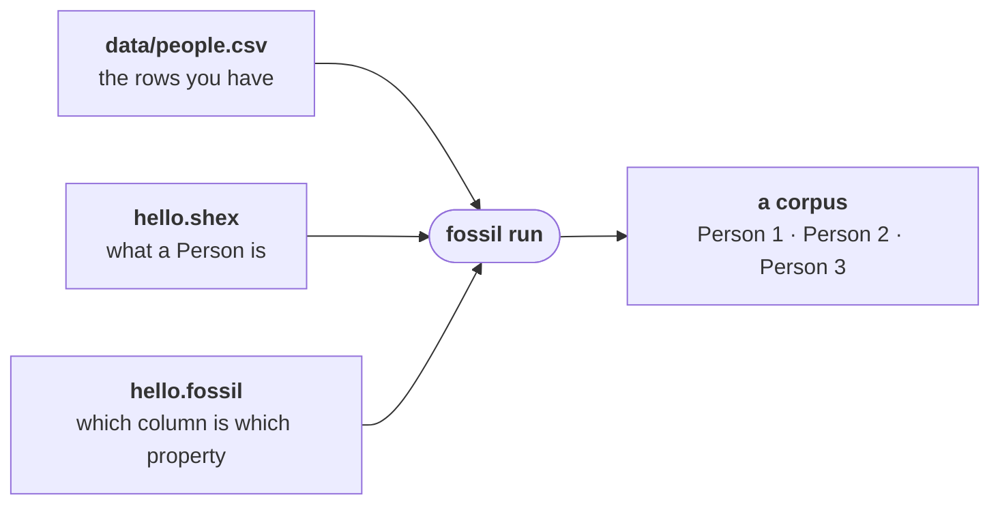

fossil turns tables into a graph. You give it the data you have and a document describing the graph
you want, and it writes the graph.



## Install

One binary, built from the repository. It puts `fossil` on your path.

```bash
cargo install --git https://github.com/Kanzo-Tech/fossil-lang fossil-cli
```

## The three files

Make a directory and put them in it.

<Program src="hello/hello.fossil" title="hello.fossil" />

<Program src="hello/hello.shex" title="hello.shex" />

<Program src="hello/data/people.csv" title="data/people.csv" />

## Check it, then run it

`fossil check` reads all three and tells you whether they agree. If they do not you get a diagnostic
pointing at the line — [when it does not compile](/docs/book/diagnostics) is worth reading early.

```bash
fossil check hello.fossil
```

```
ok — no errors in hello.fossil
```

Then write the graph:

```bash
fossil run hello.fossil --dest file:///tmp/hello
```

```
wrote 1 vertex type(s), 0 edge type(s) to file:///tmp/hello
```

Under `/tmp/hello` is the corpus: columnar files and a manifest, three `Person` nodes in them, one
per row of `people.csv`.

## Where to go next

[Your first program](/docs/book/first-program) accounts for every token above. [The anatomy of a
fossil program](/docs/book/anatomy) takes a larger one and grows it a section at a time.
