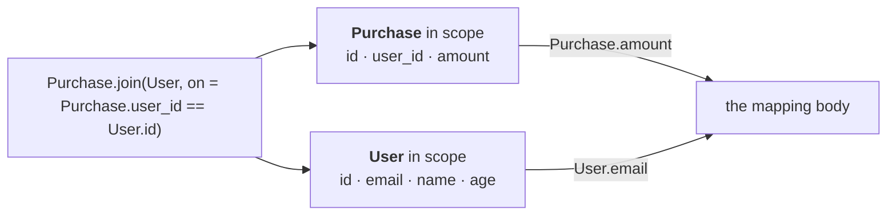

A source binding gives you a relation. So does every operation on one: you start with the rows in a
file and build the set of rows you actually want, one named step at a time.

## `where`

<Program src="shop/shop.fossil" region="derived" title="shop.fossil" />

`where` takes a predicate — an ordinary expression, true or false for a row — and gives back the rows
where it holds. `Adults` is a relation derived from `User`, with the same operations `User` has, so
you can keep going.

## `select`

<Program src="projection/projection.fossil" region="chain" title="projection.fossil" />

`select` narrows a relation to the fields you will use: `Active` is the rows that survive the filter,
`Minimal` is those rows carrying two of their four fields. Neither is a new type — `Adults` is a
relation of `User`s and `Minimal` a relation of `Employee`s. The fields belong to the type, and the
type is the one the binding named, so inside a mapping that reads `Minimal` you write `Employee.name`:

<Program src="projection/projection.fossil" title="projection.fossil" />

**The name after `from` says which rows; the name before a dot says which type.**

Naming a step is optional — `User.where(...).select(...)` in a header is a relation like any other. A
name is worth it when the step means something you would otherwise re-explain, which is why `Adults`
is `Adults` and not `Filtered`.

## `join`

Two files, and the key that connects them lives in one of them:

<Program src="shop/shop.fossil" region="join" title="shop.fossil" />

`join` is a member of a relation, like `where`. It takes the other relation and an `on`, which is an
equality between qualified references — or several joined by `and`, which is what a compound key
needs:

<Program src="compound-key/compound-key.fossil" region="on" title="compound-key.fossil" />

It is not a general condition. `on = A.date > B.since` is refused rather than quietly becoming a
nested loop over the product of two corpora — today by `fossil run` rather than `fossil check`, so
the message arrives late and without a span.

### A join does not flatten

There is no merged row afterwards. **Two rows are in scope**, and every reference says which one:

<Program src="shop/shop.fossil" region="second-mapping" title="shop.fossil" />

Nothing acquires a suffix, and no column is renamed because two files used the word `id`. A self-join
needs no special apparatus either, there being no union of rows to collide in: name the second copy
with `as` and you have two rows again, both of them `Node`s.

<Program src="self-join/self-join.fossil" title="self-join.fossil" />

The price is that names travel with the relation. Once a join has a name, every mapping that reads it
has both rows in scope — which is how `Other` reaches the body of `Categories`. Rename a source and
its readers see the change.

## The rest of them

| verb | takes | gives back |
| --- | --- | --- |
| `where` | a predicate over a row | the rows where it holds |
| `select` | columns | the same rows, narrower |
| `join` | another relation and an `on` | both rows in scope |

Those three reach the surface today. The catalogue holds ten more for a relation — `union`,
`distinct`, `sort`, `take`, `drop`, `count`, `map`, `flatten`, `group_by`, `aggregate` — which the
checker knows and the lowering does not yet handle; [the standard library](/docs/book/stdlib) lists
them. None is a special form: they are functions with a relation on the left.
