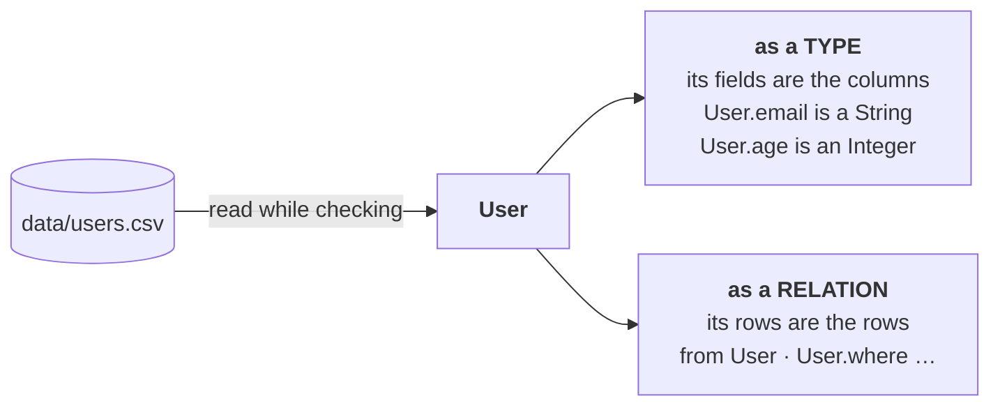

A source binding is one line:

<Program src="shop/shop.fossil" region="sources" title="shop.fossil" />

fossil opens the file at that path while it is checking your program, to see what is in it. The
columns become fields, and the values decide what kind each field holds. `age` holds whole numbers, so
`User.age` is an `Integer`, and it is an `Integer` without anybody writing that down.

## One name, two jobs

<Program src="shop/shop.fossil" region="derived" title="shop.fossil" />

<Program src="shop/shop.fossil" region="header" title="shop.fossil" />

The two never collide, because they are never in the same position: after `from` a name is a relation,
after a dot in an expression it is a type, and what the dot answers in each case is
[values and expressions](/docs/book/expressions). One binding is one concrete file, so there is nothing
to be gained by making you write the halves separately.

## The formats

| what you have | how you bind it | where the field names come from |
| --- | --- | --- |
| a CSV | `io.csv("data/users.csv")` | the header row |
| a JSON file | `io.json("data/sightings.json")` | the keys of the objects |
| Parquet | `io.parquet("events.parquet")` | the file's own schema |
| an RDF graph | `io.rdf("people.ttl")` | the predicates of its subjects |

Each one is a member of `io`, and nothing else is said about a source: no column list, no types, no
schema file beside it. The file is the declaration.

## What this gets you

Reading it up front, rather than when the data goes past, buys two things.

**A misspelled column is a mistake you find now**, at the line, with a suggestion drawn from `User`'s
own fields rather than from everything the language knows — see
[when it does not compile](/docs/book/diagnostics). Nothing is left to be discovered later in a graph
with nothing in it.

**And your editor can know the answer.** Type `User.` and the completion list is the columns of that
file: not a guess, not a cached schema somebody wrote down in a config.

The reading is the host's job, and every host does it: `fossil-cli` introspects before each `check` and
each `run`, the browser playground reads the file with DuckDB-WASM, and `fossil-lsp` goes and looks at
any source it can `stat` (`crates/fossil-lsp/src/lib.rs:183`). The gap left is a source that is not on
disk — a CSV on `s3://`, or behind an `https://` — which the editor declines to fetch on its message
loop, so there `fossil check` reports things your editor does not, and
[in your editor](/docs/book/editor) measures it.

## Fields, not rows

A binding gives you the shape of a row, not the rows themselves. There is no way to ask a program what
is in cell three, and no way for a value in the data to change what the program means.
