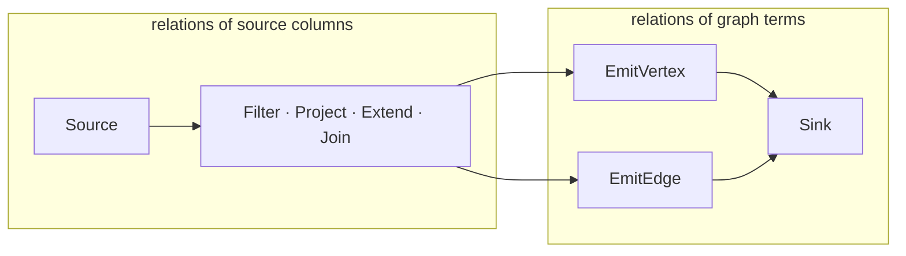
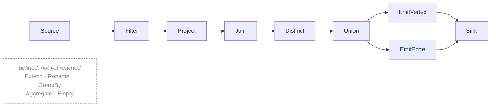

A fossil program is not translated to SQL directly. It is elaborated into a tree of operators, each
taking relations with schemas and producing a relation with a schema, and that tree is what the rest
of the compiler talks about. Three of fossil's seven reasons for existing — static typing, inference
from shapes, generic functions — are claims about types, and this is what the types attach to.

Operators defined independently of any syntax make two questions answerable that are otherwise
arguments: *do these two programs mean the same thing*, and *is this rewrite sound*. Knowledge-graph
construction had surface syntaxes long before it had that, which is why two mappers can read one
document and disagree about what it produces. **Min Oo and Hartig, *An Algebraic Foundation for
Knowledge Graph Construction*** (arXiv 2503.10385; ESWC 2025) closed the gap, and fossil's middle is
their algebra with a type on every operator's schema.

## The fourteen operators

What an operator does to the **schema** is as much of its definition as what it does to the rows.

| Operator | Schema in ⟶ schema out | The SQL shape it lowers to |
| --- | --- | --- |
| `Source` | none ⟶ the type the provider generated for the file | a scan or a view over the file |
| `Project` | drops columns not named | the `SELECT` list |
| `Extend` | adds one column, whose type is the expression's | a computed column in the `SELECT` list |
| `Rename` | one column changes name, the type unchanged | `AS` |
| `Filter` | unchanged; the predicate must be boolean | `WHERE` |
| `Join` | the union of two schemas, qualified | `JOIN … ON` |
| `Union` | both inputs must carry the same schema | `UNION ALL` |
| `GroupBy` | the grouping columns, plus what `Aggregate` adds | `GROUP BY` |
| `Aggregate` | adds one column whose type the aggregate decides | an aggregate in the `SELECT` list |
| `Distinct` | unchanged | `SELECT DISTINCT` |
| `EmitVertex` | a schema of graph terms, not of source columns | a projection into the vertex encoding |
| `EmitEdge` | a schema of two identities and a predicate | a projection into the adjacency encoding |
| `Sink` | none — it consumes | the write |
| `Empty` | the empty relation, with a schema and no rows | the unit of `Union`, so an empty filter is not a special case |

## The seam

**`EmitVertex` and `EmitEdge` are where the algebra stops being relational.** Above them is a
relation of source columns, below is a relation of graph terms — an identity, a predicate, a value.
That is the seam the whole type system runs through: the only place where the input's type and the
output's have to agree about the same thing.



## The typing rules

An operator's schema-out is a function of its schemas-in and of the expressions it carries. A rule
that cannot produce a schema is a compile error, attributed to the expression that made it so:

```
        Γ ⊢ r : {a₁:τ₁, …, aₙ:τₙ}       Γ, r ⊢ e : σ
Extend  ─────────────────────────────────────────────
        Γ ⊢ Extend(r, b, e) : {a₁:τ₁, …, aₙ:τₙ, b:σ}

        Γ ⊢ r : R      Γ, r ⊢ e : Bool
Filter  ──────────────────────────────
        Γ ⊢ Filter(r, e) : R
```

`Filter`'s premise is why a predicate cannot be a string with holes in it: `Bool` is a type, and a
type is a thing an expression either has or does not. The other judgement, `Γ, r ⊢ e : σ`, is
defined on [what an expression is](/docs/design/expressions).

<Callout title="A conservative typed elaboration">
**None of these annotations change what an operator does to the rows.** Erase them and what remains
is an expression in the paper's algebra, so their soundness results are results about fossil's
middle. The obligation is permanent: **a feature that would make a type operationally significant is
out of bounds** — a checker-inserted coercion, a dispatch on a run-time type, a run-time type test
each make erasure change the answer.
</Callout>

## The verbs that reach the operators

A source almost never arrives with the shape a mapping needs, and that work has three possible
homes: outside fossil, borrowed from the engine through the source binding, or in the language. **It
lives in the language** — a relation carries verbs, reached through the dot like every other member,
and our checker types the result end to end, which is what neither of the other two gives.

<Program src="shop/shop.fossil" region="derived" title="shop.fossil" />

`Adults := User.where(User.age >= 18)` is a **relation**, not a value. `join` is in the first version
as an inner join, and the checker gained its first two-input rule with it — the joined row is the
two sides' scopes side by side, each column addressed by the binding that owns it — because a join
is where an operator set stops being a list and starts being an algebra. Nine of the fourteen are
what the lowering emits today; the other five are defined and unreached, which is a different
problem from being over-designed and takes a different fix:



### The join condition is a predicate, not a key

`on` takes a condition relating the two sides by qualified column, and the two columns need not
share a name — the MIR lowering carries the binding, so a column reference says which side it is:

<Program src="shop/shop.fossil" region="join" title="shop.fossil" />

Three shapes follow and each has an executed test: differently-named keys plan as an ordinary
equi-join (`crates/fossil-df/tests/pipeline.rs:272`), a compound key is a conjunction of equalities
joined by `and` (`crates/fossil-df/tests/pipeline.rs:307`), and a self-join tells its two halves
apart by the alias `X as Y` (`crates/fossil-df/tests/pipeline.rs:603`).

### A union answers to the pipeline, and to neither side

<Program src="union/union.fossil" region="chain" title="union.fossil" />

`join` keeps its two sides addressable — the body writes `Purchase.amount` and `User.email`, and the
scope holds two rows. `union` cannot: its result is one row, and a row of it came from one of the
two with nothing in the data to say which. So `Everyone` is the name, `Staff.email` is refused, and
`Op::Union` carries the relation the way a `JoinSide` does. Keeping the left side's name instead
would be the ambiguity that `select` after a `join` was decided against on 2026-08-14, one operator
along.

The sides are paired **by position**, and equal names in equal order with equal types is the
requirement. That is not a rule of ours: DataFusion pairs them by position and returns a schema
whose fields carry no qualifier at all, which is also why the re-qualification happens after the
union rather than to each side before it.

### `distinct` takes nothing

<Program src="distinct/distinct.fossil" region="chain" title="distinct.fossil" />

Its catalogue row declared `on: Column+` — `DISTINCT ON`, which keeps one row per group and picks it
arbitrarily unless an `ORDER BY` says otherwise. `sort` has no lowering, so there is no way to write
that order, and a verb whose corpus differs between two runs of the same program cannot be admitted
while every conformance artefact is compared byte for byte. The parameter is gone and
[what would bring it back](/docs/design/discarded) is `sort`.

Its effect is **not** visible in either conformance artefact, and it cannot be made so: `EmitVertex`
dedups by subject unconditionally, so four sightings of two species mint two vertices with or
without the verb. The rows are asserted where rows exist —
`crates/fossil-df/tests/pipeline.rs:690` unions three names onto three and counts six, then five.

## The plan is DataFusion's

**We do not need a planner. We need a checker.** The typed tree lowers to a DataFusion
`LogicalPlan`, which already has predicate pushdown, join reordering and a cost model; we supply the
types of the mapping, which DataFusion has no way to know, and borrow the rest. Two consequences:

- **The fourteen operators stay.** They are the pipeline's vocabulary, not an aspiration.
- **The ten rewrite rules are gone**, which gave up on optimising *twice*, not on optimising:
  `rewrite()` ran on every compile and always returned its input, because all ten matched operators
  the lowering never emits.

<Callout title="Deliberately absent">
**No planner of ours** — no cost model, no statistics, no join reordering. If any of it is ever
needed it arrives through DataFusion or it does not arrive. And **no operator the pipeline cannot
express**: `Op` has fourteen variants (`crates/fossil-mir/src/op.rs:43`) and stops there, because an
operator enters when a verb needs it and a verb enters when a program spells it.
</Callout>

## Not a template engine

A template is a string with holes in it and has exactly one checkable property: that the holes are
filled. You can verify that a placeholder names a column that exists; you can verify nothing about
the value that will arrive, because a hole is a hole — which is why "type-checked mapping" usually
means spell-checking placeholder names. A schema has names *with types*, and a type is the thing you
can state a rule about, which is what makes a mapping [checked against a shape rather than validated
after it](/docs/design/shapes).

## What this does not settle

- **The eight relation verbs the catalogue declares and the lowering does not implement.** `seq/`
  has thirteen rows — `map`, `flatten`, `take`, `drop`, `sort`, `group_by`, `aggregate` and `count`
  beside the five — and the refusal says so by reading the table rather than by listing what it
  knows. Each one that arrives has to arrive with the operator that carries it and a program that
  spells it, not as a row. `groupBy` is the next of the six and the expensive one: an aggregate
  changes the type of the row it produces, which is work for the checker and not for the syntax.
- **The three join flavours that are not `Inner`.** They stay defined and unreachable
  (`crates/fossil-df/tests/pipeline.rs:481` pins the refusal). An outer join manufactures NULL, and
  [the shape](/docs/design/shapes) has no way to declare a nullable property yet, so the one that
  arrives will arrive with that story and not before.
- **How a pipeline's type is reported in the editor.** A source binding today has a schema from a
  descriptor; a pipeline has a schema derived from one, and hover has to say something useful about
  the derived one.
