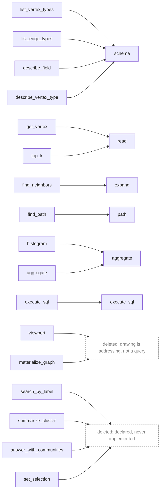
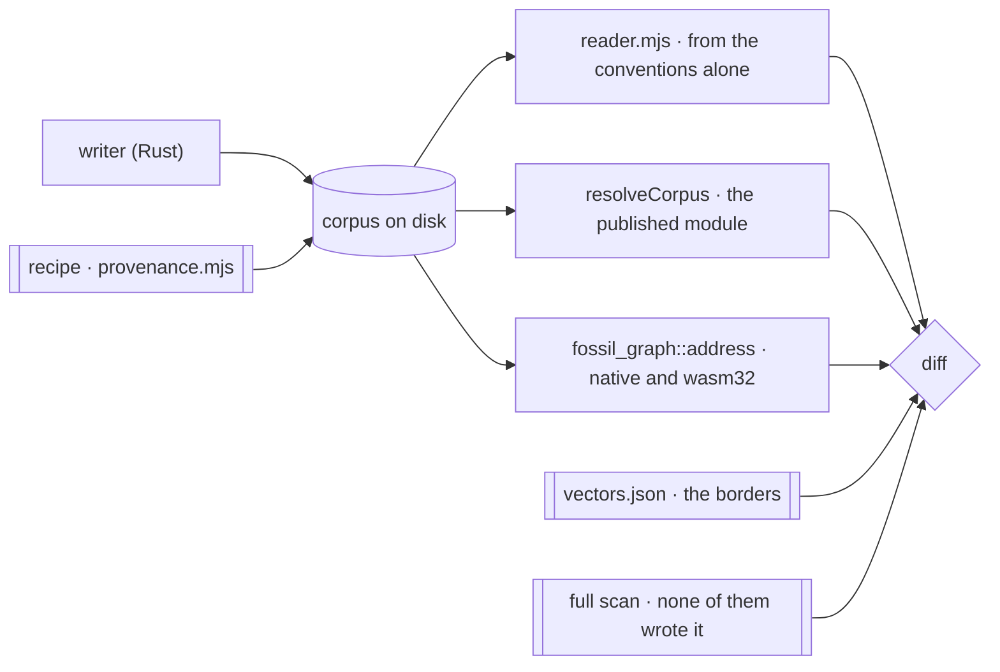

A fossil program produces a **corpus**: a graph written to disk as columnar files with a manifest
that names them. Not a database to connect to, not a stream to consume, not an endpoint. Files.

A reader that wants a slice works out which byte ranges hold it and fetches those ranges — from a
local path, an object store, or a plain web server. **There is no service in the path**, so no query
language between reader and data, no process to keep alive, no writer version to match.

## Addressable, and what that buys

An address is computed, not discovered: given the manifest, a reader derives the location of every
piece it wants **before it issues a single request**. The constraint that forces it is that **you
cannot list a directory over HTTP.** Expanding a wildcard over files *is* listing a directory — it
works on a local filesystem and on an object store, and fails in a browser against a plain origin,
which is the worst distribution of a failure a design can have. The lineage is explicit —
**Cloud-Optimized GeoTIFF → GeoParquet → PMTiles** — and copying that schema beats inventing one.

## The artifact is the API

The stance follows the table formats — Iceberg, Delta Lake, Lance — where a manifest plus a set of
files is the interface, *many* engines read the same table, and **none of them is the contract**.

**Arithmetic a reader must reproduce ships as arithmetic.** Iceberg publishes the hash function, the
seed and a table of vectors per type, and those constants turn up in the tests of implementations
that copied them; PMTiles dispatches its space-filling curve with a link to an encyclopedia article,
and every port re-derives it. **And two implementations before a format change, not after** — the
Arrow rule, which is why its gaps are skipped lines rather than wrong answers. Parquet is the
warning: thirteen years of unwithdrawable files and a reference implementation that became normative
without anyone deciding it.

<Callout type="warn" title="One clock, running one way">
**If the corpus reaches third parties before the vectors do, the option is gone.** Nothing is
published today, which is what makes this cheap exactly once. It is also why capability negotiation
is not built: before a corpus leaves this machine towards somebody who cannot regenerate it the
mechanism answers a question nobody has asked, and after that day it is late.
</Callout>

## What is borrowed from GraphAr, and where borrowing stops

**GraphAr's YAML field names are borrowed wholesale** — three files named the way GraphAr names
them, `<name>.graph.yml`, `<label>.vertex.yml` and `<source>_<edge>_<destination>.edge.yml`, plus
`version: gar/v1`, which is GraphAr's own string.

| file | the keys, all of them GraphAr's |
| --- | --- |
| graph info | `name`, `prefix`, `vertices`, `edges`, `version` |
| vertex info | `type`, `chunk_size`, `prefix`, `property_groups`, `version`; per property `name`, `data_type`, `is_primary`, `is_nullable` |
| edge info | `src_type`, `edge_type`, `dst_type`, `chunk_size`, `src_chunk_size`, `dst_chunk_size`, `directed`, `prefix`, `adj_lists`, `property_groups`, `version`; per adjacency `ordered`, `aligned_by`, `prefix`, `file_type` |

> **fossil follows GraphAr as far as GraphAr specifies, and no further** — because past that point
> there is nothing left to follow but a C++ implementation.

Is the thing in `docs/specification/format.md`? Then fossil spells it that way and a difference is a
defect. Is it only in that repository's `cpp/`? Then it is somebody's code, it binds nobody, and the
decision is taken here. **This is not a GraphAr-conformant corpus and does not claim to be.**

The count is the worked example. The specification never defines one — the word appears zero times —
and the reference implementation stores one anyway, as raw native-endian bytes in a file with no
declared width and no test vector. Here a count is a **manifest field**, required and not optional,
checked against the rows on disk after the layout pass has re-read, renumbered and re-tiled them
(`c573e73`). Required, because tiles are addressed and never listed: a hole in the middle is caught
by the addressing, and **a missing tail is caught by nothing.**

Eight divergences follow from that rule. None of them is a bug.

| key or artefact | GraphAr specifies | fossil does | why |
| --- | --- | --- | --- |
| `data_type` | ten built-ins, none unsigned; its parser accepts eight spellings and throws on the rest | `uint32` for `dense_id` and `cluster_id`, `binary` as the Arrow fallback (`crates/fossil-df/src/lib.rs`) | the address is a `u32`, so GraphAr's own reader throws on the first property of every corpus fossil writes |
| a count | nothing; three files under `cpp/` that no specification names | `vertex_count` and `edge_count` in the YAML | a decimal integer has a width and cannot have a byte order |
| offset table | required for `ordered_by_source`/`ordered_by_dest` edges | none emitted, anywhere | a vertex's run is a predicate on the tile already fetched, not a second request. **A real divergence from a specified thing** |
| `chunk_size` on an edge | rows per edge chunk, recommended 2²² | equals `src_chunk_size` and is the addressing unit, so nothing bounds the row count (`crates/fossil-sinks/src/manifest.rs`) | `by_source/tile{k}.parquet` holds every edge out of vertex tile `k`. Same key, different meaning: a reader taking the borrowed name at its borrowed value gets a number instead of an error |
| data-file paths | none, anywhere | `<prefix>chunk{k}.parquet` and `<edge prefix><adjacency prefix>tile{k}.parquet`, one level, one property group | there is nothing here to diverge from |
| `chunk_size` on a vertex | any value; recommends 2¹⁸ | 4,096, and a power of two | the address is `dense_id >> 12`, not a division; the value is measured on five million vertices, not recommended |
| `iri` | no field; its one escape hatch is on the graph info | on the vertex info and the edge info, omitted when empty | RDF type and predicate IRIs. A non-RDF corpus is exactly the borrowed shape |
| an `adj_lists` entry with no `prefix` | prose names the prefix; the worked example omits it from all three entries | reported absent rather than composed from convention | conformance case `unaddressable`. The specification's own example reads here as a corpus nobody can address |

<Callout type="warn" title="What would reverse all of this">
GraphAr specifying what it presently leaves to `cpp/`: a data-file path, a count with a declared
width and byte order, and a table of vectors. The stronger trigger is the one
[discarded alternatives](/docs/design/discarded) records against conforming at all — **a second
reader that is not ours and already speaks it** — because a specification nobody reads is not
interoperability.
</Callout>

## Why write-once/read-many is not an implementation detail

[Identity is unique per type](/docs/design/identity) because a fossil program is compiled in one
piece with every mapping in front of it — a check unavailable to any system whose parts deploy
independently, which is why the one federation system that shipped an equivalent removed it. And
atomic renames, lock files, visibility protocols and transaction logs exist to protect a reader from
a half-written state; with no such reader they are cost without benefit.

## The verb surface: six, and none of them draws

`fossil-graph` defines the surface; MCP, HTTP, the CLI and the in-process TS package are bindings
over it. **It closed at six on 2026-08-05**, and the six are the variants of `Operation`
(`crates/fossil-graph/src/operations/mod.rs`).

| verb | what it answers |
| --- | --- |
| `read` | rows of one vertex type, filtered, ordered and capped |
| `expand{into\|all}` | the neighbourhood of a *set* of vertices, one hop |
| `path` | a route between two vertices |
| `aggregate` | a grouped, bounded summary — over values or over ranges |
| `schema` | what types, fields and relations exist, with field stats on request |
| `execute_sql` | the escape hatch, which a binding may hide behind a permission |

The algebra answers questions and **does not draw**, because drawing is addressing: the camera works
out which level and which tiles it needs and asks for bytes, with no bbox in flight and no database
on that path. Level-of-detail is not a filter but a different relation — a level-3 tile holds
super-nodes that do not exist at level 0. A `where` selects rows from a table; zoom changes the
table. Once that is settled, every verb whose job was to make a picture stops having one.



Deleting the four stubs took `GraphError::NotImplemented` with them, so **the `match` is exhaustive
and a verb can no longer be declared without being wired.**

<Callout title="The rule that keeps it at six">
A new verb enters only if it serves a case the single path demonstrably cannot, and that
demonstration is a measurement. Not an argument.
</Callout>

### `read`'s `where` is SQL, and carries `execute_sql`'s authority

This is the one thing here a binding can get wrong quietly. `read { vertex_type, where?, order_by?,
descending, limit }` takes `where` as a **raw SQL fragment**, evaluated by the engine `execute_sql`
reaches. It is not a parsed predicate language. So the permission travels with it: **a binding that
gates `execute_sql` must gate `read`'s `where` with the same permission.** Gating the escape hatch
and leaving `where` open is the same surface with a second door. The rule is written on the type in
`crates/fossil-graph/src/operations/discovery.rs`, where a binding author reads it as they type.

<Callout type="warn" title="Six is enumerated; nothing says six is right">
The operation envelope snapshot is the wire contract every binding consumes and it enumerates
exactly these six, so a seventh cannot land without it changing. What nothing on disk asserts is a
target *count*. The closed set is a discipline, argued in
[tooling for machines](/docs/design/tooling-for-machines).
</Callout>

<Callout type="warn" title="Nothing answers a camera today">
`viewport` was deleted **before its replacement existed** — `c6c87fa` records the breakage as
expected and accepted, and **none of the six verbs answers a camera** — which is the decision, and
it holds: the camera is addressed, not queried.

What used to stand here beside it was that there is no tile emission and no tile index anywhere in
`crates/`, and **both stopped being true**. `fossil run` writes `vertex/<Type>/tiles.parquet`,
`edge/<E>/by_source/tiles.parquet` in both orientations, and an identity index at
`vertex/<Type>/index/tiles.parquet` that the manifest declares under `index:` — one file per payload
set, whose row groups are the tiles, and `graph.graph.yml` says which container that is. Verified by
reproducing a corpus and listing it, and now held by `crates/fossil-cli/tests/conformance.rs`,
which asserts the index exists, that the prefix the manifest declares is the one the writer used,
and that it is tiled by the same shift as the vertices it addresses. There is still no tile
**store**, which is a different noun.
</Callout>

## The camera has a renderer, and it is not fossil's

The verbs do not draw and the corpus is addressed rather than queried, which leaves one thing
unstated: *something* has to put a million points on a screen, and fossil does not ship it. What
fossil publishes is the address — `resolveCorpus`, synchronous, no engine — and what draws is
`@kanzo-tech/graph`, a bounded WebGL canvas over cosmos.gl whose whole data contract is one method:

```ts
interface BoundedSource {
  slice(request: { view, limit, fill?, pinned?, perPixel? }): Promise<Slice>;
  total?(): Promise<number>;
  extent?(): Promise<Viewport>;
}
```

Both sides had already written the same sentence about the same deleted verb. `fossil-graph` says
the camera is addressed and not queried; that package's own reader says *what replaces `viewport` is
a tile brought by a computed URL, which is another source*. `apps/playground/src/tiles.ts` is that
other source, and the seam between the two is a `WHERE` clause on `dense_id`: nothing in it knows
how cosmos.gl holds a buffer, and nothing in the renderer knows what a corpus is.

**The division is: the renderer owns the contract and the picture, fossil owns the address.** That
package ships a fossil reader of its own — `openCorpus`, on its `duckdb` subpath — and the
playground does not call it, for a reason that is a 404 rather than a preference: it composes
`chunk{k}.parquet` and `by_source/tile{k}.parquet`, which is `container: files`, and fossil's writer
emits `container: rowgroups`. It also re-derives the addressing from a line scan over six manifest
keys, which is the arithmetic
[`@fossil-lang/graph` exists to publish](/docs/format/conventions/addressing#the-address-is-published-not-described)
so that nobody has to. What reverses this is that reader learning `rowgroups` — better, addressing
through the published module — at which point the source here becomes a call to it.

### What the adoption costs, measured

A 10% window over a million vertices opens **17 of 245 tiles in 6 range requests and 1,466 kB** —
2.56% of the corpus, 1.13× over-read at tile granularity — and the camera is asked again on every
move. `extent()` and `total()` are answered off the footer and the manifest, so the *opening* frame
issues no query at all. The panel is `apps/playground/src/Canvas.tsx`; the arithmetic is checked
against bytes over a real HTTP server by `pnpm --filter @fossil-lang/playground verify-stream`, and
the source itself — every array against the window it claims to describe — by `verify-canvas`.

Two things that adoption does **not** buy, and one it must not cost:

- **No crossfilter.** The renderer's Mosaic bindings are the way a graph joins the same crossfilter
  as the charts beside it, through an `IdSetClient` that publishes `id IN (…)` precisely because a
  position living in a GPU simulation is not a column anybody can filter on. It is the right adapter
  and there are no charts beside this canvas: a coordinator with one client in it is a crossfilter
  with nothing to cross.
- **No second engine, and this is the constraint rather than the preference.** Those bindings are a
  peer of `@uwdata/mosaic-core`, which hard-depends on a *different* DuckDB-WASM from the one the
  playground pins. Two of them in one tab is not a size problem, it is two engines and therefore two
  crossfilters that cannot hear each other — the exact failure the single re-export of `Coordinator`
  exists to prevent. So the condition is a build artifact and not an intention: the playground
  bundle emits **one** `duckdb-*.wasm` — 34,242.59 kB, the version the app pins — and the day it
  emits two the adoption has gone wrong. That is checked by counting the assets of
  `pnpm --filter @fossil-lang/playground... build`, which is also the only build that type-checks:
  three workspace dependencies shell out to cargo, and without the recursive form a stale `dist/`
  is what fails.
- **No engine in `@fossil-lang/graph`.** The renderer needs bytes; the *host* reads them. The
  addressing subpath stays synchronous, `fetch`-free and WASM-free, which
  `packages/graph/tests/address-standalone.test.ts` holds by importing it from a package directory
  with no `pkg/` in it.

### A palette has a capacity, and a corpus does not know it

`cluster_id` is what the layout pass writes and what colours the picture, and the two scales are not
the same size. This demo corpus carries **128 communities**; the design system's categorical palette
publishes its capacity as `--chart-capacity`, which is **8**, and an ordinal at or past it resolves
to the muted token. Handed over unfolded, **937,496 of a million vertices came back one grey** — a
picture that is not wrong about anything and shows nothing. Folded into the capacity by remainder,
two communities can share a slot, which is what eight slots *means*; the fold is a function of the
community alone, so a colour survives a pan, which a rank over the visible sample would not.

## Conformance is a round trip, and what it rests on is not a headcount

Write with the writer, read back with every independent reader, diff the results. GraphAr ships a
shared corpus with no round trip, and through that gap its fourth implementation landed having
re-derived the path arithmetic differently from the other three *and* from the corpus on disk, green
on both sides, because its tests asserted hand-written strings instead of resolving against the
artefact.

**The lesson there is not "have four implementations".** It is the two the other formats state
plainly, and fossil follows both:

- **Iceberg publishes the arithmetic and a table of vectors**, and ports are checked against the
  table rather than against a sentence. `apps/corpus/guards/vectors.json` is that table here, every
  value a border, read by the guard *and* rendered by [addressing](/docs/format/conventions/addressing)
  so the documented table and the executed one cannot drift apart.
- **Arrow requires two implementations and integration tests _before_ a format change lands**, not
  after. Two. What that buys is the ordering, not the count.



Three readers that never read each other, and the numbers they are diffed against come from a **full
scan** — every tile read with no addressing at all and filtered in SQL, which is a fourth thing none
of the implementations wrote. All of them prune, and all of them have to land where an unpruned read
already is. That is what closes GraphAr's gap: an assertion here cannot be satisfied by agreeing with
another implementation, only by agreeing with the bytes.

The corpus they resolve against is itself generated, and **the parameters that generated it are
executed rather than remembered.** They were not written down, and the cost of that was a
misdiagnosis: regenerating with the fixture's defaults produces 600 edges against the 596 the
manifest declares, which reads exactly like a fixture that has drifted from its generator. It has
not. `clusters` decides how many chords the ring carries and the default is 256; at **16** the
generator reproduces the checked-in corpus **byte for byte**, all twenty-three files.
`apps/corpus/conformance/provenance.mjs` carries the recipe and proves it, asserting the manifests
as text and every payload's rows in order — and *reporting* byte-identity rather than requiring it,
because a writer may change an encoding without changing a row, and a check that went red on a
DuckDB point release would teach everyone to regenerate the fixture instead of reading the diff.

**There are three readers, and the third one is Rust.** This paragraph argued the opposite, and the
argument it made was about *consumers*: one in Rust would have none, since `fossil-mcp` composes its
own paths, keasy reads through the TypeScript, and the writer's own validator reads the artefact with
plain SQL on purpose so that it never passes through reader code of ours. All of that is still true
and none of it was the point. **Both existing readers were JavaScript**, and a mistake they share is
invisible to a diff of the two — a shift taken as signed, a count that went through a `Number`, which
are exactly the borders `vectors.json` publishes because a port can get them wrong. A third reader in
the same language family is what is not missing; a third reader in a different one is a different
claim.

`fossil_graph::address` is that reader. It goes through no struct of the writer's — `fossil-graph`'s
other manifest module deserialises into `fossil-sinks`' own types, which proves those types
round-trip and says nothing about the artefact, so this one reads a generic YAML value and asks the
document a stranger's questions. It opens no byte, which is also what makes it indifferent to which
engine anybody would open the files with. `crates/fossil-graph/tests/conformance.rs` runs it
natively; `apps/corpus/conformance/wasm-reader.mjs` runs the wasm32 build of it, through
`fossil-graph-wasm`, which is a separate claim rather than the same one twice — `usize` is 64 bits in
one and 32 in the other.

What that buys is Arrow's ordering, and it remains an obligation rather than an intention:
**a format change lands after every reader has been moved to it and diffed, never before.**

That obligation has been discharged once, and the shape of it is what to copy. The
[row-group container](/docs/format/conventions/addressing#two-containers-one-address) is a change of
format; both readers were moved to it and diffed **while the writer still emitted only the old one**,
which is the only window in which two containers of one corpus exist at the same time to be compared.
`apps/corpus/conformance/containers.mjs` and `packages/graph/tests/containers.test.ts` are that diff:
the same graph written both ways, every answer required to match. After the writer moves there is
one container and nothing left to compare against.

What runs lives in `apps/corpus/conformance/` — `verify.mjs` (the table, against each reader in
turn), `containers.mjs` (the same graph in both containers) and `provenance.mjs` (the corpus from its
recipe) — plus `crates/fossil-graph/tests/conformance.rs` and
`packages/graph/tests/conformance.test.ts`. The conventions they check are documented for reader
implementors on the corpus site rather than here.

The wasm leg is the one part of that directory needing more than `node` and a `duckdb` binary, and it
is **refused explicitly rather than skipped**: `verify.mjs --without-wasm` is the opt-out, passed by
the workflow whose whole install list is those two, and a missing build output is otherwise a
failure. A leg that disappears with its dependency is the same failure as a guard that passes over
NULL — it stops guarding and nothing says so.

<Callout title="The consumer that did not read through the conventions, and now does">
`fossil-mcp` registered its relations with `read_parquet('{base}/vertex/<Type>/*.parquet')` and read
edges from `by_source.parquet`, the uncut relation the writer published beside its own tiles.
**Expanding a wildcard is listing a directory**, which is the one thing this design says a reader may
never need, and the second file was a second container for bytes the tiles already held. It worked —
MCP is native and can list — but two readers disagreeing about where the bytes are is GraphAr's
failure wearing a different coat.

It composes both paths from the manifest now: `container` says whether a tile is a file or a row
group and `prefix` says where the set is, so under the container fossil writes each relation is one
named file and there is nothing to expand. Under the other one a vertex type's tiles are enumerated
from `vertex_count` and `chunk_size`, which is why the count is declared. The single wildcard left is
an edge orientation in the file-per-tile container, where a tile whose vertices have no edges is a
file that was never written and no arithmetic predicts the gaps.
</Callout>

<Callout title="Checked for vacuity">
Most assertions count violations, so **an empty corpus satisfies them all at once** — which is
exactly how a conformance suite comes to pass vacuously and stops being evidence. The guard is a
non-emptiness check numbered before the rest, repeated for the edge directories because an empty
directory satisfies everything after it. And the ordering check is known to measure ordering rather
than pass by construction because inverting its predicate over the published conformance corpus
turns 0 disorders into 299 over 596 edge rows.
</Callout>

## What a corpus can carry, and where the format lives

RDF terms, quads and named graphs — a graph is not restricted to triples and the container is not
restricted to one graph. But **a cell in a columnar file carries a value, not a term with its
trimmings**: a literal's language tag, and in RDF 1.2 its base direction, are gone at the pivot into
columns unless the layout carries them explicitly. Base direction exists precisely because the first
strong character of a string does **not** determine how it should be laid out, so a value returned
without it is one the host renders backwards with nothing in the cell to say so.

The format itself — the conventions, the measurement behind each, and executable guards — is
documented in `apps/corpus`, for somebody implementing a reader and requiring no knowledge of the
language. **The language is one product and the corpus is another, and the seam is the artifact.**
