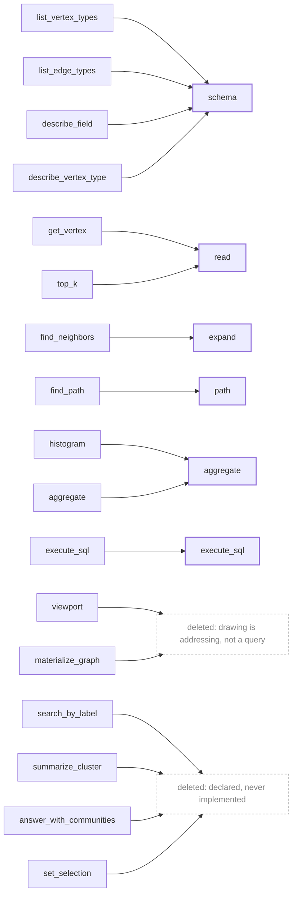
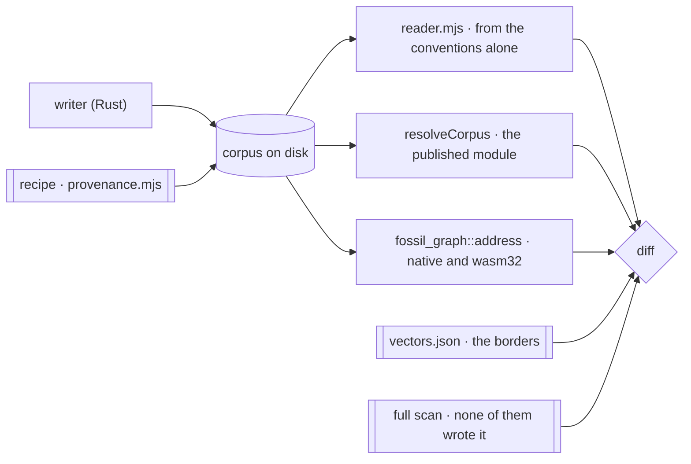

A fossil program produces a **corpus**: a graph written to disk as columnar files with a manifest
that names them. Not a database to connect to, not a stream to consume, not an endpoint. Files.

A reader that wants a slice works out which byte ranges hold it and fetches those ranges — from a
local path, an object store, or a plain web server. **There is no service in the path**, so no query
language between reader and data, no process to keep alive, no writer version to match.

## Addressable, and what that buys

An address is computed, not discovered: given the manifest, a reader derives the location of every
piece it wants **before it issues a single request**. The constraint that forces it is that **you
cannot list a directory over HTTP.** Expanding a wildcard over files *is* listing a directory — it
works on a local filesystem and on an object store, and fails in a browser against a plain origin,
which is the worst distribution of a failure a design can have. The lineage is explicit —
**Cloud-Optimized GeoTIFF → GeoParquet → PMTiles** — and copying that schema beats inventing one.

### Where a wildcard survives, counted

The rule has one exception left in the tree, and it is bounded rather than argued.
`fossil-mcp`'s `register_views_sql` composes every path a verb reads, and
`crates/fossil-mcp/src/lib.rs` measures what is left over the conformance corpus in both containers:

| container | globs registered | where |
| --- | --- | --- |
| `rowgroups` | **0** | every payload set is one file the manifest's `prefix` names |
| `files` | **one per edge orientation**, none elsewhere | a vertex type's tiles come out of `vertex_count` and `chunk_size`; an edge orientation's cannot, because a tile whose vertices have no edges is a file that was never written and a run of them is a gap no arithmetic predicts |

**What bounds it is which container fossil writes**, measured rather than reasoned: `fossil run
examples/hello.fossil` emits `container: rowgroups`, and `crates/fossil-df/src/lib.rs` has the one
call that decides it. So a corpus fossil wrote registers no wildcard at all, and the surviving one is
reachable only through a corpus another writer produced — which the conformance corpus is, because it
is written through DuckDB and DuckDB clamps a row group under its 2,048-row vector.

### `chunk_size` is what was written, never what was asked for

DuckDB's `ROW_GROUP_SIZE` is a **request**. It writes row groups in whole 2,048-row vectors and
rounds a smaller one up without saying so, and a generator that takes `chunk_size` from the number it
passed in publishes a manifest describing a corpus it did not write. `--chunk-size 1024` produced
exactly that: a corpus declaring 1,024 over row groups of 2,048, against which this repository's own
`tile-of` guard finds **14,643 violations**.

The fixture now **refuses** when the two disagree. Writing the size it observed was the tempting fix
and is the same lie pointed the other way — the manifest would agree with the bytes while silently
disowning what the caller asked for, and a `chunk_size` that quietly means something else is what
produced a flat sweep curve for somebody measuring from outside. Refusing is the only outcome that
reaches the person who can act on it.

**This is DuckDB's floor and not the format's**, which is why fossil's own writer is unaffected:
`TileWriter` goes through arrow-rs with both automatic limits set to `None`, so the cut is the
explicit one the caller made. A 64-row tile round-trips as `[64, 64, 64, 64, 44]`. The conformance
corpus therefore declares `container: files` at a `chunk_size` of 64 — the field exists to say which
— while fossil emits `rowgroups`.

It is not closed, and the reason is that closing it is a format change rather than a binding change:
it needs a per-orientation tile census in the edge manifest, a field with its own argument about what
a reader may derive. Until a `files` corpus is served, the cost is one nobody is paying.

### The reader prunes the identity index, because the engine declines to

The [identity index](/docs/format/conventions/identity) is built so that footers name the one tile a
key can be in. Nothing makes an engine use them. **DuckDB prunes no disjunction over a `VARCHAR`
column**, so a batched lookup — `key IN (a, b)` — opened all 245 index tiles of a million-vertex
corpus and read **44.1 MB**, where the single `key = a` opened one and read **3.98 MB**. The index
was doing its job and the query was reading past it.

So the pruning moves to the reader, out of the same statistics the engine declined to use: one
`parquet_metadata` sweep over the index tiles, cached per type exactly as the payload's `x`/`y` boxes
are, and the batch stays **one** query over only the files its keys can be in. Under the `rowgroups`
container a row group has no URL and there is nothing to address, so the batched read over the whole
index is what there is, and the cache records that with `null` rather than pretending it pruned.

<Callout type="warn" title="Two hazards in the comparison, and neither is visible in a passing test">
**The comparison is on bytes, not on strings.** Parquet orders a string column by unsigned UTF-8
bytes and JavaScript compares UTF-16 code units. The two disagree above `U+E000`, and an IRI reaching
there would be pruned out of the very tile holding it and reported **absent** — a wrong answer, not a
slow one.

**A truncated statistic must widen the range, never narrow it.** A writer may shorten a long min/max:
parquet-rs increments a truncated max, but a writer that did not would store a prefix, so a key
extending the stored max is **kept** rather than excluded.
</Callout>

## The artifact is the API

The stance follows the table formats — Iceberg, Delta Lake, Lance — where a manifest plus a set of
files is the interface, *many* engines read the same table, and **none of them is the contract**.

**Arithmetic a reader must reproduce ships as arithmetic.** Iceberg publishes the hash function, the
seed and a table of vectors per type, and those constants turn up in the tests of implementations
that copied them; PMTiles dispatches its space-filling curve with a link to an encyclopedia article,
and every port re-derives it. **And two implementations before a format change, not after** — the
Arrow rule, which is why its gaps are skipped lines rather than wrong answers. Parquet is the
warning: thirteen years of unwithdrawable files and a reference implementation that became normative
without anyone deciding it.

<Callout type="warn" title="One clock, running one way">
**If the corpus reaches third parties before the vectors do, the option is gone.** Nothing is
published today, which is what makes this cheap exactly once. It is also why capability negotiation
is not built: before a corpus leaves this machine towards somebody who cannot regenerate it the
mechanism answers a question nobody has asked, and after that day it is late.
</Callout>

## What is borrowed from GraphAr, and where borrowing stops

**GraphAr's YAML field names are borrowed wholesale** — three files named the way GraphAr names
them, `<name>.graph.yml`, `<label>.vertex.yml` and `<source>_<edge>_<destination>.edge.yml`, plus
`version: gar/v1`, which is GraphAr's own string.

| file | the keys, all of them GraphAr's |
| --- | --- |
| graph info | `name`, `prefix`, `vertices`, `edges`, `version` |
| vertex info | `type`, `chunk_size`, `prefix`, `property_groups`, `version`; per property `name`, `data_type`, `is_primary`, `is_nullable` |
| edge info | `src_type`, `edge_type`, `dst_type`, `chunk_size`, `src_chunk_size`, `dst_chunk_size`, `directed`, `prefix`, `adj_lists`, `property_groups`, `version`; per adjacency `ordered`, `aligned_by`, `prefix`, `file_type` |

> **fossil follows GraphAr as far as GraphAr specifies, and no further** — because past that point
> there is nothing left to follow but a C++ implementation.

Is the thing in `docs/specification/format.md`? Then fossil spells it that way and a difference is a
defect. Is it only in that repository's `cpp/`? Then it is somebody's code, it binds nobody, and the
decision is taken here. **This is not a GraphAr-conformant corpus and does not claim to be.**

The count is the worked example. The specification never defines one — the word appears zero times —
and the reference implementation stores one anyway, as raw native-endian bytes in a file with no
declared width and no test vector. Here a count is a **manifest field**, required and not optional,
checked against the rows on disk after the layout pass has re-read, renumbered and re-tiled them
(`c573e73`). Required, because tiles are addressed and never listed: a hole in the middle is caught
by the addressing, and **a missing tail is caught by nothing.**

Eight divergences follow from that rule. None of them is a bug.

| key or artefact | GraphAr specifies | fossil does | why |
| --- | --- | --- | --- |
| `data_type` | ten built-ins, none unsigned; its parser accepts eight spellings and throws on the rest | `uint32` for `dense_id` and `cluster_id`, `binary` as the Arrow fallback (`crates/fossil-df/src/lib.rs`) | the address is a `u32`, so GraphAr's own reader throws on the first property of every corpus fossil writes |
| a count | nothing; three files under `cpp/` that no specification names | `vertex_count` and `edge_count` in the YAML | a decimal integer has a width and cannot have a byte order |
| offset table | required for `ordered_by_source`/`ordered_by_dest` edges | none emitted, anywhere | a vertex's run is a predicate on the tile already fetched, not a second request. **A real divergence from a specified thing** |
| `chunk_size` on an edge | rows per edge chunk, recommended 2²² | equals `src_chunk_size` and is the addressing unit, so nothing bounds the row count (`crates/fossil-sinks/src/manifest.rs`) | `by_source/tile{k}.parquet` holds every edge out of vertex tile `k`. Same key, different meaning: a reader taking the borrowed name at its borrowed value gets a number instead of an error |
| data-file paths | none, anywhere | `<prefix>chunk{k}.parquet` and `<edge prefix><adjacency prefix>tile{k}.parquet`, one level, one property group | there is nothing here to diverge from |
| `chunk_size` on a vertex | any value; recommends 2¹⁸ | 4,096, and a power of two | the address is `dense_id >> 12`, not a division; the value is measured on five million vertices, not recommended |
| `iri` | no field; its one escape hatch is on the graph info | on the vertex info and the edge info, omitted when empty | RDF type and predicate IRIs. A non-RDF corpus is exactly the borrowed shape |
| an `adj_lists` entry with no `prefix` | prose names the prefix; the worked example omits it from all three entries | reported absent rather than composed from convention | conformance case `unaddressable`. The specification's own example reads here as a corpus nobody can address |

<Callout type="warn" title="What would reverse all of this">
GraphAr specifying what it presently leaves to `cpp/`: a data-file path, a count with a declared
width and byte order, and a table of vectors. The stronger trigger is the one
[discarded alternatives](/docs/design/discarded) records against conforming at all — **a second
reader that is not ours and already speaks it** — because a specification nobody reads is not
interoperability.
</Callout>

## The width of an address, and what actually runs out first

The first divergence in that table is a width, and a width is the most expensive kind of decision
here: it is a commitment made once, in files that cannot be withdrawn. `dense_id` is declared
`uint32`, which puts a hard ceiling of **4,294,967,295 vertices in one type**, and the question the
number invites is whether that ceiling is close.

**It is not close, and what is close is something else.** The layout pass assigns the numbering, and
it is measured: on a 14-core machine with 48 GiB it peaks at **2.09 GiB at two million vertices and
8.82 GiB at ten**, and the whole write at ten million is **404.4 s**. Linear over that range, 2³²
vertices of one type is on the order of **3.7 TiB resident and two days of wall clock** — so the
pass exhausts a machine roughly **430× before the column exhausts its range**. The width is not what
stops a corpus. Nothing in this repository has produced a corpus within two orders of magnitude of
the ceiling, and the thing that would have to change first is not the manifest.

It is also 32-bit *by construction* rather than by choice of spelling. `weakly_connected_components`,
`community_hierarchy` and the Morton ranks in `crates/fossil-layout/src/layout.rs` are `u32`
throughout — the sentinel there is documented as safe precisely because "the count is a `u32` and
the last one is `u32::MAX - 1` at worst". Widening the column without widening the pass would
declare a range nothing in the writer can number. And the ecosystem is at the same place, which is
its own evidence: no maintained community-detection crate exceeds 32-bit indices, which is one of
the three reasons [adopting one is
rejected](/docs/design/discarded#streaming-memory-and-scale).

The cost of the other choice is on the column that can least afford it. `dense_id` is **4.000 of the
9.23 compressed bytes per row** a drawing tile costs — 43% of the payload, the largest single column
in it — so `uint64` spends the format's cheapest artefact on range nothing can reach.

<Callout title="What makes it cheap to be wrong about">
**The arithmetic every reader implements is already 64-bit.** `tile_of` takes and returns a `u64`,
and the published vectors carry 2³¹, **2³² − 1** and 2⁵³ — values above what the column holds — so
every port is checked *past* the storage ceiling before a corpus ever approaches it.

That inverts the usual cost. A format change here lands only after every reader has been moved to it
and diffed, which is the discipline the row-group container paid in full. A widening of `dense_id`
pays none of it: no reader changes, no vector changes, no address changes — one manifest spelling
does. So the decision that was expensive to make is cheap to revise, and the thing that bought that
was publishing the arithmetic wider than the storage.
</Callout>

### The gapless `0..V−1`, and the price of keeping it

The other half of the same commitment is [gaplessness](/docs/format/conventions/identity), and it is
the convention a writer is most tempted to trade. The temptation is concrete: the writer assigns ids
after a `collect()` that holds every batch, and handing each partition a **preassigned range**
removes it — at the price of holes wherever a partition does not fill its range.

Both exits were priced before any code was written, and neither is taken.

- **How many holes.** The split is a hash's, not the data's: the plan repartitions on `subject` into
  fourteen partitions, and at ten million they come out within **0.526%** of each other. A quantum
  sized to the largest and rounded to the tile leaves **35,200 holes, 0.35% of V** — but that
  quantum is known only *after* the run. The one a writer can pick beforehand is source rows over
  partitions, and the dedup collapses 8.1 rows into one: **71,027,072 holes, 710% of V**.
- **What compacting them costs.** Over the ten-million corpus, **9.6 s and 3.72 GiB**, against a
  whole write of 404.4 s and 20.72 GiB — 2.4% of the wall clock standing alone, and less than that
  folded into the renumbering that already runs on every write. Verified rather than asserted:
  compacting a numbering with holes injected produces output byte-identical to compacting the
  gapless one.
- **And the premise did not survive the measurement.** The `collect()` is not where the peak comes
  from. Level by level at ten million, the sort is **13.72 GiB** and the aggregate beneath it
  **13.85**, so deleting the collect leaves ≈13.9 GiB — and that term is the dedup, which no range
  scheme touches. What escapes the pool is the `Vec` the collect builds, and that is 1.64 GiB, not
  fourteen.

`crates/fossil-df/examples/dense_id_ranges.rs` and `crates/fossil-layout/examples/compaction_pass.rs`
are the two harnesses. They are instruments and not tests: neither runs in CI, and neither writes
inside the corpus it reads.

**So the convention stays, and the reason it stays is the third bullet rather than the first two.**
The exit was being bought to solve a problem the measurement puts somewhere else entirely.

## Why write-once/read-many is not an implementation detail

[Identity is unique per type](/docs/design/identity) because a fossil program is compiled in one
piece with every mapping in front of it — a check unavailable to any system whose parts deploy
independently, which is why the one federation system that shipped an equivalent removed it. And
atomic renames, lock files, visibility protocols and transaction logs exist to protect a reader from
a half-written state; with no such reader they are cost without benefit.

## The verb surface: six, and none of them draws

`fossil-graph` defines the surface; MCP, HTTP, the CLI and the in-process TS package are bindings
over it. **It closed at six on 2026-08-05**, and the six are the variants of `Operation`
(`crates/fossil-graph/src/operations/mod.rs`).

| verb | what it answers |
| --- | --- |
| `read` | rows of one vertex type, filtered, ordered and capped |
| `expand{into\|all}` | the neighbourhood of a *set* of vertices, one hop |
| `path` | a route between two vertices |
| `aggregate` | a grouped, bounded summary — over values or over ranges |
| `schema` | what types, fields and relations exist, with field stats on request |
| `execute_sql` | the escape hatch, which a binding may hide behind a permission — and in `fossil-mcp` that is [literal](/docs/design/tooling-for-machines): the tool is registered or it is not |

The algebra answers questions and **does not draw**, because drawing is addressing: the camera works
out which level and which tiles it needs and asks for bytes, with no bbox in flight and no database
on that path. Level-of-detail is not a filter but a **decimation**: level *k* is the vertices whose
`dense_id` is a multiple of 2^*k*, which over a Morton-ordered `dense_id` is one vertex per quadtree
cell of that depth. A `where` selects rows from a table; zoom changes which rows exist at all. Once
that is settled, every verb whose job was to make a picture stops having one.

<Callout type="warn" title="This paragraph claimed super-nodes, and there are none">
It read *"a level-3 tile holds super-nodes that do not exist at level 0"*. Nothing writes one.
Louvain builds a hierarchy in the layout pass — four levels at ten million, 3,757,900 / 8,832 /
2,081 / 1,487 — and the pass **collapses it to a `cluster_id` column** and discards the levels
above zero. `cluster_id` is a colour, not a level, and no directory under `vertex/<Type>/` is a
level either.

Aggregation is also the wrong primitive here, and the reason is the one below: **a synthetic
centroid cannot nest.** Replace a super-node with its children and every point on screen moves.
A decimation is real vertices at real positions, and level *k+1* is a strict subset of level *k*,
so zooming in only ever ADDS. Louvain's levels could not serve as a pyramid anyway — 8,832 to
2,081 to 1,487 is not a decimation, it is a hierarchy that stops decimating after one step.
</Callout>

### The stride has to be a power of two, and this is what it costs when it is not

The reader draws a bounded sample of what the window holds. It picks the sample by striding on
`dense_id`, which is right — the ids ascend along the Morton curve, so every *s*-th id is spatially
stratified where a prefix would be one corner. But `s` is `ceil(matched / limit)`, **an arbitrary
integer**, and arbitrary integers do not nest: the multiples of 34 and the multiples of 21 share
only the multiples of 714.

So zoom does not refine the picture, it **replaces** it. Measured over a million-vertex corpus at a
12,000-point cap, counting only the vertices that are still inside the window after the camera
moves — every point lost below is lost to *resampling*, not to leaving the frame:

| zoom step | still drawn, `s` arbitrary | still drawn, `s` a power of two |
| --- | --- | --- |
| 60% → 40% | **5.9%** | **100%** |
| 40% → 25% | 4.8% | 100% |
| 25% → 15% | 7.7% | 100% |
| 15% → 10% | 11.1% | 100% |
| 10% → 6% | 20.0% | 100% |

Quantising `s` up to the next power of two costs at most one extra halving of the sample and buys
the nesting outright: a vertex drawn at one zoom is drawn at every closer zoom, at the same
position, and nothing is thrown away that did not leave the frame. **That is the whole difference
between a picture that refines and a picture that flashes**, and it is one expression.

<Callout title="Writing the levels is an optimisation of this, not a second design">
Level *k* selected by `dense_id % 2^k` needs no bytes on disk: it is a predicate. What a written
`vertex/<Type>/l{k}/` buys is that a coarse camera reads a small file instead of striding a large
one — which is where the byte cost of a zoomed-out view lives. Both paths select **the same rows by
the same predicate**, so a corpus without the levels still draws the same picture and only reads
more. That is the property that lets the pyramid be added later without becoming a second contract.
</Callout>

### The addressing and the reader do not meet, and Morton is why they could

`@fossil-lang/corpus/address` stated its own seam: *"**No boxes.** Which tiles a rectangle touches
comes from the per-tile `x`/`y` statistics in the Parquet footers... the address is the half that
cannot be re-derived from the corpus itself. So the host reads its own footers and hands the tile
numbers back here."* `tilesFor` took `tiles: number[]` — the caller had to already know.

**That last clause is false, and the layout pass is what made it false.** `dense_id` is renumbered
into Morton order, so a vertex's address and its position are the same number read two ways. A
rectangle is therefore a set of Morton ranges, a Morton range is a `dense_id` range, and a
`dense_id` range is a run of tiles — no footer, no reader and no engine. The sentence was true
before the renumbering and nobody revisited it after. `mortonTilesFor` is that decomposition:
descend the Z-order quadtree, stop where the answer stops changing, and `tilesForBox` is it fed
into the tile-number door beside it.

What this changes is not an optimisation, it is which package can answer:

- **A camera with no engine can address itself.** The browser used to need a Parquet reader to ask
  "which tiles"; the coarse levels of a pyramid have no reason to. The subpath's promise — no
  fetch, no WASM, no promise — stopped one step short of the question a camera actually asks.
- **`openCorpus` stops being the only door to a picture.** It keeps the engine for what needs one.

#### What it costs, measured against the footer path over the same windows

The over-read was left unwritten here on purpose — *"it is not written down until it is measured"* —
so it was measured, over the million-vertex corpus `apps/playground/scripts/bench-corpus.mjs`
writes, at nine windows. The denominator is not a model: DuckDB is asked which tiles actually hold
a vertex inside the rectangle, and a path answering with fewer has not read less, it has drawn a
wrong picture.

| window | need | geometric | arithmetic | uniform, no anchor |
| --- | --- | --- | --- | --- |
| 2%, centred | 4 | 7 · 1.75× | **4 · 1.00×** | 4, **4 missed** |
| 2%, lower-left | 4 | 8 · 2.00× | **4 · 1.00×** | 4, **4 missed** |
| 2%, upper-right | 4 | 7 · 1.75× | **4 · 1.00×** | 3, **4 missed** |
| 10%, centred | 15 | 17 · 1.13× | **15 · 1.00×** | 8, **12 missed** |
| 10%, lower-left | 7 | 10 · 1.43× | **7 · 1.00×** | 8, **7 missed** |
| 10%, upper-right | 12 | 18 · 1.50× | **12 · 1.00×** | 9, **11 missed** |
| 30%, centred | 90 | 96 · 1.07× | **90 · 1.00×** | 42, **52 missed** |
| 30%, lower-left | 40 | 41 · 1.02× | **40 · 1.00×** | 46, **9 missed** |
| 30%, upper-right | 50 | 53 · 1.06× | **50 · 1.00×** | 40, **26 missed** |

**The arithmetic does not over-cover here — it under-cuts the footers.** Mean over-read 1.00×
against 1.41×, and on the 10% window the page already records, **15 tiles in 4 range requests and
1,294 kB against 17 tiles in 6 requests and 1,466 kB** — 2.26% of the corpus rather than 2.56%.
The reason is not cleverness, it is that a code range is a *tighter* description of a tile than its
`x`/`y` box: the box is the rectangular hull of an arc that snakes, and the arc is where the
vertices are. The predicted over-cover is real and it is smaller than the hull's.

<Callout type="warn" title="The seam moved and did not vanish: a rank is not a code">
*"Arithmetic on the manifest's `chunk_size` alone"* is the half of the claim that does not survive.
`dense_id` is a vertex's **rank** by Morton code, not its code, and where a code falls in a ranking
is a function of how the positions are distributed — which `chunk_size` does not carry. The third
column above is that assumption taken seriously: tile *k* holding the *k*th equal slice of the code
space **misses 129 of the 226 tiles** that hold a matching vertex. It is not a conservative guess,
it is a wrong picture.

So the decomposition needs one anchor, and it is small: the first and last code of each tile, two
`u32`, against the 226 kB of Parquet footer the geometric path reads over the same corpus — and
readable by anything that can read a number. **It is published.** The layout pass writes
`vertex/<Type>/codes.json` and the vertex manifest names it in a `codes:` block; the numbers above
are measured against that file, read as a stranger reads it — `JSON.parse`, its own extent, and no
Parquet reader anywhere on the path.

Three things about it were decided rather than assumed, and each one is written where it is spelled.

- **A path on the manifest, not the numbers in it.** Every other field of a vertex manifest is known
  before a byte is written; the codes are known only after the layout pass has placed the vertices.
  Inlining `2 · ceil(V / chunk_size)` numbers would also turn a constant-size document into one that
  grows with V, charged to everything that reads a manifest in full — including a reader that wants
  a row count. `codes:` has the shape `index:` already has: the manifest names where, the pass fills
  it, and `apps/corpus` is what goes red if the pass does not.
- **A file beside the tiles, not a column inside them.** The point of the arithmetic is that a
  camera answers *which tiles* with no Parquet reader; publishing the anchor as Parquet puts back
  exactly the dependency it exists to remove.
- **JSON, not a packed `u32` array.** Packed is **1,960 B** at a million vertices where the JSON is
  **5,498 B** — 2.8×, and both two orders of magnitude under the footer they replace. What the
  difference buys is that there is no endianness, no width and no offset table to get wrong, in any
  language. The criterion this format is written to is legibility by anything that can read a
  number, and a packed array is legible only to a reader that has been told how.

The writer holds it rather than computing it: `morton` and `order` are the same values in the same
hand — the codes are what the ranking was made from — so publishing is a projection and not a second
pass. Anything downstream would have to re-derive the codes from the written `x`/`y`, which means
reading every tile back *and* getting a different answer wherever the two quantisations disagree by
a unit.

Two implementations write it and a guard holds them together. `code-anchor` recomputes every
`lo[k]`/`hi[k]` from the corpus's own first and last row of tile *k*, quantised in binary32 against
the extent the anchor publishes, and checks that extent against the corpus's actual bounding box —
because a writer that published a *plausible* anchor computed from something else would draw a
plausible picture of the wrong vertices, and no count would notice. `self-test.mjs` breaks it two
ways, one code and one extent, and both fire in isolation: the rows are untouched, so every other
guard stays green.

The two still compose, but not in the direction this callout used to guess. Arithmetic addresses
*and* prunes tighter; what the footer is still needed for is **byte offsets under `container:
rowgroups`**, where a run of tiles is a byte interval only a footer can name. Under `container:
files` a URL is the answer and there is no footer on the path at all.

`packages/corpus/tests/address-cost.test.ts` is the measurement, `address-morton.test.ts` the
soundness — every tile holding a point inside the rectangle is in the answer, over a sweep of
rectangles against a renumbering it did not build.
</Callout>

### Zarr, against the condition this repo wrote down for reopening a format

Conforming to an existing interchange specification is [discarded](/docs/design/discarded), and the
reversal condition recorded there is exact: **a second reader that is not ours, that already speaks
it.** GraphAr failed that in practice — its own reader cannot open a fossil corpus, because
`TypeNameToDataType` throws on `dense_id`'s `uint32`.

Zarr meets the condition on the half above and fails it on the half below, and the split is clean:

- **Its addressing model is this one.** A metadata document plus chunks addressed by a key computed
  from the index, no server, store-agnostic. That is `resolveCorpus`, spelled differently — and its
  `multiscales` convention is the level pyramid described above, already standardised.
- **Its data model is not.** Zarr is dense N-dimensional arrays. A tile here is a typed table with a
  subject IRI and, load-bearing, **footer statistics**: a chunk of Zarr carries none, so adopting
  the container means building an explicit spatial index to replace what Parquet gives for free.

So the honest reading is that Zarr is worth borrowing at the manifest and the key arithmetic, where
this format already agrees with it and would gain a vocabulary readers know, and is not worth
adopting as the container while the footer is the index. **Neither half is decided here** — this
section exists so the next person argues against the right thing.

The measurement above moves the bottom half rather than the top. A tile's Morton range prunes a
rectangle *better* than its `x`/`y` box does, so "the footer is the index" is now only true of byte
offsets: the spatial index a Zarr container would have to grow is 8 B per chunk and the writer
already publishes it, in a document beside the chunks rather than inside them — which is the shape a
Zarr store would want anyway. What that does **not** settle is the reversal condition, which is a reader and not
a size — and no Zarr reader opens a corpus of typed tables with a subject IRI in them.

### The npm package is named for the corpus; the crates are named for the surface

The published binding was `@fossil-lang/graph` and it is now **`@fossil-lang/corpus`**. The section
title is the reason: none of the six draws, the package's door is `openCorpus`, and every type it
exports is `Corpus*`. What forced the rename rather than merely recommending it is that the thing
which *does* draw arrived and took the obvious name — `apps/playground/package.json` lists
`@kanzo-tech/graph`, a GPU canvas, and listed `@fossil-lang/graph` beside it. Two dependencies
called `graph`, one addressing files and one painting vertices, and no import statement said which.

**The Rust crates keep their names.** `fossil-graph` and `fossil-graph-wasm` are unchanged, and the
argument is that the collision is specific to a namespace they are not in. A cargo name resolves in
a workspace that has no `@kanzo-tech/graph` and never will; nothing in `crates/` had an ambiguous
import to disambiguate. And the crate is not misnamed the way the package was: `fossil-graph` is a
verb surface over a **property graph**, which is what it says it is, whereas the package's whole
public shape had already moved to the corpus. Renaming them would have spent a cross-language
rename — every `fossil_graph::address` in the conformance tables, the `fossil_graph_wasm` artefact
stem in `packages/corpus/pkg/`, and the `pkg/` filenames in the published `files` list — to fix an
ambiguity that does not exist there.

The name it took was held by `apps/corpus`, which is now `@fossil-lang/corpus-contract`. The
published name won that collision because it is the one that appears in a stranger's import; the
app's name was a pnpm resolution handle referenced from nowhere else in the tree. **Neither
directory rename that would have been tidier happened**: `apps/corpus/` keeps its path because
`apps/docs/components/{guard-index,vector-table}.tsx` read across into it at build time.

<Callout type="info">
  The three readers of `conformance/expected.json` are unchanged in number and in kind — the rename
  moved `packages/graph/` to `packages/corpus/` and touched no arithmetic. `fossil_graph::address`
  is still the third one, and still spelled that way.
</Callout>



Deleting the four stubs took `GraphError::NotImplemented` with them, so **the `match` is exhaustive
and a verb can no longer be declared without being wired.**

<Callout title="The rule that keeps it at six">
A new verb enters only if it serves a case the single path demonstrably cannot, and that
demonstration is a measurement. Not an argument.
</Callout>

### The reader keeps an addressing pair beside the verbs, and that is a correction

The reader package offers `node` and `neighbours` alongside `read` and `expand`, and they read as
duplicates of them. They were to be deleted on exactly that reading, and the deletion was wrong.

**A verb names a relation and lets the engine choose bytes; these compute which files to open.** It
is the same line that keeps `extent` and `window`, and the one the crate doc draws when it says
pruning is the tiles' job and not a verb's. The two are not interchangeable in either direction:
`expand` is a recursive CTE over the whole edge relation — the query `neighbours` exists because of,
and which **did not return in 45 seconds at a million vertices**. It answers in IRIs where a canvas
needs placements, it walks the source-ordered relation only where a neighbourhood is undirected, and
it reports no `complete`, `gaps` or `frontier`, so an answer whose outermost ring is missing its own
edges looks whole in a count.

Deleting them would also have left the identity index unreadable through the package, because **no
verb sees it** — the index is addressing by construction, and a surface with only verbs on it has no
way to ask.

### `read`'s `where` is SQL, and carries `execute_sql`'s authority

`read { vertex_type, where?, order_by?, descending, limit }` takes `where` as a **raw SQL fragment**,
evaluated by the engine `execute_sql` reaches. It is not a parsed predicate language. So the
permission travels with it: **a binding that gates `execute_sql` gates `read`'s `where` with the same
permission.** Gating the escape hatch and leaving `where` open is the same surface with a second
door.

That sentence used to end *"the rule is written on the type, where a binding author reads it as they
type"* — which is an obligation discharged by remembering, the same shape the
[privacy bound](/docs/design/privacy) rejects an anonymisation operator for. It is enforced now, and
the mechanism is one argument rather than a check:

- The two fields are `RawSql`, a newtype whose only constructor takes a `RawSqlAccess` token.
- `RawSql` has **no `Deserialize` impl**. That propagates: `ReadParams`, `ExecuteSqlParams` and
  `Operation` itself cannot derive one either.
- So the one door from wire JSON is `Operation::from_wire(value, sql: Option<RawSqlAccess>)`, and
  that single argument answers for both fields. `None` refuses a `read` carrying a `where` **and**
  refuses `execute_sql`; `Some` admits both. **There is no spelling that opens one and closes the
  other**, which is exactly what the comment was asking for and had no way to get.

`crates/fossil-graph/src/operations/raw_sql.rs` carries the argument, and
`crates/fossil-graph/tests/schemas.rs` exercises all four combinations.

Two things it does not claim. It does not stop a binding *granting* access — withholding SQL is a
policy and a library cannot hold a policy for its consumers; what the type holds is the coupling,
so whatever the policy is, it lands on both fields at once. And `RawSql` is not a sanitiser: it
parses, validates and escapes nothing, because [there is no chokepoint to sanitise
towards](/docs/design/privacy).

<Callout title="It cost nothing on the wire">
The published JSON Schemas are byte-identical across the change apart from prose — `where` and `sql`
are still `{"type": "string"}`, because `RawSql` is `#[schemars(transparent)]`. Measured by the
snapshot diff in `crates/fossil-graph/tests/snapshots/`: two files touched, and both diffs are a
`description:` line. No binding that speaks the wire has anything to update.
</Callout>

<Callout type="warn" title="Six is enumerated; nothing says six is right">
The operation envelope snapshot is the wire contract every binding consumes and it enumerates
exactly these six, so a seventh cannot land without it changing. What nothing on disk asserts is a
target *count*. The closed set is a discipline, argued in
[tooling for machines](/docs/design/tooling-for-machines).
</Callout>

<Callout type="warn" title="Nothing answers a camera today">
`viewport` was deleted **before its replacement existed** — `c6c87fa` records the breakage as
expected and accepted, and **none of the six verbs answers a camera** — which is the decision, and
it holds: the camera is addressed, not queried.

What used to stand here beside it was that there is no tile emission and no tile index anywhere in
`crates/`, and **both stopped being true**. `fossil run` writes `vertex/<Type>/tiles.parquet`,
`edge/<E>/by_source/tiles.parquet` in both orientations, and an identity index at
`vertex/<Type>/index/tiles.parquet` that the manifest declares under `index:` — one file per payload
set, whose row groups are the tiles, and `graph.graph.yml` says which container that is. Verified by
reproducing a corpus and listing it, and now held by `crates/fossil-cli/tests/conformance.rs`,
which asserts the index exists, that the prefix the manifest declares is the one the writer used,
and that it is tiled by the same shift as the vertices it addresses. There is still no tile
**store**, which is a different noun.
</Callout>

## The camera has a renderer, and it is not fossil's

The verbs do not draw and the corpus is addressed rather than queried, which leaves one thing
unstated: *something* has to put a million points on a screen, and fossil does not ship it. What
fossil publishes is the address — `resolveCorpus`, synchronous, no engine — and what draws is
`@kanzo-tech/graph`, a bounded WebGL canvas over cosmos.gl whose whole data contract is one method:

```ts
interface BoundedSource {
  slice(request: { view, limit, fill?, pinned?, perPixel? }): Promise<Slice>;
  total?(): Promise<number>;
  extent?(): Promise<Viewport>;
}
```

Both sides had already written the same sentence about the same deleted verb. `fossil-graph` says
the camera is addressed and not queried; that package's own reader says *what replaces `viewport` is
a tile brought by a computed URL, which is another source*. `apps/playground/src/tiles.ts` is that
other source, and the seam between the two is a `WHERE` clause on `dense_id`: nothing in it knows
how cosmos.gl holds a buffer, and nothing in the renderer knows what a corpus is.

**The division is: the renderer owns the contract and the picture, fossil owns the address.** That
package ships a fossil reader of its own — `openCorpus`, on its `duckdb` subpath — and the
playground does not call it, for a reason that is a 404 rather than a preference: it composes
`chunk{k}.parquet` and `by_source/tile{k}.parquet`, which is `container: files`, and fossil's writer
emits `container: rowgroups`. It also re-derives the addressing from a line scan over six manifest
keys, which is the arithmetic
[`@fossil-lang/corpus` exists to publish](/docs/format/conventions/addressing#the-address-is-published-not-described)
so that nobody has to. What reverses this is that reader learning `rowgroups` — better, addressing
through the published module — at which point the source here becomes a call to it.

### What the adoption costs, measured

A 10% window over a million vertices opens **17 of 245 tiles in 6 range requests and 1,466 kB** —
2.56% of the corpus, 1.13× over-read at tile granularity — and the camera is asked again on every
move. `extent()` and `total()` are answered off the footer and the manifest, so the *opening* frame
issues no query at all. The panel is `apps/playground/src/Canvas.tsx`; the arithmetic is checked
against bytes over a real HTTP server by `pnpm --filter @fossil-lang/playground verify-stream`, and
the source itself — every array against the window it claims to describe — by `verify-canvas`.

Two things that adoption does **not** buy, and one it must not cost:

- **No crossfilter.** The renderer's Mosaic bindings are the way a graph joins the same crossfilter
  as the charts beside it, through an `IdSetClient` that publishes `id IN (…)` precisely because a
  position living in a GPU simulation is not a column anybody can filter on. It is the right adapter
  and there are no charts beside this canvas: a coordinator with one client in it is a crossfilter
  with nothing to cross.
- **No second engine, and this is the constraint rather than the preference.** Those bindings are a
  peer of `@uwdata/mosaic-core`, which hard-depends on a *different* DuckDB-WASM from the one the
  playground pins. Two of them in one tab is not a size problem, it is two engines and therefore two
  crossfilters that cannot hear each other — the exact failure the single re-export of `Coordinator`
  exists to prevent. So the condition is a build artifact and not an intention: the playground
  bundle emits **one** `duckdb-*.wasm` — 34,242.59 kB, the version the app pins — and the day it
  emits two the adoption has gone wrong. That is checked by counting the assets of
  `pnpm --filter @fossil-lang/playground... build`, which is also the only build that type-checks:
  three workspace dependencies shell out to cargo, and without the recursive form a stale `dist/`
  is what fails.
- **No engine in `@fossil-lang/corpus`.** The renderer needs bytes; the *host* reads them. The
  addressing subpath stays synchronous, `fetch`-free and WASM-free, which
  `packages/corpus/tests/address-standalone.test.ts` holds by importing it from a package directory
  with no `pkg/` in it.

### A palette has a capacity, and a corpus does not know it

`cluster_id` is what the layout pass writes and what colours the picture, and the two scales are not
the same size. This demo corpus carries **128 communities**; the design system's categorical palette
publishes its capacity as `--chart-capacity`, which is **8**, and an ordinal at or past it resolves
to the muted token. Handed over unfolded, **937,496 of a million vertices came back one grey** — a
picture that is not wrong about anything and shows nothing. Folded into the capacity by remainder,
two communities can share a slot, which is what eight slots *means*; the fold is a function of the
community alone, so a colour survives a pan, which a rank over the visible sample would not.

## Conformance is a round trip, and what it rests on is not a headcount

Write with the writer, read back with every independent reader, diff the results. GraphAr ships a
shared corpus with no round trip, and through that gap its fourth implementation landed having
re-derived the path arithmetic differently from the other three *and* from the corpus on disk, green
on both sides, because its tests asserted hand-written strings instead of resolving against the
artefact.

**The lesson there is not "have four implementations".** It is the two the other formats state
plainly, and fossil follows both:

- **Iceberg publishes the arithmetic and a table of vectors**, and ports are checked against the
  table rather than against a sentence. `apps/corpus/guards/vectors.json` is that table here, every
  value a border, read by the guard *and* rendered by [addressing](/docs/format/conventions/addressing)
  so the documented table and the executed one cannot drift apart.
- **Arrow requires two implementations and integration tests _before_ a format change lands**, not
  after. Two. What that buys is the ordering, not the count.



Three readers that never read each other, and the numbers they are diffed against come from a **full
scan** — every tile read with no addressing at all and filtered in SQL, which is a fourth thing none
of the implementations wrote. All of them prune, and all of them have to land where an unpruned read
already is. That is what closes GraphAr's gap: an assertion here cannot be satisfied by agreeing with
another implementation, only by agreeing with the bytes.

The corpus they resolve against is itself generated, and **the parameters that generated it are
executed rather than remembered.** They were not written down, and the cost of that was a
misdiagnosis: regenerating with the fixture's defaults produces 600 edges against the 596 the
manifest declares, which reads exactly like a fixture that has drifted from its generator. It has
not. `clusters` decides how many chords the ring carries and the default is 256; at **16** the
generator reproduces the checked-in corpus **byte for byte**, all twenty-three files.
`apps/corpus/conformance/provenance.mjs` carries the recipe and proves it, asserting the manifests
as text and every payload's rows in order — and *reporting* byte-identity rather than requiring it,
because a writer may change an encoding without changing a row, and a check that went red on a
DuckDB point release would teach everyone to regenerate the fixture instead of reading the diff.

**There are three readers, and the third one is Rust.** This paragraph argued the opposite, and the
argument it made was about *consumers*: one in Rust would have none, since `fossil-mcp` composes its
own paths, keasy reads through the TypeScript, and the writer's own validator reads the artefact with
plain SQL on purpose so that it never passes through reader code of ours. All of that is still true
and none of it was the point. **Both existing readers were JavaScript**, and a mistake they share is
invisible to a diff of the two — a shift taken as signed, a count that went through a `Number`, which
are exactly the borders `vectors.json` publishes because a port can get them wrong. A third reader in
the same language family is what is not missing; a third reader in a different one is a different
claim.

`fossil_graph::address` is that reader. It goes through no struct of the writer's — `fossil-graph`'s
other manifest module deserialises into `fossil-sinks`' own types, which proves those types
round-trip and says nothing about the artefact, so this one reads a generic YAML value and asks the
document a stranger's questions. It opens no byte, which is also what makes it indifferent to which
engine anybody would open the files with. `crates/fossil-graph/tests/conformance.rs` runs it
natively; `apps/corpus/conformance/wasm-reader.mjs` runs the wasm32 build of it, through
`fossil-graph-wasm`, which is a separate claim rather than the same one twice — `usize` is 64 bits in
one and 32 in the other.

What that buys is Arrow's ordering, and it remains an obligation rather than an intention:
**a format change lands after every reader has been moved to it and diffed, never before.**

That obligation has been discharged once, and the shape of it is what to copy. The
[row-group container](/docs/format/conventions/addressing#two-containers-one-address) is a change of
format; both readers were moved to it and diffed **while the writer still emitted only the old one**,
which is the only window in which two containers of one corpus exist at the same time to be compared.
`apps/corpus/conformance/containers.mjs` and `packages/corpus/tests/containers.test.ts` are that diff:
the same graph written both ways, every answer required to match. After the writer moves there is
one container and nothing left to compare against.

What runs lives in `apps/corpus/conformance/` — `verify.mjs` (the table, against each reader in
turn), `containers.mjs` (the same graph in both containers) and `provenance.mjs` (the corpus from its
recipe) — plus `crates/fossil-graph/tests/conformance.rs` and
`packages/corpus/tests/conformance.test.ts`. The conventions they check are documented for reader
implementors on the corpus site rather than here.

The wasm leg is the one part of that directory needing more than `node` and a `duckdb` binary, and it
is **refused explicitly rather than skipped**: `verify.mjs --without-wasm` is the opt-out, passed by
the workflow whose whole install list is those two, and a missing build output is otherwise a
failure. A leg that disappears with its dependency is the same failure as a guard that passes over
NULL — it stops guarding and nothing says so.

<Callout title="The consumer that did not read through the conventions, and now does">
`fossil-mcp` registered its relations with `read_parquet('{base}/vertex/<Type>/*.parquet')` and read
edges from `by_source.parquet`, the uncut relation the writer published beside its own tiles.
**Expanding a wildcard is listing a directory**, which is the one thing this design says a reader may
never need, and the second file was a second container for bytes the tiles already held. It worked —
MCP is native and can list — but two readers disagreeing about where the bytes are is GraphAr's
failure wearing a different coat.

It composes both paths from the manifest now: `container` says whether a tile is a file or a row
group and `prefix` says where the set is, so under the container fossil writes each relation is one
named file and there is nothing to expand. Under the other one a vertex type's tiles are enumerated
from `vertex_count` and `chunk_size`, which is why the count is declared. The single wildcard left is
an edge orientation in the file-per-tile container, where a tile whose vertices have no edges is a
file that was never written and no arithmetic predicts the gaps.
</Callout>

<Callout title="Checked for vacuity">
Most assertions count violations, so **an empty corpus satisfies them all at once** — which is
exactly how a conformance suite comes to pass vacuously and stops being evidence. The guard is a
non-emptiness check numbered before the rest, repeated for the edge directories because an empty
directory satisfies everything after it. And the ordering check is known to measure ordering rather
than pass by construction because inverting its predicate over the published conformance corpus
turns 0 disorders into 299 over 596 edge rows.
</Callout>

## What a corpus can carry, and where the format lives

RDF terms, quads and named graphs — a graph is not restricted to triples and the container is not
restricted to one graph. But **a cell in a columnar file carries a value, not a term with its
trimmings**: a literal's language tag, and in RDF 1.2 its base direction, are gone at the pivot into
columns unless the layout carries them explicitly. Base direction exists precisely because the first
strong character of a string does **not** determine how it should be laid out, so a value returned
without it is one the host renders backwards with nothing in the cell to say so.

The format itself — the conventions, the measurement behind each, and executable guards — is
documented in `apps/corpus`, for somebody implementing a reader and requiring no knowledge of the
language. **The language is one product and the corpus is another, and the seam is the artifact.**
