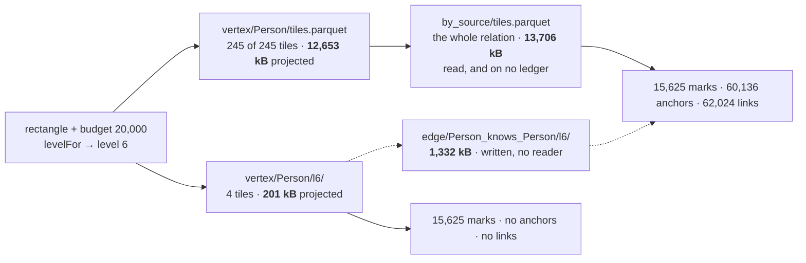

Every piece of a multiscale viewer is in this tree and none of them was built from a model. The
addressing came first, then the level plan, then [one door](/docs/design/one-door) over both, then an
app that feeds a renderer through it. Each of those was argued on its own terms and each of the
arguments holds. What was never written down is the thing they are pieces *of*: what a reader is
supposed to do with a corpus at every zoom, what it may cost, and what it owes the person looking at
the picture.

This is that model, stated as the reference the implementation is held against. The last section is
the list of places where the tree does not meet it — including a pyramid that is already on
disk and unreachable through the door.

## What a reference multiscale viewer is

The shape is not ours and it is not new. Four communities have converged on the same three parts,
and naming them is what lets "fossil is a multiscale viewer" be a checkable sentence rather than an
analogy. Every source below is in [prior art](/docs/design/prior-art).

**A declared level list.** OME-Zarr's `multiscales` is an entry per resolution, each with a path,
and the spec fixes the order — the `datasets` paths must run from the largest resolution to the
smallest. OGC's Tile Matrix Set publishes each matrix's width and height in tiles for the reason
that decides it: *so the range of relevant tile indexes does not have to be calculated by the client
application*. The list is a document, not a rule a reader re-derives.

**An address that is arithmetic.** An XYZ tile is `z/x/y` composed from the viewport; a Zarr chunk
key is composed from the index. No listing, no tile tree, no discovery request. A reader knows every
URL it wants before it issues the first one.

**A client that picks the level.** The store answers for the level it was asked about. Which level a
viewport deserves is a function of pixels, and pixels are the client's business.

fossil is the same in all three, and the correspondence is exact rather than rhetorical.
`levels:` is the declared list — finest first, and declared rather than derived for OGC's reason,
written out at [`levels:` — which of them are
written](/docs/format/conventions/addressing#levels-which-of-them-are-written).
`tile = dense_id >> 12` is the arithmetic, and `vertex/<Type>/codes.json` is the one input it
cannot derive. `levelFor(rect, budget)` is the client's pick and it is
[a separate, synchronous, pure function](/docs/design/one-door) precisely so that a camera can
decide before it asks for anything.

The container question has the same two answers here as everywhere else. Zarr v3's
`sharding_indexed` codec puts many addressable chunks inside one object with an index at the end;
a Cloud Optimized GeoTIFF puts its whole pyramid inside one file as reduced-resolution directories
read by range request. fossil's [two containers](/docs/format/conventions/addressing#two-containers-one-address)
are that question asked over Parquet, and `rowgroups` won it by a measured 4× in requests.

### Where it is not the same, and all three differences are about the graph

**A graph has edges, and a level of the vertices is not closed.** A raster tile is drawable on its
own: every pixel it needs is in it. A vertex level is not, because a mark's neighbour is almost
never a mark — a level keeps one vertex in `2^k` and the far end of an edge is drawn from a
coordinate the level does not hold. The number is measured on the 300,000-vertex bench corpus at the
app's own three-pixel floor: of the edges a level-6 view draws, a level file can position
**0.79%**. That single number is why the pyramid has a second half, and why it took a second
artefact rather than a flag.

**A decimation is not a downsample.** Every raster level in the prior art above is *synthetic*: a
level-1 pixel is an average of four level-0 pixels, and the averages nest because the grid is fixed
in advance. A graph has no such grid. The average of two vertices is a vertex that is not in the
corpus, and replacing a synthetic centroid with its children moves every point on screen — which is
the whole argument for a subset instead of a summary, made at length on
[the corpus](/docs/design/corpus). So the nesting here is not a property of a grid; it is
`dense_id % 2^(k+1) == 0` being a strict subset of `dense_id % 2^k == 0`, which is a fact about
integers.

The consequence is a rule the raster formats do not need and this one does: **a level shares the
payload's coordinate space exactly.** A Mapbox vector tile carries its geometry in the tile's own
integer grid, so the same feature has different coordinates at different zooms and "the point did
not move" is not even expressible. Here it is expressible and it is checked, in the files, both for
the vertices and for the coordinates the edge levels carry.

**The level is over a rank, not a grid.** A Zarr chunk key is an index into an array and a tile
matrix cell is a position in a grid; both are the coordinate. `dense_id` is a vertex's **rank** by
Morton code, and where a code falls in a ranking is a function of how the positions are distributed.
That is the whole reason `codes.json` exists — assuming the ranks are uniform in the code space
misses 129 of the 226 tiles holding a matching vertex over nine windows, which is a wrong picture
rather than a slow one. A raster reader never has this problem and a graph reader cannot avoid it.

### The two systems that already tried this on a graph

**GraphMaps** — Nachmanson, Prutkin, Lee, Henry Riche, Holroyd and Chen — is the closest published
thing to this model: a sequence of layers where *each layer refines the previous one*, the layer
chosen by zoom, and only the entities intersecting the viewport rendered. It is the same shape, and
it is the evidence that the shape is not an idiosyncrasy of ours.

**ASK-GraphView** is the alternative, and it is the one fossil refuses. Abello, van Ham and Krishnan
build a clustering hierarchy over the graph and navigate it by expanding one cluster into its
children — which is exactly the meta-node whose expansion moves every point on screen. It is named
here rather than ignored because it scales further than anything else in the literature, and the
reason it is not taken is a property (nesting) rather than a benchmark.

## The five invariants a viewer owes

Each of these is a property of the *answer*, not of an implementation, and each has something in the
tree that goes red when it stops holding. Four hold today. The fifth does not, and it is the second
gap below.

**1 · Nesting: refining only ADDS.** `view(R, k+1) ⊆ view(R, k)` for the same rectangle. It comes
free from the predicate, but a writer can still break it in the bytes, so it is checked in the
bytes: `crates/fossil-layout/tests/levels.rs, a_coarser_level_file_is_a_subset_of_the_finer_one`
for the vertices, and the closing half of
`crates/fossil-layout/tests/levels.rs, an_edge_level_holds_the_incident_edges_at_the_payload_s_own_coordinates`
for the edges. End to end, over a real camera path, it is
[monotone refinement](/docs/design/camera) carrying 100.0% of the previous picture across five zoom
steps.

**2 · Purity: `view(rect, level)` is a function of its arguments.** No cap that moves with what the
window holds, no stride derived from a running count, no state between calls. This is the invariant
that makes the other four *statable* — a reader that chose its own level inside the read cannot be
asked whether refining adds, because there is no left-hand side to compare.
[One door](/docs/design/one-door) is the argument; the camera page carries the measurement, and the
one bug it caught, which was a rectangle moving underneath a pure function rather than the function.

**3 · One contract, whether or not a level file exists.** `dense_id % 2^k == 0` **is** the
definition of level *k*; a written `l{k}/` is a cache of it. Two contracts would be strictly worse
than no pyramid, because a reader would have to know which one it got in order to know what it was
looking at. Held by diffing the file against the predicate in both directions, every column and not
only the id, with the row count as a separate statement:
`crates/fossil-layout/tests/levels.rs, a_level_file_holds_exactly_what_the_level_predicate_selects`.
The reader executes the identity rather than assuming it — `pool` applies the modulo over a level
file whose every row already satisfies it.

**4 · A frame's cost is bounded by the level, not by the corpus.** The pyramid's whole cost is
`2^LEVEL_WINDOW − 1` tiles' worth of rows whatever *V* is
(`crates/fossil-sinks/src/manifest.rs, LEVEL_WINDOW`), so a coarse frame is a constant number of
range requests over a corpus of any size. This is the invariant the cost model below is about, and
it is the one that the app does not get today: at the whole extent the reader opens 245 tiles of 245.

**5 · Every byte the frame opened is on the ledger.** A cost a caller cannot see is a cost nobody
optimises, and the point of reporting bytes at all is that a reader can check them against a network
tab. `ViewCost` reports `tiles`, `runs`, `bytes`, `read` and `addressed` — and `bytes` counts whole
vertex tiles and no adjacency at all. **This invariant is false in both directions at once**, which
the table below is arranged to show.

## What a frame costs

The frame is the whole extent of the million-vertex corpus `apps/corpus/guards/fixture.mjs` writes,
at a budget of 20,000 marks — `BOUNDED_DEFAULTS.limit` in the renderer, which `levelFor` answers
**6** for. Every byte is `total_compressed_size` out of the Parquet footer, because DuckDB issues
its reads from inside a Worker where no thread here can weigh them; anything derived rather than
measured says so in the cell.

**Two conventions exist in this tree and they must not be added up.** `ViewCost.bytes` sums whole
vertex tiles — every column, `subject` included, which is the widest and is never drawn — and counts
no adjacency file. `apps/playground/src/whole.ts` sums the columns a query actually projects, across
both the payload and the adjacency. The second is what a frame *reads*; the first is what a caller
is *told*, and the gap between the columns is the second half of the table.

### One frame, four strategies

| | what it reads | what `ViewCost` says | what it draws |
| --- | --- | --- | --- |
| **a · load everything**, once | 12,653 + 13,706 = **26,359 kB** | not on this ledger | 1,000,000 marks · 1,999,993 links |
| **b · tiles + strided payload**, per frame — what the app does | 12,653 + 13,706 = **26,359 kB** | 20,901 kB | 15,625 · 60,136 anchors · 62,024 links |
| **c · + vertex levels**, `links: false` | **201 kB** · 4 tiles | 335 kB | 15,625 · no anchors · no links |
| **d · + edge levels** | 201 + 1,332 = **1,533 kB** | nothing reads it | 15,625 · 60,136 · 62,024 |

**Rows (a) and (b) read the identical bytes, and that is the finding.** At the whole extent every
tile intersects the rectangle and both paths project the same columns out of the same two files, so
the addressing prunes nothing whatsoever on the frame the app opens on. What separates them is not
bytes but *when*: the baseline pays 26,359 kB once and every camera move afterwards reaches no
engine, where the windowed path pays it again per frame — measured in a browser over the same
corpus, six answers cost the windowed path **36,311 kB cumulative** against the baseline's 26,359 kB.
Tiling earns its keep as the camera closes in, not here. **The only thing that buys anything at the
outermost frame is the level.**

Rows (c) and (d) are the same picture at two prices, and (c) is **not** that picture. Its anchors
are four times its marks and they are real vertices at real coordinates, so dropping them turns a
zoomed-out view into a sparse cloud with holes rather than a cheaper version of what was there.
`apps/playground/src/tiles.ts` records that correction against its own earlier decision, and it is
why the app pays for row (b).

Row (d) is the one the model wants and no reader can produce. The edge level at *k*=6 holds
**62,024 rows** — exactly the links row (b) draws — and the far ends it positions are exactly the
**60,136** anchors row (b) returns, because a level of a relation is the edges incident to a
level-*k* vertex and every row carries both endpoints' coordinates
(`crates/fossil-sinks/src/manifest.rs, EdgeLevels`). So the same frame, drawn identically, is
1,533 kB against 26,359 kB — **17.2× (derived)** — and the bytes are on disk today.

### The same frame, as the camera zooms

Four rectangles over the same corpus, from [the camera](/docs/design/camera), against the levels
this corpus actually writes. **This table is on the ledger's convention**, because that is what was
measured: each row also reads adjacency the ledger does not report — the whole relation on the top
row, a subset below it that nothing has measured.

| window | `levelFor` | tiles | **b** · strided, as reported | **c/d** · off the pyramid |
| --- | --- | --- | --- | --- |
| whole extent | 6 | 245 / 245 | 20,901 kB | 335 kB, or 1,332 kB more with the edges |
| 50% | 5 | 145 / 245 | 12,506 kB | — level 5 is not written |
| 25% | 4 | 47 / 245 | 4,062 kB | — level 4 is not written |
| 10% | 2 | 15 / 245 | 1,294 kB | — level 2 is not written |

**The pyramid answers exactly one of these four frames**, and the reason is that the writer's window
and the camera's demand are chosen by different rules: `VertexLevels::planned` anchors the coarsest
level at *the one that fits a single tile* and runs `LEVEL_WINDOW` levels finer from there, while
`levelFor` answers whatever a budget in marks asks for over the rectangle. They meet at the whole
extent here and miss by one at 300,000 vertices, which
`apps/playground/scripts/measure-pyramid.mjs` prints as a normal outcome rather than a failure. The
app reads none of the four, because it asks for links at every zoom and a level answers only a view
that does not — which is gap 4.

That is defensible and it is not free. The strided rows fall steeply — 20,901 to 1,294 kB across the
four — so the frames the pyramid cannot answer are the cheap ones, and the frame it can answer is
the expensive one. But the fall is not proportional to area, because a layout clusters: a rectangle
covering **9%** of the extent holds **25%** of the vertices, so an area estimate is off by 2.8× —
a level and a half — which is why `levelFor` counts tiles rather than area.

What would fill the empty cells is a plan whose window follows the camera rather than the corpus.
What argues against changing it is that the same cells are also filled by
[residency](/docs/design/camera): every one of the 145 tiles the 50% frame opens was already among
the 245 the whole-extent frame opened, so a reader that separated what is loaded from what is drawn
pays zero for that zoom step. **Those are two different fixes for the same four rows and only one of
them costs the writer bytes.**

### What the pyramid costs the writer

| set | level 6 | level 7 | level 8 | all three | of the set it decimates |
| --- | --- | --- | --- | --- | --- |
| `vertex/Person/l{k}/` | 335 kB | 168 kB | 84 kB | 587 kB *(derived)* | 2.8% *(derived)* |
| `edge/Person_knows_Person/l{k}/` | 1,332 kB | 674 kB | 342 kB | 2,348 kB *(derived)* | 17.1% *(derived)* |

The edge pyramid is four times the vertex pyramid *(derived)* and the reason is legible in the
schema rather than in the data. A vertex level keeps one row in `2^k`; an edge level keeps every edge with *either* end
in the level, which is about two in `2^k` — and each of its rows carries four coordinates beside the
two ids. Measured: **22.0 B a row against 7.0 B** in the adjacency it decimates, 3.1×. That is what
a self-drawing row costs, and it is the trade the whole second artefact is: three times the bytes
per row so that a line can be drawn without opening the payload the pyramid exists to avoid.

## What is missing to be that reference

Five, in the order of how much a reader loses.

**1 · The edge levels are written and nothing reads them.** `EdgeLevels` is in the manifest model,
`crates/fossil-layout/src/layout.rs, write_edge_levels` emits the files, `apps/corpus/guards/fixture.mjs`
writes them into the fixture and declares them in the edge manifest — and
`packages/corpus/src/address.ts` resolves a `levels:` block for a vertex type and none for an edge
type, so `Corpus.view` has no address to compose and no way to open one. The consequence is exact:
the app's own note in `apps/playground/src/tiles.ts` says *what would change it is a way to keep the
far ends without opening the payload*, and that way now exists on disk and is unreachable through the
door. Until a reader lands, row (d) of the table above is a measurement taken with a shell rather
than an instrument, which is the honest status of it.

**2 · `ViewCost.bytes` is wrong in both directions, and the two errors nearly cancel.** At the whole
extent it reports **20,901 kB** for a frame that reads **26,359 kB**. It counts 8,248 kB of columns
the query never projects — `subject`, `birth_year` and `postcode`, which are in the tiles and are
never drawn — and it omits all 13,706 kB of `by_source` that the same frame opens to find the links.
Neither is an approximation. The first is a unit error (whole tiles where the read is columnar), the
second a category left out (the edge runs are never weighed against their own footers the way the
vertex runs are), and a caller watching one number would have seen the pyramid arrive and the
adjacency stay invisible. One summed number would not fix it either: the two reads are avoided by
different decisions, and a frame that flips to `read: level` drops one to zero while the other
stays. What would close it is a second pair of fields weighed the same way, and the projection the
query already knows.

**3 · There is no level of detail for the identity index, and no statement of whether it needs one.**
`VertexIndex` carries a prefix, an ordered-by column and a chunk size, and no `levels:`. At a
million vertices `index/tiles.parquet` is **8,522 kB — 41% of the payload (derived)**, the largest
artefact in the corpus after the two it serves. The honest framing is that a *lookup* does not need
a pyramid: the index tiles' footers carry disjoint `subject` ranges, so a binary search over them
names the one tile a value can be in and the read is one tile whatever *V* is. What has no answer is
the **scan** — a typeahead over prefixes, or "what identities are in this rectangle" — which is a
different question from the one the index was built for, and the reference model currently says
nothing about how it degrades under a budget. That is a design question and not a gap in the writer:
what would settle it is one measurement of a prefix query over the index at three corpus sizes.

**4 · The rule that decides when the pyramid may answer is stated too narrowly.**
[One door](/docs/design/one-door) says *the pyramid answers when the answer is points*, and that is
true of the reader today for the reason gap 1 names rather than for a reason about levels. The rule
that survives a reader is the general one: **the pyramid answers when the level set carries what the
answer needs** — for points that is the vertex level, for lines it is the pair. It stays as written
until the reader exists, because a rule stated in the future tense on this site is a rule nothing
holds. [The corpus](/docs/design/corpus) carried the same claim as a statement of fact — a callout
titled *the edges get no pyramid* — and that one was corrected rather than left, because it was
measuring the induced set to answer a question about the incident one.

**5 · The instrument measures half of it.** `apps/playground/scripts/measure-pyramid.mjs` asks one
rectangle twice, with links and without, and reports the byte ratio between them — which is the
whole of row (c) and none of row (d). It cannot be extended before gap 1 is closed, because it
measures through the door on purpose: an instrument that read the level files directly would be a
second reader, and the ratio it printed would be a property of the instrument rather than of the
corpus.

## What would reverse the model

The model is one decision deep, and it is the decision to make a level a **subset of real rows**
rather than a summary. Everything above follows from it: nesting is integer arithmetic, the
coordinate rule is expressible, one contract survives, and the second artefact had to carry
coordinates rather than contract a path.

What would reverse it is a use for a picture that a decimation cannot draw. The candidate is
density: at a zoom where a million vertices become fifteen thousand, a heat map of *where the
vertices are* is a truer picture than fifteen thousand of them, and no subset of rows is a heat map.
That would be a **third** artefact and not a replacement — a level that answers a different question
under a different name, which is the one thing the one-contract invariant forbids doing under the
same one. It is not written down as discarded because nothing has asked for it yet.
