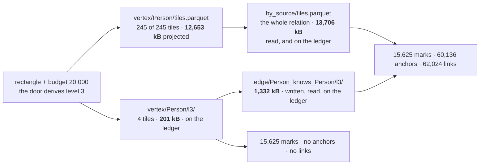

Every piece of a multiscale viewer is in this tree and none of them was built from a model. The
addressing came first, then the level plan, then [one door](/docs/design/one-door) over both, then an
app that feeds a renderer through it. Each of those was argued on its own terms and each of the
arguments holds. What was never written down is the thing they are pieces *of*: what a reader is
supposed to do with a corpus at every zoom, what it may cost, and what it owes the person looking at
the picture.

This is that model, stated as the reference the implementation is held against. The last section is
the list of places where the tree does not meet it. The ledger that tells a caller what a frame cost
was the one invariant of the five that did not hold; it holds now, and what is left of it is stated
there with the items that are still open.

## What a reference multiscale viewer is

The shape is not ours and it is not new. Four communities have converged on the same three parts,
and naming them is what lets "fossil is a multiscale viewer" be a checkable sentence rather than an
analogy. Every source below is in [prior art](/docs/design/prior-art).

**A declared level list.** OME-Zarr's `multiscales` is an entry per resolution, each with a path,
and the spec fixes the order — the `datasets` paths must run from the largest resolution to the
smallest. OGC's Tile Matrix Set publishes each matrix's width and height in tiles for the reason
that decides it: *so the range of relevant tile indexes does not have to be calculated by the client
application*. The list is a document, not a rule a reader re-derives.

**An address that is arithmetic.** An XYZ tile is `z/x/y` composed from the viewport; a Zarr chunk
key is composed from the index. No listing, no tile tree, no discovery request. A reader knows every
URL it wants before it issues the first one.

**A client that picks the level.** The store answers for the level it was asked about. Which level a
viewport deserves is a function of pixels, and pixels are the client's business.

fossil is the same in all three, and the correspondence is exact rather than rhetorical.
`projections:` is the declared list — finest first, and declared rather than derived for OGC's
reason, written out at [`projections:` — the payload and the levels in one
list](/docs/format/conventions/addressing#projections-the-payload-and-the-levels-in-one-list).
`tile = dense_id >> 12` is the arithmetic. The pick is the client's in the sense that matters: the
canvas goes in, `frame` derives the level at one mark per pixel, and `level` names one outright for
a caller that would rather say it. [One door](/docs/design/one-door) is why that moved inside the
read and what it had to keep in order to.

The container question has the same two answers here as everywhere else. Zarr v3's
`sharding_indexed` codec puts many addressable chunks inside one object with an index at the end;
a Cloud Optimized GeoTIFF puts its whole pyramid inside one file as reduced-resolution directories
read by range request. fossil's [two containers](/docs/format/conventions/addressing#two-containers-one-address)
are that question asked over Parquet, and `rowgroups` won it by a measured 4× in requests.

### Where it is not the same, and all three differences are about the graph

**A graph has edges, and a level of the vertices is not closed.** A raster tile is drawable on its
own: every pixel it needs is in it. A vertex level is not, because a mark's neighbour is almost
never a mark — a level keeps one vertex in `4^k` and the far end of an edge is drawn from a
coordinate the level does not hold. The number is measured on the 300,000-vertex bench corpus at the
app's own three-pixel floor: of the edges a level-6 view draws, a level file can position
**0.79%**. That single number is why the pyramid has a second half, and why it took a second
artefact rather than a flag.

**A decimation is not a downsample.** Every raster level in the prior art above is *synthetic*: a
level-1 pixel is an average of four level-0 pixels, and the averages nest because the grid is fixed
in advance. A graph has no such grid. The average of two vertices is a vertex that is not in the
corpus, and replacing a synthetic centroid with its children moves every point on screen — which is
the whole argument for a subset instead of a summary, made at length on
[the corpus](/docs/design/corpus). So the nesting here is not a property of a grid; it is
`dense_id % 4^(k+1) == 0` being a strict subset of `dense_id % 4^k == 0`, which is a fact about
integers.

The consequence is a rule the raster formats do not need and this one does: **a level shares the
payload's coordinate space exactly.** A Mapbox vector tile carries its geometry in the tile's own
integer grid, so the same feature has different coordinates at different zooms and "the point did
not move" is not even expressible. Here it is expressible and it is checked, in the files, both for
the vertices and for the coordinates the edge levels carry.

**The level is over a rank, not a grid.** A Zarr chunk key is an index into an array and a tile
matrix cell is a position in a grid; both are the coordinate. `dense_id` is a vertex's **rank** by
Morton code, and where a code falls in a ranking is a function of how the positions are distributed
— which no field of a manifest carries. So which tiles a rectangle touches is read off the tiles'
own `x`/`y` statistics and never computed from `chunk_size`. A raster reader never has this problem
and a graph reader cannot avoid it.

### The two systems that already tried this on a graph

**GraphMaps** — Nachmanson, Prutkin, Lee, Henry Riche, Holroyd and Chen — is the closest published
thing to this model: a sequence of layers where *each layer refines the previous one*, the layer
chosen by zoom, and only the entities intersecting the viewport rendered. It is the same shape, and
it is the evidence that the shape is not an idiosyncrasy of ours.

**ASK-GraphView** is the alternative, and it is the one fossil refuses. Abello, van Ham and Krishnan
build a clustering hierarchy over the graph and navigate it by expanding one cluster into its
children — which is exactly the meta-node whose expansion moves every point on screen. It is named
here rather than ignored because it scales further than anything else in the literature, and the
reason it is not taken is a property (nesting) rather than a benchmark.

## The five invariants a viewer owes

Each of these is a property of the *answer*, not of an implementation, and each has something in the
tree that goes red when it stops holding. All five hold today. The fifth was the last to, and what
is left of it is the second item below.

**1 · Nesting: refining only ADDS.** `frame(R, k+1) ⊆ frame(R, k)` for the same rectangle. It comes
free from the predicate, but a writer can still break it in the bytes, so it is checked in the
bytes: `crates/fossil-layout/tests/levels.rs, a_coarser_level_file_is_a_subset_of_the_finer_one`
for the vertices, and the closing half of
`crates/fossil-layout/tests/levels.rs, an_edge_level_holds_the_incident_edges_at_the_payload_s_own_coordinates`
for the edges. End to end, over a real camera path, it is
[monotone refinement](/docs/design/camera) carrying 100.0% of the previous picture across five zoom
steps.

**2 · Purity: `frame(rect, level)` is a function of its arguments.** No cap that moves with what the
rectangle holds, no stride derived from a running count, no state between calls. This is the
invariant that makes the other four *statable* — a reader with no way to name a level cannot be
asked whether refining adds. The canvas derives one when the caller names none, which is a default
and not a replacement: `level` given wins, and that is what keeps the left-hand side.
[One door](/docs/design/one-door) is the argument; the camera page carries the measurement, and the
one bug it caught, which was a rectangle moving underneath a pure function rather than the function.

**3 · One contract, whether or not a level file exists.** `dense_id % 4^k == 0` **is** the
definition of level *k*; a written `l{k}/` is a cache of it. Two contracts would be strictly worse
than no pyramid, because a reader would have to know which one it got in order to know what it was
looking at. Held by diffing the file against the predicate in both directions, every column and not
only the id, with the row count as a separate statement:
`crates/fossil-layout/tests/levels.rs, a_level_file_holds_exactly_what_the_level_predicate_selects`.
The reader executes the identity rather than assuming it — `pool` applies the modulo over a level
file whose every row already satisfies it.

**4 · A frame's cost is bounded by the level, not by the corpus.** The coarsest level is *the one
that fits a single tile* — that is its definition, not a budget — so the coarsest frame is **one
range request over a corpus of any size** (`crates/fossil-sinks/src/manifest.rs, VertexLevels`).
The pyramid it sits on top of costs `1/4 + 1/16 + … = 1/3` of the type, a fraction rather than a
tile count, which is why nothing bounds it but its own geometry. This is the invariant the cost
model below is about, and it is the one that the app does not get today: at the whole extent the
reader opens 245 tiles of 245.

**5 · Every byte the frame opened is on the ledger.** A cost a caller cannot see is a cost nobody
optimises, and the point of reporting bytes at all is that a reader can check them against a network
tab. `FrameCost` reports `requests`, `bytes`, `ms`, `tiles` and `ofTiles`, and `bytes` is the
compressed weight of the columns the query projects, over the row groups the read selected, across
**both** halves of a frame — the vertex artefact that answered and the relation's. What shows it
holds is that the number *moves with the selection*: a frame reading 3 tiles of 62 reported
21.76 MB, more than the entire 21.40 MB payload it had not opened; it reports **1.21 MB**.
`apps/playground/scripts/measure-frame.mjs` is the measurement, and the second item below is what
is left of this one.

## What a frame costs

The frame is the whole extent of the million-vertex corpus `apps/corpus/guards/fixture.mjs` writes,
at a budget of 20,000 marks — `BOUNDED_DEFAULTS.limit` in the renderer, which the door answers
level **3** for over the four levels this corpus writes. Every byte is `total_compressed_size` out
of the Parquet footer, because DuckDB issues its reads from inside a Worker where no thread here
can weigh them; anything derived rather than measured says so in the cell.

**One convention now, and there were two.** `FrameCost.bytes` and `apps/playground/src/whole.ts`
weigh a read by the same rule — `total_compressed_size` over the columns the query projects, across
both the vertex artefact and the relation's. What differs between them is the scope and not the
rule: `whole.ts` weighs every row group because it loads every row, and the door weighs the row
groups the rectangle selected. So the columns below may be compared, which is what the third one is
for.

### One frame, four strategies

| | what it reads | what `FrameCost` says | what it draws |
| --- | --- | --- | --- |
| **a · load everything**, once | 12,653 + 13,706 = **26,359 kB** | not on this ledger | 1,000,000 marks · 1,999,993 links |
| **b · tiles + strided payload**, per frame | 12,653 + 13,706 = **26,359 kB** | — not measured | 15,625 · 60,136 anchors · 62,024 links |
| **c · + vertex levels**, `links: false` | **201 kB** · 4 tiles | **201 kB** | 15,625 · no anchors · no links |
| **d · + edge levels** — what the app does | 201 + 1,332 = **1,533 kB** | **1,533 kB** | 15,625 · 60,136 · 62,024 |

**The third column is a measurement of rows (c) and (d) and of nothing else.** Those two are what
the door answers this frame with, and it reports for them exactly what the first column says they
read — which is the whole of what invariant 5 asks and is why the two columns now agree rather than
straddle. Row (b)'s cell is empty because there is no longer a way to get the number honestly: this
corpus writes the pyramid, so the door answers off it and never takes the strided-payload path at
this rectangle. The figure that stood here was measured against a ledger that weighed whole tiles
and no adjacency at all, and it is deleted rather than carried forward.

**Rows (a) and (b) read the identical bytes, and that is the finding.** At the whole extent every
tile intersects the rectangle and both paths project the same columns out of the same two files, so
the addressing prunes nothing whatsoever at the outermost frame. What separates them is not
bytes but *when*: the baseline pays 26,359 kB once and every camera move afterwards reaches no
engine, where the windowed path pays it again per frame — measured in a browser over the same
corpus, six answers cost the windowed path **36,311 kB cumulative** against the baseline's 26,359 kB.
Tiling earns its keep as the camera closes in, not here. **The only thing that buys anything at the
outermost frame is the level.**

Rows (c) and (d) are the same picture at two prices, and (c) is **not** that picture. Its anchors
are four times its marks and they are real vertices at real coordinates, so dropping them turns a
zoomed-out view into a sparse cloud with holes rather than a cheaper version of what was there.
`apps/playground/src/tiles.ts` records that correction against its own earlier decision, and it is
why the app asks for links at all. What it pays for them is row (d): the same picture off both
pyramids, one range request and 1,533 kB, which is what
`apps/playground/scripts/measure-frame.mjs` reports for the frame the app opens on.

Row (d) is the one the model wants, and it is the one `Corpus.frame` produces for a caller that asks
for links at a level both pyramids are written at. The edge level at *k*=3 holds
**62,024 rows** — exactly the links row (b) draws — and the far ends it positions are exactly the
**60,136** anchors row (b) returns, because a level of a relation is the edges incident to a
level-*k* vertex and every row carries both endpoints' coordinates
(`crates/fossil-sinks/src/manifest.rs, Projection`). So the same frame, drawn identically, is
1,533 kB against 26,359 kB — **17.2× (derived)** — and the bytes are on disk today.

### The same frame, as the camera zooms

Four rectangles over the same corpus, from [the camera](/docs/design/camera), against the levels
this corpus actually writes. **This table is on the ledger's OLD convention** — whole vertex tiles,
every column, and no adjacency — which is what was measured at the time and is not what
`FrameCost.bytes` reports now. It is kept as the strided baseline the pyramid is judged against,
and it is not a reading of today's ledger.

| window | `levelFor` | tiles | **b** · strided, whole tiles | **c/d** · off the pyramid |
| --- | --- | --- | --- | --- |
| whole extent | 6 | 245 / 245 | 20,901 kB | 335 kB, or 1,332 kB more with the edges |
| 50% | 5 | 145 / 245 | 12,506 kB | — level 5 is not written |
| 25% | 4 | 47 / 245 | 4,062 kB | — level 4 is not written |
| 10% | 2 | 15 / 245 | 1,294 kB | — level 2 is not written |

**The four rows above were measured against a pyramid of five levels in halves, and that pyramid no
longer exists.** They are kept because the strided column is what the pyramid is judged against and
that half is unchanged; the "not written" answers are not.

The reason three of the four went unanswered was that the writer's window and the camera's demand
were chosen by different rules — a window of five levels down from the one-tile level, against
whatever a budget in marks asked for — so they met at the whole extent and missed by one at 300,000
vertices. **Both halves of that mismatch are gone**: the pyramid is complete from level 1 to the
coarsest, so there is no level below the coarsest that a camera can ask for and not find. What is
left is a ceiling rather than a gap — a frame coarser than one tile is answered by that one tile.

Whether a frame reads any of the four is a question about which levels the corpus writes and no
longer one about links: a view that asks for links is answerable off the pyramid wherever the
relation's own level is written beside the type's, which is the correction in gap 1 below.

That is defensible and it is not free. The strided rows fall steeply — 20,901 to 1,294 kB across the
four — so the frames the pyramid cannot answer are the cheap ones, and the frame it can answer is
the expensive one. The fall is not proportional to area, and [one door](/docs/design/one-door)
carries the measurement of by how much.

What would fill the empty cells is a plan whose window follows the camera rather than the corpus.
What argues against changing it is that the same cells are also filled by
[residency](/docs/design/camera): every one of the 145 tiles the 50% frame opens was already among
the 245 the whole-extent frame opened, so a reader that separated what is loaded from what is drawn
pays zero for that zoom step. **Those are two different fixes for the same four rows and only one of
them costs the writer bytes.**

### What the pyramid costs the writer

**These two tables and the four rows above name their levels in the numbering of the pyramid that no
longer exists**, which this corpus writes as `l1` through `l4` — the door answers the whole extent
at level 3, and the `335 kB` and `1,332 kB` below are the artefacts it reads there. The bytes are
what was measured; only the index on them moved.

| set | level 6 | level 7 | level 8 | all three | of the set it decimates |
| --- | --- | --- | --- | --- | --- |
| `vertex/Person/l{k}/` | 335 kB | 168 kB | 84 kB | 587 kB *(derived)* | 2.8% *(derived)* |
| `edge/Person_knows_Person/l{k}/` | 1,332 kB | 674 kB | 342 kB | 2,348 kB *(derived)* | 17.1% *(derived)* |

The edge pyramid is four times the vertex pyramid *(derived)* and the reason is legible in the
schema rather than in the data. A vertex level keeps one row in `4^k`; an edge level keeps every edge with *either* end
in the level, which is about two in `4^k` — and each of its rows carries four coordinates beside the
two ids. Measured: **22.0 B a row against 7.0 B** in the adjacency it decimates, 3.1×. That is what
a self-drawing row costs, and it is the trade the whole second artefact is: three times the bytes
per row so that a line can be drawn without opening the payload the pyramid exists to avoid.

## What is missing to be that reference

Five, in the order they were written. The first two are closed; what is left of each is stated with
the three that are not.

**1 · The edge levels are read, and what is left is which question the pyramid may be asked.** This
item said nothing read them, and it named a `levels:` block and an `EdgeLevels` that the tree no
longer spells. A relation's levels are `projections:` entries beside its adjacency, declared by
`crates/fossil-sinks/src/manifest.rs, EdgeInfo`, emitted by
`crates/fossil-layout/src/layout/pass.rs, write_edge_levels`, written into the fixture by
`apps/corpus/guards/fixture.mjs`, and addressed by `crates/fossil-graph/src/plan.rs, EdgeAddress` —
one projection per orientation at `scale: 1` and one per written level, source-aligned, each counted
against the SOURCE type's `vertex_count` and never against `edge_count`.
`packages/corpus/src/address.ts` is the binding over that reader rather than a second one, and
`Corpus.frame` in `packages/corpus/src/corpus.ts` composes the read: where every relation a frame
draws has its level *k* written, the lines and the far ends they need come out of the relation's own
level file — which carries both endpoints' coordinates, so no vertex tile is opened to place
them — and `Frame.matchedAt` reports *k* rather than `0`. Where any of them is missing it, the read
is the payload's, all or none, because a frame drawing one relation off level *k* and another off
the payload would be two reads reported as one number.
`packages/corpus/tests/frame-levels.test.ts` holds it against a fixture corpus with a pyramid and
the identical corpus without one.

What is left of this item is not a byte the writer owes; it is what a caller may ask for.

- **A frame draws the relations its type is the source of**, at every scale. A level of a relation is
  source-aligned, so the in-edges of a coarse view are no more answerable off the pyramid than they
  are off the one adjacency a window opens — the same incidence gap the addressing layer already
  reports as `AddressedTiles.complete`, inherited rather than introduced. What would close it is a
  destination-aligned level set, which is a second artefact and which nothing has asked for.
- **Nothing says in advance whether a frame that asks for links will be answered off the pyramid.**
  `Corpus.levels` reports `written` for `vertex/<Type>/l{k}/` and says nothing about the relations,
  so a caller budgeting a read learns which artefact answered from `Frame.matchedAt` after it has
  paid. What would close it is one more field; what argues against it is that every level is
  answerable either way, so the number that matters is the one the read reports rather than the one
  a caller predicted.

**2 · The byte ledger is a measurement, and what is left is that it and `requests` weigh different
things.** This item said `bytes` was wrong in both directions at once, and it named both: whole
tiles where the read is columnar, and no adjacency at all. Both are closed, and they closed
separately.

The columnar half went in `e7bd99e`, which made the weighing `total_compressed_size` over the
columns the query projects and added the edge half to the same call. The half that survived it is
one the item never named, and it is the one that made the number useless in practice: **under
`rowgroups` every tile of a set names the same URL**, so a sum over `parquet_metadata(urls)` weighed
the whole *file* rather than the row groups the rectangle selected. The vertex half only looked
selected because a level read names a small file; the edge half named the entire relation. The
symptom is one column of `apps/playground/scripts/measure-frame.mjs`: **`bytes` did not fall with
`tiles`.** A frame reading 3 tiles of 62 reported 21.76 MB — more than the whole 21.40 MB payload it
had not opened — and a camera closing in reported the same figure four moves running.

The fix took nothing new. The per-row-group extents were already read and already used:
`FrameCost.requests` collapses the selection into maximal runs off `TileBox.start` and
`TileBox.bytes`, so the intervals the read is bounded by were in hand and the sum was taken over the
wrong set. `bytesOf` in `packages/corpus/src/corpus.ts` is now bounded by those same intervals,
matched against each row group's own statistics on the column they are stated over — `dense_id` for
the vertex half, `src_dense` for the relation's, which is the only thing that locates an adjacency
row group under either container. A row group whose footer declares no statistics is counted, which
is the conservative answer and the one the tile boxes already make. Measured over the same ten-frame
camera path: the 3-of-62 frame is **1.21 MB**, and every frame that opens part of an artefact now
reports a fraction of it.

What is left is not a direction, it is a caveat a caller has to be told rather than left to infer.
**`bytes` and `requests` weigh the same read under different rules.** A request is a `Range` over a
maximal run of abutting row groups, and a range is not columnar: it carries `subject` along with the
four columns a view draws with. So `bytes / requests` is not the size of a request, and a reader
checking the ledger against a network tab will find the responses larger than the bytes — by whatever
share of a row group the projection leaves out, which on this corpus's payload is most of it. What
would close it is a third field weighing the runs whole; what argues against it is that nothing has
yet asked how large the responses are, only how much of the corpus a frame had to touch.

**3 · There is no level of detail for the identity index, and no statement of whether it needs one.**
The index is [not a projection](/docs/format/conventions/identity), so it carries a prefix, an
ordered-by column and a chunk size of its own, and no `scale`. At a
million vertices `index/tiles.parquet` is **8,522 kB — 41% of the payload (derived)**, the largest
artefact in the corpus after the two it serves. The honest framing is that a *lookup* does not need
a pyramid: the index tiles' footers carry disjoint `subject` ranges, so a binary search over them
names the one tile a value can be in and the read is one tile whatever *V* is. What has no answer is
the **scan** — a typeahead over prefixes, or "what identities are in this rectangle" — which is a
different question from the one the index was built for, and the reference model currently says
nothing about how it degrades under a budget. That is a design question and not a gap in the writer:
what would settle it is one measurement of a prefix query over the index at three corpus sizes.

**4 · The rule that decides when the pyramid may answer is stated too narrowly.**
[One door](/docs/design/one-door) says *the pyramid answers when the answer is points*, and the
reader stopped obeying that rule the day it learned to draw lines off a relation's level set:
`Corpus.frame` reads the pair where the pair is written, and opens the payload only where it is not.
The rule that survives a reader is the general one: **the pyramid answers when the level set carries
what the answer needs** — for points that is the vertex level, for lines it is the pair. That
sentence is in `packages/corpus/src/corpus.ts` beside the decision it governs and not yet on the page
that states the rule, which is the whole of this item. [The corpus](/docs/design/corpus) carried the
same claim as a statement of fact — a callout
titled *the edges get no pyramid* — and that one was corrected rather than left, because it was
measuring the induced set to answer a question about the incident one.

**5 · The instrument measures half of it.** `apps/playground/scripts/measure-pyramid.mjs` asks one
rectangle twice, with links and without, and reports the byte ratio between them — which is the
whole of row (c) and none of row (d). The door it measures through now answers row (d) as well, so
what stopped it is gone — and it must keep measuring through the door, because an instrument that
read the level files directly would be a second reader, and the ratio it printed would be a property
of the instrument rather than of the corpus.

## What would reverse the model

The model is one decision deep, and it is the decision to make a level a **subset of real rows**
rather than a summary. Everything above follows from it: nesting is integer arithmetic, the
coordinate rule is expressible, one contract survives, and the second artefact had to carry
coordinates rather than contract a path.

What would reverse it is a use for a picture that a decimation cannot draw. The candidate is
density: at a zoom where a million vertices become fifteen thousand, a heat map of *where the
vertices are* is a truer picture than fifteen thousand of them, and no subset of rows is a heat map.
That would be a **third** artefact and not a replacement — a level that answers a different question
under a different name, which is the one thing the one-contract invariant forbids doing under the
same one. It is not written down as discarded because nothing has asked for it yet.
