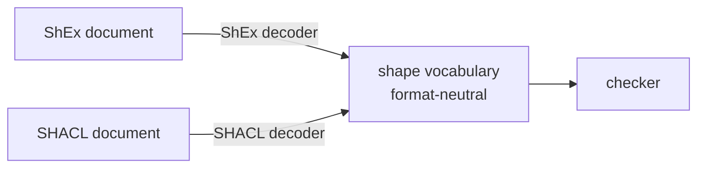

The type of a fossil program's *output* is not written in the program. It is read out of an RDF shape
document — ShEx or SHACL — that describes the graph you intend to produce.

<Program src="shop/shop.shex" region="person" title="shop.shex" />

Read that as a table and the design falls out. Per class it gives, for each predicate: a name, a kind
of value, and a count. Three columns. That is a constraint table, and a constraint table is a type —
the target type of every mapping that claims to produce that class.

<Program src="shop/shop.fossil" region="shapes" title="shop.fossil" />

The binding pulls shapes out of the document and gives them local names. From that line on, `Person`
is a type the checker knows as thoroughly as the type a [provider](/docs/design/type-providers)
generated for a CSV — same status, opposite end of the program.

## Checked against, not validated after

The established way to use a shape document is validation: run the mapping, produce the graph, run a
validator over it, see whether it conforms. That works. What it costs is when you find out — after
the mapping has run over millions of rows, so the repair is a full regeneration. fossil reads the
same document as a *type*, so the same error is a compile error over the program, and everything it
offers over validate-afterwards is the part that happens before the run.

Most of the surrounding ecosystem runs the arrow the other way, deriving the shape document *from*
the mapping. That is [discarded](/docs/design/discarded), with the one workflow that would bring it
back and the [survey](/docs/design/prior-art) it was measured against.

## Both formats, one vocabulary

ShEx and SHACL describe the same thing in different vocabularies, and both are first class here. That
claim decays into a lie unless something structural holds it up: in practice one format is the one
the compiler was built around and the other is a converter bolted on. Here the middle of the compiler
never learns which schema language a document came from.

There is no `if shex` below the decoders, and no privileged format whose concepts the neutral
vocabulary happens to be shaped like. A third way to describe a graph's shape is a decoder, exactly
as a third source format is [a row in the provider registry](/docs/design/type-providers). Taking the
constraint table from SHACL instead is [discarded](/docs/design/discarded), with the cost of the
choice and the three conditions that reverse it stated there.

## What the constraint table has to carry

Choosing what goes in the neutral vocabulary is the design work, and the table is smaller than it
looks: a shape is its IRI and its predicates, and a predicate carries its cardinality.

**Cardinality, at full resolution.** Not "required or not" — the real count. *Exactly one* against
*one or more* is the difference between a property you may repeat and one you may not, and a table
that collapses them cannot support the check on the [typing page](/docs/design/types) that
distinguishes a missing required property from a legitimately absent optional one.

**Closure is NOT in it, and the reason is that fossil only has the writing side.** A `closed` field
was carried for a while — `ShEx` `CLOSED`, SHACL `sh:closed` — and no checker ever read it. Wiring it
would have changed nothing: a property key is a bare name resolved against this table, so a key no
predicate declares is already an error, with a did-you-mean over the ones that do, unconditionally
and for every shape. Openness has no way to be expressed from the side a mapping writes on, and a
flag that can only select the behaviour that already happens is not a flag.

If it ever returns — for a reader that validates graphs it did not write — it cannot return as a
bit, because there are three states and not two:

| state | a node may carry | what a boolean loses |
| --- | --- | --- |
| `closed` | only the predicates the shape names | nothing — a bit keeps this one |
| `open` | any predicate beyond them | nothing — and this one |
| `EXTRA p` | `p` again, with values that do **not** match its constraint | the state itself: neither closed nor open, so a bit rounds it to one of the other two |

Rounding `EXTRA` to `open` admits graphs the author excluded; rounding it to `closed` rejects graphs
the author allowed. Both public systems that put closure on the *emitter* rather than on the type can
no longer round-trip a schema: the same type emits two different documents depending on how it was
invoked.

The semantics themselves rest on **rudof**, the Rust ShEx implementation from the WESO group at the
Universidad de Oviedo — a dependency on a specification's authors, not on a convenient library. What
a shape *means* has a normative answer, and re-deriving it from the specification text is how
implementations drift from each other.

## The cost of binding by position

Shapes bind to local names in the order the document declares them, not by matching names, which is
what lets one program read two documents with unrelated vocabularies. It also means reordering the
shapes inside a document rebinds the program — acceptable because shape documents are files you
version and review, but a real edge, and the sort discovered on the day somebody tidies one up.

Naming a document is also what gives a program its property names, so the output type is not optional
the way an annotation is: a program with no document has no way to spell a property at all.
