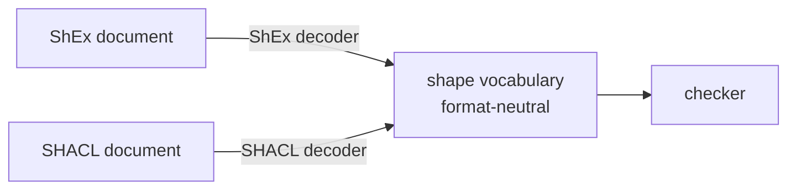

The type of a fossil program's *output* is not written in the program. It is read out of an RDF shape
document — ShEx or SHACL — that describes the graph you intend to produce.

<Program src="shop/shop.shex" region="person" title="shop.shex" />

Read that as a table rather than as a schema language and the design falls out. Per class it gives,
for each predicate: **a name, a kind of value, and a count.** Three columns. That is a constraint
table, and a constraint table is a type — the target type of every mapping that claims to produce
that class.

<Program src="shop/shop.fossil" region="shapes" title="shop.fossil" />

The binding pulls shapes out of the document and gives them local names. From that line on, `Person`
is a type the checker knows as thoroughly as it knows the type a
[provider](/docs/design/type-providers) generated for a CSV — same status, opposite end of the
program.

## Checked against, not validated after

The established way to use a shape document is **validation**: run the mapping, produce the graph,
run a validator over the graph, see whether it conforms. That works. What it costs is when you find
out — after the mapping has run over millions of rows, so the error is discovered downstream of all
the work and the repair is a full regeneration.

fossil reads the same document and uses it as a *type*, so the same error is a compile error over the
program rather than over the data. **Everything fossil offers over validate-afterwards is the part
that happens before the run.**

That also explains an otherwise strange fact about the surrounding ecosystem, measured in the survey
[prior art](/docs/design/prior-art) records: of seventeen mapping languages, fifteen treat a class
IRI as a sequence of characters to concatenate, and they run the arrow the other way — deriving the
shape document *from* the mapping. A generated shape cannot disagree with the mapping because it was
computed from it, and a contract that cannot contradict you is not checking anything. Deriving it
stays [discarded](/docs/design/discarded), with the one workflow that would bring it back.

## Both formats, one vocabulary

ShEx and SHACL describe the same thing in different vocabularies, and both are first class here. That
claim decays into a lie unless something structural enforces it, because in practice one format is
the one the compiler was built around and the other is a converter bolted on. The structural move is
that **the middle of the compiler never learns which schema language a document came from.**

There is no `if shex` anywhere below the decoders, and no privileged format whose concepts the
neutral vocabulary happens to be shaped like. A third way to describe a graph's shape is a decoder,
in the same way that a third source format is
[a row in the provider registry](/docs/design/type-providers). Whichever document you point at, the
type you get carries the same three things on every property.

Taking the constraint table from SHACL instead was considered and is
[discarded](/docs/design/discarded) with the cost of the choice stated there — SHACL is the W3C
Recommendation with the active working group — and the three conditions that would reverse it.

## What the constraint table has to carry

Choosing what goes in the neutral vocabulary is the actual design work, and two things earn their
place.

**Cardinality, at full resolution.** Not "required or not" — the real count. *Exactly one* against
*one or more* is the difference between a property you may repeat and one you may not, and a table
that collapses them cannot support the check on the [typing page](/docs/design/types) that
distinguishes a missing required property from a legitimately absent optional one.

**Closure, which has three states rather than two.** Whether a node may carry predicates the shape
does not mention is a property of the *shape*, and it is tempting to model it as a bit:

| state | a node may carry | what a boolean loses |
| --- | --- | --- |
| `closed` | only the predicates the shape names | nothing — this is one of the two the bit keeps |
| `open` | any predicate beyond them | nothing — this is the other |
| `EXTRA p` | `p` again, with values that do **not** match its constraint | the whole state; it is neither closed nor open, so a bit has to round it to one of them |

Rounding `EXTRA` to `open` admits graphs the author excluded, and rounding it to `closed` rejects
graphs the author allowed. Either way the vocabulary silently loses a distinction the source document
made.

The general lesson underneath both has a name in the prior art: DCTAP, a deliberately minimal tabular
profile for shapes, needed extension sheets before it could write SHACL at all, because a usable
shape type has to carry things that are not "shape" — node kinds, targets, severity. Model the
intersection of two schema languages too tightly and the vocabulary stops being able to express
either one. Putting closure on the *emitter* is the specific version of that mistake, and both public
systems that made it can no longer round-trip a schema by construction: the same type emits two
different documents depending on how it was invoked. Closure is a property of the type.

## Where the semantics come from

The shape semantics rest on **rudof**, the Rust ShEx implementation from the WESO group at the
Universidad de Oviedo, led by José Emilio Labra Gayo. That is a dependency on a specification's
authors rather than on a convenient library, and it is the right kind for this job: what a shape
*means* has a normative answer, and re-deriving it from the specification text is how implementations
drift from each other.

## The cost of binding by position

Shapes bind to local names **in the order the document declares them**, not by matching names, which
is what lets one program read two documents with unrelated vocabularies without either one
negotiating. It also means reordering the shapes inside a document rebinds the program. Shape
documents are files you version and review, which is what makes that acceptable — but it is a real
edge, and the sort discovered on the day somebody tidies a document up.

Naming a document is also what gives a program its property names, so the output type is not optional
the way an annotation is: a program with no document has no way to spell a property at all. What a
program *targeting* a shape does with a predicate the shape does not mention is decided by that
shape's own closure, which is what the three-state model exists to keep answerable.
