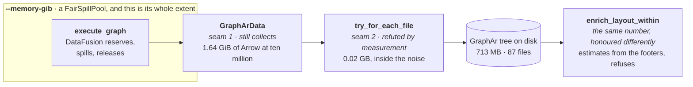

"Efficient" is a comparison. **Larger than RAM is a guarantee**: exceeding the machine is a slower
run, not a failed one, and the corpus that comes out is the same corpus. Two mechanisms produce it
and neither suffices alone. **A budget bounds the operators inside the pool** — they reserve before
they allocate and spill when told no. **A stream bounds everything outside it** — a batch arrives, is
transformed, is handed on and is dropped, so peak memory follows the working set and not the corpus.
A boundary that holds a whole value is memory the pool never sees, and the process dies with the
budget honoured. One mechanism, two halves, one page.

## The budget encloses the executor, and the layout refuses



The box used to be the whole finding. `enrich_written_layout` took the run's `memory_bytes` and
wrote `let _ = memory_bytes;`, with a comment saying there was nothing left to cap and nothing
enforcing the budget either — and at ten million vertices a declared 4 GiB run peaked at 8.39 GiB.
**A bound overshot by more than double is worse than no bound**, because the person who declared it
stopped worrying. A probe settled where it went, not an argument: four explanations for seventeen
gigabytes were each killed by a number, and **RSS was already 14.61 GiB when `enrich_layout` ran its
first statement.**

The number reaches the second half now, and the two halves honour it differently because only one of
them can. The executor reserves against a pool and **spills**. The layout pass holds Rust `Vec`s
with no disk manager under them, so it **refuses**: `estimated_peak_bytes` over three numbers out of
the staged Parquet footers — rows, adjacency rows, uncompressed vertex bytes — checked before a
single column chunk is decoded. Over budget is an error at second zero and a corpus left exactly as
the writer staged it, instead of an out-of-memory at second two hundred.

<Callout title="A refusal is not the same promise as a spill, and the page should not blur them">
This is not larger-than-RAM for the layout pass. It is a declaration that has stopped being a lie:
`--memory-gib 4` at ten million now *says so* rather than quietly using 8.39 GiB. What it buys is
that the number means something; what it does not buy is the run.

**The budget never changes what the pass writes**, only whether it runs, and that is structural
rather than cautious. `fossil run` and the playground tab write the same tree byte for byte through
one `LayoutIo`, and only one of them has a flag to declare a budget with — so a budget that degraded
the output would make the two paths disagree exactly when somebody declared one.
`crates/fossil-layout/tests/budget.rs` runs one staged corpus twice, once unbounded and once under a
budget, and compares every byte of every file.
</Callout>

## A budget is a protocol, not a flag

*Try, and die if it does not fit* is not a mode any serious engine offers. DataFusion, DuckDB and
Velox all implement one shape — **the operator reserves before it allocates and knows what to do when
told no** — and a pool without a temporary directory beside it turns a slow job into a failed one at
exactly the size it was meant to help.

**A budget only means something if the operators can honour it.** The first 4 GiB run died and
`TrackConsumersPool` named the culprit:

```text
HashJoinInput[8]#125(can spill: false) consumed 387.7 MB, peak 387.7 MB,
HashJoinInput[9]#126(can spill: false) consumed 291.9 MB, peak 291.9 MB,
…five of them, on a ten-core machine: one reservation per partition
```

A hash join's build side declares `can spill: false`; told it may not allocate it has nothing to give
back, so it dies. A sort-merge join spills. `bounded_context` therefore clears
`datafusion.optimizer.prefer_hash_join` alongside the pool: a plan free to pick an operator that
cannot obey is a budget in name.

**The floor belongs to the machine, not the corpus.** Each sort partition reserves
`sort_spill_reservation_bytes` (10 MB) and declares it non-spillable, so the smallest viable pool
grows with `target_partitions`. On ten cores, 384 MiB dies with five `ExternalSorterMerge` holding
10 MB each; 480 MiB runs and spills, and it still spills at 2 GiB. A hundred-megabyte budget is not
viable at any corpus size.

So `crates/fossil-df/tests/spill.rs` asks for 64 MiB *per core*.
`a_ridiculous_budget_spills_and_writes_the_same_corpus` writes one corpus twice, once unbounded as a
control and once under the budget; the bounded run must open a spill directory and the two trees must
come out byte-identical. The control is what makes it evidence — the default pool has no disk manager
and cannot spill. It measures no RSS, so nothing below this line is in CI, and widening it is not
cheap: spill files are deleted when the job ends and per-plan metrics do not outlive the execution.

## The numbers, at ten million vertices

| ten million | unbounded | 4 GiB + sort-merge |
| --- | --- | --- |
| RSS after `execute_graph` | 15.68 GiB | **5.56 GiB** |
| RSS entering `enrich_layout` | 16.51 GiB | **6.82 GiB** |
| process peak | ~21 GiB | **9.87 GiB** |
| wall clock | 256.3 s | 290.9 s |

Eleven gigabytes off the peak for 13% more wall clock, corpus byte-identical across 87 files. Then
the layout stopped asking for two more (`97efc79`):

| ten million, 4 GiB budget | before | with the CSR |
| --- | --- | --- |
| `community_hierarchy` | +2.09 GiB · 135.0 s | **+0.08 GiB** · 168.0 s |
| process peak | 10.10 GiB | **8.39 GiB** |

−1.71 GiB against the ≈ −1.7 GB predicted before it was attempted, and the peak falling to 8.39 GiB
is the result. **The reading drawn from the `community_hierarchy` row is not**: measured on its own
through `examples/enrich_memory`, the same post-CSR path bills that step 0.41 GiB per million
vertices, linear, and three to five times every other phase in the pass. An RSS delta only sees a
phase that makes the process ask the OS for more, and by the time the layout runs there are
gigabytes of freed pages in hand. The step did not stop asking; it stopped showing. See
[the cost model](/docs/design/cost). The peak still grows
with N, which is the gap to the direction above: on the pre-CSR binary under the same budget, ten
times the corpus cost 4.1× the peak (2.43 → 9.87 GiB) and 10.3× the retained Arrow (0.16 → 1.64).

<Callout title="Two baselines, 0.23 GiB apart, and that is the resolution">
The first table puts the pre-CSR peak at 9.87 GiB; the second measures the same binary at 10.10. Two
runs of one build, on a machine other agents were also using. Nothing reconciles them and nothing
should — **the spread between two identical runs is about 0.2 GiB, and no number on this page is
finer than that.** It is also why seam 2 below reads as no result at all.

The wall clock moved the wrong way, 135 s to 168 s, and that is not clean either: the same previous
binary measured 151 s on another pass. Walking two arrays per vertex instead of one has a locality
cost that is structural, and it is owed a measurement on a quiet machine before anybody calls it free.
</Callout>

### The residue, found — and the pass costs 42% of what it did

The layout pass on its own, `FOSSIL_MEM_PROBE=1 … --example enrich_memory -- <N> <degree>`, on a
Mac16,8 — 14 cores, 48 GiB, macOS 26.2 / Darwin 25.2.0 — 2026-08-28. **Before** is the same binary
the row above describes, re-run on this machine rather than quoted:

| ten million, degree 14 | before | after |
| --- | --- | --- |
| `community_hierarchy` | +3.47 GiB · 228.2 s | **+1.92 GiB · 136.1 s** |
| the whole pass | 7.22 GiB | **3.80 GiB** |
| process peak | 8.54 GiB | **5.08 GiB** |
| wall clock | 247.4 s | **159.1 s** |
| `ADJACENCY_ROW_BYTES` | 48 | **14** |

`ADJACENCY_ROW_BYTES` was 48, of which ten were the CSR entry and the final remap and **thirty-eight
were a residue nothing in the file explained**. The thirty-eight are found, and the way they were
found is worth more than the number: sample the resident set *inside* the hierarchy, per level and
per sweep, instead of at the phase boundary.

**`local_moving` costs no memory at all.** RSS is flat to three decimal places across all thirty-two
of its sweeps, at two million and at ten. The hundreds of millions of transient `HashMap`s the
previous reading blamed are recycled by the allocator and never reach the resident set.

**The estimate is calibrated to come out high, and the direction is the decision.** Against the
pass's own footprint `estimated_peak_bytes` is **+12% at two million and +19% at ten**. An estimate
that reads too large refuses a run that would have fitted, and the caller raises the number; one that
reads too small waves through a run that then exceeds what it was promised, which is the defect the
budget exists to remove. Only one of those two failures is silent, so the bias points away from it.

**One line of `Weighted::contract` was the whole residue.** `vec![HashMap::new(); k]` — one hash
table per community, and the *first* contraction is the one that barely contracts, so `k` is
3,757,900 at ten million and those tables hold 110,070,012 entries between them. Measured directly:
**+3.41 GiB of the +3.82** the step billed, at ~33 bytes per surviving inter-community half-edge.
The quotient CSR built out of them is another +1.04.

The maps are gone. Group the nodes by community with a counting sort first, then build one row at a
time into a sparse accumulator and emit it before the next row starts: `k` hash tables live at once
becomes one dense array of `k`. The output is **bit-identical** — the counting sort is stable, so
every `f64` is the same sequence of additions — and a 300,000-vertex corpus written both ways is
equal over all seven files and 130 MB.

<Callout title="The 1.78× was real, and it was the smaller half">
`local_moving`'s `HashMap`-per-vertex-per-sweep was replaced by one reused sparse accumulator
(`Vec<f64>` of weights, `Vec<bool>` of occupancy, a `touched` list to clear them), which is a wall
clock change and nothing else. Measured alone, on this machine: Louvain **228.2 s → 132.8 s**, 1.72×,
and the process peak **8.54 → 8.90 GiB** for 90 MB of arrays added — reproducing an earlier
measurement of 1.78× and +0.38 GiB almost exactly.

That trade was refused once, on the grounds that it spent the one quantity `--memory-gib` bounds to
buy wall clock that was not the objective. It is here now because the objection has been removed
rather than overruled: with the contraction's maps gone the peak is 5.08 GiB, and 90 MB against
3.4 GiB recovered is not a trade any more.
</Callout>

### What the budget is calibrated on now

Four terms, three of them proportional and one a floor:

| fixture | adjacency rows | the pass | `read CSR + CSC` | `estimated_peak_bytes` | clears by |
| --- | --- | --- | --- | --- | --- |
| 2,000,000 · degree 14 | 27,974,508 | 0.60 GiB | +0.16 GiB | 0.74 GiB | +24% |
| 4,000,000 · degree 6 | 23,978,362 | 1.07 GiB | +0.15 GiB | 1.25 GiB | +16% |
| 4,000,000 · degree 14 | 55,949,862 | 1.23 GiB | +0.31 GiB | 1.49 GiB | +21% |
| 4,000,000 · degree 28 | 111,899,830 | 1.17 GiB | +0.52 GiB | 1.90 GiB | +63% |
| 10,000,000 · degree 14 | 139,874,560 | 2.71 GiB | +0.78 GiB | 3.69 GiB | +36% |

**The three middle rows are a debt paid.** Every calibration point behind the old constant shared
mean degree fourteen, where V and E are proportional and a per-row term and a per-vertex term fit
the same line — so attributing the cost to adjacency rows was mechanically defensible and
unverified. These three hold the vertex file byte-identical and move only the edges, and a
per-vertex attribution predicts a flat line across them. `read CSR + CSC` moves **+0.15 → +0.31 →
+0.52 GiB** across them, a slope of **4.5 bytes per adjacency row**. It is rows.

**`ADJACENCY_ROW_BYTES` is 8 now, and the phase it is fitted on has moved for the third time.** It
was 48 when Louvain's contraction built a hash table per community; it was 14 when the remap held a
whole orientation as Arrow at 13–15 B/row. With the remap holding one `Vec<u64>` per orientation —
four bytes for each row counted in the table above, and not live at the same time as the CSR — the
phase that holds the most per adjacency row is `read CSR + CSC`, which is arithmetic rather than a
guess: one `u32` of `targets` per row plus an offset per vertex, held by Louvain for the whole of
its 127 s at ten million. Measured, that is 5.0 to 6.7 B/row across the five. Eight is the larger of
the two terms, rounded up.

<Callout type="warn" title="The pass's total has stopped being fittable, and the fixture is why">
The constant is fitted on a **phase delta** and no longer on the pass's total, because that
regression has started lying in the direction that matters. At four million vertices the pass
measures 1.07 / 1.23 / **1.17** GiB at degree 6 / 14 / 28: it goes *down* at the densest point, and
a slope through the three is 1.2 B/row — below what `read CSR + CSC` is measured to hold in the same
runs.

The confound is the fixture, not the pass. `examples/enrich_memory` builds the corpus in the process
that then measures the pass, so the baseline already contains the generator's retained heap — 0.36,
0.72 and 1.01 GiB at those three degrees — and the pass reuses those pages instead of asking the OS
for more. **`peak − start` is biased low, and increasingly so with degree.** A delta taken from
inside the pass is not.

Which is why the constant was *not* lowered to what the regression suggests. What would let the
total be fitted again is a measurement whose process did not build the fixture: a second binary
handed a corpus already on disk. That is the next thing this calibration is owed.
</Callout>

There is also a floor now, `LAYOUT_BASE_BYTES`, 16 MiB. Three proportional terms make a small enough
corpus cost nothing, and the reader's batches and the writer's row-group buffers are the size they
are: a ten-thousand-vertex corpus holds 6.21 MB against 4.00 MB of linear terms. Without it the
guard that samples the bound was admitting a sixty-thousand-vertex run on 22.8 MB and watching it
hold 30.1.

### The ceiling is the remap, and the remap is the sort

The last phase sets the peak, and *which line of it* was a guess until it was sampled from the
inside. `Probe::sample` is that instrument — a reading taken within a phase, against the previous
reading, that does not move the phase's own baseline, so instrumenting a phase cannot quietly
rewrite the number the phase had been reporting. The phase billed **+1.95 GiB** at ten million;
here is where it went (`examples/enrich_memory 10000000 14`, degree 14, 69,937,280 rows per
orientation, Mac16,8 — 14 cores, 48 GiB, macOS 26.2 / Darwin 25.2.0, 2026-08-28):

| step, `by_source` | delta | of the phase |
| --- | --- | --- |
| `read` — every batch of the orientation | +0.39 GiB | 20% |
| `concat` — `concat_batches` into one | +0.26 GiB | 13% |
| `remap endpoints` — two `Vec<u32>` through the mapping | +0.52 GiB | 27% |
| **`lexsort`** — `lexsort_to_indices` over the two columns | **+0.78 GiB** | **40%** |
| `take` — the permutation applied | +0.00 GiB | — |
| `write tiles` | +0.00 GiB | — |
| the whole second orientation, `by_target` | +0.00 GiB | — |

**`concat_batches` was the suspect and it is not the answer.** It is thirteen percent. The dominant
term is the *sort*, and the reason is a detail of the kernel rather than of the data: `arrow`'s
`lexsort_to_indices` over more than one column routes through a `RowConverter`, which encodes every
row into a comparable byte string first — for two non-null `u32`s that is ten bytes per row plus an
eight-byte offset, against the eight bytes the row actually is. Sorting a pair of `u32`s costs more
than twice holding it.

**And the second orientation is free**, which is the other half of the reading: every step of
`by_target` bills +0.00 GiB. Nothing about it is cheaper — it does the identical work on the identical
number of rows. It lands in the pages the first orientation's transients left behind. A phase-boundary
delta over the loop would have reported one number for two orientations and attributed it to neither.

**A pair of `u32` ordered lexicographically is a `u64` ordered by value**, so there is nothing to
encode: pack the key endpoint into the high half and the other into the low, and `sort_unstable` is
the same order for no bytes at all. That collapses the whole loop — the batches, the `concat`, the
two remapped arrays, the permutation and the `take` are one `Vec<u64>` reserved exactly from the
footer's row count, and the only Arrow the remap holds is the tile it is writing:

| ten million, degree 14 | before | after |
| --- | --- | --- |
| `remap adjacencies + write edge tiles` | +1.95 GiB · 11.8 s | **+0.46 GiB · 6.5 s** |
| the whole pass | 3.75 GiB | **2.71 GiB** |
| process peak | 4.98 GiB | **3.94 GiB** |
| the phase that sets the peak | the remap | `community_hierarchy` |

Two runs of each build, and each column is the **larger**, because a number fitted to the luckier of
two runs is a number that fails on the unluckier. The remap's own row is the one to read: +1.95 GiB
in both before-runs and +0.46 in both after-runs, 11.7 / 11.8 s against 5.6 / 6.5. **The totals move
less than the phase does**, and the wall clock does not move at all — 130.4 and 130.7 s before,
129.4 and 140.2 after — because `community_hierarchy` is 113 to 127 s of every one of those four
runs and its own spread swamps everything this change touched.

**The output is bit-identical**, and that is checked rather than argued: the ordering is the same
ordering, ties are pairs equal in both columns and therefore the whole row, and a 300,000-vertex
corpus written by the two binaries is equal over all seven files and 136 MB.

<Callout title="Three of four runs agree to 0.01 GiB, and the fourth says what the resolution depends on">
Both before-runs report `community_hierarchy` at +1.92 and +1.93 GiB and a 4.98 GiB peak, to the
digit. One of the two after-runs reports +1.93; the other reports **+1.02**, on code that is byte for
byte the same and a fixture that is byte for byte the same.

What separates the outlier is not the pass. It is the line above every phase: that run enters
`enrich_layout` at **1.31 GiB** resident where the other three enter at 1.23. A delta is what the
phase asked the OS for, not what it used, so a phase that starts with more freed pages in hand asks
for less and bills less — and the whole difference is downstream of a `start` that differs by 0.08.

That is the reading, and it is narrower than "identical runs vary by 0.9 GiB": **runs that enter the
pass at the same resident set agree to 0.01 GiB, and runs that do not are not comparable phase by
phase.** The totals are what to compare across builds; the sub-phase deltas are for attribution
*within* one run. The outlier also moves the peak — it peaks in the remap at 3.61 GiB, where the
run beside it peaks in the hierarchy at 3.94 and the remap never reaches it. **No single phase sets
the peak any more**, which is what a sum of terms is for.
</Callout>

<Callout type="warn" title="What is still not measured">
The peak is **no longer monotone**, and one page's arithmetic assumed it was. The ten-million run now
prints `flatten + order + place  −2.93G` — the level-zero quotient graph being dropped, in pages the
allocator hands back. `estimated_peak_bytes` still *sums* its terms, which is now a bound on the
maximum rather than a reading of it, and it is the direction the calibration wants.

`community_hierarchy` still bills +1.92 GiB at ten million, and the level-zero graph is still fully
resident — `read CSR + CSC` is +0.78 GiB and Louvain holds it for all 136 s. **A level-zero pass that
streamed the CSR from disk instead of holding it was the named next step, and it is now worth
nothing**, which is a result rather than a deferral.

Sampled through the hierarchy, the pass's high-water while Louvain runs is **3.55 GiB**, and the
pass's peak is **4.72**, reached in the last phase after every byte of Louvain's has been given back.
Taking the CSR's 0.78 out of the Louvain period lowers a number that is already **1.17 GiB below**
the one the budget is fitted to. It changes `estimated_peak_bytes` by zero, it changes what
`--memory-gib` admits by zero, and it costs a Parquet scan per sweep for it.

It comes back the day Louvain's high-water is the pass's high-water, and **one of the two things
that would do it has happened**: the remap stopped holding an orientation as Arrow, and the last
phase now bills +0.46 GiB where it billed +1.95. The other is a corpus whose level-zero contraction
survives at a much higher ratio than the 79% measured here. Louvain's high-water and the pass's are
now 3.11 GiB and 3.61 in the same run — half a gigabyte apart, where they were 3.93 and 4.98 — so
this is worth re-measuring rather than re-deciding, and it is measurable before anything is written.
</Callout>

<Callout type="warn" title="The composition is not closed, and this is the honest edge of the claim">
One declared number is spent **twice** — once by the executor's pool, once by the layout pass — and
neither half knows what the other took. `--memory-gib 4` therefore bounds a write path at something
closer to eight than to four, and what has changed is that the second four is now *checked* rather
than unbounded. Closing it means the layout being told what the executor left resident, which is a
number nothing currently carries across the seam.
</Callout>

## The pass takes a filesystem it does not own

The layout pass is arithmetic over Arrow — Louvain, a Morton renumbering, a gather, one sort — and
only eight functions of it were ever about files. Every one of those was `std::fs`, which is the
single reason a crate declaring `[package.metadata.fossil] wasm = true` could not actually run in a
browser: it compiled for `wasm32` and then had nothing to open. `LayoutIo` is the narrowest seam that
fixes it — **open a URL for reading, create one for writing, ensure a prefix exists** — with
`LocalFs` behind it natively and `MemoryFs` for a tab.

**Handing the pass bytes instead of a filesystem was the obvious alternative, and it makes the native
path worse to buy the browser path nothing.** A `Vec<(String, Vec<u8>)>` in and one back forces every
input file resident before the pass starts and every output file resident until it ends, on a host
that has a filesystem and needs neither. The vertex read is already the memory peak of the whole
write path, so that is the half a byte-slice interface would double down on:

| measured 2026-08-22, one million vertices and ten million edges | no budget | `--memory-gib 2` |
| --- | --- | --- |
| `execute_graph` peak | 7.42 G | 2.21 G |
| layout entry → peak | 7.93 → 9.25 G | 2.80 → **4.80 G** |
| what the layout adds | +1.32 G | +2.00 G |

And it is the **vertex read and the gather, not the edge sort**: `read vertices` is +0.95 G and
`gather + replace` +0.51 G under the cap, while `remap adjacencies + write edge tiles` is +0.17 G in
1.9 s. So `LocalFs` streams through `File` exactly as the code did before the module existed, and the
browser pays the resident cost because in a browser there is nothing else to pay.

Below the trait the dispatch inverts: `LayoutIo` is a `&dyn` the pass takes once, while `Source` and
`Sink` are enums, because `parquet` puts the reader and the writer in hot loops and that is where the
indirection would be paid per call rather than per run.

## Three seams, named on the same reasoning

DataFusion already streams — it hands `RecordBatch`es out lazily and its operators reserve, spill and
release against the pool. The unbounded half of the write path is the seams we wrote around it. **The
three did not end the same way**, and the difference is the useful part.

### 1. `GraphArData` holds every batch — still true

`crates/fossil-df/src/lib.rs:406` collects each vertex projection before registering it as a
`MemTable`, and both edge orientations are collected beside them, so the whole materialised graph is
resident before the writer is called. 0.16 GiB of Arrow at one million, **1.64 at ten** — 10.3× for
10×, exactly linear. The count is hand-run: if the value became a stream tomorrow no assertion would
notice.

From the row counts and the Arrow width, 71,024,690 edges in two orientations of two `u32`s is
1.06 GiB, so the edges are about 65% of the boundary, and a fix is asymmetric. **The vertex half
cannot be streamed away**: the edge phase joins against every vertex type registered as a `MemTable`,
and those are the same Arrow buffers the boundary holds, not a second copy — which is why dropping
the `SessionContext` before encoding frees 0.00 GiB. **The edge half is pinned by nothing**: no
`register_batches` call sees it, its only reader is the encoder, and it holds the bytes.

<Callout type="warn" title="A hypothesis with a shape, and what would say it is right">
**No part of that fix has been attempted, so nothing about its cost has been measured.** Seam 2 was
*refuted* by the probe after exactly this kind of reasoning, and seam 3 went the wrong way by seven
gigabytes while three parity tests stayed green. So it is written in the register it has earned.
**Reasoned:** the 65/35 split, and that the two halves are pinned differently — one from arithmetic,
one from the code. **Unknown:** whether streaming the edge half moves the peak at all, and by how
much.

`FOSSIL_MEM_PROBE=1` on the ten-million corpus, before and after, is the acceptance criterion, and
both numbers are owed: the Arrow count at the boundary *and* the process peak. It is written down so
the next attempt starts from something sharper than *the boundary holds a value*.
</Callout>

### 2. `to_files()` encoded every file first — measured, and refuted

`try_for_each_file` builds each file, hands it over and drops it before the next; `to_files()` is
that with a `Vec` on the end, kept for the browser host, which genuinely needs a list. **Peak RSS at
ten million moved from 10.60 GB to 10.58 GB.** Two identical runs differ by more than that, so the
number is not small: it is absent. The +0.58 GiB the probe bills to the encode phase is the encoder's
working memory — the output is 713 MB across six files, so holding six of them was never that figure.

The change stayed, and the reason has to be stated separately from the number, because mixing them is
how a refuted hypothesis quietly survives: holding N files in order to write them one at a time has
**no reader on that path**. Indefensible per file, and saying so is not saying it saved megabytes.

### 3. The layout read the whole edge list — landed 2026-08-05

`enrich_layout` reads both adjacency Parquet files **as the CSR they already are**, one
`RecordBatch` at a time, the two columns arriving as the `u32` slices `CsrBuilder::push` wants; no row
is ever a Rust tuple. Gone with it: a `Vec<(u32, u32)>` of every edge (568 MB at ten million), a
degree-counting pre-pass, and an 80 MB cloned cursor scattering random writes over the 568.

**None of the three was asked for by the algorithm.** `local_moving` is a sequential CSR scan whose
only random access is `community[u]`, which is O(n), and the files have been sorted since they were
written — `by_source.parquet` has zero out-of-order rows by `src_dense` across 71,024,690, and
`by_target.parquet` likewise by `dst_dense`. All three existed because of a type.
`Weighted::from_edges(vertex_count, edges: &[(u32, u32)])` takes an unordered bag, so the ordering the
file already had could not pass through it. **A parameter that is an adjacency cannot need a counting
pass, because the type already asserts what the pass would establish.** The type at a boundary is
what decides whether the next stage may be lazy.

The same change had been implemented in full the day before, over `duckdb-rs`. It compiled, the three
parity tests in `crates/fossil-layout/tests/layout_renumber.rs` passed untouched, and the process peak
went from 17.0 GiB to **24.4**:

| API | what it does |
| --- | --- |
| `Statement::query_map` | materialises the entire result. What was used, and what regressed |
| `Statement::stream_arrow` | `execute_streaming` + `ArrowStream`, one `RecordBatch` per step |

Two open statements were two full result sets resident where one `Vec` had been: one copy traded for
two. **The definition of done was wrong** — three green parity tests did not see a seven-gigabyte
regression, because they checked the result was correct when the cost *was the entire objective*. The
redone change carried the probe in its acceptance criteria, which is why it is here as a result and
not a second revert.

## The state an algorithm genuinely needs

Streaming everything is not achievable, and pretending otherwise is how a guarantee becomes a slogan.
The honest answer is a bounded working set, and each step of the layout pass bounds a different one:

| step | state it needs | how it is bounded |
| --- | --- | --- |
| connected components by union-find | one entry per vertex, O(V) | intrinsic, but edges are consumed in sequence and never resident |
| placement by the golden angle (phyllotaxis) | a counter | closed-form in the index: no neighbourhood, no iteration, nothing to stream |
| ordering by Morton code | the sort | arithmetic per point, and a sort is the operator class that spills |

**wasm32 has roughly four gigabytes of address space and nowhere to spill**, so a browser tab cannot
make this promise — cannot, the way a machine with no disk cannot promise durability. It lives in the
layer that has a disk, which is what [three hosts](/docs/design/three-hosts) is about. The obligation
is one line: **a new stage in the write path declares what it holds.** "A batch" composes with the
budget; "all of it" makes the budget stop being a promise downstream, and needs a different
interface, not a bigger machine.
