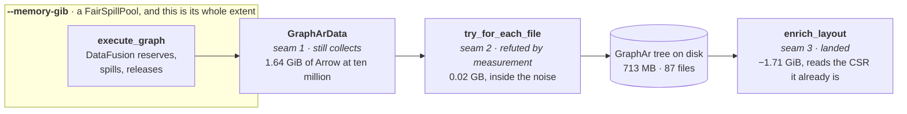

"Efficient" is a comparison. **Larger than RAM is a guarantee**: exceeding the machine is a slower
run, not a failed one, and the corpus that comes out is the same corpus. Two mechanisms produce it
and neither suffices alone. **A budget bounds the operators inside the pool** — they reserve before
they allocate and spill when told no. **A stream bounds everything outside it** — a batch arrives, is
transformed, is handed on and is dropped, so peak memory follows the working set and not the corpus.
A boundary that holds a whole value is memory the pool never sees, and the process dies with the
budget honoured. One mechanism, two halves, one page.

## The budget encloses the executor, and nothing after it



The box is the finding. `enrich_written_layout` takes the run's `memory_bytes` and discards it —
`let _ = memory_bytes;`, with a comment saying there is nothing left to cap and nothing enforcing the
budget either. The run's peak is the pool's cap plus what the three stages outside the box add;
[one engine](/docs/design/one-engine) tables the cost of the last of them. A probe settled that, not
an argument: four explanations for seventeen gigabytes were each killed by a number, and **RSS was
already 14.61 GiB when `enrich_layout` ran its first statement.**

## A budget is a protocol, not a flag

*Try, and die if it does not fit* is not a mode any serious engine offers. DataFusion, DuckDB and
Velox all implement one shape — **the operator reserves before it allocates and knows what to do when
told no** — and a pool without a temporary directory beside it turns a slow job into a failed one at
exactly the size it was meant to help.

**A budget only means something if the operators can honour it.** The first 4 GiB run died and
`TrackConsumersPool` named the culprit:

```text
HashJoinInput[8]#125(can spill: false) consumed 387.7 MB, peak 387.7 MB,
HashJoinInput[9]#126(can spill: false) consumed 291.9 MB, peak 291.9 MB,
…five of them, on a ten-core machine: one reservation per partition
```

A hash join's build side declares `can spill: false`; told it may not allocate it has nothing to give
back, so it dies. A sort-merge join spills. `bounded_context` therefore clears
`datafusion.optimizer.prefer_hash_join` alongside the pool: a plan free to pick an operator that
cannot obey is a budget in name.

**The floor belongs to the machine, not the corpus.** Each sort partition reserves
`sort_spill_reservation_bytes` (10 MB) and declares it non-spillable, so the smallest viable pool
grows with `target_partitions`. On ten cores, 384 MiB dies with five `ExternalSorterMerge` holding
10 MB each; 480 MiB runs and spills, and it still spills at 2 GiB. A hundred-megabyte budget is not
viable at any corpus size.

So `crates/fossil-df/tests/spill.rs` asks for 64 MiB *per core*.
`a_ridiculous_budget_spills_and_writes_the_same_corpus` writes one corpus twice, once unbounded as a
control and once under the budget; the bounded run must open a spill directory and the two trees must
come out byte-identical. The control is what makes it evidence — the default pool has no disk manager
and cannot spill. It measures no RSS, so nothing below this line is in CI, and widening it is not
cheap: spill files are deleted when the job ends and per-plan metrics do not outlive the execution.

## The numbers, at ten million vertices

| ten million | unbounded | 4 GiB + sort-merge |
| --- | --- | --- |
| RSS after `execute_graph` | 15.68 GiB | **5.56 GiB** |
| RSS entering `enrich_layout` | 16.51 GiB | **6.82 GiB** |
| process peak | ~21 GiB | **9.87 GiB** |
| wall clock | 256.3 s | 290.9 s |

Eleven gigabytes off the peak for 13% more wall clock, corpus byte-identical across 87 files. Then
the layout stopped asking for two more (`97efc79`):

| ten million, 4 GiB budget | before | with the CSR |
| --- | --- | --- |
| `community_hierarchy` | +2.09 GiB · 135.0 s | **+0.08 GiB** · 168.0 s |
| process peak | 10.10 GiB | **8.39 GiB** |

−1.71 GiB against the ≈ −1.7 GB predicted before it was attempted. The `community_hierarchy` row is
the finding: the step cost +2.09 GiB because it built the CSR on entry, and the CSR already exists
now. **The memory did not move somewhere else — it stopped being asked for.** The peak still grows
with N, which is the gap to the direction above: on the pre-CSR binary under the same budget, ten
times the corpus cost 4.1× the peak (2.43 → 9.87 GiB) and 10.3× the retained Arrow (0.16 → 1.64).

<Callout title="Two baselines, 0.23 GiB apart, and that is the resolution">
The first table puts the pre-CSR peak at 9.87 GiB; the second measures the same binary at 10.10. Two
runs of one build, on a machine other agents were also using. Nothing reconciles them and nothing
should — **the spread between two identical runs is about 0.2 GiB, and no number on this page is
finer than that.** It is also why seam 2 below reads as no result at all.

The wall clock moved the wrong way, 135 s to 168 s, and that is not clean either: the same previous
binary measured 151 s on another pass. Walking two arrays per vertex instead of one has a locality
cost that is structural, and it is owed a measurement on a quiet machine before anybody calls it free.
</Callout>

## Three seams, named on the same reasoning

DataFusion already streams — it hands `RecordBatch`es out lazily and its operators reserve, spill and
release against the pool. The unbounded half of the write path is the seams we wrote around it. **The
three did not end the same way**, and the difference is the useful part.

### 1. `GraphArData` holds every batch — still true

`crates/fossil-df/src/lib.rs:406` collects each vertex projection before registering it as a
`MemTable`, and both edge orientations are collected beside them, so the whole materialised graph is
resident before the writer is called. 0.16 GiB of Arrow at one million, **1.64 at ten** — 10.3× for
10×, exactly linear. The count is hand-run: if the value became a stream tomorrow no assertion would
notice.

From the row counts and the Arrow width, 71,024,690 edges in two orientations of two `u32`s is
1.06 GiB, so the edges are about 65% of the boundary, and a fix is asymmetric. **The vertex half
cannot be streamed away**: the edge phase joins against every vertex type registered as a `MemTable`,
and those are the same Arrow buffers the boundary holds, not a second copy — which is why dropping
the `SessionContext` before encoding frees 0.00 GiB. **The edge half is pinned by nothing**: no
`register_batches` call sees it, its only reader is the encoder, and it holds the bytes.

<Callout type="warn" title="A hypothesis with a shape, and what would say it is right">
**No part of that fix has been attempted, so nothing about its cost has been measured.** Seam 2 was
*refuted* by the probe after exactly this kind of reasoning, and seam 3 went the wrong way by seven
gigabytes while three parity tests stayed green. So it is written in the register it has earned.
**Reasoned:** the 65/35 split, and that the two halves are pinned differently — one from arithmetic,
one from the code. **Unknown:** whether streaming the edge half moves the peak at all, and by how
much.

`FOSSIL_MEM_PROBE=1` on the ten-million corpus, before and after, is the acceptance criterion, and
both numbers are owed: the Arrow count at the boundary *and* the process peak. It is written down so
the next attempt starts from something sharper than *the boundary holds a value*.
</Callout>

### 2. `to_files()` encoded every file first — measured, and refuted

`try_for_each_file` builds each file, hands it over and drops it before the next; `to_files()` is
that with a `Vec` on the end, kept for the browser host, which genuinely needs a list. **Peak RSS at
ten million moved from 10.60 GB to 10.58 GB.** Two identical runs differ by more than that, so the
number is not small: it is absent. The +0.58 GiB the probe bills to the encode phase is the encoder's
working memory — the output is 713 MB across six files, so holding six of them was never that figure.

The change stayed, and the reason has to be stated separately from the number, because mixing them is
how a refuted hypothesis quietly survives: holding N files in order to write them one at a time has
**no reader on that path**. Indefensible per file, and saying so is not saying it saved megabytes.

### 3. The layout read the whole edge list — landed 2026-08-05

`enrich_layout` reads both adjacency Parquet files **as the CSR they already are**, one
`RecordBatch` at a time, the two columns arriving as the `u32` slices `CsrBuilder::push` wants; no row
is ever a Rust tuple. Gone with it: a `Vec<(u32, u32)>` of every edge (568 MB at ten million), a
degree-counting pre-pass, and an 80 MB cloned cursor scattering random writes over the 568.

**None of the three was asked for by the algorithm.** `local_moving` is a sequential CSR scan whose
only random access is `community[u]`, which is O(n), and the files have been sorted since they were
written — `by_source.parquet` has zero out-of-order rows by `src_dense` across 71,024,690, and
`by_target.parquet` likewise by `dst_dense`. All three existed because of a type.
`Weighted::from_edges(vertex_count, edges: &[(u32, u32)])` takes an unordered bag, so the ordering the
file already had could not pass through it. **A parameter that is an adjacency cannot need a counting
pass, because the type already asserts what the pass would establish.** The type at a boundary is
what decides whether the next stage may be lazy.

The same change had been implemented in full the day before, over `duckdb-rs`. It compiled, the three
parity tests in `crates/fossil-layout/tests/layout_renumber.rs` passed untouched, and the process peak
went from 17.0 GiB to **24.4**:

| API | what it does |
| --- | --- |
| `Statement::query_map` | materialises the entire result. What was used, and what regressed |
| `Statement::stream_arrow` | `execute_streaming` + `ArrowStream`, one `RecordBatch` per step |

Two open statements were two full result sets resident where one `Vec` had been: one copy traded for
two. **The definition of done was wrong** — three green parity tests did not see a seven-gigabyte
regression, because they checked the result was correct when the cost *was the entire objective*. The
redone change carried the probe in its acceptance criteria, which is why it is here as a result and
not a second revert.

## The state an algorithm genuinely needs

Streaming everything is not achievable, and pretending otherwise is how a guarantee becomes a slogan.
The honest answer is a bounded working set, and each step of the layout pass bounds a different one:

| step | state it needs | how it is bounded |
| --- | --- | --- |
| connected components by union-find | one entry per vertex, O(V) | intrinsic, but edges are consumed in sequence and never resident |
| placement by the golden angle (phyllotaxis) | a counter | closed-form in the index: no neighbourhood, no iteration, nothing to stream |
| ordering by Morton code | the sort | arithmetic per point, and a sort is the operator class that spills |

**wasm32 has roughly four gigabytes of address space and nowhere to spill**, so a browser tab cannot
make this promise — cannot, the way a machine with no disk cannot promise durability. It lives in the
layer that has a disk, which is what [three hosts](/docs/design/three-hosts) is about. The obligation
is one line: **a new stage in the write path declares what it holds.** "A batch" composes with the
budget; "all of it" makes the budget stop being a promise downstream, and needs a different
interface, not a bigger machine.
