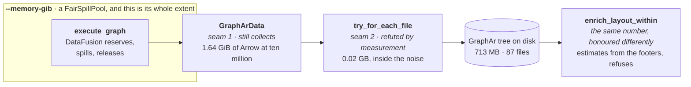

"Efficient" is a comparison. **Larger than RAM is a guarantee**: exceeding the machine is a slower
run, not a failed one, and the corpus that comes out is the same corpus. Two mechanisms produce it
and neither suffices alone. **A budget bounds the operators inside the pool** — they reserve before
they allocate and spill when told no. **A stream bounds everything outside it** — a batch arrives, is
transformed, is handed on and is dropped, so peak memory follows the working set and not the corpus.
A boundary that holds a whole value is memory the pool never sees, and the process dies with the
budget honoured. One mechanism, two halves, one page.

## The budget encloses the executor, and the layout refuses



The box used to be the whole finding. `enrich_written_layout` took the run's `memory_bytes` and
wrote `let _ = memory_bytes;`, with a comment saying there was nothing left to cap and nothing
enforcing the budget either — and at ten million vertices a declared 4 GiB run peaked at 8.39 GiB.
**A bound overshot by more than double is worse than no bound**, because the person who declared it
stopped worrying. A probe settled where it went, not an argument: four explanations for seventeen
gigabytes were each killed by a number, and **RSS was already 14.61 GiB when `enrich_layout` ran its
first statement.**

The number reaches the second half now, and the two halves honour it differently because only one of
them can. The executor reserves against a pool and **spills**. The layout pass holds Rust `Vec`s
with no disk manager under them, so it **refuses**: `estimated_peak_bytes` over three numbers out of
the staged Parquet footers — rows, adjacency rows, uncompressed vertex bytes — checked before a
single column chunk is decoded. Over budget is an error at second zero and a corpus left exactly as
the writer staged it, instead of an out-of-memory at second two hundred.

<Callout title="A refusal is not the same promise as a spill, and the page should not blur them">
This is not larger-than-RAM for the layout pass. It is a declaration that has stopped being a lie:
`--memory-gib 4` at ten million now *says so* rather than quietly using 8.39 GiB. What it buys is
that the number means something; what it does not buy is the run.

**The budget never changes what the pass writes**, only whether it runs, and that is structural
rather than cautious. `fossil run` and the playground tab write the same tree byte for byte through
one `LayoutIo`, and only one of them has a flag to declare a budget with — so a budget that degraded
the output would make the two paths disagree exactly when somebody declared one.
`crates/fossil-layout/tests/budget.rs` runs one staged corpus twice, once unbounded and once under a
budget, and compares every byte of every file.
</Callout>

## A budget is a protocol, not a flag

*Try, and die if it does not fit* is not a mode any serious engine offers. DataFusion, DuckDB and
Velox all implement one shape — **the operator reserves before it allocates and knows what to do when
told no** — and a pool without a temporary directory beside it turns a slow job into a failed one at
exactly the size it was meant to help.

**A budget only means something if the operators can honour it.** The first 4 GiB run died and
`TrackConsumersPool` named the culprit:

```text
HashJoinInput[8]#125(can spill: false) consumed 387.7 MB, peak 387.7 MB,
HashJoinInput[9]#126(can spill: false) consumed 291.9 MB, peak 291.9 MB,
…five of them, on a ten-core machine: one reservation per partition
```

A hash join's build side declares `can spill: false`; told it may not allocate it has nothing to give
back, so it dies. A sort-merge join spills. `bounded_context` therefore clears
`datafusion.optimizer.prefer_hash_join` alongside the pool: a plan free to pick an operator that
cannot obey is a budget in name.

**The floor belongs to the machine, not the corpus.** Each sort partition reserves
`sort_spill_reservation_bytes` (10 MB) and declares it non-spillable, so the smallest viable pool
grows with `target_partitions`. On ten cores, 384 MiB dies with five `ExternalSorterMerge` holding
10 MB each; 480 MiB runs and spills, and it still spills at 2 GiB. A hundred-megabyte budget is not
viable at any corpus size.

So `crates/fossil-df/tests/spill.rs` asks for 64 MiB *per core*.
`a_ridiculous_budget_spills_and_writes_the_same_corpus` writes one corpus twice, once unbounded as a
control and once under the budget; the bounded run must open a spill directory and the two trees must
come out byte-identical. The control is what makes it evidence — the default pool has no disk manager
and cannot spill. It measures no RSS, so nothing below this line is in CI, and widening it is not
cheap: spill files are deleted when the job ends and per-plan metrics do not outlive the execution.

## The numbers, at ten million vertices

| ten million | unbounded | 4 GiB + sort-merge |
| --- | --- | --- |
| RSS after `execute_graph` | 15.68 GiB | **5.56 GiB** |
| RSS entering `enrich_layout` | 16.51 GiB | **6.82 GiB** |
| process peak | ~21 GiB | **9.87 GiB** |
| wall clock | 256.3 s | 290.9 s |

Eleven gigabytes off the peak for 13% more wall clock, corpus byte-identical across 87 files. Then
the layout stopped asking for two more (`97efc79`):

| ten million, 4 GiB budget | before | with the CSR |
| --- | --- | --- |
| `community_hierarchy` | +2.09 GiB · 135.0 s | **+0.08 GiB** · 168.0 s |
| process peak | 10.10 GiB | **8.39 GiB** |

−1.71 GiB against the ≈ −1.7 GB predicted before it was attempted, and the peak falling to 8.39 GiB
is the result. **The reading drawn from the `community_hierarchy` row is not**: measured on its own
through `examples/enrich_memory`, the same post-CSR path bills that step 0.41 GiB per million
vertices, linear, and three to five times every other phase in the pass. An RSS delta only sees a
phase that makes the process ask the OS for more, and by the time the layout runs there are
gigabytes of freed pages in hand. The step did not stop asking; it stopped showing. See
[the cost model](/docs/design/cost). The peak still grows
with N, which is the gap to the direction above: on the pre-CSR binary under the same budget, ten
times the corpus cost 4.1× the peak (2.43 → 9.87 GiB) and 10.3× the retained Arrow (0.16 → 1.64).

<Callout title="Two baselines, 0.23 GiB apart, and that is the resolution">
The first table puts the pre-CSR peak at 9.87 GiB; the second measures the same binary at 10.10. Two
runs of one build, on a machine other agents were also using. Nothing reconciles them and nothing
should — **the spread between two identical runs is about 0.2 GiB, and no number on this page is
finer than that.** It is also why seam 2 below reads as no result at all.

The wall clock moved the wrong way, 135 s to 168 s, and that is not clean either: the same previous
binary measured 151 s on another pass. Walking two arrays per vertex instead of one has a locality
cost that is structural, and it is owed a measurement on a quiet machine before anybody calls it free.
</Callout>

### Reproduced, and what the budget is calibrated on

The layout pass on its own, `FOSSIL_MEM_PROBE=1 … --example enrich_memory -- <N> 14`, on a Mac16,8 —
14 cores, 48 GiB, macOS 25.2.0 — 2026-08-27:

| N | vertex Parquet | process peak | at `start` | **the pass** | `community_hierarchy` |
| --- | --- | --- | --- | --- | --- |
| 2,000,000 | 235.87 MB | 2.09 GiB | 0.50 GiB | 1.59 GiB | +0.83 GiB · 34.0 s |
| 10,000,000 | 1,187.75 MB | 8.82 GiB | 1.33 GiB | 7.49 GiB | **+3.91 GiB · 225.7 s** |

The ten-million row is the same measurement `examples/compaction_pass` records as 8.47 GiB, on a
quieter machine and 0.35 GiB apart — which is a little outside the 0.2 GiB two runs of one build
differ by, and not far outside. **Nothing on this page is finer than that spread.**

What the reproduction settles is the shape rather than the digit. `community_hierarchy` is **+3.91
GiB of the pass's 7.49**, more than every other phase put together, and 225.7 s of its 244.3 —
Louvain rules, and the Morton half of the pass is `morton codes + ranks` at +0.07 GiB. So the budget
is calibrated where the memory is: `ADJACENCY_ROW_BYTES` is 48, of which ten are the CSR entry and
the final remap and **thirty-eight are Louvain and are not explained by anything in the file**.
`community_hierarchy` holds `community`, `totals` and `levels[0]` — 160 MB at ten million — and
transiently asks the OS for four gigabytes it never gives back.

<Callout type="warn" title="One hypothesis about that residue, tested and refuted">
`local_moving` allocates a `HashMap` and a candidate `Vec` **per vertex per sweep** — a few hundred
million transient allocations at ten million — which is the obvious reading of a step that bills
3.91 GiB while holding 160 MB. Replacing both with one sparse accumulator reused across every vertex
(`Vec<f64>` of weights, `Vec<bool>` of occupancy, a `touched` list to clear them) was implemented and
gives **bit-identical output**, by construction: the same accumulation order, the same ascending
tie-break.

It went the other way. Louvain **225.7 s → 126.2 s**, a 1.78× that the pass badly wants; process peak
**8.82 → 9.20 GiB**, reproduced *exactly* across two runs, against 90 MB of arrays added. It costs
0.38 GiB of the one quantity `--memory-gib` exists to bound, to buy wall clock that was not the
objective, so it is not in the tree — it is in [discarded](/docs/design/discarded) with what would
bring it back. **The residue is still unexplained**, and the cheapest next probe is a level-zero
pass that keeps only `community[u]`, which [the cost model](/docs/design/cost) already argues for on
different grounds.
</Callout>

<Callout type="warn" title="The composition is not closed, and this is the honest edge of the claim">
One declared number is spent **twice** — once by the executor's pool, once by the layout pass — and
neither half knows what the other took. `--memory-gib 4` therefore bounds a write path at something
closer to eight than to four, and what has changed is that the second four is now *checked* rather
than unbounded. Closing it means the layout being told what the executor left resident, which is a
number nothing currently carries across the seam.
</Callout>

## The pass takes a filesystem it does not own

The layout pass is arithmetic over Arrow — Louvain, a Morton renumbering, a gather, one sort — and
only eight functions of it were ever about files. Every one of those was `std::fs`, which is the
single reason a crate declaring `[package.metadata.fossil] wasm = true` could not actually run in a
browser: it compiled for `wasm32` and then had nothing to open. `LayoutIo` is the narrowest seam that
fixes it — **open a URL for reading, create one for writing, ensure a prefix exists** — with
`LocalFs` behind it natively and `MemoryFs` for a tab.

**Handing the pass bytes instead of a filesystem was the obvious alternative, and it makes the native
path worse to buy the browser path nothing.** A `Vec<(String, Vec<u8>)>` in and one back forces every
input file resident before the pass starts and every output file resident until it ends, on a host
that has a filesystem and needs neither. The vertex read is already the memory peak of the whole
write path, so that is the half a byte-slice interface would double down on:

| measured 2026-08-22, one million vertices and ten million edges | no budget | `--memory-gib 2` |
| --- | --- | --- |
| `execute_graph` peak | 7.42 G | 2.21 G |
| layout entry → peak | 7.93 → 9.25 G | 2.80 → **4.80 G** |
| what the layout adds | +1.32 G | +2.00 G |

And it is the **vertex read and the gather, not the edge sort**: `read vertices` is +0.95 G and
`gather + replace` +0.51 G under the cap, while `remap adjacencies + write edge tiles` is +0.17 G in
1.9 s. So `LocalFs` streams through `File` exactly as the code did before the module existed, and the
browser pays the resident cost because in a browser there is nothing else to pay.

Below the trait the dispatch inverts: `LayoutIo` is a `&dyn` the pass takes once, while `Source` and
`Sink` are enums, because `parquet` puts the reader and the writer in hot loops and that is where the
indirection would be paid per call rather than per run.

## Three seams, named on the same reasoning

DataFusion already streams — it hands `RecordBatch`es out lazily and its operators reserve, spill and
release against the pool. The unbounded half of the write path is the seams we wrote around it. **The
three did not end the same way**, and the difference is the useful part.

### 1. `GraphArData` holds every batch — still true

`crates/fossil-df/src/lib.rs:406` collects each vertex projection before registering it as a
`MemTable`, and both edge orientations are collected beside them, so the whole materialised graph is
resident before the writer is called. 0.16 GiB of Arrow at one million, **1.64 at ten** — 10.3× for
10×, exactly linear. The count is hand-run: if the value became a stream tomorrow no assertion would
notice.

From the row counts and the Arrow width, 71,024,690 edges in two orientations of two `u32`s is
1.06 GiB, so the edges are about 65% of the boundary, and a fix is asymmetric. **The vertex half
cannot be streamed away**: the edge phase joins against every vertex type registered as a `MemTable`,
and those are the same Arrow buffers the boundary holds, not a second copy — which is why dropping
the `SessionContext` before encoding frees 0.00 GiB. **The edge half is pinned by nothing**: no
`register_batches` call sees it, its only reader is the encoder, and it holds the bytes.

<Callout type="warn" title="A hypothesis with a shape, and what would say it is right">
**No part of that fix has been attempted, so nothing about its cost has been measured.** Seam 2 was
*refuted* by the probe after exactly this kind of reasoning, and seam 3 went the wrong way by seven
gigabytes while three parity tests stayed green. So it is written in the register it has earned.
**Reasoned:** the 65/35 split, and that the two halves are pinned differently — one from arithmetic,
one from the code. **Unknown:** whether streaming the edge half moves the peak at all, and by how
much.

`FOSSIL_MEM_PROBE=1` on the ten-million corpus, before and after, is the acceptance criterion, and
both numbers are owed: the Arrow count at the boundary *and* the process peak. It is written down so
the next attempt starts from something sharper than *the boundary holds a value*.
</Callout>

### 2. `to_files()` encoded every file first — measured, and refuted

`try_for_each_file` builds each file, hands it over and drops it before the next; `to_files()` is
that with a `Vec` on the end, kept for the browser host, which genuinely needs a list. **Peak RSS at
ten million moved from 10.60 GB to 10.58 GB.** Two identical runs differ by more than that, so the
number is not small: it is absent. The +0.58 GiB the probe bills to the encode phase is the encoder's
working memory — the output is 713 MB across six files, so holding six of them was never that figure.

The change stayed, and the reason has to be stated separately from the number, because mixing them is
how a refuted hypothesis quietly survives: holding N files in order to write them one at a time has
**no reader on that path**. Indefensible per file, and saying so is not saying it saved megabytes.

### 3. The layout read the whole edge list — landed 2026-08-05

`enrich_layout` reads both adjacency Parquet files **as the CSR they already are**, one
`RecordBatch` at a time, the two columns arriving as the `u32` slices `CsrBuilder::push` wants; no row
is ever a Rust tuple. Gone with it: a `Vec<(u32, u32)>` of every edge (568 MB at ten million), a
degree-counting pre-pass, and an 80 MB cloned cursor scattering random writes over the 568.

**None of the three was asked for by the algorithm.** `local_moving` is a sequential CSR scan whose
only random access is `community[u]`, which is O(n), and the files have been sorted since they were
written — `by_source.parquet` has zero out-of-order rows by `src_dense` across 71,024,690, and
`by_target.parquet` likewise by `dst_dense`. All three existed because of a type.
`Weighted::from_edges(vertex_count, edges: &[(u32, u32)])` takes an unordered bag, so the ordering the
file already had could not pass through it. **A parameter that is an adjacency cannot need a counting
pass, because the type already asserts what the pass would establish.** The type at a boundary is
what decides whether the next stage may be lazy.

The same change had been implemented in full the day before, over `duckdb-rs`. It compiled, the three
parity tests in `crates/fossil-layout/tests/layout_renumber.rs` passed untouched, and the process peak
went from 17.0 GiB to **24.4**:

| API | what it does |
| --- | --- |
| `Statement::query_map` | materialises the entire result. What was used, and what regressed |
| `Statement::stream_arrow` | `execute_streaming` + `ArrowStream`, one `RecordBatch` per step |

Two open statements were two full result sets resident where one `Vec` had been: one copy traded for
two. **The definition of done was wrong** — three green parity tests did not see a seven-gigabyte
regression, because they checked the result was correct when the cost *was the entire objective*. The
redone change carried the probe in its acceptance criteria, which is why it is here as a result and
not a second revert.

## The state an algorithm genuinely needs

Streaming everything is not achievable, and pretending otherwise is how a guarantee becomes a slogan.
The honest answer is a bounded working set, and each step of the layout pass bounds a different one:

| step | state it needs | how it is bounded |
| --- | --- | --- |
| connected components by union-find | one entry per vertex, O(V) | intrinsic, but edges are consumed in sequence and never resident |
| placement by the golden angle (phyllotaxis) | a counter | closed-form in the index: no neighbourhood, no iteration, nothing to stream |
| ordering by Morton code | the sort | arithmetic per point, and a sort is the operator class that spills |

**wasm32 has roughly four gigabytes of address space and nowhere to spill**, so a browser tab cannot
make this promise — cannot, the way a machine with no disk cannot promise durability. It lives in the
layer that has a disk, which is what [three hosts](/docs/design/three-hosts) is about. The obligation
is one line: **a new stage in the write path declares what it holds.** "A batch" composes with the
budget; "all of it" makes the budget stop being a promise downstream, and needs a different
interface, not a bigger machine.
