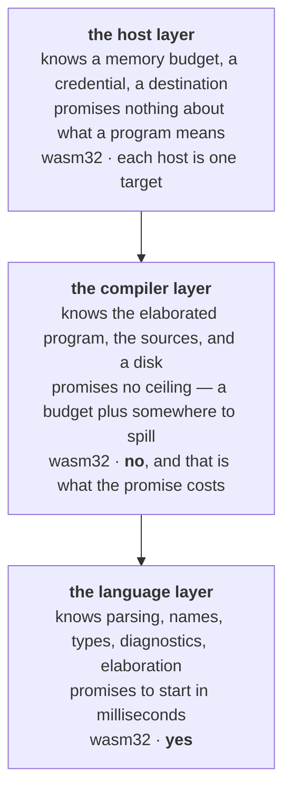

fossil is designed to be embedded. Three destinations have to work, and they are not variations of
one another: a **native command**, run from a terminal or a job scheduler; **wasm in a browser**,
where the editor and the checker live next to the person typing; and a **product embedding it**,
which supplies credentials, storage and a job lifecycle and wants the language to be a component
rather than a subprocess it has to understand.

Add the promise that a corpus has [no ceiling on its size](/docs/design/streaming) and the four
requirements contradict each other — but only under one reading. If "this destination works" means
*run the whole engine here*, then the browser must be larger-than-RAM, and it cannot be: wasm32 has
roughly four gigabytes of address space and nowhere to spill. So the destinations are not
configurations of one program. The code is cut by **where it runs**, and each layer gets a different
promise.

*No ceiling* lives in the middle box and only there, because a budget plus spill needs somewhere to
spill to — which is exactly why it must not live in a layer the browser shares. The top box holds
**inputs of a command**, not properties of a language: nobody thinks a program means something
different because it was given more memory. And the bottom box depends on no execution engine, the
single negative fact that buys both of its positive ones — the checker in a browser tab is the same
checker, not a reduced imitation. Gluon is the model, for a reason more specific than admiration:
being embedded in a host application is its whole problem statement.
[The architecture](/docs/architecture) is the shape this argument produces.

One boundary here is a threat model rather than a preference, and it looks mergeable. Resolving a
source path can require credentials, and **credential material is deliberately kept off the wasm
boundary**, so `fossil-resolver` refuses to compile to wasm by construction; merging it into the
layer that must compile to wasm would break the browser target *and* put credential handling inside
the browser. The proposal to merge came from two header comments that both, accurately, described
their file as a host-injection seam. The constraint was elsewhere, in a `cfg`.

> **Do not read prose where there was a checkable constraint.** A dependency query, a search for a
> compile-time refusal, or a build against the target answers in seconds a question that prose
> answers confidently and wrongly.

## The test for the host boundary

The host owns credentials, storage, job lifecycle, multi-tenancy and its own interface. fossil owns
*what this program computes and what it produces*. One criterion decides every case between them:

> **Anything in the host that re-parses, re-derives or re-models the language's own knowledge is a
> boundary violation.** And a program whose meaning — which graph it produces — changes with an
> external flag is not self-contained; the definition of the output belongs **in** the program, next
> to its sources and its transformations.

It is productive because it turns architecture arguments into deletions. A host that walks the
compiler's intermediate representation to summarise a pipeline is re-deriving what the compiler
already knows, and the repair is not a better walker: it is the compiler emitting a description and
the walker going away. The general shape is that **the logic has one home and the host injects the
data plane**, at which point "should the schema read happen in the browser or on the server" is
answered by what the host passes in.

## One implementation, and one wire

If the embedding host is a browser, a capability only a native binary can perform is a capability the
product cannot reach. So the direction is that **every capability has one implementation, in a crate
that compiles to `wasm32`, and each host is a transport over it** — the command line, the language
server, the wasm shim and the machine-facing server are projections, and none of them is the API.
`cargo xtask wasm-check` derives that set from the cdylib crates plus any crate declaring
`[package.metadata.fossil] wasm = true`, and the compile→run pipeline is inside it. Its size is
deliberately not written here; this page carried a count once and it was stale by the next reading.

Sharing an implementation is only half the promise, and the other half was learned by measuring two
exports built precisely to be one capability in two hosts: `serde_json` and `serde_wasm_bindgen`
disagree about an absent optional field, and neither host's test could see it, because each asserts
on its own side of the wire.

> **Two hosts that share a function still disagree if they serialize it differently.** One
> implementation guarantees one *answer*, not one *wire* — so a capability offered to two hosts owes
> a test that crosses each host's wire rather than each host's function.

Where an implementation genuinely cannot be shared,
`packages/introspect/tests/rust-parity.test.ts` is the shape of the guard: it derives its tables from
the Rust rather than restating any value, so a rewritten crate fails it instead of quietly matching
nothing.

## An open question this page does not settle

Whether the *server* of a product embedding fossil is a host in its own right, or the browser host
wearing a server's clothes, is left open. It owns credentials, storage, job lifecycle and
multi-tenancy — exactly the list assigned to the host layer — and none of that runs in a tab. Against
that: keasy's server spawns no fossil binary and its images declare themselves free of one, so every
capability it exposes is computed in the browser and the server only stores the result, which makes
it a data plane and makes the tab the host.

Settling it decides something concrete, which is why it is worth leaving until someone means to
decide it: if the server is a host, it is owed a surface of its own, and today it links one Rust type
and consumes the rest as TypeScript.

Which units of code sit in which layer is deliberately absent: that is a fact about the tree, and a
list of it printed here would be wrong before it was useful.
