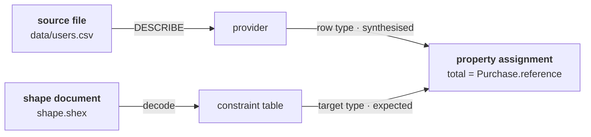

fossil is RML with a type system. RML validates the graph **after** producing it, when the error
already costs a full regeneration over a source that may have millions of rows, and everything
fossil offers over RML is the part that happens before that. So "if it compiles, it is correct in
its types" is worth saying only if both halves are precise: what compiling rules out, and what it
leaves open.

## Checking runs in two directions

Information about a mapping arrives from two documents, and neither one is the program. There is
nowhere in a program to write a type.

**Forward, from the source.** `User := io.csv("data/users.csv")` gives `User` a row type whose
fields are the columns of the file, with the types the file has, and every expression in the body is
synthesised from it. That row type comes from the file itself: one
`DESCRIBE SELECT * FROM read_csv_auto(…)` per binding, run by the native host before the compiler
exists (`crates/fossil-introspect/src/lib.rs:320`) and cached per source. The programs are small and
the sources are large, so it is the only step of a compile that costs real time.

**Backward, from the shape.** `Users : Person from Adults` names the type the body must produce.
`Person` is a constraint table — a predicate, a kind of value and a count, per property — read out
of the document the program names (`crates/fossil-hir/src/shapes.rs:529`). Which schema language
that document is written in is settled, and it is neither: a ShEx decoder and a SHACL decoder lower
into one format-neutral vocabulary and the checker reads that and nothing else, argued on
[the shapes page](/docs/design/shapes).

Neither direction is a fallback for the other, and the split is what makes the error message good:
at every property assignment the checker holds a synthesised type and an expected one and knows the
origin of each, so a mismatch names two places.

<Program src="errors/wrong-type/expected/diagnostic.txt" title="fossil check program.fossil" />

A single-direction checker cannot write that. Working forward only, it does not know what was
expected; working backward only, it does not know what arrived.

## The three failures a compile rules out

### A field that is not in the source

The provider generated `User` from the file, so the compiler knows its columns exactly. A name that
is not among them is a typo with a location, refused by `resolve_predicate`
(`crates/fossil-hir/src/check.rs:473`).

<Program src="errors/unknown-field/expected/diagnostic.txt" title="fossil check program.fossil" />

Notice *where* the suggestion searched: among the members of `User`, not among every name in the
program — a property of [the dot meaning member-of](/docs/design/the-dot), not of the diagnostic.

### A value whose type the shape will not accept

The shape declares what kind of value a predicate carries; the source declares what kind a column
holds. `compatible` (`crates/fossil-hir/src/check.rs:907`) checks them where they meet, before the
graph exists. That is the `wrong-type` diagnostic above, and the fix is in the message — a parsing
function from the standard library — because the checker knows both types and can say which
conversion closes the gap.

### A cardinality the shape requires that the mapping does not supply

A constraint table carries counts, not just kinds, so a property the shape requires and the body
never writes is knowable from the program alone — `check_required_properties`
(`crates/fossil-hir/src/check.rs:598`):

<Program src="errors/missing-property/expected/diagnostic.txt" title="fossil check program.fossil" />

`shop:phone` is also declared and also absent, and it is *not* an error, because the shape says it
is optional. A contract that could not tell "one" from "zero or one" would not be a contract.

A fourth failure is of the same family but is not about a single property, and it has [its own
page](/docs/design/identity): two mappings that mint different identities for one type. It is
affordable because a program is checked as a whole — no separate compilation, no unit checked
against a declaration written elsewhere — which is also why a type error can be attributed to a
place rather than to a stage.

## What a compile does not promise

Stating this badly is how a type system loses the trust it earned. Three things, plainly.

**The source's *contents*.** A column typed `Integer` is a column the file presents as integral; a
row that turns out to hold something else is a data error, and it surfaces when the data is read.
Static typing here bounds the *program*, not the world.

**That the graph is semantically right.** Nothing checks that the customer's name went to
`shop:name` and not to `shop:email`. Both are strings, both satisfy the shape, and only one is true.

**Anything about a document you did not name.** A graph can be type-correct against one shape and
violate another, and fossil is not the arbiter of which shape a consumer downstream expects.

<Callout title="Deliberately absent">
No user type annotations. No global inference either, and "inferred" on the tin could mislead: both
ends are known before checking starts, so there is no type variable to solve for and the check is
local to one mapping. There IS subtyping, five rules wide — reflexivity, lifting to `Optional`,
covariance of `Optional` and of `Seq`, and `Integer <: Float`, all in
[the typing rules](/docs/book/typing) — and `compatible` runs them on every property.
</Callout>

## What is not settled

- **The upper bound of a cardinality.** `check_required_properties` observes a required property
  that is absent, and the property loop says in its own comment why it does not read
  `constraint.occurs` (`crates/fossil-hir/src/check.rs:450`). Nothing in the language constructs a
  multi-valued expression, so a `maxCount 1` property has nothing to reject yet; an expression that
  yields more than one value is what makes the gap reachable, and reachable is when it gets a rule.
- **What types a `join` condition.** The `on` predicate is checked for the existence of every column
  it names, under the binding that qualifies it, and for nothing else, so
  `Orders.person_id == People.person_id` with an `Integer` on one side and a `String` on the other
  compiles. The header of `crates/fossil-hir/tests/source_pipeline_row.rs` records that rather than
  an assertion, deliberately: a test pinning today's acceptance would make the gap the contract.
  What closes it — an equality between two qualified column references is an error unless the two
  types are compatible under the subtyping rules a property assignment uses — belongs to
  [the row algebra](/docs/design/algebra), above any shape and reachable by a program that names no
  shape at all. Typing the whole predicate as `Bool` is the general form, and is [not what to build
  first](/docs/design/discarded).
- **Which freshness token the descriptor cache uses.** mtime and size from one `stat` today; a host
  with a strong `ETag` writes that instead, and one that cannot cheaply tell writes `""`, which
  reads as *never fresh*. A content hash is ruled out either way: it reads the whole source to
  decide whether to read the source.
