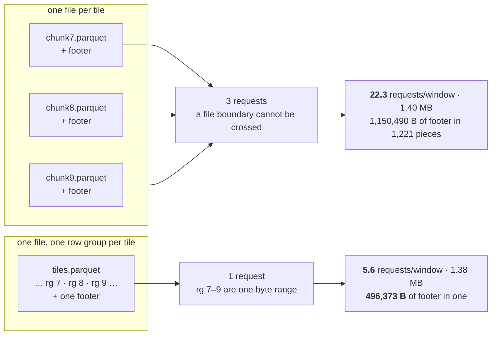

**A tile is a fixed range of 4,096 rows of `dense_id`**, and tile `i` *is* the range
`[i·4096, (i+1)·4096)`. Its address is a cut in the id:

```
   63        53        31       12 11         0
  ┌───────────────────────────────┬────────────┐
  │     tile = dense_id >> 12     │ row in tile│
  └───────────────────────────────┴────────────┘
             ▲         ▲           └ 12 bits  ┘
             │         └ 2^31 — a shift read as signed gives a negative tile
             └ 2^53 — a JavaScript Number stops being exact
```

That is the entire index: no directory to fetch, no tile tree to walk, no listing to perform. The
ancestor at level `L` is `dense_id >> (12+L)`; the lowest common ancestor of two vertices is the
common prefix of their ids, an `XOR` and a count of leading zeros. **A reader computes every URL it
wants before it emits the first request.**

The cut is a shift because `chunk_size` is a power of two. Anything else forces a division and the
two marked bits stop being positions in one diagram. `chunk_size` is a power of two or the corpus
does not have an address. Guard: `declared-tiling`.

## The order that makes an interval mean something

**`dense_id` ascends with the Morton code of the vertex's position.** The id space *is* the spatial
order. Without it `dense_id >> 12` still names a tile, and that tile holds 4,096 vertices scattered
across the whole canvas.

A rectangle over a Morton order breaks into **O(√n) contiguous segments** — a property of the curve,
not of the data. On an 8×8 quantised grid, window `x ∈ [2,5], y ∈ [1,4]` bracketed:

```
  y
  7 │ 42  43  46  47  58  59  62  63
  6 │ 40  41  44  45  56  57  60  61
  5 │ 34  35  38  39  50  51  54  55
  4 │ 32  33 [36][37][48][49] 52  53
  3 │ 10  11 [14][15][26][27] 30  31
  2 │  8   9 [12][13][24][25] 28  29
  1 │  2   3 [ 6][ 7][18][19] 22  23
  0 │  0   1   4   5  16  17  20  21
    └────────────────────────────────
       0   1   2   3   4   5   6   7  x
```

Sixteen ids, six runs, nothing over-read:
`6·7 │ 12·13·14·15 │ 18·19 │ 24·25·26·27 │ 36·37 │ 48·49`. At five million vertices a window of 20,000 is **179 runs covering exactly 20,007 ids** — 0.4% of the
corpus, zero over-read at run granularity. At tile granularity nine windows select **11–25 tiles
where 10–21 are needed: 1.10×–1.20×, mean 1.14×**.

The community hierarchy does not produce those runs: `community` is eight groups of 625,000 vertices
each broken into **5,461 runs** of `dense_id`, and `cluster_id` is 15,310 groups with a median of 1
vertex. The hierarchy gives the levels of *aggregation*; the curve gives the ranges of *bytes*.

**A new placement produces a new numbering**, so `dense_id` cannot also be the identity — that is
[the subject IRI](/docs/format/conventions/identity#the-identity-is-the-subject-iri). Positions moved
by hand are a layer on top; mutating a tile means rebuilding it.

## The arithmetic

**Quantise** each coordinate to 16 bits over the bounding box of **that vertex type's own
positions** — each type is laid out and renumbered independently. A degenerate axis maps to 0.

```
q = round(clamp((v − lo) / (hi − lo), 0, 1) × 65535)
```

<VectorTable of="quantize" />

**Interleave** the quantised coordinates into a 32-bit code, `x` in the even bits, `y` in the odd.

```
morton = spread(x) | (spread(y) << 1)
```

<VectorTable of="morton2" />

`x = 0, y = 32768` is the row that matters most: `spread(y) << 1` reaches bit 31, so in a signed
32-bit accumulator the result is negative and a port that does not coerce it back to unsigned sorts
the top half of the plane first. That corpus satisfies every count-based check ever written and
addresses nothing.

<Callout type="warn" title="The quantisation is binary32, and the width is part of the contract">
The subtraction, the division, the multiply by 65535 and the rounding are all single-precision. Two
implementations that agree on the formula and disagree on the width differ by one at the boundaries,
and one unit is a different Morton code and a different order.

`v = 147, hi = 167` is what says so: **57687 in binary32, 57686 in binary64**. The other four rows are
exact in both widths, so a table without it passes against a binary64 port — and the table is checked
to still contain a row that separates them. Both sides execute it: `guards/arithmetic.mjs` wraps
every step in `Math.fround`, and the engine asserts against the same `vectors.json` in a Rust test
rather than restating it. Neither reaches the `::FLOAT` half of the contract inside the engine's own
SQL, or the bounding box the layout derives before quantising.
</Callout>

Two guards ask different questions of the result. `morton-order` recomputes the code from the
corpus's own `x` and `y` and asserts it **never decreases** as `dense_id` increases — non-decreasing,
because two vertices can quantise to the same cell. `spatial-tiles` asks what the order was *for*,
using only the footer: the average tile's box covers at most half the corpus extent. On the fixture,
70,000 vertices in 18 tiles, Morton-ordered measures **12.4%** and the same vertices renumbered at
random measure **99%**. It separates having a spatial order from not having one, and is not a quality
target.

## Two questions, one arithmetic

| the question | the address |
| --- | --- |
| the vertices of a window | `chunk{k}.parquet` for each `k` in the window's runs of `dense_id` |
| the edges drawn in it | `by_source/tile{k}.parquet`, the same `k` — every drawable edge has its source on screen |
| the out-edges of `v` | `by_source/tile{v >> shift}.parquet`, filtered to `src_dense = v` |
| the in-edges of `v` | `by_target/tile{v >> shift}.parquet`, filtered to `dst_dense = v` |

The filenames are the file-per-tile container's; in the other one every row is
[the set's single file](#two-containers-one-address) and the `k` is what the footer is asked for.
The question, the tile and the filter are the same either way.

The last two are a **hop**, and they are why both orientations are tiled: asking the edge relation
for a neighbourhood with a recursive query
[did not return in 45 seconds](/docs/format/conventions/adjacency). Which prefix carries which
direction is declared per edge type, never conventional.

### A set of tiles says what it is complete for

The second row is complete for **drawing** and incomplete for **incidence**, and the difference is
invisible in the picture: an edge whose destination is drawn and whose source the window never
selected is in none of the `by_source` tiles. On 20M and 40M edges that is **19,892 edges per window
at degree 4 and 39,849 at degree 8**. So an answer carries which orientations it read and states
completeness only for those — `src` for the drawable set, `dst` for every edge whose destination is
in the window, both for every edge incident to it.

A missing orientation has two causes that are not one fact. *The caller did not ask* is a choice.
*The corpus does not publish it* is a property of the artefact: an edge type with no `adj_lists`
entry for a direction, or one declaring it with no `prefix`, has tiles nobody can address, and the
answer says so rather than composing a URL that 404s. And an orientation applies to a window only if
its **own `dense_id` space is that window's** — on `Author authored Paper`, `by_target` tile `k`
addresses `Paper`'s tile `k`, a different set of vertices. Guard: `declared-tiling`; conformance case
`cross-type`.

## Why the camera does not ask

Pruning cannot be expressed as a predicate. The 179 runs of a 20,000-vertex window contain **130,516
of 34,974,279 edges — 268× fewer** — and return the same 120,103 visible edges. No way of asking for
them in SQL gets that:

| how the runs are asked for | cost |
| --- | --- |
| a plain join | 5 ms |
| a range join against the runs | 237 ms |
| 179 `BETWEEN … OR …` predicates | 189 ms wall, 2.3 s CPU |

Both attempts are **slower than not pruning at all**, because DuckDB evaluates the ranges per row
instead of skipping row groups. A `WHERE` clause selects rows from a table; it does not select which
bytes get read. So the camera asks for bytes and the
[verbs](/docs/design/corpus#the-verb-surface-six-and-none-of-them-draws) answer
questions; when a filter has to change the picture it returns **ids**, and the canvas applies them as
a mask over the tiles it holds.

## Why 4,096

Served over a plain HTTP origin at five million vertices, counting every request that answers,
against an ideal payload of 0.6–0.9 MB per window that is flat in N:

| `chunk_size` | requests | bytes | vs ideal |
| --- | --- | --- | --- |
| 1,024 | 178 | 1.11 MB | 1.73× |
| **4,096** | **78** | **1.48 MB** | **2.31×** |
| 8,192 | 47 | 1.89 MB | 2.95× |
| 32,768 | 25 | 4.61 MB | 7.20× |
| 122,880 | 35 | 11.73 MB | 18.3× |

The curves have no common optimum — bytes bottom out at 1,024–2,048, requests fall monotonically — so
what chooses is `λ·β`, the bytes a link moves in the latency of one request: 32,768 in series, 8,192
with six in flight, **4,096 fully multiplexed**, which an addressed reader is by construction. The
byte curve is flat from 1,024 to 8,192, so the emitter is not tuned inside that band. 122,880 is
Pareto-dominated on both curves at once, because a 122,880-row edge tile crosses several row groups
and costs 9.4 requests.

## The footer is the index

Arithmetic says **which tiles exist**. It does not say **which tiles intersect the window**: the
`dense_id` range of a rectangle needs the Morton range, and the Morton range is what the row-group
boxes say. They live in the footer, and one request buys all of them.

```
tiles.parquet                                 5,000,000 rows
┌──────┬────────┬────────┬─────┬─────────┬────────┐
│ PAR1 │  rg 0  │  rg 1  │  …  │ rg 1220 │ footer │
└──────┴────────┴────────┴─────┴─────────┴────┬───┘
         4,096    4,096            2,880      │
          rows     rows             rows      ▼
        ┌─────────┬──────────────┬──────────────┬──────────────────────┐
        │ rg 0    │ x [min,max]  │ y [min,max]  │ dense_id 0..4095     │
        │ rg 1    │ x [min,max]  │ y [min,max]  │ dense_id 4096..8191  │
        │ …       │              │              │                      │
        │ rg 1220 │ x [min,max]  │ y [min,max]  │ dense_id 4997120..   │
        └─────────┴──────────────┴──────────────┴──────────────────────┘
          the row group ordinal is the tile is a range of dense_id
          1,221 boxes, 406 B each — a 496,373 B footer, bought once
```

That footer is **the one thing a reader holds that follows N**, and it is worth stating rather than
rounding away: one box per 4,096 vertices is a small constant, not a flat one. A reader's *queries*
are flat in N; the index it holds to answer them is N divided by the tile size.

The addressing unit and the storage unit are the same number, and a writer's default breaks that
without failing anything:

```
  the same 5,000,000 rows at a default of 1,000,000 rows per group
  ┌─────────┬─────────┬─────────┬─────────┬─────────┐  5 boxes,
  └─────────┴─────────┴─────────┴─────────┴─────────┘  nothing to prune with
```

`tile-of` checks that a row group's ordinal is its address and that it never holds more rows than a
tile. `footer-is-the-index` asserts a box for `x`, `y` and `dense_id` on every vertex row group, and
on every edge tile a box for **the endpoint column that orientation is ordered by** — `src_dense`
under `by_source`, `dst_dense` under `by_target`, never one standing in for the other. What it cannot
prove is that the statistics are **true**: a box wider than its rows costs a request, a box narrower
loses vertices, and only re-reading every page tells them apart.

Two traps. Parquet's original `min`/`max` statistics were defined by **signed** byte comparison,
meaningless for `dense_id`, so a writer that gets this right leaves them empty and fills
`min_value`/`max_value`; a reader that knows only the deprecated pair concludes the footer carries no
box for the column the whole address is built on. And the **page index** (`ColumnIndex`,
`OffsetIndex`) is 179 kB no reader here opens: it prunes *inside* a row group, and a row group is the
indivisible unit. It is the obvious reason to prefer one Parquet writer over another and it is the
wrong one.

## Two containers, one address

Which container carries a tile is a second question, and both answers are addressed by the same
arithmetic: **one file per tile**, the address in the name, or **one file with one row group per
tile**, the address as the row-group ordinal. Measured on five million vertices in 1,221 tiles:



A request is one file when a tile is a file, and a **maximal run of consecutive row groups** when it
is not. The file boundary is the only thing preventing the merge: **one file per tile costs 4× the
requests and does not save a byte.** Guard: `tile-of`, in whichever form the corpus uses.

**Which one a corpus is, it declares.** `graph.graph.yml` carries `container: files` or
`container: rowgroups`, and it applies to every payload set in the corpus — the vertex tiles, the
identity index, and each orientation of each edge type. A reader cannot work it out: working it out
means listing a directory, and there is no listing over HTTP. Absent is `files`, because a corpus
written before the field existed is that one. **fossil writes `rowgroups`**, and its file is
`tiles.parquet` in the set's own prefix, one per set; the addresses are published as vectors below.
The conformance corpus is the other one and says so, for a reason that belongs to a writer rather
than to the format — see below.

```yaml
name: graph
prefix: ''
container: rowgroups          # vertex/Person/tiles.parquet, by_source/tiles.parquet, index/tiles.parquet
```

The checker compares that declaration against what is on disk and refuses *both at once*, because
two ways to address the same rows is one too many and a reader that globs finds both. Guard:
`declared-tiling`.

### Where the ordinal is the address, and where the footer is

Row group `k` **is** tile `k` for a set whose tiles are a fixed number of rows: a vertex payload,
whose tile is exactly `chunk_size` gapless `dense_id`s, and an identity index, whose tile is a slice
of a total order. `tile-of` checks that ordinal, and it is what makes a byte-range reader's address
arithmetic rather than a lookup.

**An adjacency is not one of those**, and the difference is a property of the data rather than of the
writer. An adjacency tile is however many edges its vertices happen to have, so the boundaries do not
land on a fixed stride; and a tile whose vertices have no edges contributes no rows, so it has no row
group to be numbered. What locates it there is the general rule the fixed-stride sets satisfy by
construction: **the footer's box on the endpoint column the orientation is ordered by**, over the
tile's `dense_id` range. `tile-of` asks that orientation the question it can answer — the boxes
ascend and do not overlap, so a tile is a contiguous run of row groups.

<Callout type="warn" title="DuckDB cannot write a row group under 2,048 rows, and arrow-rs can">
Row groups come out in multiples of DuckDB's 2,048-row vector, and a smaller `ROW_GROUP_SIZE` is
clamped without a warning: 300 rows written at `ROW_GROUP_SIZE 64` come back as **one** row group of
300. So a corpus whose `chunk_size` is under 2,048 cannot be put in the row-group container by
DuckDB at all — which is why the conformance corpus, at `chunk_size` 64, is the file-per-tile one,
declares `container: files`, and the two-container comparison runs on a fixture at 4,096.

**It is a limit of that writer and not of the format**, and fossil is not that writer: `parquet`'s
`ArrowWriter` cuts a row group where it is told, and the same 300 rows at 64 come back as
`[64, 64, 64, 64, 44]`. `a_tile_can_be_smaller_than_duckdbs_vector` in `crates/fossil-df/src/files.rs`
is that measurement, and it is why the container fossil emits is not the container its own fixture
generator can produce.
</Callout>

## There is no tile tree

A tree of tiles would only earn its keep by **containing** something that does not fit in a leaf. The
one candidate was the edge that crosses tiles, and hoisting it to the deepest tile holding both
endpoints costs more than it saves by a wide margin
([Adjacency](/docs/format/conventions/adjacency#csr-not-lca)). With nothing to hoist, the interior
nodes are empty.

**The level-of-detail pyramid is not that tree either.** Zoom reads a different relation rather than
filtering one: a tile at aggregation level 3 holds super-nodes that do not exist at level 0, and each
level has its own `dense_id` space, its own Morton renumbering and its own flat tiling of 4,096 rows.
It is **`k` flat tilings**, not a tree of `k` levels.

## Encoding is chosen per column

Dictionary encoding is right for one of the four drawing columns and wrong for the others. Five
million vertices, uncompressed pages:

| | `cluster_id` | `dense_id` | `x` | `y` |
| --- | --- | --- | --- | --- |
| dictionary everywhere | 71.6 kB | 27.56 MB | 27.50 MB | 20.00 MB |
| dictionary nowhere | 20.03 MB | 20.03 MB | 20.03 MB | 20.03 MB |
| **dictionary per column** | **71.6 kB** | **20.03 MB** | **20.03 MB** | 20.03 MB |

On `dense_id` and `x` — nearly unique within a tile — the dictionary and its indices cost **37% more
than PLAIN**; on `cluster_id` it wins by **280×**. Off everywhere is worse than on everywhere (80.73
MB against 75.81 MB) because it destroys `cluster_id`; per column lands at **60.78 MB**. The corpus
mandates no encoding, only the consequence: one decision applied to every column costs a quarter of
the bytes.

The drawing tile carries geometry and nothing else: `dense_id, x, y, community` costs **3 requests
and 36.0 kB** against **4 requests and 37.0 kB** for all six columns, from 68.8 kB stored. `x` and
`y` are separate arrays, never interleaved, which is what Parquet stores anyway.

## The address is published, not described

All of the above is arithmetic over four manifest fields — `prefix`, `chunk_size`, `aligned_by` and
the adjacency's own `prefix` — and a reader that re-derives it from this page has copied a convention
no compiler compares against the corpus. Change a prefix or a shift and the copy composes URLs that
404 at runtime, in a browser, with no type error and nothing red.

A 404 is the loud half. A copy of `chunk_size` that is **too large** fails in the other direction and
says nothing at all: it names fewer tiles than the corpus has, and every name it composes is real. A
reader holding 122,880 — fossil's own earlier default, chosen when a chunk was thought to be a row
group — against a corpus written at 4,096 composes `ceil(1_000_000 / 122_880) = 9` URLs where the
corpus publishes 245. All nine resolve, because `chunk0…chunk8` are the corpus's own first nine
tiles; each holds 4,096 rows, not 122,880. The window opens `dense_id` 0..36,863, **3.7% of the
corpus**, and reports a first paint over it — a latency flattering in exact proportion to what it
skipped, with nothing red anywhere. What a reader can check is not the cause but the count: *fewer
vertices arrived than the manifest declares* is one comparison against a number the manifest already
carries. What would reverse this whole argument is fixing `chunk_size` in the specification instead
of declaring it per corpus: a copied constant could not drift, and the composition would not need the
manifest. The declared field is what buys a corpus the freedom to be addressed at the size its writer
chose, and the arithmetic above is what that freedom costs a reader who guesses instead of reading.

So the composition ships as code, in `@fossil-lang/graph`, sharing nothing with the verbs but the
manifest:

```ts
const corpus = resolveCorpus({ manifestFiles, base: '/bench/1000000' });
const { vertexUrls, edgeUrls, complete, gaps } = corpus.window({ tiles, directions: ['src'] });
```

It is **synchronous, and that is the claim** — no `fetch`, no connection, no promise. Bytes, tile
caches, debounce, supersede-cancellation and sampling stay in whatever draws. It refuses to compose
three things the manifest does not say: an orientation the corpus does not publish (`adjacency('dst')`
is `null`, never a string), a tile size that disagrees with the vertex type addressing it, and which
tiles a rectangle touches, which comes from the footer boxes.

The seam is tested by the question it exists to answer: **can a reader that is not fossil's open the
same corpus with only what fossil publishes?** `apps/corpus/conformance/reader.mjs` is that reader —
plain Node, no npm, no build. `verify.mjs` runs it against the same table of addresses the module
does; `writer.mjs` runs it against a corpus `fossil run` has just written, because the first cannot
catch two readers being wrong *together*.

## The published vectors

The arithmetic ships as a formula **and a table of vectors**, because the vectors are what gets
copied. Every value below is a border, they live in `apps/corpus/guards/vectors.json`, the guard
`published-vectors` executes that file, and these tables are rendered from it.

<VectorTable of="tile_of" />

The last three rows are the marked bits of the diagram at the top of this page. All three exceed the
width a `dense_id` column carries in any corpus that has been written, and that is why they are
published: they are where a wrong implementation is still right.

Which tile an id is in is one question; **how many tiles there are** is the other, and it is the
manifest's declared count divided the same way:

<VectorTable of="declared_count" />

`count = 4096` at `chunk_size = 4096` is the row that catches ports: that is **one** tile, and an
off-by-one addresses a `chunk1.parquet` nothing wrote. `count = 0` is the other — zero tiles, not one
empty one, and a reader that assumed at least one pays a request to be told 404. Guard:
`declared-count`.

Which tile an id is in and how many there are are both numbers. **Where a tile is** is a path, and
the container is the one field of it a reader is told rather than derives:

<VectorTable of="tile_url" />

The last row of the pair on `vertex/Person/` is the one that separates the containers: every tile of
a set is the same file, and a reader that hands the same path to `read_parquet` once per tile scans
the relation once per tile — 9,240 vertices where the window holds 1,848, exactly five times over
five tiles. Guard: `published-vectors`; harness:
`apps/corpus/conformance/containers.mjs`, which writes one graph both ways and requires every answer
to match.

## The payload format is open

**This is a design question, not a settled convention.** A tile's payload is Parquet because the
corpus is Parquet and one format is simpler than two. But a tile is read to be drawn, and drawing
wants contiguous typed arrays that upload to a GPU without decoding. **Arrow IPC gives exactly that
and Parquet does not** — Parquet's encodings are the reason its bytes are small, and decoding them is
work a drawing path pays on every tile.

What settles it is where the cost lands on a real link: Parquet moves fewer bytes and decodes them,
Arrow IPC moves more and does not, and which wins depends on the link, which a corpus does not
control. The addressing does not care — `tile = dense_id >> 12` is true of a row group, of a file and
of an IPC record batch alike. What would change is the footer: an IPC file's metadata is not laid out
to answer "which batches intersect this box", and replacing that is a design cost, not a swap. That
the question stays open is why the guards split into the ones about addressing, which survive a
format change untouched, and the ones about Parquet, which are named as such — and why these
conventions are [a document and not a crate](/docs/format#why-a-format-and-not-a-library).
