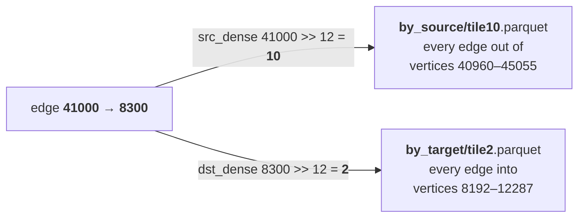
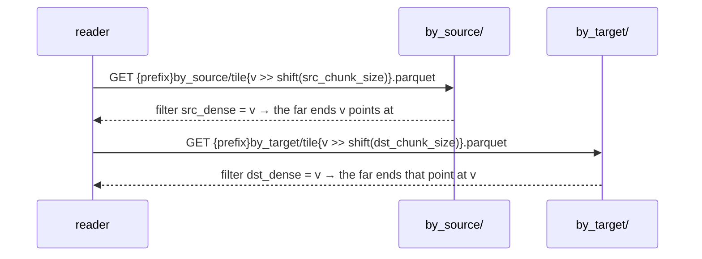

Every edge type is stored **twice, in one relation**: `by_source` ordered by `src_dense`, which is
CSR on disk, and `by_target` ordered by `dst_dense`, which is CSC. Verified on a ten-million-vertex
corpus: **zero out-of-order rows** in either, across 71,024,690 rows.

## Why the order is worth a convention

A sorted adjacency file is not merely convenient to scan — it **is** the CSR structure a graph
algorithm wants, offsets and values, already laid out:

```
by_source/tile10.parquet, ordered by src_dense    the CSR a reader already has

 row   src_dense   dst_dense                      offsets[41000] = 0  first row of 41000
   0       41000        8300  ┐                   offsets[41001] = 3  one past its last
   1       41000      912004  │ 41000, degree 3
   2       41000        4118  ┘                   offsets[41002] = 3  41001 has no out-edges
   3       41002          77  ┐ 41002, degree 2   offsets[41003] = 5
   4       41002       66051  ┘
   5       41003      130998  ] 41003, degree 1   offsets[41004] = 6

                              targets = the dst_dense column, read as it lies
```

The offsets are the run boundaries and the values are the `dst_dense` column: no degree-counting
pre-pass, no scatter, no intermediate bag of pairs. And a file that claims the order and does not
have it does not fail — it builds a different graph, silently, and lays the corpus out by it.
**Wrong answers rather than slow ones**, which is what makes it worth a convention. What the order
does not fix is the secondary one: rows sharing a `src_dense` may appear in any order, and no reader
may depend on which. Guard: `csr-and-csc` — and every guard named on this page is specified in full,
with what it cannot prove, in [the guard index](/docs/format#the-guards).

## One relation, stored twice

The manifest carries **one** `edge_count` for the relation, so each orientation separately has to add
up to that number. What it does not say is that the two hold the same *rows*: same size and different
contents is a reader answering a neighbourhood query from one and a count from the other, and
silently disagreeing with itself. And every endpoint addresses a vertex that exists, in its own
type's dense space — the corruption a renumbering introduces where the counts match, the orientations
agree, and the graph is wrong. Guards: `one-relation-twice`, `no-dangling-endpoint`.

## An edge lives in the tile of the endpoint its file is ordered by

Both orientations are tiled, and each is keyed by **the same range as the vertices** of the endpoint
it is ordered by, so one edge is written into two tiles that have nothing to do with each other:



On a cross-type edge those are two different `dense_id` spaces, which is why `src_chunk_size` and
`dst_chunk_size` are two fields. A tile's row count is the total degree of those 4,096 vertices, not
4,096 — **`chunk_size` on an edge is an addressing unit and never a row count.**

An empty tile is not written, so a 404 is the answer "these 4,096 vertices have no edges in this
direction" — and also "this tile was never uploaded", and nothing in the address separates them. The
manifest's `edge_count` is what does: a reader sums the tiles it found against the declared number,
and a short sum is a corpus missing rows rather than a graph that is sparse. The vertex side closes
the same hole with `vertex_count` ([Identity](/docs/format/conventions/identity)). Guard:
`declared-count`, taken per orientation.

### Given a `dense_id`, where its edges are

Every part of this comes out of the edge type's manifest — nothing is agreed out of band. `prefix`
is the URL, the one part a reader cannot compute; `aligned_by` is the arithmetic, and the shift comes
from `src_chunk_size` for the source-aligned list and `dst_chunk_size` for the target-aligned one.

```yaml
prefix: edge/Person_knows_Person/
src_chunk_size: 4096
dst_chunk_size: 4096
adj_lists:
- { ordered: true, aligned_by: src, prefix: by_source/, file_type: parquet }
- { ordered: true, aligned_by: dst, prefix: by_target/, file_type: parquet }
```

So the **out-edges and in-edges of `v`** are two addressed reads, and the work follows the frontier
and never the corpus:



### Why the target half is tiled, when a window only reads `by_source`

A **neighbourhood** — one hop from a seed — was implemented in a reader the obvious way, as an
undirected adjacency under a `WITH RECURSIVE`:

```sql
-- On 6.9M edges this did not return: still running after 45 seconds, one hop, one seed.
WITH RECURSIVE reach(id) AS (
      SELECT :seed
  UNION SELECT e.dst
          FROM (SELECT src_dense AS src, dst_dense AS dst FROM edges
                UNION ALL SELECT dst_dense, src_dense FROM edges) AS e
          JOIN reach ON e.src = reach.id)
SELECT * FROM reach;
```

The adjacency term materialises 13.8M rows before the recursion starts, and no `limit` on the answer
bounds the cost of *finding* it. The right shape is the two reads above — and it needs both
directions, because **following only the out-edges is a wrong answer rather than a partial one**:
"the papers by this author" is an in-edge from the author.

### What a hop costs, measured

Written by `apps/corpus/guards/fixture.mjs` at three sizes (`--layout files`, a ring plus one chord
per vertex), read with the `duckdb` CLI. Twelve seeds across the id space, compared row for row
against the scan at every seed; medians, all queries inside **one** process, since a process start is
10–40 ms here.

| N | edges | bytes: the two tiles the id names | bytes: both relation files | ms: addressed | ms: scan | ms: `WITH RECURSIVE` |
| --- | --- | --- | --- | --- | --- | --- |
| 250,000 | 500k | **113.0 kB** | 6.9 MB | 8 | 5 | 4 |
| 1,000,000 | 2.0M | **113.0 kB** | 27.5 MB | 2 | 5 | 7 |
| 4,000,000 | 8.0M | **113.0 kB** | 110.2 MB | **1** | 16 | 23 |

**The addressed hop is flat in N and the relation is not** — 61× fewer bytes at a quarter million,
975× at four million, and the gap is the corpus growing.

<Callout type="warn" title="What this measurement is not">
**At a quarter million the addressed hop is the slowest of the three** — nothing to win on a corpus a
native engine reads in five milliseconds. **Native DuckDB is the easy case for the other two**: every
core and a local file, where the reader this was tiled for is single-threaded WASM over HTTP, so the
milliseconds are the *floor* of the difference and the bytes are what carries over. **And the graph
is a ring with chords**, so no seed is a hub and a fan-out to a million rows is not measured at all.
</Callout>

The second tiling is the edge relation on disk a fourth time — at four million vertices 57.2 MiB
against a corpus of 247.1 MiB without it, **+23%** — and it costs a drawing reader nothing. Guards:
`tile-of`, `declared-tiling` and `not-empty`, the last being the one that notices an orientation with
a relation and no tiles, since every other guard skips what is not on disk.

### CSR, not LCA

The alternative placement is to hoist an edge to the deepest tile containing both endpoints — the
lowest common ancestor of the two ids, which with a fixed tile size is their common prefix. It is
**dominated on both curves at once**: over a fifty-fold growth in corpus, CSR reads 346k to 453k edges
per window while LCA goes from 404k to 2.70M, at 2.5×–3.5× the requests. Near the root the tree has no
branching left to prune with, so a window touches nearly every high tile and pays the root whether or
not anything in it is drawn. The alternative is recorded, with what would bring it back, on
[design/discarded](/docs/design/discarded#a-materialised-tile-tree-holding-the-edges-that-cross-tiles).

**One column of it is open**: "drawable" there means both endpoints on screen, and an edge with one
endpoint outside has a visible segment neither placement brings. What would settle it is the same six
windows per size, measured with `by_target` fetched too.

## The tiles are the relation

Splitting a file is where rows are silently dropped or written twice, and both survive every count
that is not a symmetric difference. Guard: `exactly-once`.
