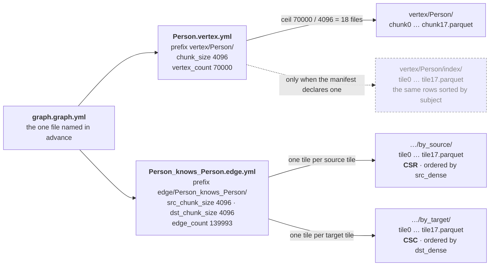

A **fossil corpus** is a graph written to disk: vertices, adjacency in both orientations, and a
manifest that names them. Plain Parquet in a directory tree, read by code that was not compiled
against the code that wrote it.

That last clause is the whole design. A corpus is not a serialisation of somebody's object graph —
it is the interface. **The seam between the two halves of fossil is the corpus on disk, not an
API.** `kanzo-ui` reads fossil-written corpora with no `@fossil-lang/*` dependency of any kind, and
three languages that do not know fossil exists read the same tree; the read surface here,
`crates/fossil-graph`, reaches the rest of the tree exactly once, which
`apps/docs/content.test.ts` asserts as a build failure instead of a sentence.

<Callout title="Two products, one repository">
The other half of fossil is a statically-typed language that produces a graph, documented at its own
site. Nothing here requires it: a corpus is readable by anyone with a Parquet reader, and the
conventions below are what makes that true instead of merely possible.
</Callout>

## One file is named in advance

A reader over HTTP cannot list a directory, so nothing is discovered by listing. `graph.graph.yml`
names every per-type manifest, each of those names a `prefix`, a `chunk_size` and a row count, and
everything under them is arithmetic over those three fields.



Every arrow with a count on it is `ceil(count / chunk_size)` files, and every file name on the right
is the tile number, which is `dense_id >> log2(chunk_size)`. Nothing is fetched to work either out.
**A reader computes every URL it wants before it emits the first request.**

## The five conventions

Five things define a corpus. Each is a measurement, and each is a guard below.

| | the convention | what it buys |
| --- | --- | --- |
| [Identity](/docs/format/conventions/identity) | `dense_id` is a gapless `0..V−1`; the identity is the subject IRI | a tile is a *range*, so its address is a shift |
| [Addressing](/docs/format/conventions/addressing) | a tile is 4,096 rows of `dense_id`; `tile = dense_id >> 12` | no index to fetch, no directory to list |
| [Order](/docs/format/conventions/addressing#the-order-that-makes-an-interval-mean-something) | `dense_id` ascends with the Morton code of the position | a rectangle in space is a few contiguous runs of ids |
| [Adjacency](/docs/format/conventions/adjacency) | `by_source` is CSR, `by_target` is CSC, both tiled by the endpoint they are ordered by | every drawable edge is in a tile the window already fetched, and a hop is two addressed reads |
| [Payload](/docs/format/conventions/addressing#the-footer-is-the-index) | plain Parquet, row-group statistics on the addressing columns | the footer is the index, bought in one request |

## Why a format and not a library

A library is a fine contract when there is one consumer and one language. This has neither: the
corpus is already read from Rust, from TypeScript over DuckDB-WASM, and from a notebook that knows
nothing about any of it. A shared crate fails three ways at once. It puts a compiler *and a version*
between writer and reader, which is the edge the two-core split removes. It gives a third party
nothing. And it assumes one output format by construction, which is a
[live design question](/docs/format/conventions/addressing#the-payload-format-is-open) a crate
modelling *the* manifest cannot hold — the addressing guards survive a format change untouched.

The reference for the stance is **Iceberg, Delta Lake and Lance**: a manifest plus files, many
engines reading the same table, none of them the contract. For the read-by-ranges half the lineage
is **Cloud-Optimized GeoTIFF → GeoParquet → PMTiles**: one file, an embedded directory, a spatial
order, and a client asking for byte ranges over HTTP with no server. And the counter-example is
**GraphAr**, whose manifest vocabulary this format borrows wholesale, down to `version: gar/v1` —
[which keys, and where borrowing
stops](/docs/design/corpus#what-is-borrowed-from-graphar-and-where-borrowing-stops). **Borrowing the
words is not conformance, and a corpus here is not a GraphAr corpus.**

The guards below exist because of the *other* half of that project. Every language's CI clones
GraphAr's shared corpus and no job writes with one implementation and reads with another; through
that gap a fourth implementation landed having re-derived the path arithmetic differently from the
other three *and* from the corpus on disk, green on both sides, because its tests asserted
hand-written strings instead of resolving against the artifact.

## The guards

```bash
node apps/corpus/guards/check.mjs /path/to/corpus
```

`node` and the `duckdb` binary. No fossil crate, no npm package, no install, no build step — copy
the `guards/` directory somewhere else and it runs, which is the position the third party this
format exists for is in. `--explain` prints what each one proves, `apps/corpus/guards/README.md` has
how each is proved to fire, and `apps/corpus/conformance/` is the other half of the question: two
readers checked against one table of addresses instead of against each other's prose.

The list is rendered from `apps/corpus/guards/guards.mjs` at build time, so it cannot name a guard
that does not exist, omit one that does, or paraphrase what one proves. **There is deliberately no
number in this sentence**: a count is the one part of a rendered list that stays wrong on its own.

<Callout type="warn" title="The price, stated where it is paid">
**There is no type. A guard checks what it was asked to check and nothing more.** That is the entire
difference between this and a compiler, and it is why every entry below publishes what it *cannot*
prove beside what it can. The second half is the one worth reading.
</Callout>

<GuardIndex />
