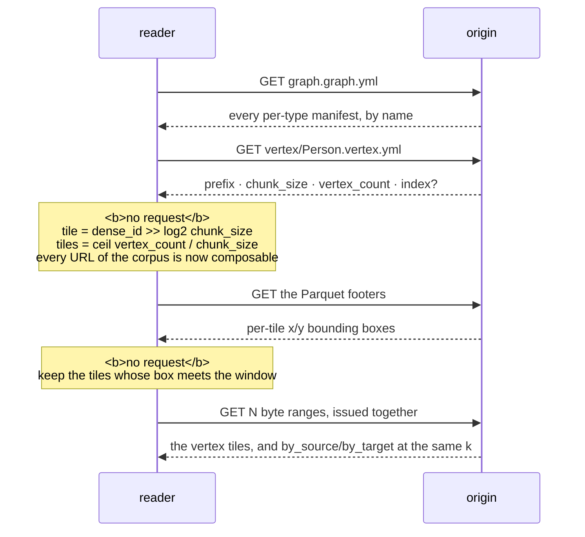

Reading a corpus needs a Parquet reader and the conventions below — no fossil crate, no
`@fossil-lang/*` package, no wasm module, no service. That is how it is already read: `kanzo-ui`
reimplements this shape against DuckDB and Mosaic with no `@fossil-lang/*` dependency at all. The
SQL is DuckDB because that is the shortest way to write it down; nothing in it is DuckDB-specific
except the syntax.

## The sequence



**Two round trips settle where everything is, and neither of them is a query.** The footers narrow
that set with one more, and the N reads after it are all composed before the first is emitted, so
they go out at once.

## The manifests, and the arithmetic over them

A reader over HTTP cannot list a directory, so nothing is discovered by listing: `graph.graph.yml`
is the one name known in advance and it names every per-type manifest. A vertex manifest carries a
`type`, a `vertex_count`, a `prefix`, a `chunk_size` and optionally an `index:` block; an edge
manifest carries `src_type`, `edge_type`, `dst_type`, an `edge_count`, a `prefix`, and the
`src_chunk_size` and `dst_chunk_size` that tie each orientation's tiles to its own endpoint type's.
They are small and flat, so `apps/corpus/guards/manifest.mjs` reads them with a line scan and no
YAML library, refusing what it cannot parse instead of guessing at it.

```
shift       = log2(chunk_size)          # 12
tile(id)    = id >> shift
tile i       spans dense ids [i·chunk_size, (i+1)·chunk_size)
tiles        = ceil(vertex_count / chunk_size)
tail rows    = vertex_count − (tiles − 1)·chunk_size
```

`chunk_size` is a power of two so the address is a shift; it is 4,096 in a corpus fossil writes, and
a reader takes it from the manifest and not from that sentence. **The count is the one field a
truncated corpus fails**: a hole in the middle breaks the address of everything after it, a missing
tail breaks nothing, and its borders are published as vectors —
[the `declared_count` table](/docs/format/conventions/addressing#the-published-vectors), where
`count = 4096` at `chunk_size = 4096` is **one** tile and the off-by-one addresses a
`chunk1.parquet` that is not there.

## Which tiles intersect the window

Arithmetic gives the tiles that *exist*; the footer gives the ones that *intersect*. The row-group
statistics on `x` and `y` are bounding boxes, and selecting on them is the whole of viewport
culling.

```sql
SELECT file_name, row_group_id, path_in_schema,
       coalesce(stats_min_value, stats_min) AS lo,
       coalesce(stats_max_value, stats_max) AS hi
  FROM parquet_metadata('vertex/Person/chunk*.parquet')
 WHERE path_in_schema IN ('x', 'y');
```

Take `min_value`/`max_value` before `min`/`max`: the deprecated pair is signed-comparison only and
is empty for an unsigned column, which is every addressing column there is. Keep the tiles whose box
meets the window and **hand them over as a set of files, never as a `WHERE` over the ranges** —
pruning is a choice of what to read, and written as a predicate it is measured slower than not
pruning at all ([Addressing](/docs/format/conventions/addressing#why-the-camera-does-not-ask)).

The glob above is a listing, which is the thing an HTTP reader cannot do; over an origin, compose
the names from the count and the shift. It also assumes one tile per file, which the manifest's
`container` is what says: against `rowgroups` the path is `vertex/Person/tiles.parquet`, and you drop
the glob and the `file_name` column and read `row_group_id` as the tile number. That is the cheaper
of the two ([two containers, one address](/docs/format/conventions/addressing#two-containers-one-address)).

## The tiles

Tile 10 is the `dense_id` range `[40960, 45056)` and it is a file, so the vertices are
`read_parquet('vertex/Person/chunk10.parquet')` — or, over HTTP, the byte ranges the footer named,
decoded directly. `x` and `y` arrive as separate arrays, which is what Parquet stores, and a
consumer wanting one interleaved buffer pays a pass: **the layout does not remove that pass, it
moves it** ([Addressing](/docs/format/conventions/addressing#encoding-is-chosen-per-column)).
`dense_id` is an address and changes when the layout is redone, so anything held outside the corpus
keys on `subject`.

An edge lives in its **source's** tile, so the tiles a window already fetched are an exact superset
of the edges it can draw and there is no second round of addressing. `by_source` is ordered by
`src_dense` and `by_target` by `dst_dense` — CSR and CSC — both tiled by the endpoint they are
ordered by, so a hop out of one vertex is two files whose names are arithmetic:

```sql
-- everything vertex 41000 touches: 41000 >> 12 = 10, in both directions
SELECT dst_dense AS far FROM read_parquet('edge/Person_knows_Person/by_source/tile10.parquet')
 WHERE src_dense = 41000
UNION ALL
SELECT src_dense FROM read_parquet('edge/Person_knows_Person/by_target/tile10.parquet')
 WHERE dst_dense = 41000;
```

Which prefix is which direction is in the edge type's manifest, one `adj_lists` entry per
orientation: `aligned_by` names the column that addresses it, `prefix` names the directory. Do not
follow only `by_source` — in a knowledge graph "the papers by this author" is an in-edge, and half
the directions is a wrong answer and not a partial one. The `WITH RECURSIVE` over the whole relation
that these two files replace did not return in 45 seconds
([Adjacency](/docs/format/conventions/adjacency)).

## Finding one by its identity

An IRI in hand and its address wanted is the one question the payload's order cannot answer: the
rows are in Morton order and subjects are not, so every tile's `min`/`max` for `subject` overlaps
every other's, the footer prunes nothing, and the read is the identity column of the whole type.
**A vertex manifest may declare a second copy of itself that does answer it** — an `index:` block
with a `prefix`, an `ordered_by` and its own `chunk_size` — and a reader that never looks for the
block scans without knowing it did not have to.

The tiles are `<vertex prefix><index prefix>tile{k}.parquet` — the same spelling and the same
`ceil(vertex_count / chunk_size)` count as everything else, over the **index's own** `chunk_size`.
Each holds two columns, `ordered_by` and the `dense_id` it names, sorted with **disjoint ranges**,
which is what lets the footers prune to the one tile a value can be in. A lookup is then two reads
and no scan of either table: the index tiles for the address, then the payload tile that address
*names*.
[Identity](/docs/format/conventions/identity#searching-for-one-is-a-second-table-not-a-second-column)
has why it is a second table and not a second sort of the first.

Its absence is legal — the scan returns the row the index would have found, so a reader may report
the cost and not refuse the corpus. A `prefix` with no `ordered_by` is the case to refuse
instead: it names files whose sort has to be guessed, and a wrong guess returns a stranger and not
nothing.

## The same read through the package

`@fossil-lang/graph` composes all of it, and none of the arithmetic reaches the caller: no tiles, no
`dense_id`, no Morton codes, no `by_source`, no prefixes, no footers.

```ts
import { openCorpus } from '@fossil-lang/graph';
const corpus = await openCorpus('https://cdn.example.org/kg/2026-08', { query });

corpus.types                                   // what is inside
await corpus.extent('Person')                  // where it is, in coordinates
await corpus.window({ x, y, w, h })            // vertices + edges in a rectangle
await corpus.node('http://example.org/p/17')   // one vertex by identity
await corpus.neighbours([id], { depth: 2 })    // everything within N hops
```

The one capability a host brings is `query`, a callback that runs SQL and hands back rows: the
package has **zero runtime dependencies**, bundling a Parquet decoder would make it a driver, and
the engine already prunes row groups off the footer statistics. Nothing a separate `fetch` could
reach is out of its reach either — it has to see the tiles or it cannot answer a window.
Cancellation, parameter binding and streaming are what the seam does not carry, each because a host
would have to lie to provide it, and `query.ts` says so.

**An answer knows what it is missing.** `complete` means one narrow thing: every edge incident to a
vertex in this answer is in this answer. `gaps` names an orientation that was not read — the
caller did not ask, or the corpus publishes no address for it — and `frontier` names the vertices a
depth bound stopped at, whose edges were never opened, without which a `depth: 1` result *looks*
whole. **Every edge appears once**, too: the corpus stores one relation twice, so an answer that
concatenates both orientations counts a self-type relation double — 1,192 edges against the 596
the conformance manifest declares, which draws identically.

It refuses three things: a corpus declaring no `vertex_count`; an edge label incident twice to one
vertex type, which the addressing cannot name unambiguously; and an `index:` with a `prefix` and no
`ordered_by`. It reads **both containers** and globs for neither — which one it is looking at comes
off `graph.graph.yml`'s `container`, and a corpus that declares one and carries the other is what
`declared-tiling` refuses.

And it declares two costs. **`extent` is believed, not verified** — it comes from the footers, a
box wider than its rows costs a read, a box narrower than its rows **loses vertices**, and only
re-reading every page tells them apart. **`node(id)` scans a corpus that publishes no index**: at
five million vertices one lookup reads about 40 MB. Both answers are correct and only one is fast,
so which one a caller gets is a property of the **type**, readable once as
`corpus.types.vertices.find((t) => t.type === 'Person')?.indexed` and not a difference discovered by
timing it.
