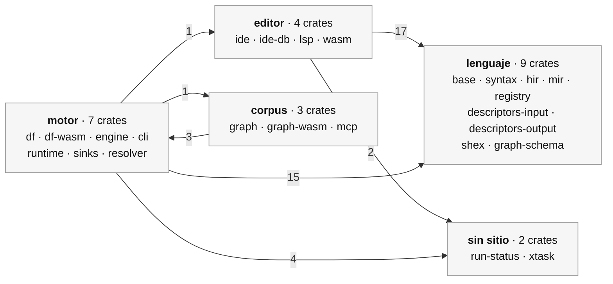
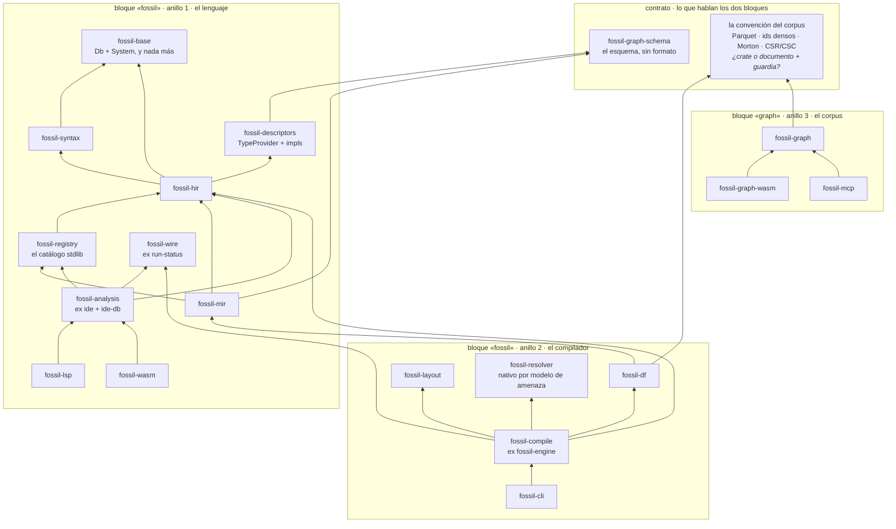

# ADR 0045: Dos núcleos, un monorepo — y la base todavía no es agnóstica

**Date:** 2026-08-05
**Status:** proposed
**Decider:** Angel Iglesias (Kanzo)
**Cite:** ADR-0002 (el reparto de quince crates), al que este revisa entero; ADR-0042 §2 (fuera
GraphAr), ADR-0043 (etapas 2 y 5), ADR-0044 (tres anillos) y ADR-0040 (fossil no publica UI). Los
números de crates y aristas salen de `cargo tree` y de los `Cargo.toml` del árbol de hoy; los de
memoria y peticiones, de `kanzo-ui/BENCHMARKS.md` y `kanzo-ui/.planning/GRAPH-ROADMAP.md`.

## Contexto

La queja es literal y es la correcta: *«veo muchísimos crates y no sé si son todos necesarios»*.
Veinticinco crates, 34.200 líneas de `src` y 9.962 de `tests/`, más once paquetes npm con 6.522
líneas. No es que sean muchos: es que **el mapa que explica por qué son esos ya no describe el
árbol**.

Tres hechos, comprobados hoy y no recordados:

- **ADR-0002 decidió quince crates.** Hay veinticinco. De los quince originales, `fossil-codegen`
  ya no existe; llegaron once nuevos —`graph`, `graph-schema`, `graph-wasm`, `df`, `df-wasm`,
  `engine`, `mcp`, `resolver`, `run-status`, `shex`, `xtask`— y ninguno trajo su propio ADR.
- **`architecture.md` dibuja cuatro crates que no existen**: `fossil-typeck`, `fossil-types`,
  `fossil-resolve` y `fossil-codegen`. El documento al que un recién llegado va primero está diez
  crates corto y cuatro crates de más.
- **Y ADR-0002 nombró, para descartarlos, exactamente los dos colapsos que este documento
  reabre**: *«to actually hit 13 would require collapsing two further pairs
  (`descriptors-input + descriptors-output` and `ide + ide-db`), each of which has independent
  reasons against»*. Aquellas razones se comprueban abajo contra el código de hoy, y ninguna de las
  dos sobrevive.

Hay precedente de sobra para colapsar: `fossil-hir/Cargo.toml` dice, en un comentario, *«per
ADR-0002, fossil-hir collapses what was three crates (fossil-types + fossil-resolve +
fossil-typeck) into one»*. La operación ya se hizo una vez, en el sitio donde más dolía, y no se
volvió a hacer.

### El grafo de hoy, agrupado por de qué va cada crate

No hace falta dibujar veinticinco nodos para ver el problema; basta con agrupar por tema y contar
lo que cruza.

Cuarenta y tres aristas cruzando cinco grupos, y **una de ellas va en los dos sentidos**:
`fossil-runtime → fossil-graph` y `fossil-mcp → fossil-runtime`. A nivel de grupo, el motor y el
corpus se apuntan mutuamente. Esa es la razón exacta de *«siento que tenemos como dos cores»*: hay
dos, y hoy están cosidos por el sitio equivocado.

## Decisión

**Dos bloques por *de qué trata* el código, tres anillos por *dónde corre*, y un contrato entre los
bloques que no es una API.** Los dos ejes componen; ninguno subsume al otro. Y la base vuelve a ser
lo que su nombre promete.

---

## §1. Los dos núcleos existen, y el segundo está a una decisión de quedarse sin dependencias

La intuición se comprueba en tres pasos, ninguno de opinión.

Antes, una corrección de nombre, porque la pregunta llegó así: *«`fossil-graph`, ¿que entiendo que
es la implementación de GraphAr?»* **No.** `fossil-graph` es la **superficie de lectura** sobre un
corpus ya escrito: un enum cerrado de seis verbos —`schema`, `read`, `expand`, `path`, `aggregate`,
`execute_sql`— con esquema JSON por verbo y generación de SQL. Quien escribe GraphAr es
`fossil-df`, y quien modela su manifiesto es `fossil-sinks`. Que el usuario se pierda ahí no es
suyo: el crate que **no** escribe se llama `sinks`, y el que sí escribe se llama `df`.

**Uno.** `fossil-graph` (2.438 líneas, la superficie de lectura) tiene **una** dependencia fossil:
`fossil-sinks`. No conoce el lenguaje —`grep` de `fossil_hir|fossil_syntax|fossil_mir|fossil_base|
fossil_descriptors|fossil_registry` sobre `crates/fossil-graph/src` da **cero**—, no toca el disco
—cero `std::fs`, cero `File::open`— y declara sus dos puertos: `ManifestSource::fetch(rel_path)`
(`manifest.rs:33`) y `DuckExecutor::query_json(sql)` (`exec.rs:45`). `fossil-graph-wasm` son 104
líneas que satisfacen ambos, y es la prueba de que los puertos son los correctos.

**Dos.** El uso de esa única dependencia es **una línea de producción**: `manifest.rs:16`, `use
fossil_sinks::manifest::{EdgeInfo, GraphInfo, VertexInfo}`. Las otras dos apariciones son
`exec.rs:948`, dentro de `#[cfg(test)]` (el módulo empieza en 944), y un `examples/`. Y
`fossil-sinks` son 380 líneas cuyo propio encabezado dice qué es: *«the canonical `GraphAr`
manifest model»*. GraphAr, y nada más.

**Tres.** **ADR-0042 §2 se titula «Parquet a secas. Fuera GraphAr».** La costura entre los dos
núcleos está hecha de algo ya condenado por una decisión tomada.

De donde sale la afirmación central de este documento, y hay que leerla despacio:

> **Cuando ADR-0042 §2 se ejecute, `fossil-graph` no tendrá ninguna dependencia fossil.** Ni una
> pequeña: cero.

Eso cambia el género de la pregunta. **La separación en dos bloques no es una propuesta de
refactor que haya que defender: es el reconocimiento de algo que será cierto en cuanto aterrice una
decisión que ya existe.** Lo único que este ADR añade es decir en voz alta lo que significa, y
prepararse para ello en vez de encontrárselo.

La confirmación externa ya está tomada: `kanzo-ui` lee corpus escritos por fossil **sin ninguna
dependencia de `@fossil-lang/*`** —verificado hoy—, reimplementando la forma de lectura contra
DuckDB/Mosaic. Tres lenguajes que no saben que fossil existe leyeron ese corpus el 2026-08-04
(ADR-0043 etapa 5). La costura entre las dos mitades **es el corpus en disco, no una API**, y eso
ya está medido, no supuesto.

### Lo que cuesta el corte, que no es cero

1. **Se pierde el chequeo del compilador sobre el contrato.** Hoy, si el escritor renombra un campo
   del manifiesto, `fossil-graph` no compila. Sin la arista, el escritor renombra y el lector se
   entera en tiempo de ejecución, o peor, no se entera. Eso es exactamente lo que ADR-0016 fue a
   evitar y hay que sustituirlo por algo, no simplemente quitarlo.
2. **Hay que reescribir el lector del manifiesto** — hoy deserializa YAML de GraphAr con
   `serde_yaml_ng` contra las structs del escritor. Sin ellas, hay que decidir qué lee, y eso es la
   pregunta abierta de abajo.
3. **Dos veredictos de este documento dependen de esa decisión** y no antes: qué pasa con
   `fossil-sinks` y con `fossil-graph-schema`.

### La pregunta que este ADR **no** responde, y que quiere que responda el usuario

Lo que reemplaza a la costura no es un formato: es un **conjunto de convenciones** que ADR-0042
conserva explícitamente —Parquet liso, ids densos, orden Morton, CSR y CSC, aristas alineadas al
chunk del origen—.

> **¿Dónde vive una convención cuando no es un crate?**

El repositorio tiene precedente de las dos respuestas, y son incompatibles entre sí:

| dónde | precedente | lo que da | lo que no |
|---|---|---|---|
| **un crate diminuto compartido** | `fossil-sinks` hoy: 380 líneas que ambos lados importan | el compilador comprueba la forma | reintroduce la arista que acabamos de quitar, y ata a los dos lados a una versión |
| **el documento más guardias ejecutables** | `deny.toml` de ADR-0044; `index.test.ts` de `kanzo-ui` | los dos lados quedan libres; un tercero puede leer sin depender de nada | no hay tipo: la guardia comprueba lo que se le pidió comprobar, y nada más |

Lo que decidiría: **si va a haber un tercer lector que no sea nuestro.** Con un solo consumidor
propio, el crate compartido es barato y honesto. Con la ambición de ADR-0043 etapa 5 —*«el
artefacto es la API»*, con Iceberg y PMTiles como referencia— el crate compartido es una atadura
que el formato de intercambio no debería tener. **Y hay un dato que empuja hacia la segunda
respuesta:** el roadmap (ítem 5) tiene abierto que **el payload de una tesela no sea Parquet**
—Arrow IPC da arrays contiguos y subida a GPU sin decodificar, y Parquet no—. Un diseño que asuma
un solo formato de salida ya está equivocado, y un crate que modele *el* manifiesto lo asume por
construcción.

---

## §2. La base no es agnóstica hoy, y se puede comprobar en una línea

*«Agnóstica de todo, unitaria, sencilla, limitada al core del lenguaje, sin saber detalles de
implementación, trabajando siempre en abstracciones.»* De las cinco, hoy falla la tercera y la
cuarta, y la evidencia es una sola arista:

    fossil-base → fossil-descriptors-input

Real, no un artefacto del grep: `crates/fossil-base/src/system.rs:21` importa
`fossil_descriptors_input::InferredDescriptor`, porque ADR-0037 hizo crecer el trait `System` con
`inferred_descriptor()` / `register_inferred_descriptor()`. El crate que existe para no saber nada
conoce el nombre de **un tipo concreto de un proveedor concreto**.

Y el uso es diminuto: dos métodos, `inferred_descriptor` (`system.rs:56`) y
`register_inferred_descriptor` (`system.rs:69`), más el `Mutex<HashMap<SmolStr,
InferredDescriptor>>` de `NativeSystem`. **El sustrato conoce un tipo concreto sólo porque guarda
una tabla de ellos** — una capacidad genérica expresada con un tipo concreto. Detalle que lo remata:
el `register_inferred_descriptor` por defecto **hace `panic!`**, que es un método de trait que no lo
es.

Y el arreglo ya está inventado **en el repositorio, dos crates más allá**:
`fossil-descriptors-output/src/system_ext.rs` declara `pub trait SystemWithDescriptors:
fossil_base::System` — la extensión vive del lado del descriptor y `fossil-base` no se entera. La
dirección de entrada usa el patrón contrario a la de salida sin ninguna razón registrada. Aplicar
el patrón de salida a la entrada **borra la arista**, y con ella la única cosa que hace que
`fossil-base` sepa de implementaciones.

**Y aquí este documento tiene que corregirse a sí mismo, porque el borrador anterior proponía otra
cosa.** El razonamiento era: `fossil-base::System` es *«host-injected capabilities»* y
`fossil-resolver` es `pub trait PathResolver` cuyo propio encabezado dice ser *«the host-injection
seam (same pattern as `fossil-base::System` for the filesystem; per ADR-0003)»*, así que dos crates
para una idea, fusión evidente. **Es imposible, y el impedimento está escrito en el código:**
`fossil-resolver/src/lib.rs:49` es un `compile_error!` en wasm32, y el comentario de encima dice por
qué — *«cloud credential handling needs OS-level fetch and explicit secret material; the threat
model deliberately keeps credentials off the wasm boundary»*. `fossil-base` sí compila a wasm32.
Fusionarlos rompe la puerta wasm y mete material de credenciales en el navegador.

Lo que queda en pie de la observación es distinto y más útil: **`fossil-resolver` no sobra, está
vacío por el lado que importa.** `PathResolver` no se nombra fuera de su crate ni una vez; los tres
consumidores usan sólo los tipos de valor (`ResolvedPath`, `CloudSecret`). Y la regla que ese trait
debería poseer vive en otro sitio: `resolve_source_uri` es una función libre en
`fossil-df/src/lib.rs:552`, anotada *«This is THE source-resolution rule»*, envuelta por
`fossil-engine/src/lib.rs:300`, que le proyecta encima su propio `ConnectionCreds`. **Una
abstracción repartida en tres crates, con la costura declarada en el que no la ejecuta.**

---

## §3. Los descriptores ya son type providers, y los dos traits que lo dicen están muertos

*«Los descriptores realmente son type providers y eso es lo que deberían ser: existirán como una
interfaz y luego implementaciones concretas.»*

Eso no es una propuesta: **es el diseño original, y el código se apartó de él.**
`architecture.md` §"Three extension points" §1 se titula literalmente *«Input descriptors (formerly
"type providers")»* y publica un `trait InputDescriptor` con `parse_descriptor` /
`infer_from_data` / `type_for_field`. El principio D2 de ese mismo documento es *«Provider-driven
typing — types from authoritative descriptors, no user annotation»*.

Y los traits existen: `fossil-descriptors-input/src/lib.rs:47` es `pub trait InputDescriptor: Send +
Sync + Debug`, y `fossil-descriptors-output/src/lib.rs:44` es `pub trait OutputDescriptor`.

**Y los dos están muertos.** No es una figura retórica; es un `grep`:

- `InputDescriptor` **no se nombra fuera de su crate**. Los únicos aciertos son una línea
  *comentada* —`//   fn input_descriptor(&self, kind: &str) -> Option<&dyn InputDescriptor>;`,
  `fossil-base/src/system.rs:77`— y una variante homónima sin relación en
  `fossil-hir/src/provenance.rs:85`. **No existe ni un `&dyn InputDescriptor` ni un
  `Box<dyn InputDescriptor>` en todo el árbol.** Lo implementan dos tipos, y ninguno se despacha.
- `OutputDescriptor` tiene **una** implementación, `AcceptAllDescriptor`, y fuera del crate sólo
  aparece en comentarios. La API viva es el `enum OutputDescriptorKind`, construido en
  `fossil-engine:269`, `fossil-lsp:198` y `fossil-wasm:551`, y casado en `fossil-hir/shapes.rs:256`.
- `CsvwDescriptor` —el descriptor más completo del crate, 532 líneas— **no implementa el trait**.
  Su `parse` es una función asociada con otra firma, y su búsqueda devuelve `Option<&'static str>`
  en vez de `FieldType`.
- Y `FieldType`, el tipo de salida del trait, tiene **dos** variantes (`String`, `Integer`) contra
  las **nueve** primitivas xsd que el sistema usa de verdad. El consumidor real
  (`fossil-hir/src/infer.rs:101`) no llama al trait: lee `col.primitive` de un `InferredDescriptor`.
  El método `parse()` del trait sólo lo ejercita su propio test unitario.

Así que la forma no es «un trait con implementaciones». Es **tres formas de salida distintas para la
misma pregunta**, un trait de la fase 1 que nadie llama, un enum que sí se usa, y una variante
—`Shacl(GraphSchema)`— **que no se construye en ningún sitio** y sólo existe en sus propios brazos
de `match`: exactamente el coste que ADR-0006 §Negative predijo.

**Y el tipo de convergencia ya existe en las dos direcciones.** En la de salida,
`OutputDescriptorKind::to_graph_schema()` (`kind.rs:90`) baja cualquier variante a
`fossil_graph_schema::GraphSchema`. En la de entrada, `shex.rs:48` es
`inferred_descriptor_from_shex(bytes) -> InferredDescriptor` — una función libre que **ya tiene la
forma que se busca**: bytes de un formato concreto, un tipo concreto de salida. Lo que falta no es
inventar la abstracción: es que las otras tres entradas pasen por ella y que se borre lo que no se
usa.

### La precisión que le debe a «favoreceremos SIEMPRE programar frente a traits»

La regla es correcta y este código dice **dónde muerde**, que es más útil que repetirla.

Cuatro traits examinados —`InputDescriptor`, `OutputDescriptor`, `PathResolver`,
`SystemWithDescriptors`— tienen **una implementación con sentido y cero llamadas dinámicas** cada
uno. Los cuatro se escribieron antes de que existiera su segunda implementación, el tipo concreto
cargó con el trabajo, y ninguno se borró. Programar contra un trait paga cuando hay ≥2
implementaciones **y** un llamante que no debe saber cuál; aquí el llamante siempre lo sabe:
`fossil-engine` sabe que construyó un `ShEx`, `fossil-hir` casa el enum, `fossil-df` casa
`SourceFormat`.

Y hay una restricción dura que no se puede saltar: **dentro de Salsa no puede vivir un objeto de
trait**, porque no tiene igualdad estructural (ADR-0006, ADR-0037, ADR-0020, la regla dura de
`CLAUDE.md`). Eso **no prohíbe el trait — prohíbe el objeto de trait como valor.**

El repositorio ya encontró la salida buena sin nombrarla, en `fossil-registry`: **cambiar la vtable
por datos**. `SigSpec` describe una firma sin `'db`; `LoweringKind` es un enum de cómo compila.
Programar contra una descripción de datos *es* programar contra una abstracción; lo que no sobrevive
dentro de la consulta es el puntero a función.

**La forma que debe tener un type provider aquí, entonces, y es una sola:**
`fn describe(&self, bytes: &[u8]) -> Result<SourceSchema>`, **invocada fuera de la consulta Salsa**,
devolviendo el tipo concreto que la consulta interna. Satisface las tres ADRs que gobiernan esto y
es literalmente lo que `shex.rs:48` ya hace, escrito como función libre.

**Una atadura que sobrevive al refactor y hay que respetar:** `InferredColumn.primitive` es
`SmolStr` **a propósito**, no por dejadez — ADR-0007 §"Construction shape" lo registra como
prevención de un ciclo contra `fossil_hir::Primitive`. El enum de primitivas tendrá que vivir en un
crate hoja, no en `hir`.

**Y una mentira que hay que borrar de paso:** el `description` de
`fossil-descriptors-input/Cargo.toml` dice *«Input descriptors (CSVW, JSON Schema, Parquet, XSD)»*.
Ninguna de las tres últimas existe. CSV, JSON y Parquet llegan como `Inferred` porque es el **host**
quien corre `DESCRIBE read_csv_auto(...)` (ADR-0037).

---

## §4. `fossil-ide` no es un IDE, y la separación que sí tiene sentido no es la que dice el nombre

*«Nosotros queremos un LSP, ¿para qué queremos un IDE?»* — El usuario tiene razón sobre el nombre y
la respuesta a *por qué está separada* no es la que el nombre sugiere.

`fossil-ide` (3.115 líneas) **devuelve structs de `lsp_types` directamente**: `completions →
Vec<CompletionItem>` (`completion.rs:69`), `document_symbols → Vec<DocumentSymbol>`
(`outline.rs:47`), `code_actions → Vec<CodeAction>` (`code_action.rs:64`), `semantic_legend →
SemanticTokensLegend` (`semantic.rs:81`). No es la separación de rust-analyzer —`ide` devuelve
datos de dominio y el crate LSP traduce—: aquí la frontera del protocolo **se derrumbó** cuando un
spike comprobó que `lsp-types` compila a wasm32.

Lo que sí separa a los dos crates es otra cosa, y es real: `fossil-lsp/src/lib.rs:13` es un
`compile_error!` en wasm32, porque `lsp-server` usa crossbeam y stdio. `fossil-lsp` son 735 líneas
de `main.rs` que son marco stdio más el `LspDb` de Salsa; el navegador necesita las mismas
funciones sin ese crate. **La separación es «wasm-limpio» contra «sólo nativo», no «IDE» contra
«LSP»**, y por eso sobrevive — pero debe llamarse por lo que es.

Tres cortes concretos, cada uno con el hecho que lo sostiene:

1. **`fossil-ide-db` (592 líneas) es un módulo, no un crate.** No es una base de datos Salsa: su
   propio `lib.rs:20` dice *«adds NO Salsa query of its own — the indexes are plain structs built
   by a CST walk»*. Cero `#[salsa::db]`, cero `#[salsa::tracked]`, cero macros, cero `tests/`. Sus
   dependencias son un **subconjunto** estricto de las de `fossil-ide`, y su único consumidor es
   `fossil-ide`. **No hay obstáculo técnico**: ni regla huérfana, ni macro, ni ciclo, ni diferencia
   de `cfg`. La razón escrita es imitación —`lib.rs:4`: *«Pattern: rust-analyzer's `ide-db` split
   from `ide`»*— y el `ide-db` de rust-analyzer son ~20k líneas compartidas por cinco crates. Aquí
   hay uno.
2. **`lineage.rs` (97 líneas) sale de `fossil-ide`,** y con él desaparece la pregunta *«¿por qué el
   motor necesita un IDE?»*. `fossil-engine` usa de `fossil-ide` exactamente **dos símbolos en
   cinco líneas**: `providers()` (`lib.rs:38`) y `source_refs()` (`lib.rs:57`). Ni una llamada a
   hover, completado o goto-def. `providers`/`source_refs` no son funciones de editor: son
   introspección de linaje para los trabajos y conexiones de keasy, y devuelven tipos de
   `fossil-run-status`.
3. **Renombrar.** Hecho (1) y (2), el crate es el conjunto de funciones del LSP y nada más.

---

## §5. `fossil-run-status` es el corpus descrito por tercera vez, y trae un versionado de compatibilidad

*«Eso me suena a code-smell que flipas.»* Sí, y hay tres hechos que lo concretan.

**Uno: describe el mismo artefacto que ya describen otros dos sitios.** `RunStatus { dest,
vertices: Vec<VertexStatus>, edges: Vec<EdgeStatus> }` con `VertexStatus { vertex_type, rdf_type,
file, count, columns }` y `EdgeStatus { edge_type, src_type, dst_type, by_source, by_target, count }`
es la misma información que `fossil_sinks::manifest::{GraphInfo, VertexInfo, EdgeInfo}` —el YAML
que el escritor emite— y que `fossil_graph::Manifest` —la vista que el lector parsea—. **Tres
formas para un artefacto**, cada una serializada distinto porque cada una tiene otro consumidor.

**Dos: no contiene una cosa, contiene cuatro, y una de ellas apunta al revés.** El resultado de
`fossil run` (`RunStatus`), el de `fossil providers` (`ProviderInfo`), el de `fossil refs`
(`SourceRefInfo`) — y `CatalogInput`, que es la **entrada** de `fossil catalog`, en un crate que se
llama «estado de la ejecución». Nada las une salvo que las cuatro las consume el mismo host. Detalle
que lo remata: `ProviderInfo` vive aquí mientras su único origen de datos es
`fossil_registry::SOURCE_KINDS`, y los dos se juntan en un tercer crate,
`fossil-ide/src/lineage.rs:69`. El tipo y su contenido viven en dos crates que no se conocen.

**Tres, y es el que choca con una regla del repositorio:** trae `pub const WIRE_VERSION: u32 = 1`
y `pub const fn is_compatible(version: u32) -> bool`, con un `serde` default para *«a legacy payload
that predates versioning»*. Un mecanismo de compatibilidad entre versiones, en un repositorio cuya
regla es que no hay compatibilidad ni alias ni deprecación, y en un paquete que nunca se ha
publicado.

Es también el crate que más lejos llega sin ser de nadie: seis crates dependen de él
—`cli`, `df`, `df-wasm`, `engine`, `ide`, `wasm`— y no tiene ninguna dependencia. Eso no es ser
fundacional: es ser el sitio donde se dejan los tipos que no encajaron.

---

## §6. Un veredicto por crate

`→` es «se funde en». Cada razón es un hecho del código, no una preferencia.

| crate | líneas | veredicto | por qué, con el hecho |
|---|---|---|---|
| `fossil-base` | 813 | **queda, y pierde una arista** | es lo único que puede ser la base agnóstica; hoy no lo es por `system.rs:21`. Absorbe `fossil-resolver`: mismo patrón, dicho por el propio crate |
| `fossil-syntax` | 3.502 | **queda** | CST lossless, una dependencia (`base`), un consumidor claro. El crate más limpio del bloque lenguaje |
| `fossil-hir` | 6.206 | **queda** | ya absorbió tres crates; es el precedente que este ADR cita |
| `fossil-mir` | 2.676 | **queda donde está** | «no sé si ahí debería vivir»: sí. Es la única entrada del compilador al escritor (`fossil-df` lo consume) y no depende de nada del corpus salvo `graph-schema`. Mover MIR movería la frontera entre bloques al sitio equivocado |
| `fossil-registry` | 1.171 | **queda; se renombra a lo que es, o se promueve — y son dos trabajos distintos** | hoy **no** es puerta de extensión: `entries` es privado, no hay `register()`, `SOURCE_KINDS` es un `pub const &[…]`, y los cuatro consumidores llaman `stdlib_default()` cada uno por su cuenta en vez de compartir una instancia. Un tercero no puede añadir una función sin editar `lib.rs`. Peor: dos comentarios afirman una extensibilidad inexistente — `lib.rs:307` dice que replica el `TableProvider` de DataFusion (no hay tal trait) y `lib.rs:335` dice que la implementación vive en `fossil-provider-rdf`, **crate que no existe** y que sólo aparece en comentarios |
| `fossil-descriptors-input` | 1.079 | **→ `fossil-descriptors`** | ADR-0002 separó entrada y salida *«so each direction can grow independent feature surface»*; en catorce meses ninguna creció una dimensión que la otra no tenga, y la de entrada perdió tres de las cuatro que su propio `Cargo.toml` anuncia |
| `fossil-descriptors-output` | 336 | **→ `fossil-descriptors`** | 336 líneas de las que `kind.rs` es la segunda superficie del mismo concepto (ADR-0006) y `system_ext.rs` la tercera —`SystemWithDescriptors` tiene dos impls **vacías** y fue superado en la práctica por `HirDb::output_descriptor_kind` (ADR-0020), que duplica su firma y su defecto—. Un crate más pequeño que su propia duplicación |
| `fossil-shex` | 1.196 | **→ `fossil-descriptors`** | es *una implementación concreta* de `OutputDescriptor` en un `lib.rs` único, a un crate de distancia del trait que implementa. Exactamente «interfaz e implementaciones concretas»; le sobra el límite de crate |
| `fossil-graph-schema` | 260 | **queda, y su promesa hay que hacerla cierta** | es ya la base abstracta que se pide: cero dependencias salvo `serde`, encabezado que dice *«no `dense_id`, no Parquet/CSR detail»*, y ya es el tipo al que converge la salida —`OutputDescriptorKind::to_graph_schema()`—. Pero **`fossil-graph` no depende de él**: el consumidor habla `fossil_sinks::manifest`, que es formato. La afirmación de la lata es falsa hoy, y hacerla cierta es lo mismo que responder §1 |
| `fossil-ide-db` | 592 | **→ `fossil-ide`** | sin Salsa, sin macros, sin `tests/`, un consumidor, dependencias que son subconjunto. Cero obstáculos |
| `fossil-ide` | 3.115 | **queda y se renombra** | es el conjunto de funciones del LSP, no un IDE; existe porque `fossil-lsp` no compila a wasm32. Pierde `lineage.rs` |
| `fossil-lsp` | 752 | **queda** | 735 líneas de marco stdio + `LspDb`; nativo por construcción y el tripwire es portante |
| `fossil-wasm` | 1.828 | **queda, y ADR-0044 se corrige** | **no le queda superficie de ejecución**: los trece `#[wasm_bindgen]` son lenguaje/LSP, `compile_file` ya no existe, y su único uso del backend (`lower_to_mir_pg`, `lib.rs:737`) descarta el resultado y sólo drena diagnósticos. La partición que ADR-0044 ordena ya ocurrió |
| `fossil-sinks` | 380 | **se renombra ya, y su vida depende de §1** | no es un sink y no escribe nada: ADR-0017 decidió que *«fossil never writes Parquet bytes from Rust»*, así que son structs serde del manifiesto GraphAr, y la mitad de sus dependientes **leen**. Se llama `fossil-graphar-manifest`. Y GraphAr sale por ADR-0042 §2: si la convención vive en un crate, éste es ese crate; si vive en el documento y las guardias, desaparece |
| `fossil-resolver` | 430 | **queda, pierde su trait y gana la lógica que le falta** | **no se puede fundir en `fossil-base`**: `lib.rs:49` es un `compile_error!` en wasm32 por modelo de amenaza, y `fossil-base` compila a wasm32. Lo que sí sobra es `PathResolver`/`DefaultPathResolver` —cero referencias fuera del crate—; lo que le falta es `resolve_source_uri` (`fossil-df:552`) y el mapa de credenciales de `fossil-engine/creds.rs`, hoy en tres crates |
| `fossil-run-status` | 294 | **se renombra y se parte por dirección; no se borra todavía** | no es «estado»: son **cuatro** contratos de cable sin relación —`RunStatus` (salida de `run`), `CatalogInput` (**entrada** de `catalog`), `ProviderInfo` (salida de `providers`), `SourceRefInfo` (salida de `refs`)—. Se llama `fossil-wire`. **No se funde en `fossil-base`**: eso metería `salsa` y el sustrato del compilador en el servidor de keasy, que es justo lo que su `Cargo.toml` dice evitar. Y `WIRE_VERSION`/`is_compatible` es un mecanismo de compatibilidad en un repositorio que no la tiene: eso sí se borra |
| `fossil-df` | 2.539 | **queda** | el ejecutor. Anillo 2 por definición de ADR-0044 |
| `fossil-df-wasm` | 436 | **se borra** | ya decidido en ADR-0044: compilar el motor al navegador afirma lo contrario de ADR-0042 §1 |
| `fossil-runtime` | 2.410 | **se disuelve** | ADR-0042 §5 + ADR-0043 etapa 2: el núcleo puro sale a `fossil-layout`, la mitad DuckDB muere con el strangler |
| `fossil-engine` | 842 | **queda y se renombra** | **no es una fachada**: `providers`+`refs` son 5 líneas, y las otras ~830 son resolución de credenciales, pre-introspección con `DESCRIBE`, y `enrich_written_layout`, que abre su propia conexión. Doce dependencias con contenido real. El nombre «engine» es lo que confunde: orquesta la compilación |
| `fossil-cli` | 328 | **queda** | 328 líneas de `src` y 1.400 de tests: la proporción correcta para un binario que es una carcasa |
| `fossil-graph` | 2.438 | **queda, y se queda solo** | el crate más limpio del árbol: enum cerrado de seis verbos, dos puertos declarados, cero acoplamiento al lenguaje, y **una** línea de importación de producción que ADR-0042 §2 va a borrar |
| `fossil-graph-wasm` | 104 | **queda** | glue puro, y la prueba de que los dos puertos son los correctos |
| `fossil-mcp` | 342 | **queda, y suelta el motor** | un solo tool (`dispatch_verb`); usa `fossil-runtime` para **dos símbolos**: `install_secret` y `DuckRuntime::new`. Arrastra DuckDB porque **construye** la conexión en vez de **recibirla**, y el trait para recibirla (`DuckExecutor`) ya existe |
| `xtask` | 131 | **queda** | 131 líneas que derivan del grafo resuelto la lista de crates que van a la puerta wasm, *«so there is no hand-maintained list to drift»*. Es el único sitio del repositorio que ya hace lo que este ADR pide de todos |

**No lo sé, y esto es lo que lo decidiría**, en tres puntos:

- **`fossil-mir` (2.676) — ¿está el álgebra en el sitio correcto?** El código dice que sí, pero
  ADR-0041 y ADR-0042 movieron el *álgebra de verbos* al lado del corpus mientras el *álgebra de
  operadores* se quedó en el compilador, y nadie ha comprobado que sean cosas distintas. **Lo
  decidiría:** listar los once operadores de `fossil-mir` y los seis verbos de `fossil-graph` y ver
  si alguno de los seis es una composición de los once. Si lo es, hay una duplicación y el ADR
  siguiente es sobre eso.
- **`fossil-run-status` — ¿lo consume keasy hoy por el cable?** `kanzo-ui` no depende de
  `@fossil-lang/*`, verificado; keasy es otro checkout y no se ha mirado. **Lo decidiría:** un
  `grep` de `RunStatus` y `wire_version` en el checkout de keasy. Si está en producción, el borrado
  es una migración con un consumidor real, no una limpieza.
- **`fossil-sinks` y `fossil-graph-schema` — ¿uno o dos?** Ambos afirman ser «el contrato». Uno es
  formato-neutro y sólo lo habla el productor; el otro es GraphAr y lo hablan los dos lados. **Lo
  decidiría:** la respuesta a la pregunta abierta de §1.

**Lo que no está en la tabla, a propósito:** nada sobre mover ficheros dentro de un crate. La
queja es sobre crates. Muchos ficheros en un crate está bien.

---

## §7. Cómo componen los bloques con los tres anillos de ADR-0044

**Los anillos dicen dónde corre el código; los bloques dicen de qué trata.** Son ortogonales y hay
que mantener los dos, porque cada uno prohíbe algo que el otro permite.

|  | anillo 1 · lenguaje, sin motor | anillo 2 · nativo, con disco y presupuesto | anillo 3 · wasm, direcciona bytes |
|---|---|---|---|
| **bloque «fossil»** | `base` · `syntax` · `hir` · `mir` · `registry` · `descriptors` · `analysis` · `lsp` · `wire` | `df` · `layout` · `resolver` · `compile` · `cli` | `fossil-wasm` (lenguaje/LSP) |
| **bloque «graph»** | — | — | `graph` · `graph-wasm` · `mcp` |
| **contrato** | `graph-schema` · la convención del corpus | | |

Dos cosas que la tabla hace visibles y que ninguna de las dos taxonomías ve sola:

- **El bloque «graph» ocupa una sola casilla.** Es un núcleo entero que vive en un anillo. Por eso
  parece un repositorio aparte y por eso `fossil-graph` no tiene dependencias: no es que esté
  bien encapsulado, es que **no cruza ninguna de las dos fronteras**.
- **`fossil-mcp` es el único crate que la tabla coloca donde ADR-0044 dijo y el código contradice.**
  ADR-0044 lo pone en anillo 1; la tabla lo pone en el bloque graph y en el anillo del lector,
  porque lo que hace es *leer un corpus por un transporte*. Las dos lecturas coinciden en lo que
  importa —que no lleve motor— y discrepan en el nombre del sitio. El bloque es la clasificación
  más útil aquí: `fossil-mcp` es a `fossil-graph` lo que `fossil-graph-wasm`, un binding.

**Y una corrección que ADR-0044 necesita antes de que nadie actúe sobre él.** Dice que
`fossil-wasm` —el anillo del lector— *«alcanza el motor por transitividad, vía fossil-ide →
fossil-engine»*. **Esa arista no existe y va en el otro sentido:** `fossil-engine → fossil-ide`.
Comprobado con `cargo tree -e normal -i duckdb --workspace`, cuya salida entera es:

    duckdb v1.10502.0
    ├── fossil-engine → fossil-cli
    ├── fossil-mcp
    └── fossil-runtime → fossil-engine, fossil-mcp

Ni `fossil-wasm` ni `fossil-ide` aparecen, con dev-dependencies incluidas. Lo que cargo-deny
rechazó como `unmatched wrapper` no era transitividad: era que esos nombres **no son dependientes
en absoluto**. Y hay un cuarto nombre en la misma situación: `fossil-cli` declara `duckdb` sólo en
`[dev-dependencies]` (`Cargo.toml:38`), para que los tests lean el Parquet de vuelta.

El estado real es **mejor** que el que ADR-0044 describe: los dependientes normales de `duckdb` son
tres —`engine`, `mcp`, `runtime`— y el anillo del lector ya está limpio de los dos motores. La
guardia tampoco está hoy en el árbol: `ed8a732` la sacó de `deny.toml` y la dejó como prosa dentro
del ADR. **Activarla cuesta menos de lo que su propio documento cree.**

---

## §8. Ids planos en vez de un árbol: no hay árbol, hay una función de direccionamiento

*(La pregunta era si representar la jerarquía como un id aplanado ayuda en vez de materializar un
árbol. Ayuda, y toca dos preguntas que el repositorio tiene abiertas.)*

El escritor ya renumera `dense_id` **en orden Morton** (`layout.rs:289`: *«renumber `dense_id` into
Morton order», remapping every adjacency list*). Si una tesela es un rango fijo de `dense_id` —y la
medición del 2026-08-05 fijó la unidad en **4.096 filas**—, entonces:

- el id de la tesela de un vértice es `dense_id >> 12`;
- el de su padre, otro desplazamiento;
- y el **antepasado común más bajo de dos vértices es el prefijo común de sus ids**: un `XOR` y un
  conteo de ceros a la izquierda.

De donde salen tres consecuencias, y ninguna es estética:

1. **La pregunta abierta de ADR-0042 §3 —«qué es una tesela, y si hay un árbol encima»— puede tener
   como respuesta «no hay árbol, hay una función de direccionamiento».** No se materializa nada: se
   calcula.
2. **La disputa CSR-contra-LCA de ADR-0042 pasa de discutible a computable.** Si una arista sube y
   cuánto es una propiedad del prefijo común de los dos ids, así que **el efecto que se teme —que
   la raíz acumule un conjunto que crece con N— se puede medir sobre el corpus que ya existe**,
   antes de escribir un emisor. Eso convierte una pregunta de diseño en una consulta.
3. **Desaparece el descubrimiento.** Hoy el lector paga `3·chunks + 1` HEADs más una lectura de
   footer de 16 kB por chunk *del corpus*, se necesite o no —la ley se cumple exacta a los cuatro
   tamaños: 7, 28, 124, 247 para 2, 9, 41, 82 chunks— porque tiene que **descubrir** metadatos. Una
   dirección calculada no necesita ninguna: el lector computa todas las URLs antes de emitir la
   primera, que es el contenido entero de *«se direcciona, no se consulta»*.

Un detalle que hay que arreglar para que la aritmética sea un desplazamiento y no una división:
**`DEFAULT_CHUNK_SIZE` es hoy `122_880`** (`fossil-sinks/src/manifest.rs:164`), que no es potencia
de dos. La medición eligió 4.096 por razones de latencia y ancho de banda, sin saber nada de bits, y
122.880 quedó dominado por 32.768 en peticiones *y* en bytes. Las dos líneas de razonamiento
convergen en el mismo número; conviene decir que convergen y no que una justifica a la otra.

### El coste, que hay que decir sin adornos

**Un id aplanado sólo funciona si el espacio de ids *es* el orden espacial.** Y la identidad
aterrizó hoy como `vertexId(type_idx, dense_id)` empaquetado (`kanzo-ui`, `da8a8ee`). Si `dense_id`
codifica posición, **rehacer la maquetación renumera todo y cambia todas las identidades**.

La resolución limpia es separar los dos papeles: **la identidad estable es el IRI del sujeto**, y
`dense_id` es una **dirección** que puede cambiar cuando el corpus se reescribe.

Y comprobado en el código, eso **ya está decidido y escrito, en el crate que menos debería
contradecirse**. `fossil-graph-schema/src/lib.rs:30-34`:

> *«Every node's key is its **subject IRI** (uniform across fossil). […] the relational plan
> computes the actual IRI-valued columns, and a GraphAr materializer resolves those IRIs to dense
> ids. The schema only states the shape.»*

Así que separar identidad de dirección **no es una decisión nueva: es hacer cumplir una que ya está
escrita**. Lo que la incumple es concreto y son dos sitios: el `vertexId(type_idx, dense_id)` del
lienzo, y `RESERVED_VERTEX_COLUMNS` (`fossil-graph/src/manifest.rs:26`), que mete `dense_id` y
`subject` en la misma lista de columnas ocultas —una es la dirección y la otra es la identidad, y
esconderlas juntas es exactamente cómo se acaban usando como si fueran lo mismo—.

Hasta dónde es cierto hoy que se usan como lo mismo: `subject` **sí** se proyecta en `read`
(`exec.rs:447`) *«porque un filtro que debe cambiar la imagen responde con ids»*, así que el camino
del álgebra ya devuelve identidad estable. El que no lo hace es el camino del dibujo, donde
`Slice.vertices` son pares empaquetados. **La grieta está en un solo sitio, y es reparable antes de
que haya teselas.**

---

## §9. Operaciones bit a bit: una disciplina, no un entusiasmo

*(La pregunta era si usar operaciones a nivel de bit siempre que se pueda haría el sistema mucho
más rápido. La respuesta honesta es que no, y el perfil dice por qué.)*

**Las operaciones bit a bit pagan donde el modelo de datos ya *es* bits, y no pagan nada donde el
coste medido es memoria o red.**

Donde pagan, y son tres sitios concretos que ya existen:

- **el intercalado de Morton**, que es la operación por definición;
- **la identidad empaquetada `(type_idx, dense_id)`**, donde el `type` y el `dense` se extraen con
  una máscara en vez de con dos campos;
- **el direccionamiento de teselas de §8**: `>>`, `XOR` y conteo de ceros a la izquierda, que es
  todo el árbol que no hay que materializar;
- **una máscara de pertenencia (bitset) para `expand{into}`**, que ADR-0041 justifica citando el
  `SEMI_MASKER` de Kùzu.

Dónde no pagan, y esto es lo que el perfil dice hoy:

| lo medido | número | qué movería un truco de bits |
|---|---|---|
| pico del escritor a diez millones | **8,39 GiB**, con el reloj dominado por Louvain (168 s de ~200) | nada: el coste es cuántos bytes hay residentes |
| un paso de arrastre ya cacheado | **247 peticiones** transfiriendo **cero bytes** | nada: el coste son viajes de ida y vuelta |

**Ningún truco de bits mueve un byte ni ahorra un viaje.** Y todas las victorias medidas hasta hoy
han sido estructurales, no aritméticas: no construir el CSR (**−1,71 GiB**, ADR-0043 etapa 1),
declarar un presupuesto (**de ~21 a 9,87 GiB**, etapa 4), no traer footers que no se usan (85 de
~129 peticiones con cuerpo, a diez millones, son de chunks que la ventana no toca).

La regla, entonces: **bits donde el id *es* la estructura; ninguno donde el perfil diga memoria o
red.** Y el sitio donde el repositorio ya la incumple por el lado contrario está localizado: ADR-0044
dice que optimizar constantes dentro de `enrich_layout` *«deja de hacerse»*, porque pasar de 53 a 30
B/arista no cambia la categoría del problema. Un bitset de comunidades es esa misma clase de cambio.

---

## §10. La maquetación hecha a mano: ¿hay crates que valga la pena adoptar?

**Casi nada, y lo poco que sí depende de §8.** Dos «no» firmes —comunidades y maquetación— y un
«todavía no» —Morton—. Buscado y verificado contra crates.io y docs.rs el 2026-08-05, crate a crate,
no recordado.

### Lo primero: cuánto código está realmente en juego

`layout.rs` son 1.720 líneas, y las tres cosas hechas a mano son **un cuarto**:

| concern | funciones | tramo | código |
|---|---|---|---|
| detección de comunidades | `community_hierarchy`, `hierarchy`, `local_moving`, `contract`, `Weighted`, `Csr` | 548 | **351** |
| Morton | `morton2`, `morton_codes`, `morton_decode`, `morton_ranks` | 76 | **54** |
| filotaxis | `cluster_layout`, `place_after` y 5 constantes | 106 | **42** |
| orquestación DuckDB (`enrich_layout`, structs, errores) | | 553 | 312 |
| tests (22) | | 405 | 300 |

Y el fichero importa **tres cosas** de fuera de `std`: `duckdb::Connection`, dos tipos de Arrow y
`fossil_base::probe::Probe`. Ni un crate de grafos, ni de matemáticas, ni de SIMD. Además ~40 % de
cada tramo no-test es prosa que registra una medición o una hipótesis refutada, y **eso no lo
sustituye una dependencia**.

### Comunidades — no adoptar, y por tres razones independientes

Los nombres que uno esperaría **no existen**: `louvain`, `louvain-rs`, `rust-louvain` dan 404 en la
API de crates.io, y una búsqueda por `louvain` devuelve **cero** crates con esa palabra en el
nombre. `petgraph` (453 M acumuladas, 96 M en noventa días) y `rustworkx-core` **no tienen detección de
comunidades**;
el issue de Louvain en rustworkx lleva abierto desde 2024-03 y sin tocar desde 2024-08.

Lo que sí existe:

| crate | último / fecha | en memoria | ancho de índice | licencia | mantenido |
|---|---|---|---|---|---|
| `graphrs` 0.11.16 | 2025-12-05 | sí, y guarda la topología hasta nueve veces, clonando el nombre de cada nodo | claves por *nombre* de nodo | MIT declarado | poco |
| `single-clustering` 0.7.0 | **2026-08-04** | sí, CSR propio | **`u32`** | BSD-3 en el repo, **`non-standard` en crates.io** | sí, y demasiado |
| `graph_builder` 0.4.2 | 2026-06-10 | sí, CSR | **`u64`/`usize`** | MIT | sin commits algorítmicos desde 2023 |
| `webgraph-algo` 0.6.2 | 2026-05-01 | **no — mmap + derrame a disco** | **`usize`/`u64`** | **`Apache-2.0 OR LGPL-2.1-or-later`** | sí (Vigna) |

Dos apuntes de la tabla que importan más que la tabla. **`single-clustering` publicó 0.7.0 ayer y es
*«a breaking rewrite of the Leiden core»*: Louvain ya no tiene punto de entrada propio**, sobrevive
como `LeidenConfig { refine: false }`. Un núcleo que se reescribe entero mientras uno lo evalúa no es
una señal de salud para *este* uso: es API en movimiento debajo del pie. Y su campo de licencia en
crates.io es **`non-standard`** —el `LICENSE.md` del repo dice BSD-3— lo que con nuestro
`confidence-threshold = 0.93` y una lista SPDX es un fallo de `cargo deny`, no una nota al pie.

1. **Funcionalidad.** `community_hierarchy` devuelve `Vec<Vec<u32>>` — **la jerarquía entera, todos
   los niveles** — y ADR-0044 midió el 2026-08-05 que eso es exactamente lo que gana su sitio: p90
   de radio **20** contra **72.722** de un bin de Morton del mismo tamaño. **Todos** los candidatos
   devuelven una partición plana. `flatten_to_budget` y `order_by_hierarchy` se quedarían sin nada
   que consumir.
2. **Escala.** `single-clustering` está topado a `u32` y su propia tabla publicada pone 8M nodos /
   57M aristas en **2,6 GB** — no mejora los 3,94 GiB medidos a 69,5M aristas. Cambiar un Louvain
   residente por otro **no acerca a «sin techo»: mueve el punto donde revienta**, que es la
   estrategia que ADR-0044 ya rechazó por escrito.
3. **Re-medición.** Adoptar es cambiar 351 líneas con 22 tests y cuatro ADRs de mediciones encima
   por algo cuyo perfil de memoria sobre este corpus es desconocido. **ADR-0043 ya registra ese modo
   de fallo una vez:** una reescritura correcta pasó los tres tests de paridad y regresó **siete
   gigabytes**, porque el criterio de terminado estaba mal.

**Lo único que merece un spike es `webgraph-algo::llp`**, y merece decirse con precisión porque es
el hallazgo nuevo de esta búsqueda: ADR-0044 cerró con que «sin techo» exige la salida 1 —estado de
vértice fuera del heap, GraphChi/X-Stream— y la llamó *«un proyecto en sí»*. **Ese proyecto está
parcialmente escrito**, con índices de 64 bits, grafo mapeado en memoria y derrame a un `work_dir`,
por el autor del algoritmo. Y los costes son igual de concretos: es **Layered Label Propagation, no
modularidad**, así que la compacidad de p90=20 que justificó conservar la jerarquía **habría que
volver a medirla desde cero**; exige un grafo simétrico y sin bucles; sigue necesitando ~25 B/nodo
residentes, que son 25 GB a mil millones; y quiere `BvGraph`, **un segundo formato en disco**, que
choca de frente con ADR-0042 §2. **Es una medición que programar, no una dependencia que añadir.**

Una cosa que **no** bloquea ese spike, y conviene decirlo porque circuló como que sí: la licencia.
`webgraph-algo` declara **`Apache-2.0 OR LGPL-2.1-or-later` en todas sus versiones**, incluida la
0.6.2 — no hay relicencia pendiente que esperar. Se toma la rama Apache-2.0, que ya está en la lista
`allow` de nuestro `deny.toml`. El único obstáculo real es el que dice el párrafo de arriba: hay que
volver a medir.

Si algún día hiciera falta Leiden a escala, es construir y no comprar, y el sustrato sería
`graph_builder` (MIT, CSR, `Idx` para `u64`).

### Morton — hoy no; **`zorder` si y sólo si se adoptan los ids planos**

Éste es el único de los tres frentes donde la respuesta depende de otra decisión, y por una razón
que no es de rendimiento.

**Hoy no, y el motivo es casi cómico.** El crate [`morton`](https://crates.io/crates/morton) (144 k
descargas, publicado 2025-12-16) tiene como **API pública entera** `interleave_morton(u16, u16) ->
u32` y `deinterleave_morton(u32) -> (u16, u16)`: un calco firma por firma de `morton2` y
`morton_decode`. Adoptarlo **borraría 21 líneas y añadiría una dependencia**, lo que falla la regla 2
del repositorio a la cara. Y es **la equivocación fácil**: es a la vez el más descargado y el más
recientemente publicado de la búsqueda, así que es el que sale primero — y está topado a `u16` y a
dos dimensiones, que es exactamente el techo del que habría que salir.

**Mañana sí, si §8 sigue adelante.** `zorder` 0.2.2 es el crate mejor hecho, y lo verificado es esto:
`pub fn index_of<I, const N: usize>([I; N]) -> <I as Interleave<N>>::Output` — genérico constante en
la dimensión, con el ancho de salida como tipo asociado, *«the smallest unsigned integer type that
can hold all of the given coordinates»*. El ejemplo de su propia documentación es literalmente
`index_of([3u32, 7u32]) == 0b101_111u64`: **u32×2 → u64, que es el mapa de anchos que los ids planos
necesitan.** `MIT OR Apache-2.0`, sin versiones retiradas, 15.730 descargas y 2.074 en noventa días,
última publicación 2024-03-16 — parado, no pudriéndose.

Dos precisiones que hay que hacer contra su reputación, porque circularon mal: **no es de cero
dependencias** —lleva `num-traits ^0.2`— y su camino **BMI2 está limitado a `u64`**, más estrecho que
el camino por software. Ninguna de las dos lo descarta; las dos cambian lo que se puede prometer.

**Y el criterio, que es lo que hace que esto no sea una preferencia:** adoptarlo **no es una jugada
de velocidad**. El coste medido es memoria y red, no ALU (§9). Se vuelve correcto sólo cuando los
ids planos entran, porque entonces el intercalado **deja de ser un detalle del escritor y pasa a ser
el contrato entre dos repositorios**: `kanzo-ui` tiene que calcular la misma dirección que
`fossil-df` escribió, y una implementación compartida y probada por terceros vale más que veintiuna
líneas nuestras en cada lado. Hasta que §8 se decida, `morton2` se queda.

**Y explícitamente: no cambiar a `fast_hilbert`**, aunque sea el crate más sano de toda la búsqueda
(199 k descargas, 81 k en 90 días, versión de 2026-02). **ADR-0042 ya midió «Hilbert mejora la
localidad sobre Morton» y salió falsa sobre este corpus.** Adoptarlo sería sustituir código medido
por código a medir, contra una hipótesis ya refutada aquí.

**Y `lindel` no**, que es el único crate que trae las dos curvas: sin actividad desde **marzo de
2021**, con siete issues abiertas de aquel mismo mes — una de ellas, `#7`, sobre mantener la salida
constante entre anchos, que es justo la propiedad de la que dependería un id plano. No hace falta
llamarlo bug para descartarlo: cinco años sin tocar bastan.

### Filotaxis — no adoptar, porque no hay nada que adoptar

**No existe un crate que haga colocación filotáctica.** Y de lo cercano: no hay crate `fdg` (sólo
el `fdg-sim` de 2022, abandonado); **no hay ningún port de SFDP ni de Yifan Hu**, ni ningún algoritmo
de maquetación multinivel en Rust; `layout-rs` es Sugiyama/DOT, no dirigido por fuerzas;
`graphviz-rust` invoca el binario de Graphviz. **Ningún crate de layout publica un benchmark por
encima de 10⁴ nodos.**

Y una corrección que hay que llevar a `.planning/W3-LAYOUT-PLAN.md`, donde `forceatlas2` 0.8 figura
hoy en la tabla de decisión: **es AGPL-3.0-only en sus trece versiones**, y este workspace es
`Apache-2.0 OR MIT`. Es un tope duro, independiente de cualquier mérito técnico. El único FA2 con
licencia compatible es `fa2`, MIT — **71 descargas en toda su vida**, tres meses de edad. Si algún
día se construye la pasada de fuerzas, lo que hay que leer (no depender) es `barnes-hut-tree`: árbol
lineal por códigos Morton en una sola arena, con `ForceKernel` enchufable — 1.506 líneas y seis
semanas de edad.

### El hilo común, que es el hallazgo de verdad

Los tres «no» no son el mismo no. **Morton** es no *por ahora*, y se convierte en sí el día que el
intercalado deje de ser un detalle nuestro. **Filotaxis** es no porque no hay nada que comprar.
**Comunidades** es no porque todos los candidatos son *arquitectónicamente lo mismo que ya hay*
—residentes, topados a `u32`, con su propia adyacencia— siendo peores en funcionalidad.

Pero lo que los une es una sola frase, y es la defensa del código hecho a mano:

> **En los tres frentes, el ecosistema se acaba casi exactamente donde empiezan nuestros tamaños.**

Ningún crate de maquetación publica un banco por encima de 10⁴ nodos. Ningún crate de comunidades
mantenido pasa de `u32`. El crate de Morton más descargado se para en `u16`. **Nuestro corpus
pequeño es diez millones.** Eso no es «no inventado aquí» ni preferencia: es que la frontera del
ecosistema cae por debajo de nuestro punto de partida, y por eso lo que se puede comprar es siempre
lo pequeño y verificable —una función de intercalado— y nunca lo grande —un Louvain, una
maquetación—.

### Un criterio de admisión para dependencias, porque casi entran tres que no lo cumplen

Esta búsqueda topó con tres crates de 2026 con repositorios que no existen, licencias que
contradicen sus metadatos, o historiales publicados con minutos de diferencia y sin usuarios. El
peor es concreto y conviene dejarlo escrito: **`bitkit`** tiene exactamente las firmas que
queríamos, y sus **tres versiones se publicaron el 2026-05-26 a las 09:44, 09:49 y 09:56** —doce
minutos— con **52 descargas en total** y un `repository` que apunta a `github.com/keon/bitkit`, que
resuelve a **`browser-control`, un CLI de automatización de navegador con 3,1 k estrellas y ninguna
relación con manipulación de bits**. Nada de eso es visible desde la página de crates.io que uno mira
al elegir.

Tres cosas, y las tres se comprueban en menos de un minuto:

1. **La fuente se localiza**, y es el proyecto que dice ser.
2. **La licencia del repositorio coincide con la del metadato**, y es una SPDX que `deny.toml`
   admite. `single-clustering` falla esta hoy con `non-standard`.
3. **Alguien lo ejecuta**: descargas recientes, no acumuladas, y un historial que no cabe en una
   sobremesa.

Es la misma forma que las reglas de admisión de `kanzo-ui`, aplicada hacia fuera en vez de hacia
dentro. Y es barata precisamente porque este ADR recomienda no adoptar casi nada: se paga tres veces,
no treinta.

Y en los tres frentes, adoptar significa cambiar código medido y funcionando por código que hay que
volver a medir, en un proyecto cuyo propio registro guarda una reescritura correcta que costó siete
gigabytes en silencio mientras tres tests de paridad seguían en verde.

---

## Secuencia

Lo que es seguro primero, lo que es de un solo sentido, y lo que no se toca hasta que algo aterrice.

### Seguro y sin dependencias — se puede hacer hoy, en cualquier orden

1. **Corregir ADR-0044** con la salida de `cargo tree` de §7. Es prosa, y es lo primero porque hay
   una secuencia entera colgando de una afirmación falsa.
2. **Corregir `architecture.md`**, que dibuja cuatro crates que no existen. Es el documento al que
   va un recién llegado.
3. **`fossil-ide-db` → módulo de `fossil-ide`.** Cero obstáculos comprobados, un consumidor.
4. **`fossil-shex` → módulo de `fossil-descriptors-output`.** Una implementación concreta junto a
   su trait; es un `lib.rs` que se mueve entero.
5. **Sacar `lineage.rs` de `fossil-ide`.** Borra la arista `engine → ide` y, con ella, la pregunta
   que abrió esta sección del ADR.
6. **Activar la guardia de `deny.toml`.** Con tres dependientes normales en vez de seis nombres,
   pasa hoy o casi.
7. **Borrar los cuatro traits muertos** —`InputDescriptor`, `OutputDescriptor`, `PathResolver`,
   `SystemWithDescriptors`— y la variante `Shacl` que nadie construye. Cero llamantes cada uno; es
   un borrado, no un cambio de diseño, y hace visible el diseño que queda.
8. **Corregir los comentarios que afirman cosas falsas**, que es lo más barato de todo y lo que más
   confunde a quien lee: `fossil-registry/lib.rs:307` y `:335` (un `TableProvider` y un
   `fossil-provider-rdf` que no existen), el `description` de `fossil-descriptors-input` (tres
   formatos que no implementa), y la fila `compile_file` de `fossil-wasm/lib.rs:16` (una función
   borrada).

### De un solo sentido — hay que decidir antes, no después

9. **La pregunta de §1: dónde vive la convención.** Todo lo que sigue en el bloque graph depende de
   la respuesta, y responderla mal se paga reescribiendo el lector dos veces.
10. **Separar identidad de dirección (§8).** Hay que hacerlo **antes** de que existan teselas, no
    después: `kanzo-ui` ya pagó una vez por índices que dejaron de ser estables (ADR-0042, *«el
    riesgo que más bugs puede dar»*), y ese arreglo se hizo con el visor actual precisamente porque
    era verificable hoy. La misma lógica se aplica aquí y con más margen.
    **Y arrastra una dependencia, en este orden y no antes:** el día que el intercalado Morton sea
    contrato entre `fossil-df` y `kanzo-ui` en vez de un detalle del escritor, entra `zorder` (§10).
    Antes de ese día, añadirlo es una dependencia por veintiuna líneas.
11. **`fossil-base` pierde `fossil-descriptors-input`,** y `fossil-descriptors-{input,output}` se
    funden. Es de un solo sentido porque toca el trait `System`, que ADR-0003 declaró estable.

### No se toca hasta que algo aterrice

12. **`fossil-sinks` y `fossil-graph-schema`** no se tocan hasta que (9) esté respondida.
13. **`fossil-runtime` no se disuelve** hasta que ADR-0043 etapas 2 y 3 hayan pasado. Su mitad
    DuckDB muere con el strangler, y adelantarlo es hacer las dos migraciones a la vez.
14. **`fossil-wire` no se parte** hasta comprobar si keasy consume `RunStatus` **como crate de
    Rust** o sólo como los tipos TypeScript que genera el `JsonSchema`. Si es lo segundo, la
    objeción de salsa desaparece y sólo queda la de capas.
15. **`fossil-mcp` no suelta el motor** hasta que reciba un `DuckExecutor` en vez de construirlo;
    el trait existe, la inyección no.

**Lo que este ADR no autoriza:** ningún movimiento de fichero dentro de un crate como si eso
respondiera a algo, y ninguna renumeración de crates «para que queden bonitos». Cada línea de la
tabla de §6 se ejecuta sola o no se ejecuta.

## Consecuencias

**El recuento, y es más modesto de lo que la queja sugiere.** De 25 crates a **21** — o a 20 si §1
se resuelve hacia el documento y las guardias. Desaparecen como crate cinco: `fossil-df-wasm` (436,
ya decidido en ADR-0044), `fossil-runtime` (2.410, se disuelve por ADR-0043), `fossil-ide-db` (592,
a `ide`), `fossil-shex` (1.196) y `fossil-descriptors-output` (336, ambos a `fossil-descriptors`).
Aparece uno: `fossil-layout` (ADR-0043 etapa 2). Cuatro se renombran sin moverse:
`run-status → wire`, `sinks → graphar-manifest`, `engine → compile`, `ide → analysis`.

**Y eso es exactamente la respuesta a la pregunta que abre el documento.** *«No sé si son todos
necesarios»*: la mayoría sí. Lo que hace que veinticinco se sientan como un laberinto no es el
número — es que **cuatro de ellos mienten sobre lo que son**. `fossil-ide` no es un IDE,
`fossil-sinks` no escribe nada, `fossil-engine` no es un motor, `fossil-run-status` no es un estado.
Un nombre falso cuesta más que un crate de más, porque no se puede saltar leyendo.

Del lado npm el recorte sí es grande y **no lo decide este ADR**: **4.552 de 6.522 líneas ya están
condenadas** por ADR-0040 (`ui`, `viewer`, `editor`, `codemirror-fossil`) y ADR-0044 (`executor`), y
ninguna de las dos ejecuciones ha ocurrido. Once paquetes quedan en seis en cuanto alguien las
ejecute.

**El grafo propuesto.**

Nada cruza en horizontal. Los dos bloques apuntan hacia abajo, al contrato, y ninguno al otro — que
es la diferencia entera con el diagrama del principio, donde el motor y el corpus se apuntaban
mutuamente.

**Lo que se gana y no es la cuenta de crates:** un recién llegado puede leer el bloque «graph»
entero —tres crates, 2.884 líneas, dos puertos— sin abrir el compilador. Hoy no puede, porque el
grafo no le dice dónde parar.

**Lo que este ADR no resuelve.** Dónde vive la convención (§1), que es la única decisión de la que
cuelga el resto y que se deja explícitamente al usuario. Si `fossil-mir` y los verbos de
`fossil-graph` son dos álgebras o una. Si keasy consume `RunStatus` como crate de Rust o sólo como
tipos generados. Y si la jerarquía de comunidades sobrevive a «sin techo», que ADR-0044 dejó
apuntando a un proyecto y §10 acaba de localizar medio escrito en `webgraph-algo::llp` — con la
advertencia de que es label propagation y no modularidad, así que la medición que salvó la jerarquía
habría que repetirla entera. La licencia, que parecía un bloqueo, no lo es.

**Y una guardia que este ADR debería tener y no tiene.** Todo lo de §10 es una foto del ecosistema
tomada el 2026-08-05, y las fotos caducan: `single-clustering` reescribió su núcleo el día anterior.
Lo que no caduca es el criterio de admisión —fuente localizable, licencia que coincide, alguien que
lo ejecuta—, y ése sí se puede comprobar solo. Es candidato a fila de `deny.toml` antes que a
párrafo.

**Y lo incómodo, que aquí es doble.**

Primero: este documento empieza corrigiendo dos afirmaciones de ADR-0044 —una arista que no existe
y una superficie de ejecución que ya no está— escritas hace menos de veinticuatro horas por el mismo
proceso que escribe ésta. La lección no es que ADR-0044 fuera descuidado: es que **el grafo de
dependencias se puede consultar y no se consultó**, y que un comentario en un `Cargo.toml` —*«NOT
pull fossil-runtime (Pitfall 3)»*— se leyó como si fuera una restricción cuando era una intención.

Segundo, y es del propio documento: **§2 proponía fundir `fossil-resolver` en `fossil-base` y era
imposible**, porque el crate lleva un `compile_error!` en wasm32 que ningún argumento de simetría
puede sortear. La propuesta venía de comparar dos comentarios de encabezado —los dos dicen
*«host-injection seam»*— en vez de mirar el `cfg`. Es el mismo error que ADR-0044 cometió con la
arista, en la misma sesión y con menos excusa: **leer prosa donde había una restricción
comprobable**. Queda escrito porque un ADR que sólo enseña sus conclusiones no sirve para reabrirse.

`xtask` lleva 131 líneas haciendo lo correcto en este punto desde el principio: derivar la lista del
grafo resuelto *«so there is no hand-maintained list to drift»*. Todo lo demás en este repositorio,
incluida la taxonomía de crates, sigue siendo una lista mantenida a mano — y este documento también,
hasta que alguna de sus filas se convierta en un test.
