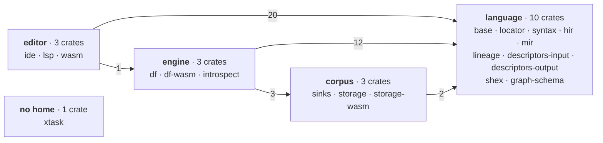
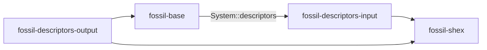
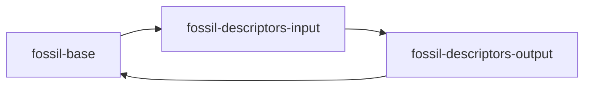

`corpus.bnf`'s header states the spine: fossil has **three boundaries — program, plan, artefact** —
and each one is specified by a data file that generates code rather than by prose that describes it.
`grammar.bnf` is the shape of a program, `catalogue.bnf` is the names a program may write, and
`corpus.bnf` is the columns a writer emits. Everything below hangs off one of the three.

**This page states the shape and links to the page that argues each part.** Where a section would
restate an argument, it is a sentence and a route instead. That is the discipline, and it is the one
this repository has paid for twice.

## What a corpus is

**Two sets of columns, four columns between them**, declared once in `corpus.bnf` and projected
into `crates/fossil-sinks/src/generated.rs` by `cargo xtask corpus`: the **payload** (2) —
`dense_id` and `subject`, before the program's own — and the **edge** (2), `src` and `dst`. Every reader
names the ROLE it means rather than the name, because the words the writer emits were 545 string
literals with no declaration any of them derived from.

**One graph, one id space, and a file per table.** `dense_id` is global across every vertex type,
gapless: the types in manifest order, each one contiguous range, subject order inside it. A vertex
type is `vertex/<Type>.parquet`, a relation is `edge/<Src>_<label>_<Dst>.parquet`, and
`fossil.json` — `crates/fossil-sinks/src/manifest.rs, Manifest` — names every one of them with its
columns and its row count. It carries the graph and not a picture of it:
[where a vertex is drawn](/docs/design/position) is the view's choice. There is no directory listing over HTTP
and the format asks for none. [The format](/docs/format) is the specification.

**The corpus has no coarse face.** A reader draws every vertex; the tiles, the cell pyramid and the
quotient edges that let a reader draw less were [deferred](/docs/design/later/cells) with their
measurements and the condition that brings them back.

## What the writer is

One call, `fossil_df::write`, and one host that makes it: the wasm build, in a browser tab or in
Node, under a 2 GiB budget it refuses past by name
([three hosts](/docs/design/three-hosts#what-the-wasm-writer-holds-and-how-it-says-no)). There is no
native write host, and [what was discarded](/docs/design/discarded#the-tooling) says what would bring
one back.

| the step | where | what it produces |
| --- | --- | --- |
| every vertex, then every edge, with a hard barrier between them | `crates/fossil-df/src/lib.rs, execute_graph` | the payload columns and the edges, as Arrow in memory; `dense_id` numbered globally as each type lands (`crates/fossil-df/src/lib.rs, prepend_dense_id`) |
| one Parquet file per table, row groups of `crates/fossil-sinks/src/manifest.rs, ROW_GROUP_ROWS`, every page ZSTD | `crates/fossil-df/src/write.rs, write` | the payload and the edges on disk, sorted by `dense_id` and by `(src, dst)`, then `fossil.json` |

Nothing is staged and read back: the writer encodes the batches the executor already held.

**The manifest is written last, and that is not tidiness.** `fossil.json` is the commit: a reader
opens nothing a manifest does not name, so a run that fails halfway leaves Parquet no reader will
find. And a document written before the bytes can only *promise* them, while `record_count` is
measured.

## What the reader is

**One door, one name, and it always takes an engine** — `packages/corpus/src/attach.ts, attach`, and
it is TypeScript with no crate behind it:

```ts
const corpus = await attach(job, { engine, host })     // a job's corpus, under the credential the host vends
const corpus = await attach('demo', { engine, url })   // a corpus at a URL
```

It attaches the corpus to the host's `Engine` as the catalog it is given: a view per table, and the
manifest itself as `fossil_tables` and `fossil_columns`. Every read after that is the host's SQL.
Pruning is the engine's: every table is written in the order of its key, and DuckDB skips the row
groups whose footer statistics exclude a predicate. [One door](/docs/design/one-door) argues the
surface.

The reader's **policy** over that contract is deliberately not on the door, and not in this
repository: what a corpus is drawn WITH and what is already LOADED belong to the viewer,
`@kanzo-tech/graph`. An encoding is a reader's ranking of what to do with a column, and a residency
budget is a number measured against one renderer on one corpus. Neither is a property of the
artefact.

## What is declared and what is derived

One rule: **a document carries a fact exactly when a reader cannot recover it from the bytes, or
must have it before it reads them.** `fossil.json` carries the tables, their columns and their types
because `attach` makes views out of them; and `record_count` because a viewer sizes its buffers before
the first byte. What it does not carry — an extent, a column's domain, statistics — is in the
Parquet footers or one query away, and comes back as an additive field the day a reader needs it
before reading. [Position](/docs/design/position) argues the field it no longer carries.

## The graph today

The same three boundaries seen from the tree: `language` and `editor` serve the program, `engine`
runs the plan, `corpus` is the artefact. Grouped by what each crate is about, because two dozen nodes
drawn flat show nothing. The ugliness is the finding, not a failure of the drawing.



**38 cross-group edges**, and no pair runs both ways. Every number above
is derived from `crates/*/Cargo.toml`, `[dependencies]` only: a test may depend on whatever it
likes, so dev edges are out of scope here for the same reason they are in `content.test.ts`, which
reads the manifests and fails the build on any figure in this diagram that stops holding.

The single `editor → engine` edge is `fossil-lsp → fossil-introspect`, and it is deliberate: without
the columns a `DESCRIBE` finds, the editor is silent on every diagnostic whose evidence is a source's
schema, which is pinned by `crates/fossil-lsp/tests/introspected_diagnostics.rs`.

The arrow between engine and corpus runs one way:

| direction | edge | why it is there |
| --- | --- | --- |
| engine → corpus | `fossil-df → fossil-sinks` | the manifest model, which **is** the format, and the writer is what builds it |
| engine → corpus | `fossil-df → fossil-storage`, `fossil-df-wasm → fossil-storage` | a run reads its sources and writes the corpus through the job's store |

`fossil-sinks` and `fossil-storage` are filed by subject and not by history. `fossil-sinks` is a
leaf: it takes `serde`, `schemars` and `arrow-schema` and no fossil crate. The corpus side reaches
into the language at one crate only — `corpus → language` is `fossil-storage` and
`fossil-storage-wasm` taking `fossil-graph-schema` for the error catalogue, the leaf where shared
vocabulary goes ([one error](/docs/design/errors)) — and at nothing that parses or resolves. [One engine](/docs/design/one-engine) is where the rest
of the filing gets settled.

Two things have left `fossil-base` and neither shows on this diagram in the same way. The `@conn`
locator is `fossil-locator`, a crate with no dependencies at all — filing it under `language` is the
same subject-not-history move `fossil-sinks` and `fossil-storage` got, except that this one moved a
file. The `tracked` query that decodes a shape document is `fossil_hir::shape_documents`, and it
cost **no** edge: its only production caller was `fossil-hir` already, and `fossil-hir` already
depended on `fossil-base`. A module crossing a boundary that was already crossed is the cheapest
kind of move there is.

The only write host is `fossil-df-wasm`; nothing native writes a corpus.

## What is left of the rings

The attractive cut is three numbered rings by where the code runs. It is not the cut, and
[three hosts](/docs/design/three-hosts) is where the three reference compilers say why. What survives
is not a ring: one crate with a `cfg` and a written reason — `crates/fossil-lsp/src/lib.rs`,
because `lsp-server` uses crossbeam and stdio. The second was `fossil-resolver`, refusing wasm32 to
keep credentials out of the browser; a vended credential is short-lived and prefix-scoped, and
reaching the browser is what it is for, so the crate became `fossil-storage` and compiles there.

## A list is not a check

> `duckdb` and `datafusion` are each reachable only from crates that declare themselves native.

`deny.toml` names six wrappers for `duckdb` and five for `datafusion` (measured 2026-08-25), but
`cargo deny check bans` matches `wrappers` against the **direct** parents of a banned crate, so a
crate one hop further away is invisible to it — measured with `fossil-lsp` linking a bundled database
while `cargo deny` printed `bans ok`. `crates/xtask/tests/engine_reach.rs` closes it, deriving the
policy from `deny.toml` and the truth from `cargo metadata`.

## `base` means two opposite things

The two references that have a crate called `base` give it contrary contents:

| | `gluon_base` — 11,970 lines | rust-analyzer's `base-db` — 1,866 |
| --- | --- | --- |
| contents | AST, types, kinds, symbols, positions | salsa plumbing, the input queries, `CrateGraph` |
| language vocabulary | **is** the vocabulary | **none** |
| describes itself as | "modular" | *"Basic database traits. The concrete DB is defined by `ide`"* |

`base-db` states two invariants that point straight at us — *"knows nothing about cargo"*, *"doesn't
know about file system and file paths"* — and its VFS is another crate, the operating-system
implementation a third.

> **If a crate called `base` contains the substrate *and* the file abstraction, it is two crates that
> have not been separated yet.**

Two parts have gone. `fossil-locator` is the file abstraction — the rule that says where a written
path points; `base-db` keeps its VFS in another crate for exactly that reason. And the shape-document
decode is `fossil_hir::shape_documents`: `base-db` holds *input queries*, and a query that runs a
decoder over a document to produce a type is not an input, it is the compiler asking a question.
What stayed in `providers` is the ROW a decoder fills, because a table entry is not a decision about
a program.

**What stayed, and why it is not the same case.** `test_support` is also not compiler logic — its
own header says so — and lifting it out looks like the identical move. It is not: a helper that
implements `System` must depend on `fossil-base`, `fossil-base`'s unit tests must depend on the
helper, and `#[cfg(test)]` makes the crate under test a second copy of `fossil-base` whose types do
not unify with the one the helper linked. It does not compile, and the rest of the bill is in
[what was discarded](/docs/design/discarded). The distinction the rule actually draws is *decides
something about a program*: the locator did, and a decoder for a format no program is written in
does not.

### What would move the remaining edge

`fossil-base → fossil-descriptors-input` exists for **one trait method**, `System::descriptors`,
which hands out a `&DescriptorCache` (`crates/fossil-base/src/system.rs, descriptors`). Four crates, and the
arrows nearly meet:



Acyclic, but only just. Fold `fossil-shex` into `fossil-descriptors-output` — the obvious
simplification, one crate fewer — and the two remaining arrows close on themselves:



So the fold is blocked while that edge stands. Three ways out were costed:

| the way out | what it costs |
| --- | --- |
| a generic or associated type on `System` | impossible, not merely expensive: the trait is used as `Arc<dyn System>` and as `&dyn System`, and either shape is object-safety's own counterexample |
| the types down into `fossil-graph-schema`, the leaf both sides already see | no new crate — and a `Mutex<HashMap>` of host-owned mutable state inside the crate that depends on nothing but `serde`, which is this page's own mistake committed a second time |
| a new leaf holding `DescriptorCache` + `InferredDescriptor` | it works, and it is the only one that does: a 25th crate, an import path changed in eight crates, and **nothing removed from `fossil-base`** |

**What reverses this:** the fold itself. It removes a crate, so the third way nets zero on the count
and the cycle goes with it.

## The verdict is not the crate count

**Twenty-one crates**, against Gluon's ~11 crates for 90k lines, Gleam's 15 (six real) for 228k
and rust-analyzer's 36 for 571k. The line count that used to sit beside this number is deliberately
not restated: it was measured on 2026-08-25 and the tree has changed since, so the only honest
options were to re-measure or to drop it.
**At this size the honest target is five to eight.**

Most of the movement was moves, not new code: `fossil-locator` arrived by moving a module down out
of `fossil-base`, `fossil-engine` left by moving three into the crate that already used them, two
arrived carrying a write-time bound and left when it was [removed](/docs/design/discarded#privacy),
`fossil-tile-writer` arrived by moving a struct out of a crate that never called it and left with the
tiles, `fossil-cli` left with the native host, and `fossil-graph` and `fossil-graph-wasm` left when
the reader became TypeScript, and `fossil-layout` left when the corpus stopped carrying a picture.
Which is the point of the heading — the count went 25 → 26 → 25 → 27 → 28 → 26 → 24 → 22 → 21 and none of those numbers is the verdict.

What makes two dozen feel like a maze is not the count. Two of them lie about what they are, and a
false name costs more than a surplus crate because you cannot skip it while reading. There were
three: `fossil-engine` was not an engine, it was the native host, and the crate that was wrong
about itself is now a module of the one host that used it.

| the name | what it actually is |
| --- | --- |
| `fossil-ide` | not an IDE: the set of LSP functions, and it exists only because `fossil-lsp` does not compile to wasm32. It also returns `lsp_types` structs directly (`crates/fossil-ide/src/completion.rs, completions`), which is the invariant rust-analyzer defends hardest and the one Gleam broke |
| `fossil-sinks` | writes nothing: the manifest model — `fossil.json` and its JSON Schema ([its vocabulary is SQL/PGQ's](/docs/design/corpus#the-vocabulary-is-sqlpgqs-declared-and-not-executed)) — and the column table `corpus.bnf` generates |

<Callout title="Deliberately absent">
**No numbered layers.** A rule that needs a number to explain itself is a taxonomy, not a rule.

**No crate named after its deployment target.** The one crate rust-analyzer names after a process
boundary is `proc-macro-srv-cli`, and procedural macros segfault — fault isolation, not a ring.

**No crate that exists by imitation.** A crate earns its boundary from a cycle, a `cfg`, an orphan
rule, a publishing frontier — or a rule about what the crate it left is allowed to contain, which is
the fifth and `fossil-locator` is the first to use it. Naming it is not widening the list: the rule
in question is the one at the head of this page, and a list that could not hold the page's own rule
would be a list that forbids acting on it.
</Callout>

## The reader has no crate

`fossil.json` is JSON and every table is one Parquet file, so a reader is `JSON.parse` and
`read_parquet`, and `packages/corpus` is exactly that — TypeScript over the host's engine. Nothing on
the read side links a fossil crate or loads a fossil wasm build.

The seam between the two halves is the corpus on disk, and it was never an API: `kanzo-ui` reads
corpora written by fossil through that package, and
[reading one without fossil](/docs/format/reading/without-fossil) is the whole recipe for a reader
that does not.

## What is on this page and what is not

The page is the shape; [three hosts](/docs/design/three-hosts) is the argument. The measurement that
reordered the whole priority — a compiler that reports success and writes a corpus with a property
missing — is [the expression cliff](/docs/design/expressions); the scope of the incremental system is
[tooling for humans](/docs/design/tooling-for-humans); and whether the specification belongs in its
own repository was settled against five projects in [prior art](/docs/design/prior-art).
