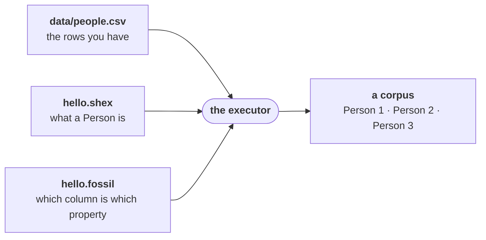

fossil turns tables into a graph. You give it the data you have and a document describing the graph
you want, and it writes the graph.



## Install

fossil runs as WebAssembly, in a browser tab or in Node. The package that writes a corpus is
`@fossil-lang/executor`; the `.wasm` ships inside it.

```bash
pnpm add @fossil-lang/executor
```

## The three files

Make a directory and put them in it.

<Program src="hello/hello.fossil" title="hello.fossil" />

<Program src="hello/hello.shex" title="hello.shex" />

<Program src="hello/data/people.csv" title="data/people.csv" />

## Check it

Open the directory in an editor with [the language server](/docs/book/editor). It reads all three
files and tells you whether they agree; if they do not you get a diagnostic on the line —
[when it does not compile](/docs/book/diagnostics) is worth reading early. The executor runs the same
check before it writes, and refuses a program that fails it.

## Run it

A host with no storage hands the executor the bytes it holds and gets the corpus back as bytes. In
Node that is a short script beside the three files:

```ts
import * as fs from 'node:fs/promises';
import * as path from 'node:path';
import * as module from 'node:module';
import { initFossilExecutor, FossilExecutor } from '@fossil-lang/executor';

const require = module.createRequire(import.meta.url);
await initFossilExecutor(await fs.readFile(require.resolve('@fossil-lang/executor/pkg/fossil_df_wasm_bg.wasm')));

// Where the program lives, as a URL: what it names relatively resolves beside it.
const base = 'https://local.test/hello/';
const exec = new FossilExecutor(await fs.readFile('hello.fossil', 'utf8'), `${base}hello.fossil`);
for (const doc of exec.missingDocuments()) {
  exec.registerDocument(doc.key, await fs.readFile(doc.locator.slice(base.length), 'utf8'));
}
const sources: Record<string, Uint8Array> = {};
for (const source of exec.sources()) sources[source.uri] = await fs.readFile(source.uri.slice(base.length));

const { files } = await exec.runInMemory(sources, 'memory://hello');
for (const file of files) {
  await fs.mkdir(path.join('out', path.dirname(file.path)), { recursive: true });
  await fs.writeFile(path.join('out', file.path), file.bytes);
}
exec.free();
```

`packages/executor/tests/execute.test.ts` runs this script against `docs/programs/hello`. Under
`out/` is the corpus: `fossil.json`, which names everything else, and one Parquet file per
type — here `vertex/Person.parquet`, three `Person` rows in it, one per row of `people.csv`.

A host that owns storage — a server, or a browser tab with credentials to a bucket — calls `runJob`
instead, and the corpus is written straight into the prefix the host vends.
[What you produce](/docs/book/what-you-produce) and [the corpus format](/docs/format) say what the
files hold.

## Where to go next

[Your first program](/docs/book/first-program) accounts for every token above. [The anatomy of a
fossil program](/docs/book/anatomy) takes a larger one and grows it a section at a time.
