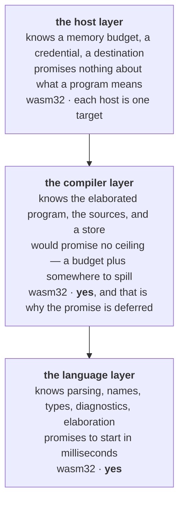

fossil is designed to be embedded. Three destinations have to work, and they are not variations of
one another: a **command**, run from a terminal or a job scheduler; **wasm in a browser**,
where the editor and the checker live next to the person typing; and a **product embedding it**,
which supplies credentials, storage and a job lifecycle and wants the language to be a component
rather than a subprocess it has to understand.

Add the promise that a corpus has [no ceiling on its size](/docs/design/later/streaming) and the four
requirements contradict each other — but only under one reading. If "this destination works" means
*run the whole engine here*, then the browser must be larger-than-RAM, and it cannot be: wasm32 has
roughly four gigabytes of address space and nowhere to spill. So the destinations are not
configurations of one program. The code is cut by **where it runs**, and each layer gets a different
promise.

*No ceiling* lives in the middle box and only there, because a budget plus spill needs somewhere to
spill to — which is exactly why it must not live in a layer the browser shares. The top box holds
**inputs of a command**, not properties of a language: nobody thinks a program means something
different because it was given more memory. And the bottom box depends on no execution engine, the
single negative fact that buys both of its positive ones — the checker in a browser tab is the same
checker, not a reduced imitation. Gluon is the model, for a reason more specific than admiration:
being embedded in a host application is its whole problem statement.
[The architecture](/docs/architecture) is the shape this argument produces.

<Callout type="warn" title="The middle box runs in wasm32, so no ceiling is deferred">
There is no native binary that writes. A command is Node over the same wasm build a tab runs, so
every write is bounded by wasm32's address space, and the one place a spill could live is a native
host that does not exist ([discarded](/docs/design/discarded#the-tooling) says why). What brings the native layer back is a consumer
that must write natively — a corpus larger than RAM, spilled — and the argument above is what it
would be built on.
</Callout>

### What the wasm writer holds, and how it says no

Inside the address space the executor declares a **budget**: a 2 GiB pool every `DataFusion`
operator reserves against, and no disk. An operator told no has nowhere to spill, so the run stops
while the graph is still executing — before the first byte of the corpus is written — and the host
gets a `FossilError` whose code is `run/over-budget` and whose `data` says which operator asked, for
how much, and what was already held. `crates/fossil-df/src/memory.rs` is the pool and its reasons.

The budget is half the address space because the pool only sees what operators *reserve*: the source
bytes, the collected graph, the layout pass and the encoded Parquet are outside it. Measured on
`docs/programs/shop` in Node, one join and two deduplicated types:

| people · orders | outcome | linear memory | wall clock |
| --- | --- | --- | --- |
| 60,000 · 180,000 | written | 183 MiB | 1.6 s |
| 200,000 · 600,000 | written | 624 MiB | 6.2 s |
| 500,000 · 1,500,000 | written | 1,466 MiB | 22.1 s |
| 900,000 · 2,700,000 | written | 2,704 MiB | 48.8 s |
| 1,000,000 · 3,000,000 | `run/over-budget` | 2,763 MiB | 39.8 s |

A real corpus sits well inside it: Vermont — twelve types, 144,784 vertices and 426,781 edges — writes
in 4.8 s at 684 MiB. What spends the budget first is the dedup of a vertex type (its
`first_value … ORDER BY subject` aggregate), not the join.

**Before the budget there was no bound at all, and it trapped.** `DataFusion`'s default pool summed
reservations into a `usize` it never checked, and a `usize` is 32 bits on wasm32. The sort above a
dedup was charged, for each of its `batch_size` slices, the whole batch the slice was cut from — 5.6
GiB accounted for a 78 MiB batch of `Order` at 200,000 people — so the sum wrapped, a reservation split found
less than had been put in, and the run died on `unreachable` with its promise never settled. The same
run natively finished in 1.5 s, which is why no native test saw it. The executor now copies a slice
out of its parent before a sort or a hash join's build side counts it, and
`packages/corpus/integration/scale.test.ts` runs the scale that used to trap.

**What would reverse it:** a `DataFusion` whose sort charges a slice for what it spans deletes the
copy; a `wasm64` target, or a disk to spill to, moves the budget.

One boundary here is a threat model rather than a preference. The host owns the credentials, and
what crosses to fossil is never one of them: it is a **vended** credential — short-lived, scoped to
one prefix, and enforced by the store rather than by the reader. See
[storage is reached by a vended credential](#storage-is-reached-by-a-vended-credential).

> **Do not read prose where there was a checkable constraint.** A dependency query, a search for a
> compile-time refusal, or a build against the target answers in seconds a question that prose
> answers confidently and wrongly.

## The test for the host boundary

The host owns credentials, storage, job lifecycle, multi-tenancy and its own interface. fossil owns
*what this program computes and what it produces*. One criterion decides every case between them:

> **Anything in the host that re-parses, re-derives or re-models the language's own knowledge is a
> boundary violation.** And a program whose meaning — which graph it produces — changes with an
> external flag is not self-contained; the definition of the output belongs **in** the program, next
> to its sources and its transformations.

It is productive because it turns architecture arguments into deletions. A host that walks the
compiler's intermediate representation to summarise a pipeline is re-deriving what the compiler
already knows, and the repair is not a better walker: it is the compiler emitting a description and
the walker going away. The general shape is that **the logic has one home and the host injects the
data plane**, at which point "should the schema read happen in the browser or on the server" is
answered by what the host passes in.

## One implementation, and one wire

If the embedding host is a browser, a capability only a native binary can perform is a capability the
product cannot reach. So the direction is that **every capability has one implementation, in a crate
that compiles to `wasm32`, and each host is a transport over it** — the language server, the wasm
shim and the executor are projections, and none of them is the API.
`cargo xtask wasm-check` derives that set from the cdylib crates, and the compile→run pipeline is
inside it. Its size is
deliberately not written here; this page carried a count once and it was stale by the next reading.

Sharing an implementation is only half the promise, and the other half was learned by measuring two
exports built precisely to be one capability in two hosts: `serde_json` and `serde_wasm_bindgen`
disagree about an absent optional field, and neither host's test could see it, because each asserts
on its own side of the wire.

> **Two hosts that share a function still disagree if they serialize it differently.** One
> implementation guarantees one *answer*, not one *wire* — so a capability offered to two hosts owes
> a test that crosses each host's wire rather than each host's function.

The browser's wire is not the protocol. A page that already calls the checker in-process has no
reason to stand up an LSP client to ask what type is under a cursor, so check, hover, completion and
definition are plain method calls on the wasm workspace, and the language server over stdio is the
other wire. One implementation, two projections of it — and the rule above is what each of them owes.

**What would reverse it.** A browser consumer that needs what only the protocol carries — code
actions, semantic tokens — at which point it earns a projection of its own, and a test that crosses
both wires with it.

The same measurement settles what a row may carry across that wire, and it is the companion rule:

> **A name crosses the boundary, never a number.** An enum's discriminant is an ordering the
> compiler is free to change; a consumer that wrote one down is broken by a reorder *silently*,
> because every kind remaps at once and nothing fails.

This is not a precaution. `TokenRow.kind` was a bare `fossil_syntax::lexer::Token as u32`, and the
consumer that kept the matching table — `packages/codemirror-fossil/src/tags.ts`, since deleted —
was **wrong in nine places** by the time it went: `KwPrefix`, `KwIn`, `KwUse`, `KwAs`, `KwIri`,
`Template`, `AbsIri`, `EnvVar` and `Pipe` are variants the lexer no longer has, `True`, `False` and
`Null` are ones it gained, and every discriminant from 3 up pointed at the wrong token. The file
carried a comment saying it must be updated in lockstep with any reorder. Nothing could hold that,
and nothing noticed for as long as it did not.

So the legend ships instead of the warning. `tokenKinds()` returns every variant name indexed by the
discriminant a row carries, and a host keys on `"Comment"` rather than on `2`; semantic tokens
cross the boundary as legend names (`"type"`, `"declaration"`), and completion kinds followed — LSP spells
`CompletionItemKind` as an integer, and `kind_name` puts the table in Rust where
`every_lsp_kind_has_a_name` can check it is total. Each of those tables is an **exhaustive** match,
so adding or renaming a variant fails this build rather than someone else's product, which is the
whole difference between a guard and a comment. A kind past the end of a legend is a newer compiler
than the host and reads as plain text, so appending stays backwards-compatible and reordering stops
being an event at all.

Where an implementation genuinely cannot be shared,
`packages/introspect/tests/rust-parity.test.ts` is the shape of the guard: it derives its tables from
the Rust rather than restating any value, so a rewritten crate fails it instead of quietly matching
nothing.

## Storage is reached by a vended credential

A host gives every `@fossil-lang/*` package one capability for storage, `Host.credentials(scope,
access)`, and never a URL it signed. The answer is Iceberg REST's `StorageCredential` verbatim —
`{ prefix, config }` with Iceberg's own keys — so what a catalogue vends to DuckDB, Spark or PyIceberg
is what a host vends to fossil. `scope` is a connection or a job; `access` is `read` or `write`, one
parameter and not two doors, which is how Unity Catalog and Polaris model it.

What fossil does with one has **one implementation**, `fossil-storage`, compiled to wasm32 for
`@fossil-lang/storage` and `@fossil-lang/executor`:

| a reader or writer that… | gets |
| --- | --- |
| queries through the page's engine (a corpus, introspection) | `CREATE OR REPLACE SECRET … SCOPE '<prefix>'` — what DuckDB's iceberg extension does with vended credentials. The SQL names `s3://…` and never the credential |
| reads through DataFusion (a job's sources), or needs bytes and no engine (documents) | an `object_store` store per credential, routed by the longest prefix covering a path — so DataFusion reads a source by range requests, not whole |
| writes a job's output | the job's `object_store` store, in parts when a file is large — fossil is the writer, because DuckDB-WASM's `COPY … TO 's3://'` signs a `content-type` the browser never sends |

A mounted prefix is renewed at `expires − 5 min` by asking the host again and re-issuing the same
statement under the same name, so a view over it never reopens: Iceberg's `VendedCredentialsProvider`
margin. A store renews the same way, through `object_store`'s `CredentialProvider`. Renewal is the mechanism and not a retry on error, because DuckDB-WASM reports an expired
credential as *no files found* or *404* and a reader cannot tell it from absent data. Two readers of
one prefix on one engine share the secret, and the last to close drops it.

**Azure is asymmetric, and the asymmetry is DuckDB-WASM's.** There is no Azure extension in the
browser, so an Azure prefix is lent file by file — a scheme-less name the engine maps to the blob's
SAS URL — and there is no glob. No reader of fossil globs: a corpus's manifest enumerates its files.
The asymmetry stays inside `@fossil-lang/storage`; a reader names a locator and is told what SQL
calls it.

## An open question this page does not settle

Whether the *server* of a product embedding fossil is a host in its own right, or the browser host
wearing a server's clothes, is left open. It owns credentials, storage, job lifecycle and
multi-tenancy — exactly the list assigned to the host layer — and none of that runs in a tab. Against
that: keasy's server spawns no fossil binary and its images declare themselves free of one, so every
capability it exposes is computed in the browser and the server only stores the result, which makes
it a data plane and makes the tab the host.

Settling it decides something concrete, which is why it is worth leaving until someone means to
decide it: if the server is a host, it is owed a surface of its own, and today it links one Rust type
and consumes the rest as TypeScript.

Which units of code sit in which layer is deliberately absent: that is a fact about the tree, and a
list of it printed here would be wrong before it was useful.
