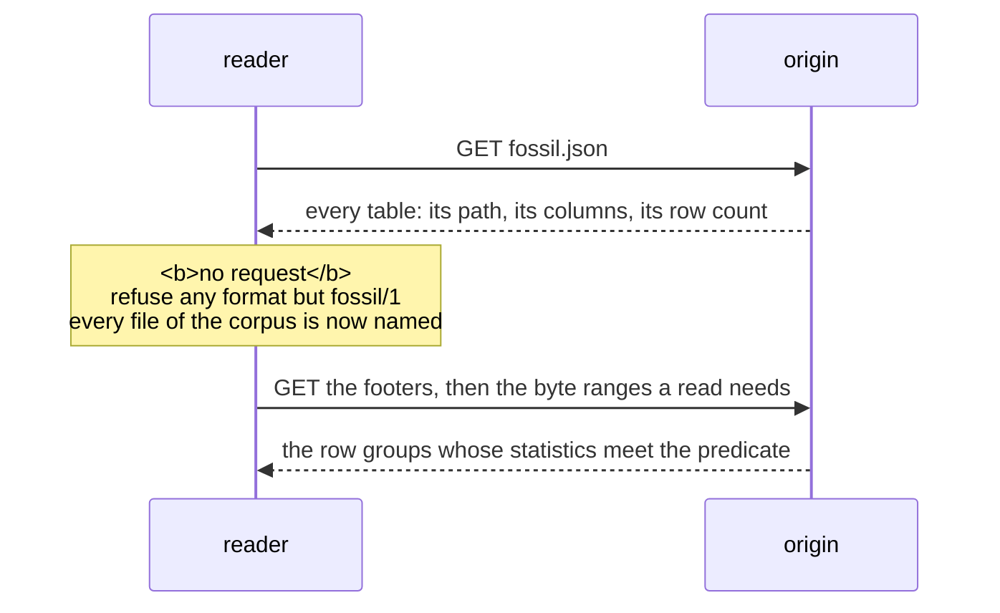

Reading a corpus needs a JSON parser and a Parquet reader — no fossil crate, no `@fossil-lang/*`
package, no wasm module, no service. The SQL below is DuckDB because that is the shortest way to
write it down; nothing in it is DuckDB-specific except the syntax.

## The sequence



**One round trip settles where everything is**, and it is not a query. A reader over HTTP cannot
list a directory, so nothing is discovered by listing: `fossil.json` is the one name known in
advance, and it names every file.

## The manifest

```jsonc
{
  "format": "fossil/1",
  "vertex_tables": [{
    "name": "Person", "path": "vertex/Person.parquet",
    "key": "dense_id", "identity": "subject", "record_count": 1000000,
    "properties": [{ "name": "dense_id", "type": "uint32" }, { "name": "subject", "type": "string" }, …]
  }],
  "edge_tables": [{
    "name": "Order_placedBy_Person", "label": "placedBy", "path": "edge/Order_placedBy_Person.parquet",
    "source": { "key": "src", "references": "Order" },
    "destination": { "key": "dst", "references": "Person" },
    "record_count": 2000000,
    "properties": [{ "name": "src", "type": "uint32" }, { "name": "dst", "type": "uint32" }]
  }]
}
```

A reader refuses a `format` other than `fossil/1` before it reads a byte of Parquet, and ignores a
key it does not know: a field added within `fossil/1` is optional, and changing what a fixed column
means is `fossil/2`. `packages/corpus/guards/manifest.mjs` is the whole of a reader of it, and it is
`JSON.parse`.

What each table carries:

- **A vertex table** holds one vertex type. `key` is `dense_id` — one gapless `0..V−1` over the
  whole graph, not per type, each table one contiguous range of it in manifest order: the sum of the
  `record_count`s before it, and that many more. `identity` is `subject`, the one column that
  survives a rewrite: `dense_id` is an address and a new subject renumbers what follows it, so
  anything held outside the corpus keys on the subject.
- **An edge table** holds one relation. `src` and `dst` are `dense_id`s of the tables its
  `source.references` and `destination.references` name — the same global ids, so an edge between
  two types indexes the same buffer as the vertices do.
- **A property table** holds one multi-valued property, a row per value, under `property_tables`:
  `src` is the `dense_id` of the vertex in `source.references` the value belongs to, and the other
  column is the value. The key is absent when there is none.
- **Every column the writer emits says what it is** in its `properties` entry — a `role` of
  `address`, `identity` or `endpoint` — and a column of the program's
  carries none, so a reader tells the two apart without a list of names.
- **Every table is written in the order of its key** — vertices by `dense_id`, edges by
  `(src, dst)`, properties by `(src, value)` — in row groups of 122,880 rows. That order is what lets a reader skip row groups
  from the footer statistics alone.

## The reads

A view per table, and every question after that is SQL:

```sql
CREATE VIEW "Person" AS SELECT * FROM read_parquet('vertex/Person.parquet');
CREATE VIEW "Person_knows_Person" AS SELECT * FROM read_parquet('edge/Person_knows_Person.parquet');

-- the edges out of a range of ids: sorted by src, so the same skip applies
SELECT src, dst FROM "Person_knows_Person" WHERE src BETWEEN 40960 AND 45055;

-- one vertex by its identity
SELECT * FROM "Person" WHERE subject = 'https://example.org/person/7';
```

A predicate on the column a table is sorted by is the one the footers answer well; a predicate on
anything else — `dst`, or `subject` — reads every row group. Which edges point *into* a vertex is
that second kind: there is one copy of each relation, ordered by its source.

Read whole, a relation is small: two million edges' `src, dst` came back as **16 MB of Arrow in
51–127 ms**, in DuckDB-WASM on one thread from a local file.

## A relation, joined to its ends

`dense_id` is one id space across the whole graph, and an edge table's `src` and `dst` are ids in it.
The manifest says which vertex table each end `references`, so joining a relation to its endpoints is
two equi-joins on `dense_id`:

```sql
-- every order with the subject of the person who placed it
SELECT o.subject AS order_iri, p.subject AS person_iri
  FROM Order_placedBy_Person AS e
  JOIN "Order"  AS o ON o.dense_id = e.src
  JOIN Person   AS p ON p.dense_id = e.dst;
```

The out-edges of one vertex are `WHERE src = ?`, and because the table is sorted by `(src, dst)` the
footer prunes to the row groups that hold them. The in-edges are `WHERE dst = ?` over the same table,
which reads it: there is no second copy sorted by destination
([Adjacency](/docs/format/conventions/adjacency)). Follow both — "the papers by this author" is an
in-edge.

## The same read through the package

`@fossil-lang/corpus` is that recipe and nothing more: `packages/corpus/src/open.ts, open` reads
`fossil.json` and creates the views on the host's engine, under a catalog it is given, with the
manifest beside them as two relations — `fossil_tables` and `fossil_columns` — and the corpus as
[RDF](/docs/format/reading/rdf), `triples`.

```ts
import { open } from '@fossil-lang/corpus';
const close = await open('kg', { engine, url: 'https://cdn.example.org/kg/2026-08' });
// SELECT table_name, rows, first_id FROM "kg".fossil_tables WHERE kind = 'vertex'
// SELECT dense_id, subject FROM "kg"."Person" WHERE subject = 'https://example.org/person/7'
// and calling `close` detaches the catalog
```

The one capability a host brings is an `Engine`: SQL in, Arrow-shaped columns out, and an
`AbortSignal` that interrupts the running statement. Every read after `open` is the host's own SQL.
The package decodes no Parquet and links no engine: bundling a decoder would make it a driver, and
the engine already prunes row groups off the footer statistics.
