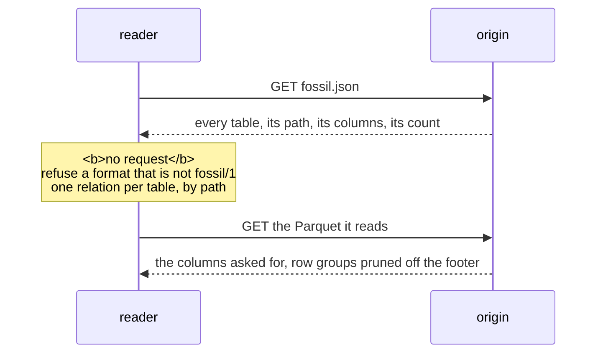

Reading a corpus needs `fossil.json` and a Parquet reader — no fossil crate, no `@fossil-lang/*`
package, no wasm module, no service. The SQL below is DuckDB because that is the shortest way to
write it down; nothing in it is DuckDB-specific except the syntax.

## The sequence



**One request settles where everything is**, and it is a small JSON document rather than a query.
Every other name comes out of it.

## The manifest is the catalogue

```sql
-- one relation per table the manifest names; `path` is relative to the corpus root
CREATE VIEW Person                AS SELECT * FROM read_parquet('https://cdn.example.org/kg/vertex/Person.parquet');
CREATE VIEW "Order"               AS SELECT * FROM read_parquet('https://cdn.example.org/kg/vertex/Order.parquet');
CREATE VIEW Order_placedBy_Person AS SELECT * FROM read_parquet('https://cdn.example.org/kg/edge/Order_placedBy_Person.parquet');
```

Read `format` first and refuse anything but `fossil/1`: a reader that opens a corpus of another major
version reads columns whose meaning it does not know. The `properties` list is the schema, in column
order, so no footer has to be opened to learn it; `record_count` is the row count, which a reader
that read a table whole can check against what it got.

## A relation, joined to its ends

`dense_id` is one id space across the whole graph, and an edge table's `src` and `dst` are ids in it.
The manifest says which vertex table each end `references`, so joining a relation to its endpoints is
two equi-joins on `dense_id`:

```sql
-- every order with the subject of the person who placed it
SELECT o.subject AS order_iri, p.subject AS person_iri
  FROM Order_placedBy_Person AS e
  JOIN "Order"  AS o ON o.dense_id = e.src
  JOIN Person   AS p ON p.dense_id = e.dst;
```

The out-edges of one vertex are `WHERE src = ?`, and because the table is sorted by `(src, dst)` the
footer prunes to the row groups that hold them. The in-edges are `WHERE dst = ?` over the same table,
which reads it: there is no second copy sorted by destination
([Adjacency](/docs/format/conventions/adjacency)). Follow both — "the papers by this author" is an
in-edge.

## What to draw

A vertex table whose manifest entry carries `position` is drawn, at the two columns it names; one
without is not. Because each table is sorted by `dense_id` and `dense_id` is the Hilbert rank of the
position, a box on the plane is a filter the footer statistics on `x` and `y` prune well:

```sql
SELECT dense_id, x, y, cluster_id
  FROM Person
 WHERE x BETWEEN 0.25 AND 0.30 AND y BETWEEN 0.60 AND 0.65;
```

Read whole, the drawn columns are small: over a million vertices, `dense_id, x, y, cluster_id` came
back as **16 MB of Arrow in 77–152 ms**, and two million edges' `src, dst` as **16 MB in 51–127 ms**,
in DuckDB-WASM on one thread from a local file.

## Finding one by its identity

An IRI in hand is a filter on the table's `identity` column — `WHERE subject = ?`. `dense_id` is an
address and changes when the layout is redone, so anything held outside the corpus keys on `subject`
([Identity](/docs/format/conventions/identity#the-identity-is-the-subject-iri)).

## The same read through the package

`@fossil-lang/corpus` does the manifest and the relations for a caller, and nothing more:

```ts
import { open } from '@fossil-lang/corpus';
const corpus = await open('https://cdn.example.org/kg', { engine });
corpus.manifest                                              // fossil.json, parsed once
const scan = corpus.scan({ table: 'Person', select: ['dense_id', 'x', 'y'] });
const batches = await scan.read(scan.plan());
await corpus.close();
```

The one capability a host brings is an `Engine`: SQL in, Arrow-shaped columns out, and an
`AbortSignal` that interrupts the running statement. `open` fetches `fossil.json`, refuses another
`format`, and registers one view per table; `scan` reads one table with an optional filter and
projection; `sql` answers a raw statement only when the host opened the corpus with
`sql: 'allowed'`. The package bundles no Parquet decoder — the engine already reads the footer.
