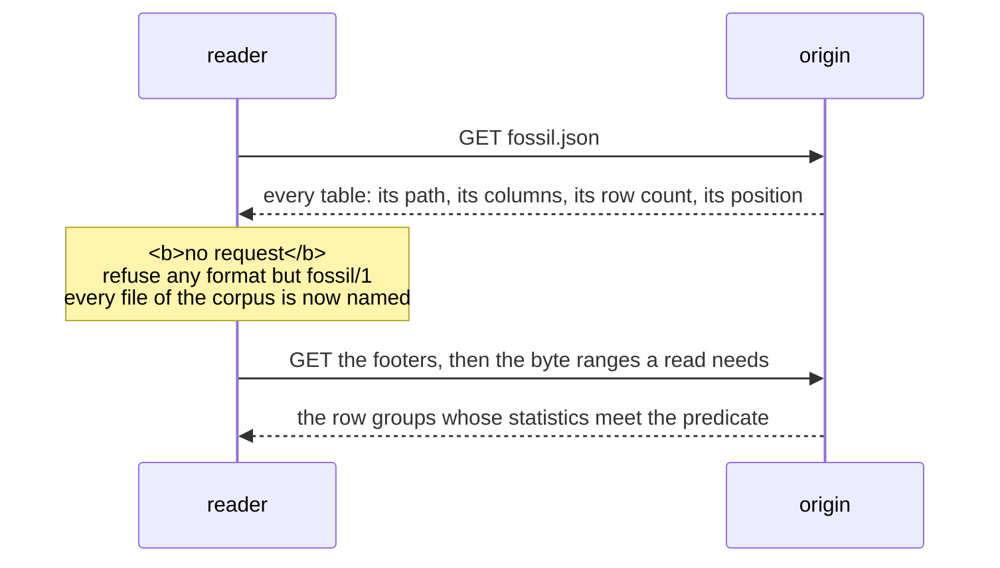

Reading a corpus needs a JSON parser and a Parquet reader — no fossil crate, no `@fossil-lang/*`
package, no wasm module, no service. The SQL below is DuckDB because that is the shortest way to
write it down; nothing in it is DuckDB-specific except the syntax.

## The sequence



**One round trip settles where everything is**, and it is not a query. A reader over HTTP cannot
list a directory, so nothing is discovered by listing: `fossil.json` is the one name known in
advance, and it names every file.

## The manifest

```jsonc
{
  "format": "fossil/1",
  "vertex_tables": [{
    "name": "Person", "path": "vertex/Person.parquet",
    "key": "dense_id", "identity": "subject", "record_count": 1000000,
    "properties": [{ "name": "dense_id", "type": "uint32" }, { "name": "subject", "type": "string" }, …],
    "position": { "by": "layout", "x": "x", "y": "y" }
  }],
  "edge_tables": [{
    "name": "Order_placedBy_Person", "label": "placedBy", "path": "edge/Order_placedBy_Person.parquet",
    "source": { "key": "src", "references": "Order" },
    "destination": { "key": "dst", "references": "Person" },
    "record_count": 2000000,
    "properties": [{ "name": "src", "type": "uint32" }, { "name": "dst", "type": "uint32" }]
  }]
}
```

A reader refuses a `format` other than `fossil/1` before it reads a byte of Parquet, and ignores a
key it does not know: a field added within `fossil/1` is optional, and changing what a fixed column
means is `fossil/2`. `packages/corpus/guards/manifest.mjs` is the whole of a reader of it, and it is
`JSON.parse`.

What each table carries:

- **A vertex table** holds one vertex type. `key` is `dense_id` — one gapless `0..V−1` over the
  whole graph, not per type, with every vertex that has a `position` numbered before every vertex
  that has none. `identity` is `subject`, the one column that survives a rewrite: `dense_id` is an
  address and changes when the layout is redone, so anything held outside the corpus keys on the
  subject. A table with a `position` is drawn at those two columns; a table without one is not
  drawn.
- **An edge table** holds one relation. `src` and `dst` are `dense_id`s of the tables its
  `source.references` and `destination.references` name — the same global ids, so an edge between
  two drawn types indexes the same buffer as the vertices do.
- **Every table is written in the order of its key** — vertices by `dense_id`, edges by
  `(src, dst)` — in row groups of 122,880 rows. That order is what lets a reader skip row groups
  from the footer statistics alone.

## The reads

A view per table, and every question after that is SQL:

```sql
CREATE VIEW "Person" AS SELECT * FROM read_parquet('vertex/Person.parquet');
CREATE VIEW "Person_knows_Person" AS SELECT * FROM read_parquet('edge/Person_knows_Person.parquet');

-- everything drawn in a window: the footer's x/y statistics skip the row groups outside it
SELECT dense_id, x, y FROM "Person" WHERE x BETWEEN 0 AND 100 AND y BETWEEN 0 AND 100;

-- the edges out of a range of ids: sorted by src, so the same skip applies
SELECT src, dst FROM "Person_knows_Person" WHERE src BETWEEN 40960 AND 45055;

-- one vertex by its identity
SELECT * FROM "Person" WHERE subject = 'https://example.org/person/7';
```

A predicate on the column a table is sorted by is the one the footers answer well; a predicate on
anything else — `dst`, or `subject` — reads every row group. Which edges point *into* a vertex is
that second kind: there is one copy of each relation, ordered by its source.

## The same read through the package

`@fossil-lang/corpus` is that recipe and nothing more: it parses `fossil.json`, creates the views
on the host's engine, and composes the `SELECT` a scan asks for.

```ts
import { open } from '@fossil-lang/corpus';
const corpus = await open('https://cdn.example.org/kg/2026-08', { engine });

corpus.manifest.vertex_tables                                      // what is inside
const scan = corpus.scan({ table: 'Person', select: ['dense_id', 'x', 'y'], filter: { bbox: [0, 0, 100, 100] } });
await scan.read(scan.plan())                                       // Arrow columns
```

The one capability a host brings is an `Engine`: SQL in, Arrow-shaped columns out, and an
`AbortSignal` that interrupts the running statement. The package decodes no Parquet and links no
engine: bundling a decoder would make it a driver, and the engine already prunes row groups off the
footer statistics.
